# 如何设置一个社交网站主题来跟踪你的 S3 桶的更新

> 原文：<https://blog.devgenius.io/how-to-set-up-a-sns-topic-to-track-updates-on-your-s3-bucket-3b2184297071?source=collection_archive---------6----------------------->

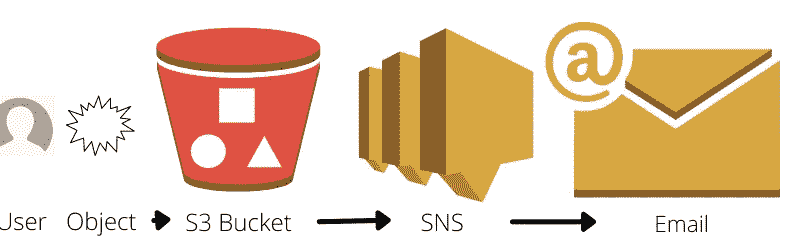

欢迎回来参加我的最新项目！这个项目将是一个关于如何建立一个 SNS 主题的教程，给你更新你的 S3 桶直接到你的电子邮件。在我们开始之前，让我们来看一下一些定义和这个项目需要什么。

*   什么是 S3，什么是水桶？[亚马逊简单存储服务](https://docs.aws.amazon.com/AmazonS3/latest/userguide/Welcome.html)(亚马逊 S3)是一种对象存储服务，提供行业领先的可扩展性、数据可用性、安全性和性能。S3 桶本质上是一个容纳对象/文件的容器。查看我链接的 AWS 文档以获得进一步的解释。
*   什么是 SNS，什么是 SNS 话题？[亚马逊简单通知服务](https://aws.amazon.com/sns/?whats-new-cards.sort-by=item.additionalFields.postDateTime&whats-new-cards.sort-order=desc)(亚马逊 SNS)是一项全面管理的消息服务，适用于应用对应用(A2A)和应用对个人(A2P)的通信。一个 SNS 主题本质上是你将创建的 SNS 链接到你的 S3 桶。要获取电子邮件，我们必须为其设置订阅。查看 AWS 文档以获得对此的进一步解释。
*   什么是 IAM，为什么我们需要创建一个用户帐户而不是根用户？ [AWS 身份和访问管理(IAM)](https://aws.amazon.com/iam/) 提供跨所有 AWS 的细粒度访问控制。使用 IAM，您可以指定谁可以在什么条件下访问哪些服务和资源。借助 IAM 策略，您可以管理员工和系统的权限，以确保最低权限。记住，最小特权是针对云中安全性的[Amazon Web Services(AWS)](http://aws.amazon.com/)[架构良好的](https://aws.amazon.com/architecture/well-architected/)最佳实践。这意味着只给用户完成特定任务所需的权限/访问权。不多不少。

该项目的目标如下:

1.  创建 S3 存储桶
2.  创建一个 SNS 主题，通知 S3 时段中的所有事件
3.  使用电子邮件订阅主题
4.  通过在 S3 放置、更新和删除对象来确认它的工作。您应该会收到一封确认电子邮件。

既然我们已经解决了这个问题，让我们开始这个聚会吧！

**步骤 1-** 按照最低权限最佳实践创建一个 IAM 用户

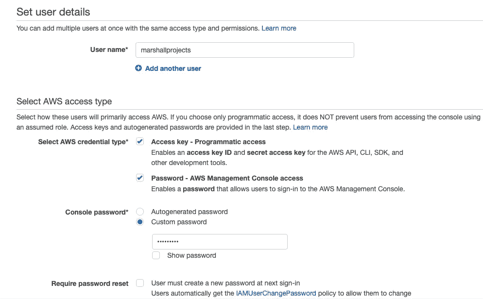

使用 AWS 控制台顶部的搜索栏，键入 IAM。填充后，选择蓝色的“添加用户”。一旦你这样做了，你将进入这个页面，你可以给你的用户一个名字，决定它将有什么样的访问权，以及决定用户的密码。我只是在登录时创建了一个密码，并选择坚持使用它，但最好的做法是在下次登录时要求重置密码。

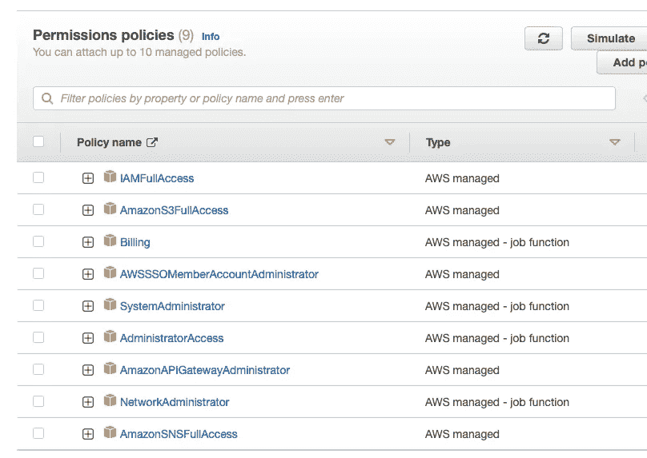

接下来要做的事情是给你的用户权限，10 是他们一次可以拥有的最高权限。我选择给我的用户大部分的完全访问权限，仅仅是因为这个用户是我项目的主要帐户，而不是使用 root 帐户。我可能会根据项目切换权限。完成后，您可以选择使用现有的密钥，或者创建并下载一个新的密钥。我使用了一个已经创建并保存的密钥，但是如果您创建了一个新的密钥，我会记住它，并将其存储在您的计算机上的某个地方(例如您的桌面或下载文件夹)，这样您就不会丢失它。AWS CLI 需要这个密钥文件。

完成用户设置后，在控制台上登录您的用户帐户。不要忘记为您的用户设置 MFA(多因素身份验证),这是云的另一个安全最佳实践。完成后，继续下一步。

**第二步** -创建你的社交网络话题

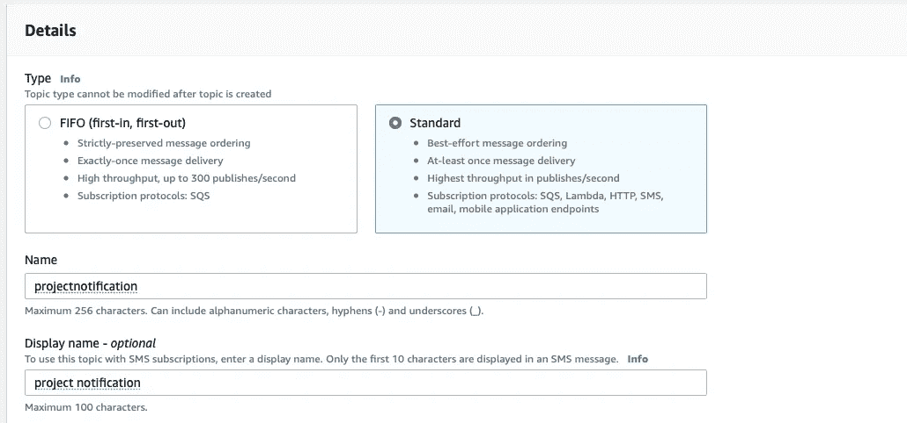

转到 AWS 控制台顶部，搜索 SNS(简单通知服务)。选择标准而不是先进先出，以获得直接的电子邮件通知，并命名您的 SNS 无论你想它是什么。与 S3 不同，它不需要非常独特，因为它不是全球性的服务。我们稍后会回来更新访问策略。

创建完成后，抓取 ARN 并将其复制到你电脑上的记事本应用程序中。

**第 3 步-** 创建您的 S3 桶

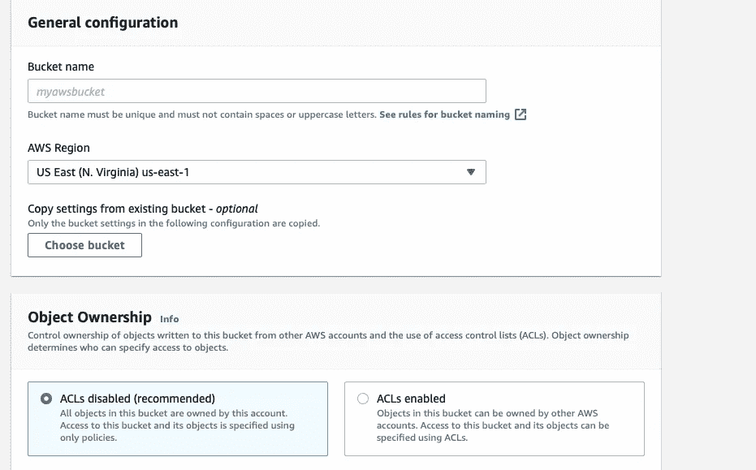

转到 AWS 控制台的顶部，然后搜索 S3。在这里，点击“创建存储桶”,然后您将进入此页面。由于 S3 是一项全球性服务，请为您的 S3 桶创建一个独特的名称。您可以将其他所有内容保留为默认设置，然后按 create。

创建桶后，获取桶的 ARN，并将其复制到您之前创建的记事本应用程序中。

**步骤 4**——更新您的 JSON 访问策略

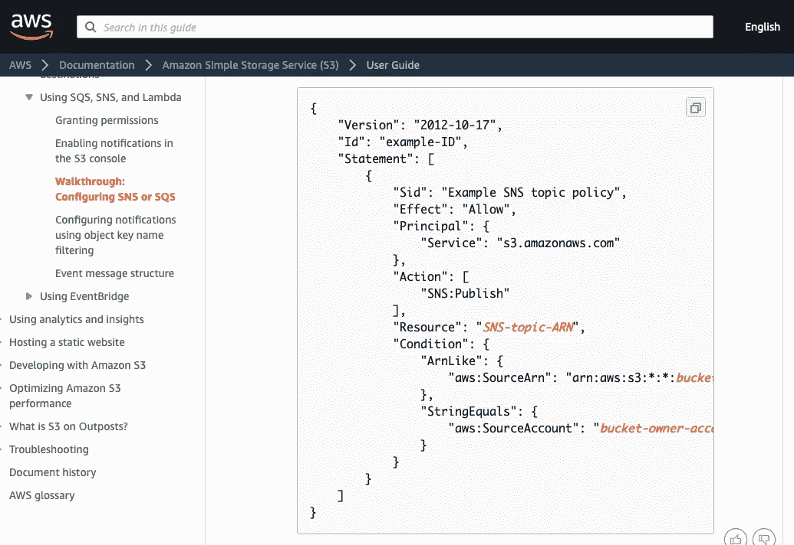

现在，我们将转到 SNS 的 AWS 文档，并获取他们的 JSON 代码的副本，以便用我们自己的信息进行修改。我们将更改该文件中的多行内容，并用我们复制到记事本中的内容进行更新。

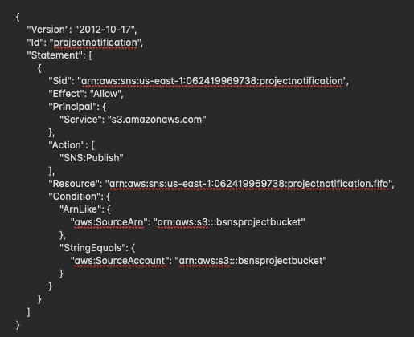

这是我用我的资源中的信息编辑完我的记事本应用程序后，它在我的记事本应用程序上的样子。

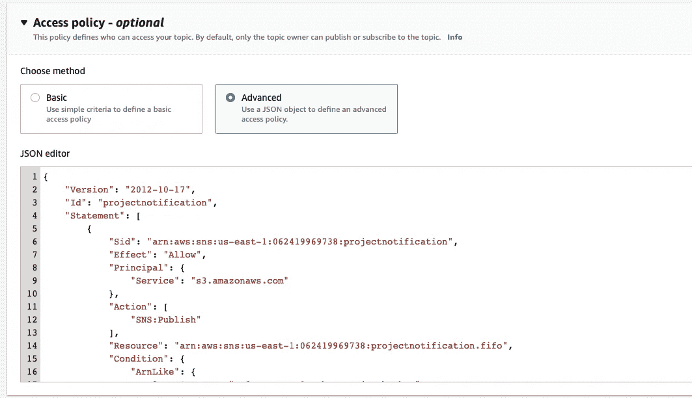

然后，我将这个新的 JSON 代码插入我的 SNS 服务的访问策略行，并按下 save。

**步骤 5-** 创建订阅和 S3 通知

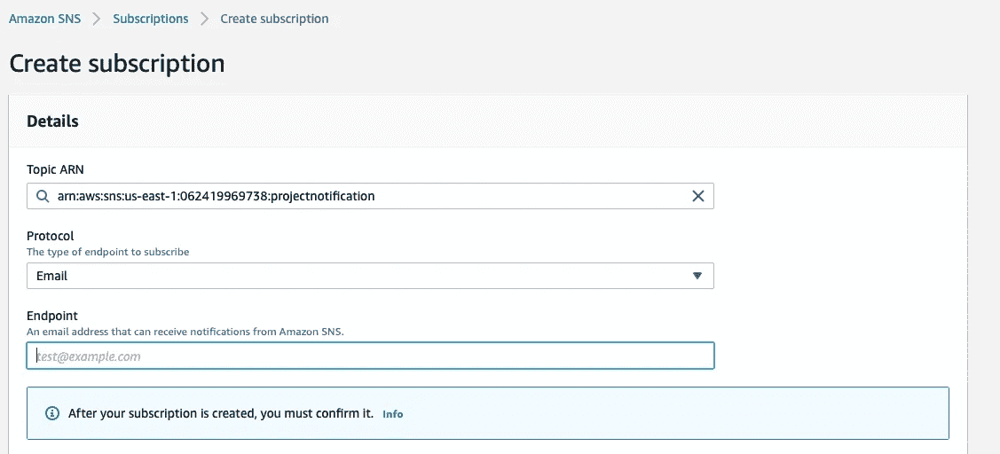

接下来，我们将通过点击 SNS 主页上的橙色按钮来创建我们的订阅。然后我们将被带到这个页面，在这里我们将选择我们的主题 ARN 和我们的交付协议。我选择了电子邮件，然后输入我的电子邮件地址。然后，您将收到一封电子邮件，您需要单击该邮件来确认协议并完全设置产品升级和技术支持服务。

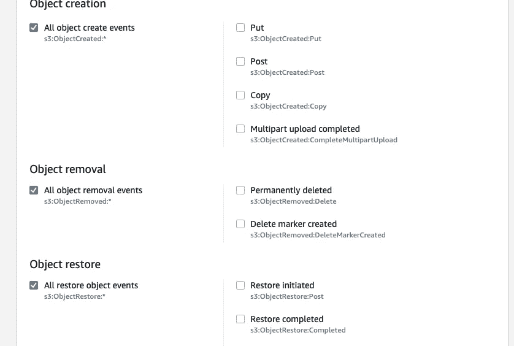

确认电子邮件后，在 AWS 控制台中键入 S3，然后单击您创建的存储桶。接下来，您要做的是单击 bucket 的属性并向下滚动，直到看到事件通知。您可以在这里命名通知，并选择您希望收到通知的事件类型。我为这个特定的项目选择了它们。下一步是按保存！

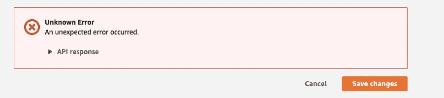

赞成..我知道..不幸的是，如果您按照我的步骤操作，那么您将得到同样的访问策略错误消息。但是不用担心！我们将在下一步处理这个问题。

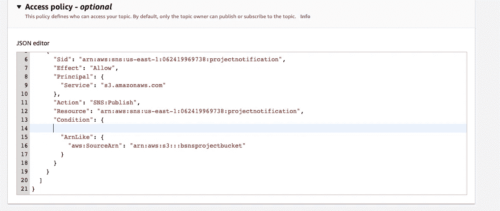

然后，我回到 SNS 页面上的访问策略，重新阅读了从 AWS 文档中获得的 JSON 代码，并认为我实际上并不需要字符串代码部分，所以我将它完全从代码中删除。然后我回到 S3 的活动通知页面…

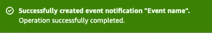

瞧啊。成功了…

**第 6 步-** 测试你的社交网站话题

好了，我们终于快完成了！现在我们将通过上传文件，更新文件，然后删除文件来测试我们的创建。我们应该会收到来自 SNS 的通知，通知我们的电子邮件帐户进行所有三项操作…

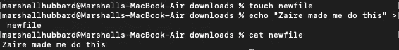

但是首先我们将创建一个文件来上传。我使用 CLI 创建了一个文件:

```
touch <name of your file>
```

然后，我使用 echo 命令在该文件中输入文本，并使用“>”命令将其附加到 newfile 中

```
echo “<your text>” > newfile
```

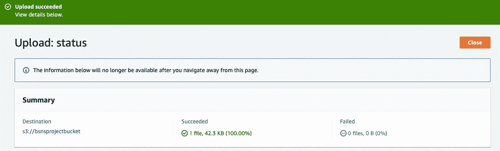

然后我把文件上传到了 S3。

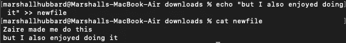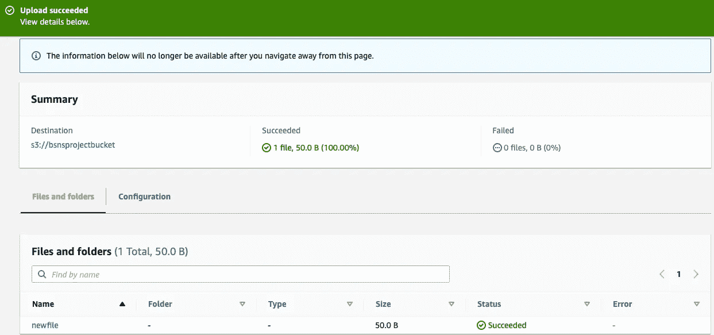

文件上传后，我向文件中添加了更多的文本，并再次上传以更新和替换已经在 s3 bucket 中的原始文件。我使用的命令是(请记住“> >”命令允许您添加输入而不覆盖它):

```
echo “<your new text>” >> newfile
```

然后，我删除了“新文件”,以确保我收到了一封电子邮件，告知我关于我的 S3 水桶的变化…

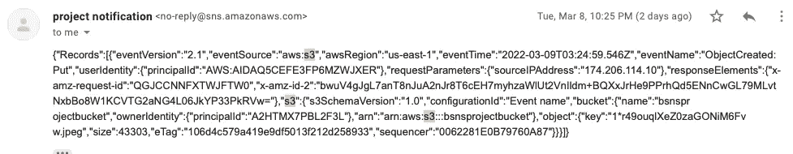

这是我第一次上传“newfile”时收到的第一封来自 SNS 的邮件。

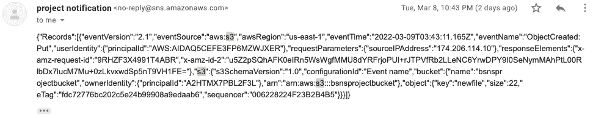

这是我用新文本更新“新文件”并替换原来的时候收到的第二封电子邮件。

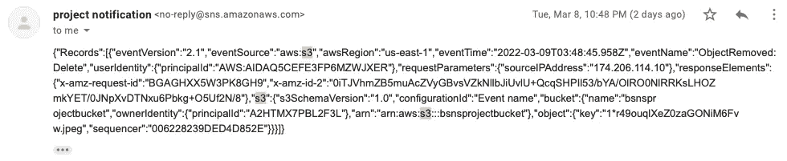

最后，这是我从桶中删除“新文件”时收到的最后一条消息。

这结束了我的项目。感谢你坚持和我在一起，请**不要**忘记分解你在 AWS 中创建的任何资源！