# 如何设置 MongoDB atlas？

> 原文：<https://blog.devgenius.io/how-to-set-up-mongodb-atlas-f5cdf59bafae?source=collection_archive---------4----------------------->

MongoDB 是一个 NoSQL 数据库，我们可以使用不同的编程语言。MongoDB 可以在本地使用，也可以在云上使用。因此在本文中，我们将讨论如何在云上设置 MongoDB 并与您的应用程序连接。

这只是为了学习的目的，所以开始使用 MongoDB atlas 的免费计划。如果您计划将 MongoDB 用于生产级应用程序，那么您可以升级该计划。

*   在 MongoDB atlas 上创建一个帐户。

[点击这里](https://www.mongodb.com/cloud/atlas/register)

访问上面的链接，你会看到这样一个页面:

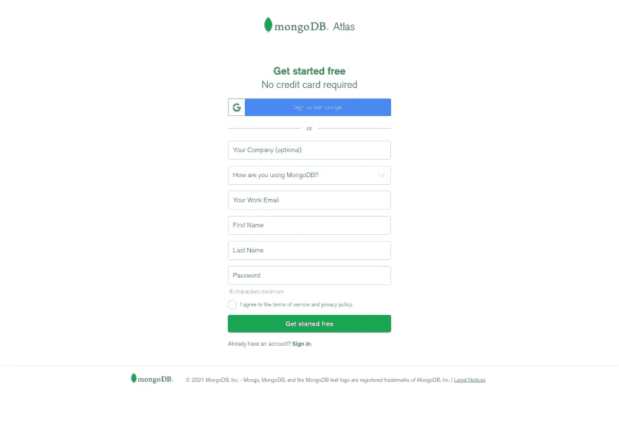

你可以填写所有信息，然后点击`get started free`按钮。

> *请填写正确的电子邮件 id，以获得验证电子邮件。*

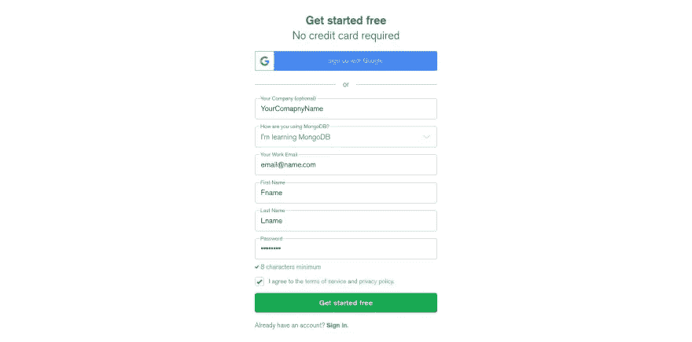

单击“开始”按钮后，您将被重定向到此页面。

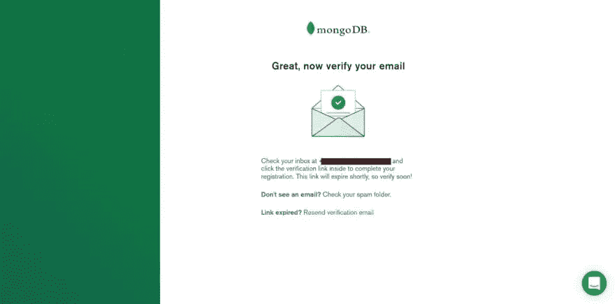

现在检查您的收件箱，并验证您的电子邮件地址。验证后，您将看到此页面，因此单击继续。

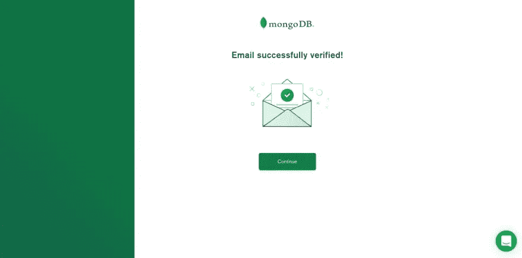

*   在 Atlas 上设置项目

填写所有信息开始。您可以稍后更改此信息。

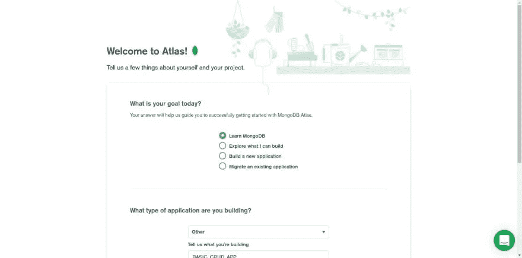

然后，您将被要求选择一个图集类型。我建议使用 shared，因为它是免费的，也是为了学习。

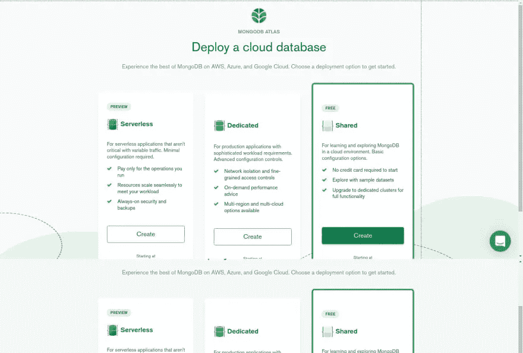

根据您的要求选择任何云提供商和地区。

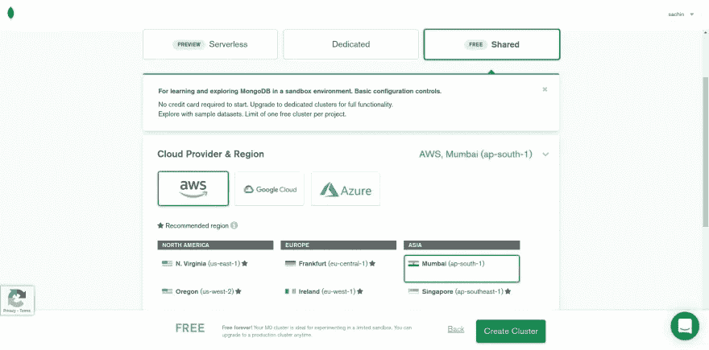

单击“create a cluster”按钮，您将被重定向到这样一个页面，该页面将显示您的集群正在创建中。所以请等待一段时间。

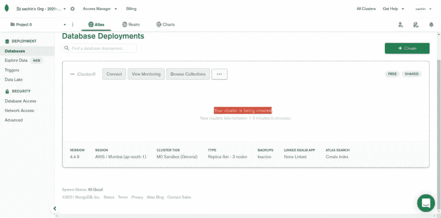

一段时间后，您将看到您的集群已创建。

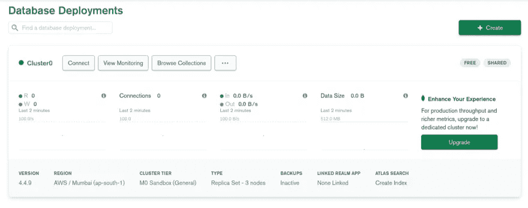

现在点击`Connect`按钮，模态将像这样打开。在这里你必须做两件事

*   添加您的 IP 地址(以便您可以在应用程序中访问该集群)
*   创建数据库用户

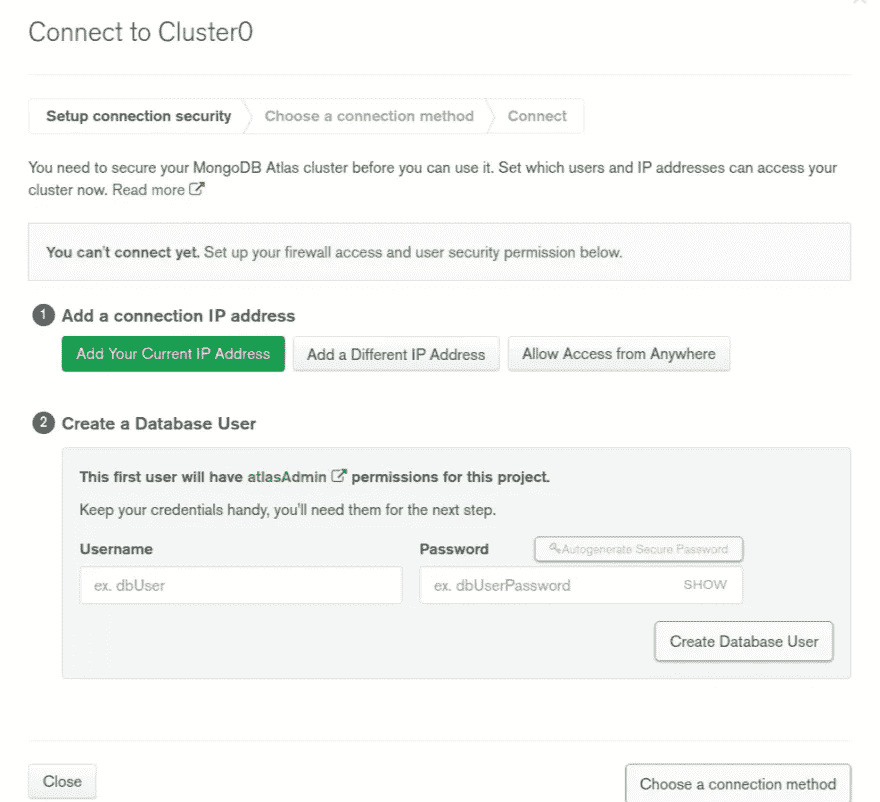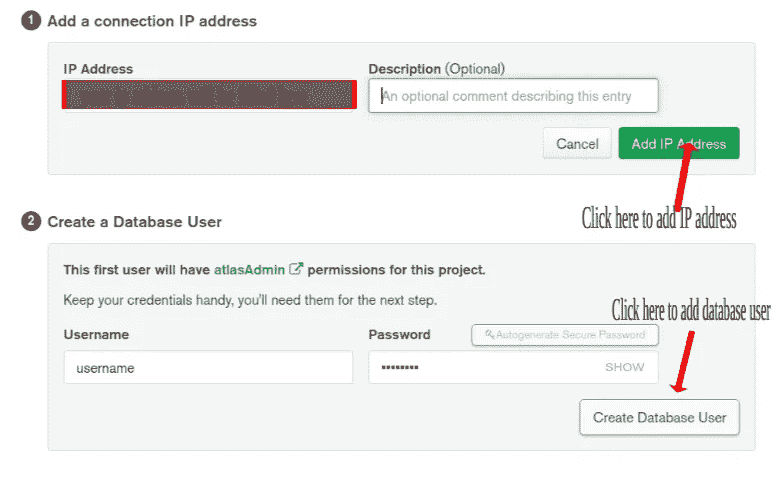

添加 IP 地址和数据库用户后点击`choose a connection method`按钮

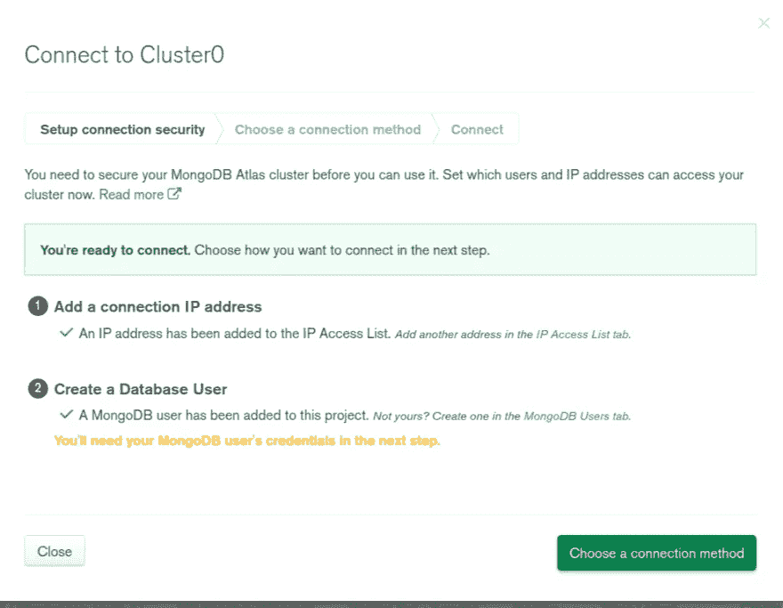

然后点击`Connect to your application`选项。

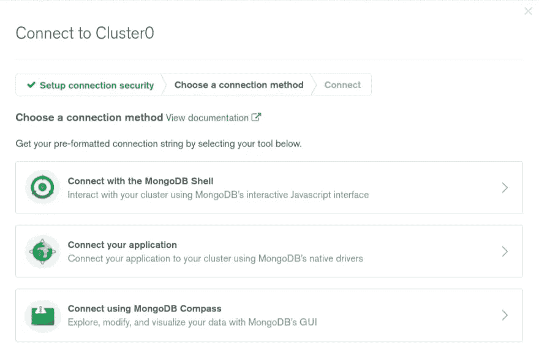

在这里你会看到两件事:

*   驱动和版本(你可以选择任何驱动和版本，我选择了 python 和最新版本)
*   连接字符串(您的连接字符串将不同于我的连接字符串)

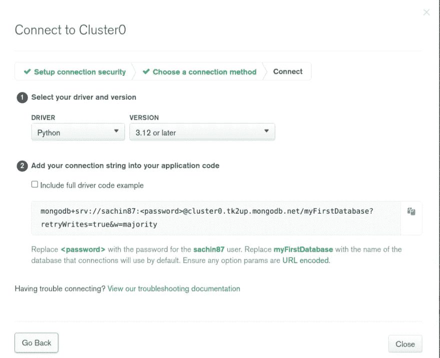

您可以复制您的连接字符串并将其放在您的应用程序中。

> *用你的实际密码替换* `*<password>*` *占位符。*

我希望这篇文章会对你有所帮助。如果你有任何疑问，可以在评论区提问，我很乐意帮助你。

感谢您的阅读。

*最初发布于 2021 年 10 月 7 日*[*https://dev . to*](https://dev.to/sachinchaurasiya/how-to-setup-mongodb-atlas-an7)*。*