# 如何使用机器人父亲设置你的电报机器人

> 原文：<https://blog.devgenius.io/how-to-set-up-your-telegram-bot-using-botfather-fd1896d68c02?source=collection_archive---------0----------------------->

## 在这篇文章中，我将向你展示如何设置一个新的电报机器人及其简介图片，描述，关于文本和命令！

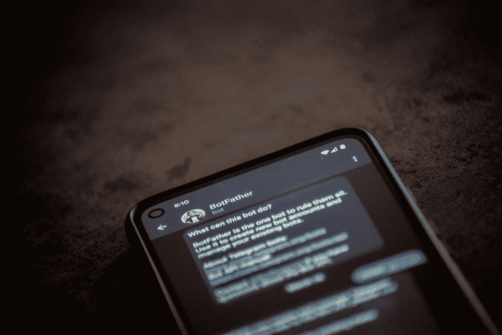

照片由 [Unsplash](https://unsplash.com?utm_source=medium&utm_medium=referral) 上的[拉娜码](https://unsplash.com/@lanacodes?utm_source=medium&utm_medium=referral)拍摄

# BotFather 是谁？

BotFather 是 Telegram 上的一个机器人，它管理你通过 Telegram 上的帐户创建的所有机器人。你可以通过在 Telegram 上搜索`@BotFather`找到他，你应该会看到这个简介

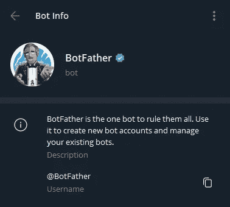

要想知道他能做什么，在与机器人父亲的聊天中发送`/start`或`/help`，你应该会看到他拥有的命令列表。

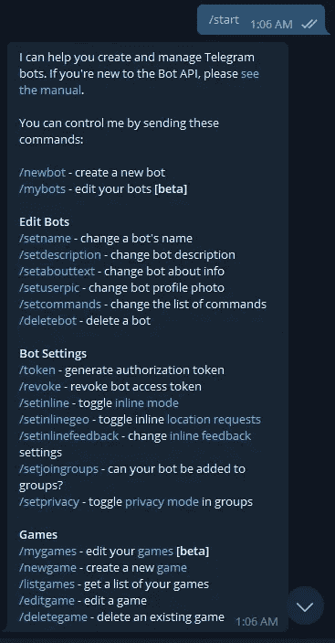

# 1.创建新的机器人

创建新的 Telegram bot 项目的第一步是向 BotFather 注册新的 bot。我们将使用待办事项列表机器人作为一个例子。

1.向机器人父亲发送`/newbot`

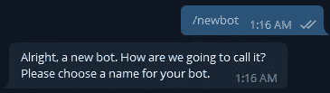

2.用你想要使用的机器人的名字回复机器人父亲。

> *请注意，这将是将出现在您对话中的机器人的名称，它不需要唯一*

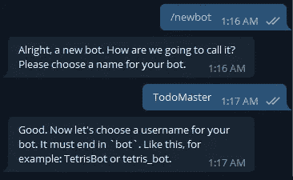

3.接下来，用你希望用于你的机器人的用户名回复机器人父亲

> *用户名是你的机器人的唯一标识符，所以它必须对所有其他机器人都是唯一的。它还会在前面附加一个“@”，这通常是人们找到你的机器人的方式。请注意，机器人的用户名必须以单词 bot 结尾，如果它不符合该标准，或者如果您的用户名不是唯一的，BotFather 会要求您重试。*

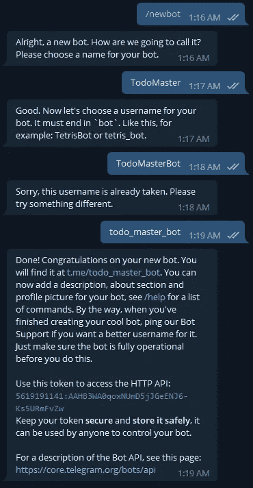

4.此时，您的 bot 应该已经创建好了！

在回复中，您应该能够看到机器人的令牌。这在创建新的机器人时非常重要，确保你不要把这个令牌给任何人，因为拥有这个令牌的人可以控制你的机器人。(别担心，我已经删除了这个示例 bot，所以在截图中复制我的令牌是没有意义的:P)

点击`t.me/<bot_username>`链接，你会被直接带到你的新电报机器人那里。您应该在聊天显示的顶部看到您的新机器人的名称，您还应该在机器人信息页面看到机器人的用户名。

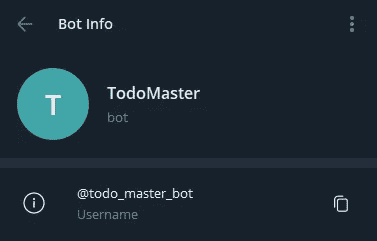

如果在任何时候你需要再次访问你的机器人的访问令牌，发送`/mybots`到机器人父亲，点击机器人的用户名，点击内嵌键盘中的 API 令牌，你应该能够再次看到机器人的令牌。

# 2.添加个人资料图片

为了让你的机器人从其他机器人中脱颖而出，它需要有一张个人资料图片。

1.从机器人父亲聊天，发送`/setuserpic`或者你可以点击聊天框左边的“菜单”按钮，向下滚动到`/setuserpic`。所有的命令都应该在菜单中，这样你就可以在需要发送命令的时候使用菜单。

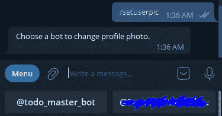

2.点击你的机器人的用户名

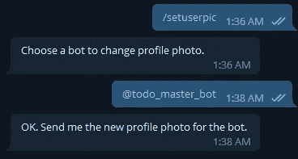

3.上传一张图片到 BotFather(图片必须至少为 150x150)

4.一旦你上传了你的照片，回到你的新机器人，它应该有它的个人资料图片更新！不错！

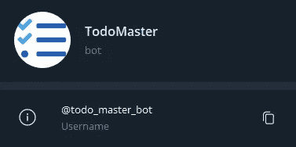

# 3.设置机器人的描述


如果你正在看这张照片，发现它缺少了什么，你是对的，它缺少对机器人的描述。每当一个人第一次访问该机器人时，通常都会显示该描述，并且会显示标题“该机器人能做什么？”。这是非常重要的设置，因为你想让你的用户在访问机器人时立即知道机器人的功能是什么。

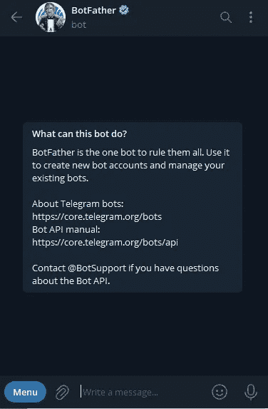

要设置 bot 的描述，类似于上面的步骤。把`/setdescription`送到机器人父亲那里，按照指示去做。

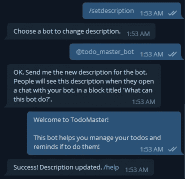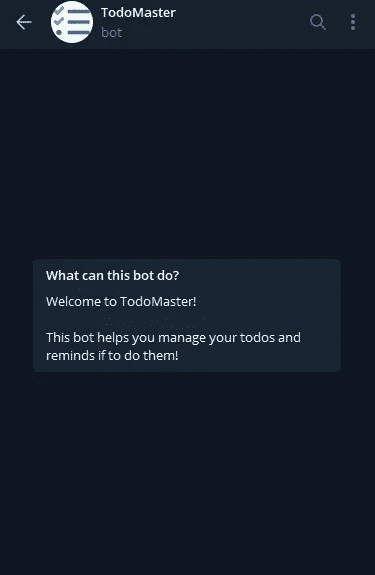

> 现在出于一些奇怪的原因，如果你想让你的机器人在机器人信息页面有“描述”部分，这个“描述”实际上是机器人的“关于”文本，要设置它，使用`/setabouttext`命令。不要问我为什么这样设计，我也不知道。

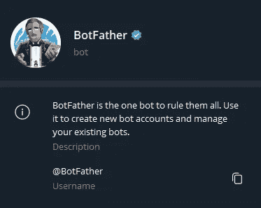

# 4.设置机器人的命令

通过左边的“菜单”按钮给用户提供一个机器人可用命令的列表是很好的。这也省去了他们键入整个命令的需要。

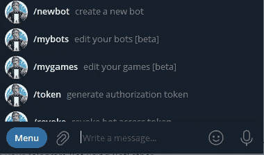

为了让你的机器人得到这个，我们想发送`/setcommands`到机器人之父并选择我们的机器人。

假设我们有 3 个命令`/new`、`/edit`和`/delete`，您需要回复给 BotFather 的是您的命令列表及其描述，格式如下:

```
new - Create a new todo
edit - Edit an existing todo
delete - Delete a todo
```

> *注意，我们排除了命令的斜线，我们使用破折号(-)来分隔命令及其描述。*

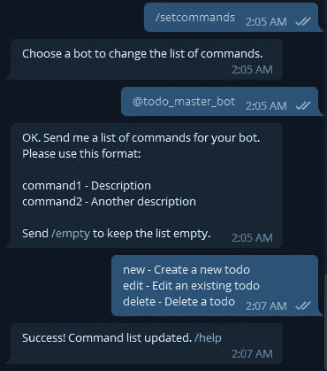

现在你的机器人应该可以通过“菜单”按钮轻松访问它们的命令了！厉害！

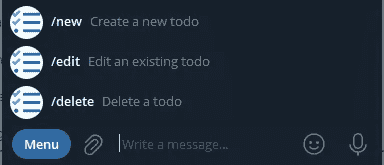

# 那都是乡亲们！

我希望这篇文章对解释 BotFather 的特性有所帮助！如果这对你有帮助，请随时留下关注或鼓掌，并评论你下一步想了解的关于电报机器人的内容！我专门研究电报机器人开发和免费部署技巧，请点击这里查看我关于电报机器人的另一篇文章:[https://blog . dev genius . io/create-and-deploy-your-Telegram-bot-here-completely-free-757 D5 D5 e 8099](/create-and-deploy-your-telegram-bot-here-entirely-free-757d5d5e8099)