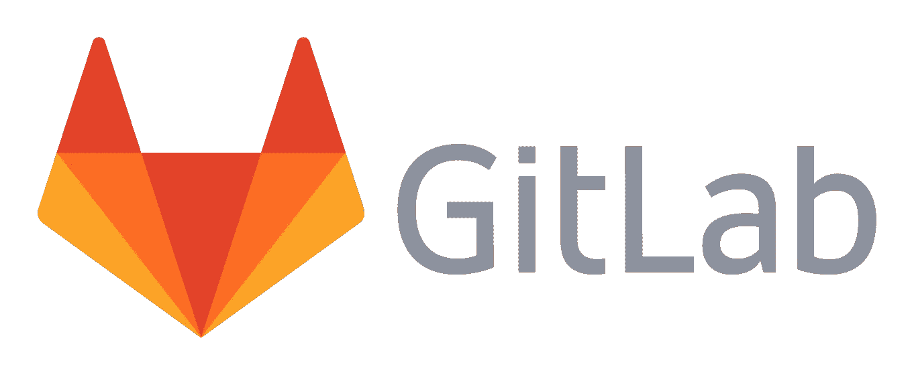
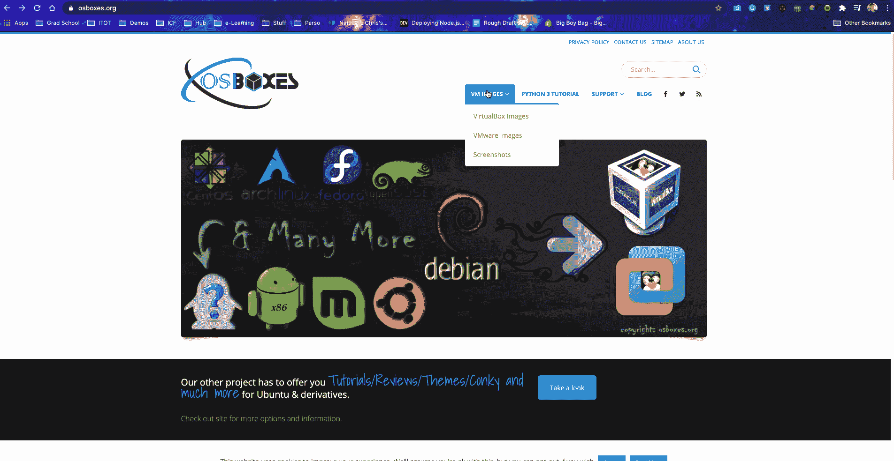
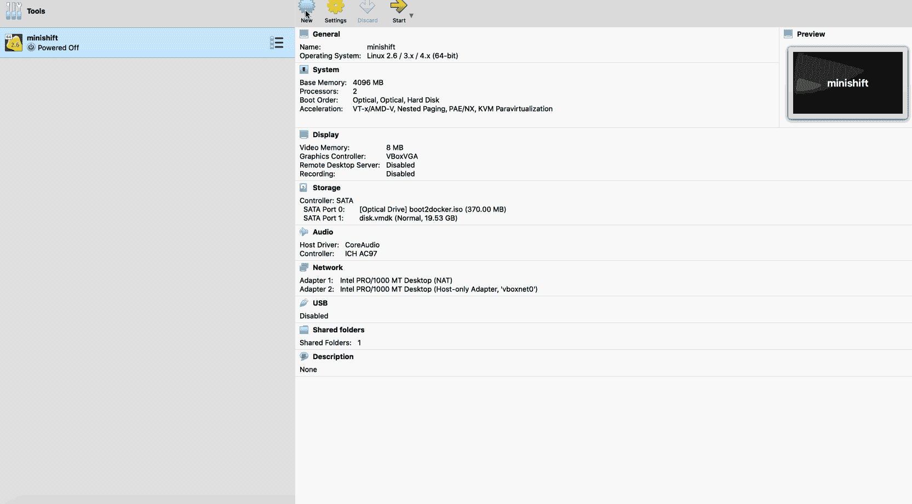
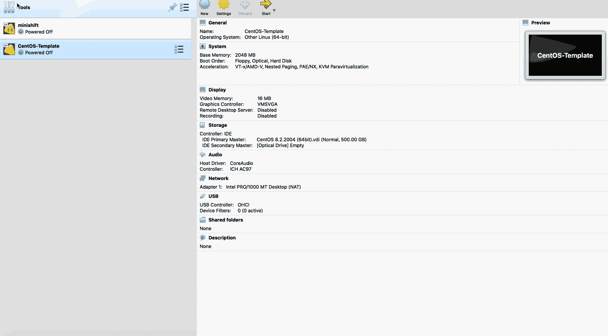
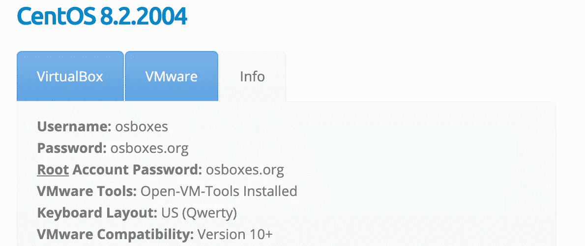
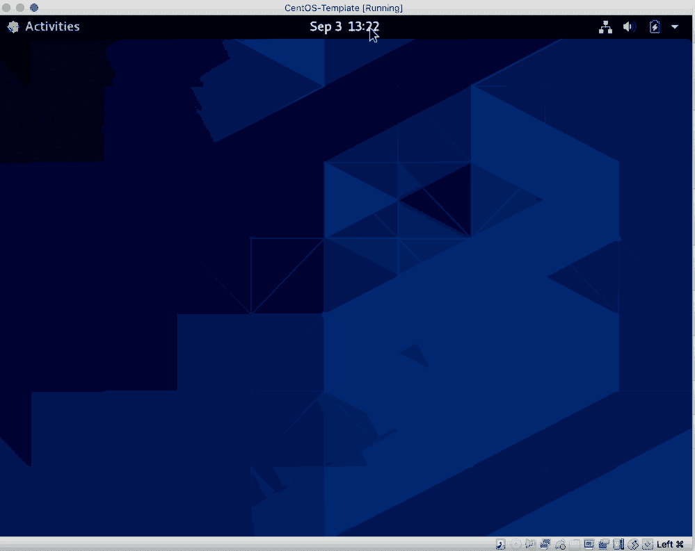

# 如何设置本地 GitLab 源代码管理

> 原文：<https://blog.devgenius.io/how-to-setup-a-local-gitlab-source-code-management-part-i-ce5722a059c4?source=collection_archive---------6----------------------->

GitLab 源代码管理简介

## **git lab 是什么？**

GitLab 是一个基于 web 的 DevOps 生命周期工具，它提供了一个 Git-repository manager，提供 wiki、问题跟踪以及持续集成和部署管道功能，使用由 GitLab Inc .开发的开源许可证。

> GitLab 为什么用于？

**GitLab** 是适用于整个 DevOps 生命周期的单一应用程序，允许团队更好地合作，更快地为您的客户带来更多价值。 **GitLab** 通过缩短您的 DevOps 周期时间、桥接筒仓和阶段，以及将工作从您手中拿走来做到这一点。

类似于 **GitHub** ， **GitLab** 是一个让团队在代码上合作的库管理器。用 Ruby 和 Go 编写的 **GitLab** 提供了一些类似于 **GitHub** 的问题跟踪和项目管理功能。

**GitHub** 和 **GitLab** 的主要区别在于每种理念所代表的平台。 **GitHub** 具有更高的可用性，更专注于基础设施性能，而 **GitLab** 更专注于为 web 开发者提供基于功能的系统**和**集中式集成平台。

> 注:**源代码管理** (SCM)用于跟踪对**源代码**库的修改。SCM 跟踪对**代码**库的变更的运行历史，并在合并来自多个贡献者的更新时帮助解决冲突。SCM 也是版本**控制**的同义词

*   Git 是一个 ***分布式版本控制*** 系统，用于在软件开发过程中跟踪源代码的变化
*   Gitlab、GitHub、Bitbucket、AWS CodeCommit 都是 ***源代码管理。***

# 在 Mac 上本地设置 GitLab 源代码库

> ***1。安装虚拟框*和**

因此，要开始使用，您需要在本地计算机上安装 Oracle Virtual box。如果没有；在这里下载 VirtualBox for Mac OS*并跟随这个视频教程学习如何在 Mac OS 上安装 VirtualBox:*

> ***2。为 VirtualBox** 下载 CentOS 虚拟机镜像*

*接下来，我们将部署一个基于 CentOS 的系统，它将在本地机器上托管 GitLab。*

*为了做到这一点。我们将下载一个 CentOS 映像，并创建一个将在 VirtualBox 中运行的虚拟机模板。VirtualBox 的操作系统映像可以在 osboxes.org*找到**

****

**下载过程的屏幕截图**

> **CentOS 是一个 Linux 发行版，它提供了一个免费的、受社区支持的计算平台，在功能上与其上游源代码 Red Hat Enterprise Linux 兼容。**
> 
> **你可以在这里了解更多关于[的信息](https://www.centos.org/about/)。**
> 
> *****3。创建 CentOS 虚拟机模板*****

**接下来，打开 VirtualBox 并创建 CentOS VM 模板，如下图所示:**

****

*   **我将 RAM 内存设置为 2 GB**
*   **使用现有的虚拟硬盘，这是我之前下载的 CentOS 虚拟机映像**

> ****现在，在我们启动新的 CentOS 虚拟机之前；我们需要考虑网络并确保网络配置设置良好，以便我们部署的所有虚拟机都有一个静态 IP 地址****

****

**所以我做了几件事:**

*   **创建一个名为 ***vbxonet1*** 的新适配器，并在该适配器上禁用 DHCP**

> **更改了 CentOS 虚拟机的网络配置:**

*   **-将适配器 1 设置为 **NAT** 适配器，以便我可以访问互联网( ***)桥接适配器也可以工作，但我在 MacBook Pro 上设置它时遇到了一些问题。但是 NAT 对我来说工作得很好。所以和 NAT 一起去吧*****
*   **-将适配器 2 设置为我创建的新适配器 ***vboxnet1*** 获取静态 IP 地址**
*   **已将 CPU 更新为 2**

**打开 CentOS 虚拟机后，使用您在[***osboxes.org***](https://www.osboxes.org/)下载的虚拟机映像的信息部分中的凭据登录**

****

**成功登录后。你都准备好了。继续关闭 CentOS VM 模板，您现在可以使用它来创建一个托管 GitLab 的新 VM。**

****

**我们都用模板设置好了！😃👌**

**现在进入下一部分。从将托管 GitLab 源代码管理实例的 CentOS VM 模板设置 GitLab 虚拟机。**

> **[如何建立本地源代码管理—第二部分](https://medium.com/dev-genius/how-to-setup-a-local-gitlab-source-code-management-part-ii-2f034ce5a004)**