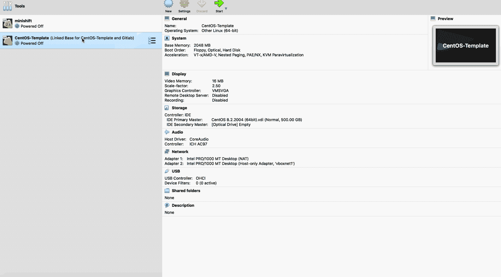

# 如何建立本地 GitLab 源代码管理—第二部分

> 原文：<https://blog.devgenius.io/how-to-setup-a-local-gitlab-source-code-management-part-ii-2f034ce5a004?source=collection_archive---------4----------------------->

GitLab 源代码管理简介

现在，我们已经设置好 CentOS 8.2 模板并准备就绪。让我们继续创建虚拟机，通过克隆模板虚拟机来托管 GitLab 源代码管理:



> **要仔细检查的东西:**
> 
> ***适配器 1 被设置为 NAT**
> 
> ***适配器 2 设置为主机专用适配器:vboxnet1**

# 网络配置

在 Gitlab VM 上电之后，我们需要为互联网访问做所有的网络配置，并在第二个适配器上设置静态 IP 地址。

为此，关闭虚拟机上的两个适配器，并验证 IP 地址分配:

```
$ ifconfig
```

NAT 适配器是 **enp0s3** ，主机专用适配器是 **enp0s8** 。

您会注意到仅主机适配器无法连接，并显示以下错误: ***【网络连接激活失败】*** 和 **enp0s8** 没有分配给它的 IP。因此，让我们继续解决这个问题吧！

## 为主机专用适配器设置静态 IP 地址: **enp0s8**

要在 CentOS 7 中的网络接口上设置静态 IP 地址，有几种不同的方法，具体取决于您是否希望使用`Network Manager`来设置。

网络管理器是一个动态的网络控制和配置系统，当网络设备和连接可用时，它试图保持它们的运行和活动。默认情况下，CentOS 8.2 会安装并启用网络管理器服务。

要验证网络管理器服务的状态:

```
$ systemctl status NetworkManager.service
```

要检查哪个网络接口由网络管理器管理，请运行:

```
$ nmcli dev status
$ nmcli con show
```

如果`nmcli`的输出显示某个特定接口的`connected`(如本例中的`enp0s3`)，则意味着该接口由网络管理器管理。您可以轻松地禁用特定接口的网络管理器，这样您就可以自己为静态 IP 地址配置它。


现在我们可以看到主机专用: **enp0s8** 在名称“ ***接线 1*** ”下出现故障。在 CentOS 8.2 上，为网络接口分配静态 IP 地址有两种不同的方式。我们将**配置一个没有网络管理器的静态 IP 地址。**

我们转到`/etc/sysconfig/network-scripts`目录，找到接口的配置文件(`ifcfg-enp0s3`)。

```
$ cd /etc/sysconfig/network-scripts
$ sudo nano ifcfg-enp0s3
```

复制以下接口配置，并以`ifcfg-enp0s8`的名称保存您的文件

这是我的`ifcfg-enp0s8 interface configuration`

接下来，重新启动网络管理器服务，检查主机专用: **enp0s8** 是否有分配的 IP 地址，并且现在是否由网络管理器管理:

```
$ systemctl restart NetworkManager.service
$ systemctl status NetworkManager.service
$ nmcli dev status
$ nmcli con show
$ ifconfig
```


我们准备好了。😃😉—现在，您可以从 can ssh 到您的虚拟机，并安装将在虚拟机上运行的 Gitlab 实例！

***密码相同→osboxes.org***

```
ssh root@192.168.56.155
```

# 安装 GitLab 实例

因此，我们有几种方法可以在 CentOS 8.2 上安装 Gitlab。请点击这里:[https://about.gitlab.com/install/](https://about.gitlab.com/install/)了解这些不同的选项。你可以随意选择你觉得舒服的选项。因此，让我们从在虚拟机中安装 docker 开始。

> ***在 CentOS 8.2 中安装 Docker***

关于如何在 CentOS 上安装 docker 的说明可以在这里找到[。但是首先，我们需要手动安装 containerd.io 包，否则我们会得到这个包丢失的错误。我们可以在这里找到最新版本](https://docs.docker.com/engine/install/centos/)[https://download . docker . com/Linux/centos/8/x86 _ 64/stable/Packages/](https://download.docker.com/linux/centos/8/x86_64/stable/Packages/):

```
$ sudo yum install --allowerasing -y [https://download.docker.com/linux/centos/8/x86_64/stable/Packages/](https://download.docker.com/linux/centos/8/x86_64/stable/Packages/)[containerd.io-1.3.9-3.1.el8.x86_64.rpm](https://download.docker.com/linux/centos/8/x86_64/stable/Packages/containerd.io-1.3.9-3.1.el8.x86_64.rpm)
```

接下来，我们将使用位于[get.docker.com](https://get.docker.com/)的脚本，通过运行以下命令来安装最新版本的 Docker 引擎:

```
$ curl -fsSL https://get.docker.com -o get-docker.sh
$ sudo sh get-docker.sh
$ service docker start
```


在 CentOS 8.2 上安装 docker 截图

> ***安装 GitLab***

我们将使用 GitLab Docker 映像在我们的虚拟机中安装 GitLab。GitLab Docker 映像是 GitLab 在一个容器中运行所有必要服务的整体映像。

在设置所有其他内容之前，配置一个新的环境变量`$GITLAB_HOME`,指向配置、日志和数据文件将驻留的目录。请确保该目录存在，并且已授予适当的权限。将路径设置为`/srv/gitlab`:

```
$ export GITLAB_HOME=/srv/gitlab
```

一旦你设置了`GITLAB_HOME`变量，你就可以运行图像了。主机名将是我们仅在主机上设置的静态 IP 地址: **enp0s8** :

```
sudo docker run --detach \
  --hostname 192.168.56.155 \
  --publish 443:443 --publish 80:80 --publish 9222:22 \
  --name mygitlab \
  --restart always \
  --volume $GITLAB_HOME/config:/etc/mygitlab \
  --volume $GITLAB_HOME/logs:/var/log/mygitlab \
  --volume $GITLAB_HOME/data:/var/opt/mygitlab \
  gitlab/gitlab-ee:latest
```

> 确保用作主机名的 IP 地址不会改变，这一点非常重要。

部署后，等待它初始化。这可能需要几分钟时间。您可以使用 docker log: `docker log containerID -f`命令对其进行监控:


> 现在你进入浏览器，导航到你本地的 Gitlad 源代码管理实例**[**http://192 . 168 . 56 . 155**](http://HTTP://192.168.56.155)**/****

**您将被要求设置密码，然后使用:**

*   **用户名→ root**
*   **密码→“您设置的新密码”**

****

**[**http://192 . 168 . 56 . 155**](http://HTTP://192.168.56.155)**/—截图****

**搞定了。现在您有了自己的源代码管理，可以使用本地托管的私有项目或其他任何东西🤷🏾‍♂️ 😉👌**

> ***如果你喜欢这个故事，你可能也会喜欢“* [**如何在 Mac OS 上本地设置 open shift**](https://medium.com/swlh/how-to-setup-openshift-locally-on-mac-os-a3b7eb5a5151)*”***

> ***干杯！！！***