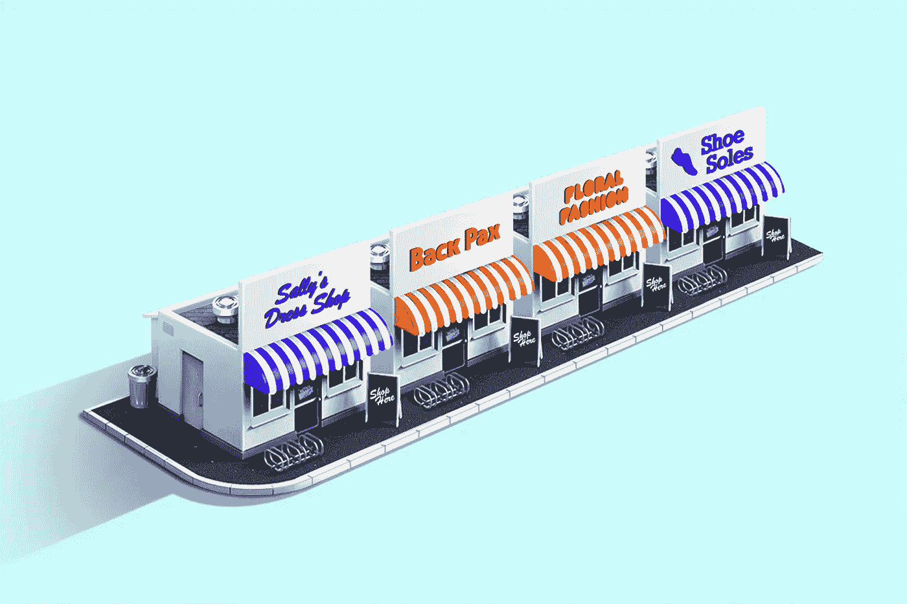
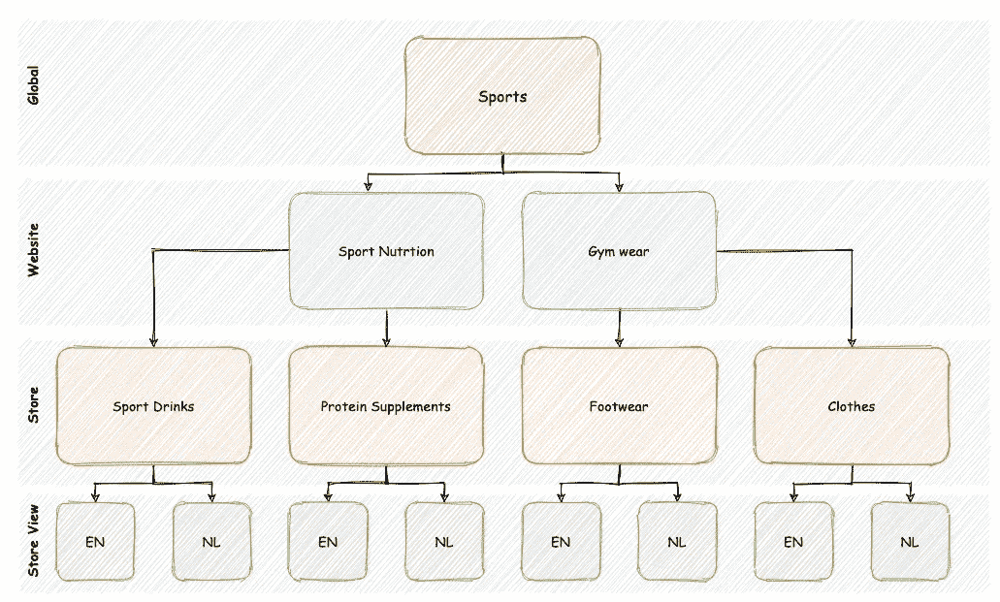
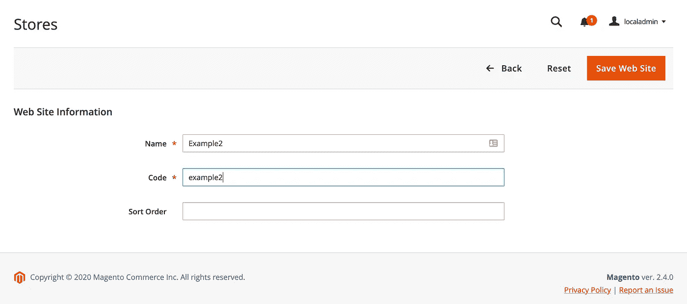
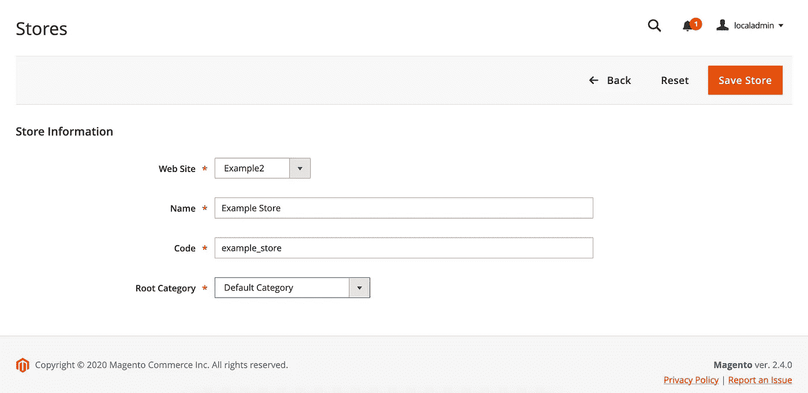
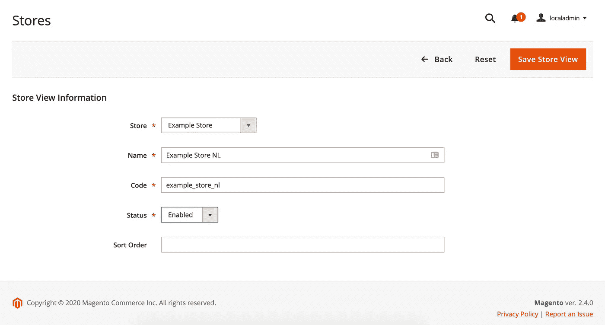
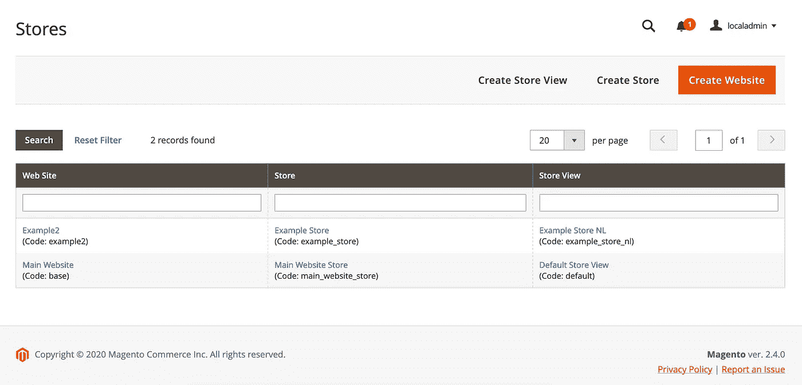

# 如何在 Magento 2 中设置多商店

> 原文：<https://blog.devgenius.io/how-to-setup-a-multistore-in-magento-2-1393a6fcae88?source=collection_archive---------4----------------------->



*照片由* [*晨沏*](https://unsplash.com/@morningbrew?utm_source=unsplash&utm_medium=referral&utm_content=creditCopyText) *上* [*下*](https://unsplash.com/s/photos/storefronts?utm_source=unsplash&utm_medium=referral&utm_content=creditCopyText)

在 Magento 中可以配置多个实例。

每个实例可以包含不同的属性，包括语言、域名、类别、产品、货币等等。

Magento 安装可以有多个网站，这些网站有多个商店或商店视图。

# Magento 2 多商店层级

**全局:**在层次结构的顶端。这是你安装 Magento 后得到的结果。这包括所有默认配置。

**网站:** Magento 安装从一个网站开始，默认情况下，这个网站称为主网站。您也可以为一次安装设置多个网站，每个网站都有自己的 IP 地址和域。

**商店:**一个网站可以有多个商店，每个商店都有自己的主菜单。商店共享相同的产品目录，但可以选择不同的产品和设计。同一网站下的所有商店共享相同的管理和结帐。

**商店视图:**每个可供顾客使用的商店都是根据特定的视图呈现的。最初，商店只有一个默认视图。可以添加额外的商店视图来支持不同的语言，或者用于其他目的。客户可以使用标题中的语言选择器来更改商店视图



Magento 2 多商店图

# 步骤 1:如何创建多商店

在我们建立了 Magento 商店之后，我们可以以管理员的身份登录我们的商店。如果您还没有管理员帐户，您可以创建一个，如下所示:

```
bin/magento admin:user:create
```

举个例子，我们来看一个卖运动饮料的网站，如上图所示。

进入商店->设置->所有商店。

## 创建新网站

点击创建网站并输入以下内容:

1.  您网站的名称
2.  您商店的唯一代码
3.  排序是可选的，默认为 0，现在让我们看看它是怎样的。



## 创建新商店

单击“创建商店”并输入以下信息:

1.  选择网站
2.  你的商店名称
3.  您商店的唯一代码
4.  根类别，默认为默认



## 创建新的商店视图

单击“创建商店”并输入以下信息:

1.  选择商店
2.  您的商店视图的名称
3.  您商店的唯一代码
4.  状态已启用(不言自明)
5.  排序是可选的，默认为 0，现在让我们看看它是怎样的。



这是我们的结果



# 方法 1:从管理员配置基本 URL

接下来，我们需要在商店>设置>配置>常规>网络中设置我们的基本 url。

1.  在页面顶部选择要设置基本 url 的商店视图。
2.  完成以下字段
3.  基本 url:商店视图的基本 URL。
4.  基本链接 url:链接 url 的基本 URL，通常与 base url 相同。
5.  静态视图文件的基本 URL(默认值):让我们默认
6.  用户媒体文件的基本 URL(默认值):输入媒体文件的 URL。这通常是后面带有/ media /的 baseurl。如果您使用的是 CDN，url 指向您的 CDN。


# 方法 2:使用 SSH 配置基本 URL

```
bin/magento config:set web/unsecure/base_url "http://app.sportnutrition.test/" **\
**    --scope=website **\
**    --scope-code=sportnutrition **\
**    -le

bin/magento config:set web/secure/base_url "https://app.sportdrinks-nl.test/" **\
**    --scope=store **\
**    --scope-code=sportdrinks_nl **\
**    -le
```

# 配置服务器以加载店面

现在我们已经为 Magento 创建了一个新网站，我们需要将它添加到我们的项目中。确保您处于开发人员模式。

```
bin/magento deploy:mode:set developer
```

有几种方法可以做到这一点。

*   将商店代码添加到您的基本 URL，您不需要为此访问您的服务器。
*   用. htaccess 和 index.php 创建一个子文件夹。
*   使用符号链接

# 方法 1:将商店代码添加到基本 URL 中。

转到系统->设置->配置->常规-> Web

1.  打开 URL 选项部分:
2.  根据需要，在添加商店代码中选择是。

带商店代码的 URL:

[https://example.com/store-view/index.php/](https://example.com/store-view/index.php/)

没有商店代码的 URL:

https://example.com/index.php/

# 方法 2:使用子文件夹创建多商店

在项目的根目录下创建一个新文件夹，并复制粘贴。htaccess 到您的新文件夹。

```
mkdir -p <new_site> && cp .htaccess <new_site>
```

然后创建一个 index.php:

```
<?php

**require** realpath(**__DIR__**) . '/../app/bootstrap.php';
$params = $_SERVER;$params[\Magento\Store\Model\StoreManager::PARAM_RUN_CODE] = '<code>';
$params[\Magento\Store\Model\StoreManager::PARAM_RUN_TYPE] = '<type>';
$bootstrap = \Magento\Framework\App\Bootstrap::create(BP, $params);$app = $bootstrap->createApplication('Magento\Framework\App\Http');
$bootstrap->run($app);
```

# 方法 3:创建带符号链接的多商店

使用*ln-s<target _ dir>创建一个符号链接。*

```
ln -s <path_to_projet_root>/app/ <your_new_site>app
ln -s <path_to_projet_root>/lib/ <your_new_site>lib
ln -s <path_to_projet_root>/pub/ <your_new_site>pub
ln -s <path_to_projet_root>/var/ <your_new_site>var
```

这些是在 Magento 2 中设置多商店的步骤，在我的下一篇博客中，我将解释如何用 Docker 和 Warden 在本地配置多商店。

# 觉得这个帖子有用吗？请点击👏下面的按钮！:)

来源:

*   [网站、商店和视图](https://docs.magento.com/user-guide/stores/websites-stores-views.html)
*   [如何在 Magento 2 中配置商店网址](https://www.mageplaza.com/kb/how-to-configure-store-urls-magento-2.html)
*   [具有多域和子目录设置的多商店—符号链接](https://magento.stackexchange.com/questions/107450/multi-store-with-multi-domain-and-sub-directory-setup-symlinks)