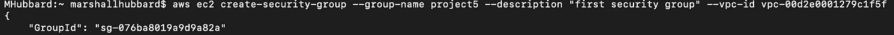

# 如何使用 CLI 设置 EC2 实例并安装虚拟 Python 环境

> 原文：<https://blog.devgenius.io/how-to-setup-an-ec2-instance-using-the-cli-and-installing-a-virtual-python-environment-51b1b850dd67?source=collection_archive---------2----------------------->

你好，感谢再次加入我的节目！在本实验中，我们将学习如何通过 AWS 命令行界面(CLI)设置 Python 环境。如果你想知道 AWS CLI 是什么，它的用途是什么，请查看我的题为“从 CLI 创建自动缩放组”的实验室。在该实验中，我介绍了什么是 AWS CLI，以及使用它代替 AWS 控制台 GUI 的好处。如果你不熟悉 Python，我强烈建议你看看我的上一篇博客“如何使用 Python 创建品牌名称生成器”。该实验室更深入地研究了 Python 是什么以及它的用途。

*在我们开始之前，给你一些建议——对于登录 AWS 或填写命令所需的任何信息，请将其保存在一个文件中，这样只有你才能访问它。这也将使你更容易参考，而不是不断地寻找信息。

好了，现在我已经说清楚了，让我们开始派对吧！

**第一步:**创建新用户

1a)登录 AWS 控制台，转到搜索栏并键入 IAM 来创建一个新用户。在那里，选择标有“添加用户”的蓝色图标。

1b)一旦您为用户提供了名称，请确保您选中了该复选框，以便为他提供编程访问权限以及 AWS 管理控制台访问权限。为用户提供一个自定义密码是一种很好的做法，同时选中强制用户在下次登录时创建新密码的复选框，但这不是本实验的要求。

1c)成功创建用户后，请确保将访问密钥 ID 和秘密访问密钥保存到记事本或其他安全的地方。这些是以该用户身份成功登录 AWS CLI 所必需的。

此外，这个 VPC 和用户将被拆除的时候，这个博客张贴，以避免任何人试图登录，哈哈。

1d)现在事情变得有趣了。登录到您的 CLI 并输入命令“aws configure”。这就是需要之前信息的地方。使用您保存的信息，使用您的新用户凭据成功配置 AWS CLI。完成后，请跟随我进行下一步。仅供参考，我在本实验中屏蔽了我的访问密钥和保密密钥，但您的密钥将完全显示在 CLI 中。

**第 2 步:**从命令行界面配置您的 VPC

2a)使用命令“aws ec2 describe-vpcs”确保您使用的是要配置的正确的 VPC。这只是为了确保在您继续之前一切都准备好了。

2b)下一步是为您的 VPC 创建一个安全组。您的 EC2 实例将需要这一点，以允许您通过 SSH 来下载您的 Python 环境。使用以下命令创建您的安全组。它应该返回安全组 ID。

AWS ec2 create-security-group-group-name project 5-description "*随便你怎么命名*-VPC-id*yourvpcid*

2c)配置安全组后，使用下一个命令打开端口 22。一旦将这个安全组连接到 EC2，端口 22 允许您 SSH 到 EC2。出于习惯，我也打开了端口 80，但这不是本实验所必需的。当它没有给你回报的时候，你就知道你成功了。您可以随时检查控制台，以确保您的命令确实得到执行。以下是命令:

AWS ec2 authorize-security-group-ingress-group-id*yoursecuritygroup-*协议 TCP-port*whateveryouwanttoopen*CIDR*yourvpcid*

第三步:创建您的 EC2

3a)好的，一旦你到了这一步，回到 AWS 控制台并选择你想要选择的 AMI。获取该实例的 AMI，并将其放在记事本中，因为下面的命令将需要它。我个人选择了 Ubuntu。请记住，无论您选择什么样的图像，都可能有自己的命令。

3b)执行到这一步后，您将使用 AWS EC2 控制台中的信息创建实例。此外，请确保您选择的密钥对保存在您计算机上您可以访问的文件夹下。使用以下命令创建实例:

AWS ec2 run-instances-image-id*ami you choosed*-instance-type*whever size you want*-key-name*your key*

使用此命令将您的安全组附加到它:

AWS ec2 modify-instance-attribut-instance-id*yoursinstanceid*-groups*yoursecuritygroupid*

**步骤 4:** 登录到您的实例

4a)执行到这一步后，转到 AWS 控制台，在搜索栏中键入 EC2。在那里，单击 Instances 并选择您刚刚创建的实例 ID，然后选择“Connect”。

4b)选择“连接”后，选择“SSH 客户端”,您的屏幕应该类似于我在上面直接发布的内容。您需要复制 AWS 为您创建的示例，并将其放入您的 CLI 中。但是在你做之前，使用 CLI 命令“cd”将目录切换到你保存密钥对文档的地方，然后键入你的文件夹名。

4c)进入该目录后，将实例连接示例粘贴到您的 CLI 中。然后，您的 CLI 应该开始连接，您的最后一行应该是您的实例的私有 IPv4 地址，等待您的下一个命令。一旦你看到这一点，你就成功地连接到了它。

**步骤 5:** 将 Python 环境下载到您的实例中

5a)好了，我们差不多完成了。下一步是将 Python 环境下载到您的实例中。但是在这之前，最好更新和升级您的实例。请记住，您的 sudo 命令将根据您选择的实例而变化。

*   使用命令" *sudo apt update* "来更新您的实例
*   接下来使用“ *sudo apt upgrade* ”来升级您的实例

然后在实例中创建一个路径，从环境中下载所有的包和库。你可以使用命令" *mkdir* "然后给这个文件夹取你想要的名字。完成后，将目录切换到该文件夹，然后使用以下命令安装 Python 环境:

sudo 安装 python3-venv

5b)要激活环境，请键入:

来源*whateveryounamedyourfolder*/bin/activate

**步骤 6** *:* 创建并运行您的 Python 测试程序

6a)在最后一步，我们将通过 Python 创建一个测试程序。您可以使用您喜欢的任何文本编辑器来创建“hello.py”程序，但是我个人选择(并且推荐本实验使用)保持简单，使用 Vim。您可以运行 Vim 并创建程序，只需输入命令“ *vim hello.py”。*

6b)然后，您将进入该屏幕输入您的代码。在这里你可以输入任何你想要文本编辑器执行的命令。要开始插入代码，只需点击“I”进入插入模式。一旦进入插入模式，只需输入 print("Hello World！").您可以通过按键盘上的 escape 键来保存此代码。要保存它，键入分号“:”，然后键入 wq 并按回车键。这将您的代码保存到文件中，以便在您输入命令后执行。

6c)现在输入" *python3 hello.py* "让 python 执行你的文件。你会立即看到 Python 打印的“Hello World！”对着屏幕。

我的实验室到此结束。谢谢你坚持和我在一起！