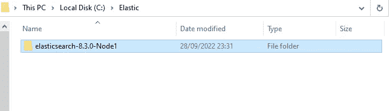
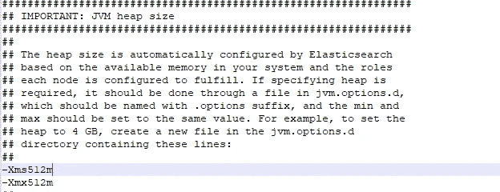
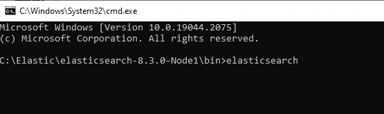
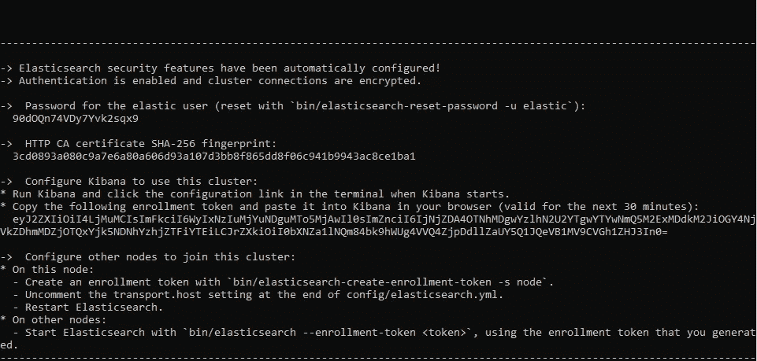
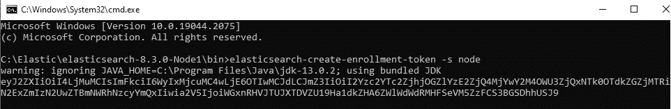
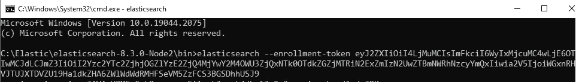
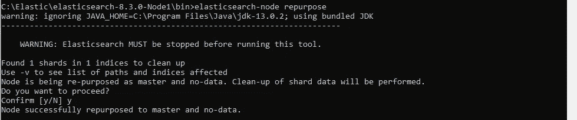
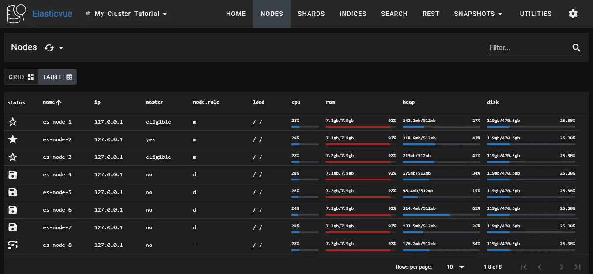

# 如何设置 Elasticsearch 8.x 集群？端到端实践。

> 原文：<https://blog.devgenius.io/how-to-setup-an-elasticsearch-8-x-cluster-end-to-end-practice-b26cc9fe5799?source=collection_archive---------0----------------------->

除非您使用 Elasticsearch 进行开发和测试，否则创建和维护一个 Elasticsearch 集群将会占用您相当多的时间。Elasticsearch 是一个极其强大的搜索和分析引擎，这种力量的一部分在于能够扩展它以获得更好的性能和稳定性。

本教程将提供一些关于如何设置 Elasticsearch 集群的信息，虽然手动设置 Elasticsearch 集群对学习很有用，但强烈建议在任何集群设置中使用配置管理工具，我建议使用 Ansible 来部署 Elasticsearch 集群。

# 什么是 Elasticsearch 集群？

一个 Elasticsearch 集群是一组由一个或多个 Elasticsearch 节点实例连接在一起的集合。弹性搜索集群的强大之处在于集群中所有节点的搜索和索引任务的分布。

Elasticsearch 集群中的节点可以被分配不同的工作或职责:

*   数据节点—存储数据并执行与数据相关的操作，如搜索和聚合
*   主节点—负责集群范围的管理和配置操作，如添加和删除节点
*   客户端节点—将集群请求转发到主节点，并将与数据相关的请求转发到数据节点
*   摄取节点—用于在索引前预处理文档
*   …

# 安装弹性搜索集群

## 安装 Java

Elasticsearch 构建于 Java 之上，至少需要 Java 8 (1.8.0_131 或更高版本)才能运行。因此，我们的第一步是在集群中的所有节点上安装 Java 8。请注意，集群中的所有 Elasticsearch 节点都应该安装相同的版本。

在本教程中，我们将在 windows 系统上安装 Elasticsearch 8.3.0，我们将创建一个 8 节点集群:

*   3 个主节点
*   4 个数据节点
*   2 个客户端节点

点击此[链接](https://www.elastic.co/fr/downloads/past-releases/elasticsearch-8-3-0)并下载 windows zip 文件

**在为集群指定的所有服务器上重复以下步骤。**

在我们的例子中，我将在同一台机器(本地 PC/windows)上安装所有节点

## 安装弹性搜索节点

打开你之前下载的 zip 文件并解压到一个文件夹中，在我的例子中我会使用这个文件夹路径 **C:/Elastic** ，你可以使用任何你想要的路径。

弹性文件夹

现在，我们将再创建 7 个*elastic search-8 . 3 . 0-Node 1*文件夹的副本，对于每个副本，我们将更改文件夹名称上的*节点*编号。

你的文件夹现在应该包含 8 个文件夹，如下图所示

# 配置弹性搜索集群

我们的下一步是设置集群，以便节点可以相互连接和通信。

**对于每个节点**，打开*Elasticsearch-8 . 3 . 0-Node */config*文件夹下的 elastic search 配置文件，打开 *elasticsearch.yml*

这个文件很长，包含不同部分的多个设置。浏览该文件，并输入以下配置

> #为您的集群命名。
> Cluster . name:My _ Cluster _ Tutorial
> 
> #为您的节点命名(从一个节点到另一个节点更改节点号)。
> node.name: "es-node-1 "

保存并退出。

## 发现和集群形成设置

在投入生产之前，应该配置两个重要的发现和群集形成设置，以便群集中的节点可以相互发现并选出一个主节点

*   **discovery.seed_hosts**

**discovery.seed_hosts** 设置提供集群中符合主节点条件的节点列表。每个值的格式都是 host:port

**然而**，由于在安装期间自动配置 Elasticsearch(从版本 8.x 开始)，我们需要能够在每个节点上启动 Elasticsearch 服务，然后才能将它们加入集群。

因此，我们现在将跳过该设置的配置。

*   **cluster . initial _ master _ nodes**

**cluster . initial _ master _ nodes**设置定义了符合主节点条件的节点的初始集合。这在首次启动 Elasticsearch 集群时非常重要。群集形成后，从每个节点的配置中删除此设置。该设置的值**必须**与 **node.name 的值相匹配。**

请注意，当您首次启动 Elasticsearch 时，会自动进行以下安全配置:

*   [TLS 的证书和密钥](https://www.elastic.co/guide/en/elasticsearch/reference/current/configuring-stack-security.html#stack-security-certificates)为传输层和 HTTP 层生成。
*   TLS 配置设置被写入 *elasticsearch.yml* 。
*   为弹性用户生成一个密码。
*   为 Kibana 生成注册令牌。

在安装过程中，Elasticsearch 被自动配置为单节点集群。

现在，在启动第一个节点之前，我们将把 jvm.options 文件中的 xms 和 xmx 参数从 4gb 改为 512mb

jvm .选项

现在打开命令行，指向你的 node1 文件夹，转到/bin 并执行 elasticserach 文件

cmd 节点-01

在执行 elasticsearch 批处理文件后，您应该在 cmd 中看到这样的消息

复制这几行并把它们保存在安全的地方。

现在转到你的 *elasticsearch.yml* 文件，你会注意到多个变化

> # — — — — — —开始安全自动配置————
> #
> #以下设置、TLS 证书和密钥已自动生成
> #以在 08–10–2022 14:26:56
> #
> #—————————
> 
> #启用安全功能
> xpack.security.enabled: true
> 
> xpack . security . enrollment . enabled:true
> 
> #为 HTTP API 客户端连接启用加密，例如 Kibana、Logstash 和代理
> xpack . security . HTTP . SSL:
> enabled:true
> keystore . path:certs/HTTP . p12
> 
> #启用群集节点之间的加密和相互身份验证
> xpack . security . transport . SSL:
> enabled:true
> verification _ mode:certs
> keystore . path:certs/transport . p12
> trust store . path:certs/transport . p12
> #允许来自任何地方的 HTTP API 连接
> #连接被加密并要求用户身份验证
> HTTP . host:127 . 0 . 0 . 1
> HTTP . port:9200
> 
> #允许其他节点从任何地方加入集群
> #连接被加密并相互验证
> #transport.host: 0.0.0.0
> 
> # ---------------------------------------------------------

现在我们要在每个节点上添加 *http.port:9200* 参数(节点 1:9200，节点 2:9201，节点 3:9202…)

保存、退出并重启节点。

# 将其他节点注册到 Elasticsearch 集群中

此时，Elasticsearch 只在节点 01 上运行。

## 生成弹性搜索集群注册令牌

接下来，您需要生成 Elasticsearch 集群注册令牌。**仅在启动 ES 的单个节点**上执行此操作。

在此设置中，我们将仅在节点 1 上生成 Elasticsearch 集群注册令牌，因为我们已经在此节点上启动了 Elasticsearch 服务。

> 弹性搜索-创建-注册-令牌-s 节点

Node01 令牌

获得令牌后，请复制并将其保存在安全的地方，因为我们稍后会用到它。

现在打开节点 2 elasticsearch.yml 文件，编辑集群和节点名称:

> #为您的集群命名。集群名称:我的集群教程
> 
> #为您的节点命名(从一个节点到另一个节点更改节点号)。
> node.name: "es-node-2 "

保存并退出。

使用以下命令注册弹性搜索节点 02

> 弹性搜索—注册令牌“上面生成的令牌”

node2 成功启动后，您会看到 *elasticsearch.yml* 文件已经更改，就像我们对 node 1 所做的那样，我们将添加 *http.port* param

> # --------------------------------------------------------------------------------------------------------开始安全自动配置--------------------------------------------------------------------
> 
> #启用安全功能
> xpack . security . enabled:true
> 
> xpack . security . enrollment . enabled:true
> 
> #为 HTTP API 客户端连接启用加密，如 Kibana、Logstash 和代理
> xpack . security . HTTP . SSL:
> enabled:true
> keystore . path:certs/HTTP . p12
> 
> #启用集群节点之间的加密和相互认证
> xpack . security . transport . SSL:
> enabled:true
> verification _ mode:certs
> keystore . path:certs/transport . p12
> trust store . path:certs/transport . p12
> #发现集群中的现有节点
> # discovery . seed _ hosts:[" 127 . 0 . 0 . 1:9300 "]
> 
> #允许来自任何地方的 HTTP API 连接
> #连接被加密并要求用户验证
> HTTP . host:127 . 0 . 0 . 1
> HTTP . port:9201
> 
> #允许其他节点从任何地方加入集群
> #连接被加密并相互验证
> #transport.host: 0.0.0.0
> 
> # ---------------------------------------------------------

类似地，在其他节点上运行相同的注册命令，就像我们对节点 2 所做的一样，每次都添加 *http.port* param 并重新启动节点

现在，在将 7 个节点注册到我们的第一个节点群集(节点 1)后，我们需要稍微调整一下它们的角色。

我们启动的每个节点都被分配了以下角色:

*   掌握
*   数据
*   数据内容
*   数据 _ 热点
*   数据 _ 温暖
*   数据 _ 冷
*   数据 _ 冻结
*   吸收
*   毫升
*   远程群集客户端
*   改变

我们将通过编辑每个节点上的 elasticsearch.yml 文件来改变这一点

首先，我们需要将以下参数分别添加到前 3 个节点的 *elasticsearch.yml* 文件中:

> node.roles: [master]

对于节点 4、节点 5、节点 6 和节点 7，以下参数:

> 节点.角色:[数据]

最后，对于最后一个节点(节点 8)，我们将为其分配协调节点角色:

> node.roles: []

**注:**

> 每个节点隐含地是一个**协调节点**。这意味着通过 **node.roles** 具有明确的空角色列表的节点将仅充当协调节点

接下来，在自动配置期间注释初始主配置集，并将其替换为

*cluster . initial _ master _ nodes:[" es-node-1 "，" es-node-2 "，" es-node-3"]*

在所有节点上

现在你的 elasticsearch 节点 1 文件应该看起来像这样

> Cluster . name:My _ Cluster _ Tutorial
> node . name:es-node-1
> node . roles:[data]
> Cluster . initial _ master _ nodes:[" es-node-1 "、" es-node-2 "、" es-node-3 "]
> #——————————————开始安全自动配置—————————————
> #
> #以下设置，TLS 证书， 密钥已自动生成
> #以在 2022 年 8 月 10 日 15:31:27 日
> #
> # — — — — — — — — — —配置弹性搜索安全功能
> 
> #启用安全功能
> xpack . security . enabled:true
> 
> xpack . security . enrollment . enabled:true
> 
> #为 HTTP API 客户端连接启用加密，如 Kibana、Logstash 和代理
> xpack . security . HTTP . SSL:
> enabled:true
> keystore . path:certs/HTTP . p12
> 
> #启用集群节点之间的加密和相互认证
> xpack . security . transport . SSL:
> enabled:true
> verification _ mode:certs
> keystore . path:certs/transport . p12
> trust store . path:certs/transport . p12
> #发现集群中的现有节点
> discovery . seed _ hosts:[" 127 . 0 . 0 . 1:9307 "、" 127.0.0.1:9301 "、" 127 . 0 . 0 . 0
> 
> #允许来自任何地方的 HTTP API 连接
> #连接被加密并要求用户验证
> HTTP . host:0 . 0 . 0 . 0
> HTTP . port:9200
> 
> #允许其他节点从任何地方加入集群
> #连接被加密并相互验证
> #transport.host: 0.0.0.0
> 
> # ---------------------------------------------------------

在重新启动 node01 之前，我们需要重新定位节点角色，

因为我们的节点已经启动，并且有一个数据碎片，这意味着我们永远不能给它分配仅主控角色，这就是为什么我们需要在节点 01 上执行这个命令

> 弹性搜索-节点再利用

再利用命令

现在重启你的节点 01

**注:**

> 如果一个节点曾经是数据节点或符合主节点条件的节点，但已经被重新调整为不具有这两种角色之一，则可以使用 elasticsearch-node 重新调整用途从该节点中删除不需要的数据。

您需要在节点 2 和节点 3 上重复最后的步骤，就像我们在节点 1 上做的那样，然后一次重新启动一个节点。

至于节点 4、节点 5、节点 6 和节点 7，我们将仅将其角色更改为数据，并添加群集初始主节点参数

> Cluster . name:My _ Cluster _ Tutorial
> node . name:es-node-4
> Cluster . initial _ master _ nodes:[" es-node-1 "、" es-node-2 "、" es-node-3 "]
> node . roles:[data]

对于节点 8，只需删除数据角色并保持参数为空

> Cluster . name:My _ Cluster _ Tutorial
> node . name:es-node-2
> Cluster . initial _ master _ nodes:[" es-node-1 "，" es-node-2 "，" es-node-3"]
> node.roles: []

现在重新启动其余的节点。

**检查我们的集群:**

现在，为了确保一切工作正常，每个节点都启动并运行，我推荐使用 [elasticvue](https://github.com/cars10/elasticvue) 应用程序，你可以找到它作为 chrome 扩展，否则你可以使用 kibana 开发工具，通过运行 elastic 提供的可用 API(GET _ cat/node 和 GET _cat/health)来检查你的集群和节点状态，你也可以使用任何浏览器或邮递员使用此链接执行 API[https://127 . 0 . 0 . 1:9200/_ cat/nodes？v](https://es-node01:9200/_cat/nodes?v) 在您的浏览器上检查节点状态或[https://127 . 0 . 0 . 1:9200/_ cat/health？v](https://es-node01:9200/_cat/health?v) 检查集群状态

Elasticvue 是一款免费的开源浏览器 elasticsearch gui，它提供了不同的功能，如:

集群概述

指数管理

搜索界面

REST 查询接口

快照管理

…

如下图所示，elaticvue 提供了一个 gui，允许您搜索和过滤集群数据。

正如您在上面看到的，所有节点都已启动并运行，每个节点都按照我们的要求进行了配置(3 个主节点、4 个数据节点和 1 个协调节点)

给你。现在，您已经拥有 8 个节点的 Elasticsearch 8.x 集群，并且正在运行。

一旦集群如上所述形成，在所有节点上删除或注释以下行。

> cluster . initial _ master _ nodes:[" es-node-1 "，" es-node-2 "，" es-node-3"]

# 弹性搜索针对生产环境的集群配置提示:

对于在生产环境中运行的集群，还有一些额外的推荐设置。

## 避免“裂脑”

“裂脑”情况是指由于网络故障或其中一个节点的内部故障，群集中节点之间的通信失败。在这种情况下，不止一个节点可能认为自己是主节点，从而导致数据不一致的状态。

为了避免这种情况，我们可以对 Elasticsearch 配置文件中的*discovery . Zen . minimum _ master _ nodes*指令进行更改，该指令确定需要多少节点进行通信(法定人数)才能选出一个主节点。

确定这个数字的最佳实践是使用下面的公式来确定这个数字:N/2 + 1。n 是群集中符合主节点条件的节点数。然后将结果向下舍入到最接近的整数。

如果集群有三个节点，则:

> discovery . Zen . minimum _ master _ nodes:2

## 调整 JVM 堆大小

为了确保 Elasticsearch 有足够的操作余地，应该调整默认的 JVM 堆大小(最小/最大 1 GB)。

根据经验，最大堆大小应该设置为 RAM 的 50%，但不超过 32GB(由于 Java 指针在较大堆中效率低下)。Elastic 还建议最大和最小堆大小的值应该相同。

这些值可以使用 *jvm.options* 文件中的 Xmx 和 Xms 设置进行配置。

## 禁用交换

换出未使用的内存是一种已知的行为，但在 Elasticsearch 的上下文中可能会导致连接断开、性能下降以及总体上不稳定的集群。

为了避免交换，你可以禁用所有交换(如果 Elasticsearch 是服务器上唯一运行的服务，建议使用)，或者你可以使用 *mlockall* 将 Elasticsearch 进程锁定到 RAM。

完成后重启 Elasticsearch。

## 调整虚拟内存

为了避免耗尽虚拟内存，请增加 mmap 计数的限制数量

## 增加打开文件描述符限制

另一个重要的配置是打开文件描述符的限制。由于 Elasticsearch 使用了大量的文件描述符，您必须确保定义的限制足够，否则您可能会丢失数据。

此设置的一般建议值为 65，536 或更高。

# 结论

您的 Elasticsearch 集群应该运行在一个健康的状态，并且配置了一些基本的优化！

Elasticsearch 还有许多其他配置选项，比如索引、分片和复制设置，这里没有介绍。建议您稍后重新查看您的配置以及官方文档，以确保您的集群配置满足您的需求。

祝您阅读愉快，我很乐意回答任何问题。