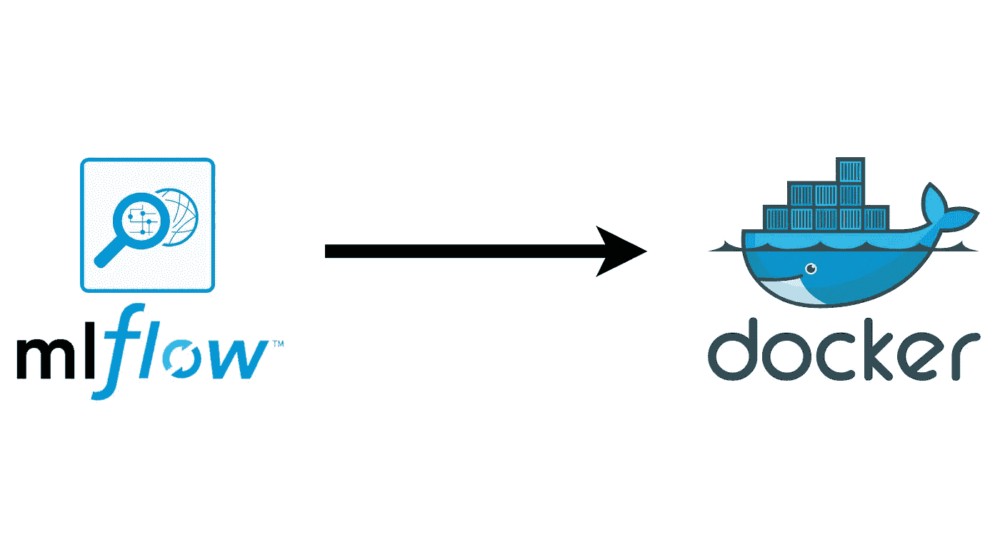
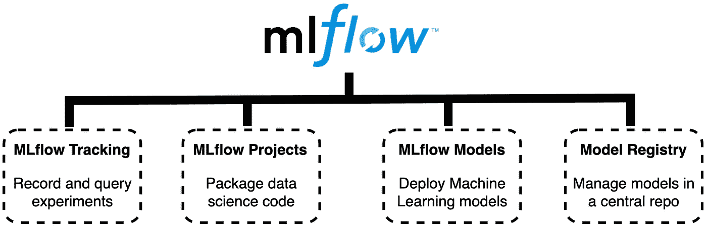
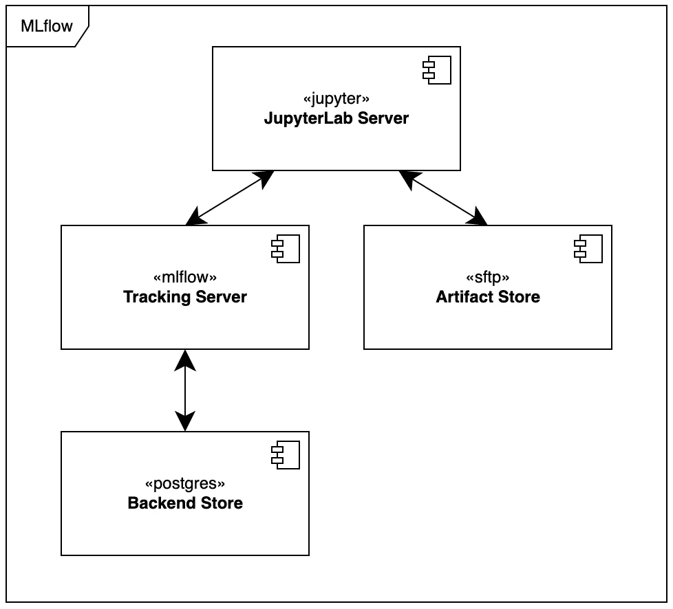
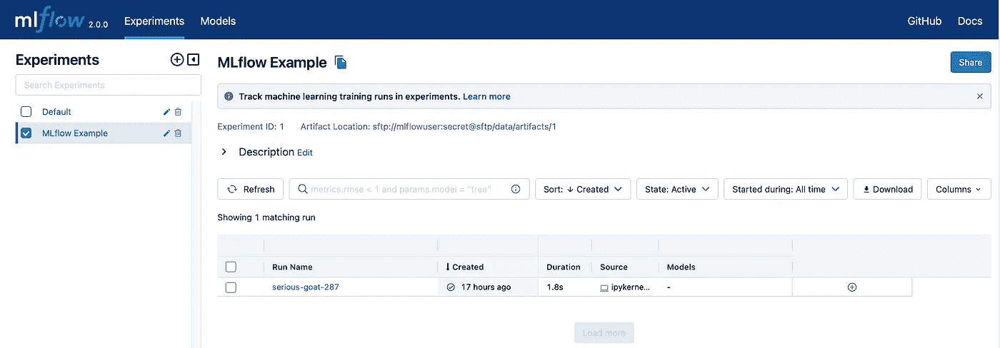
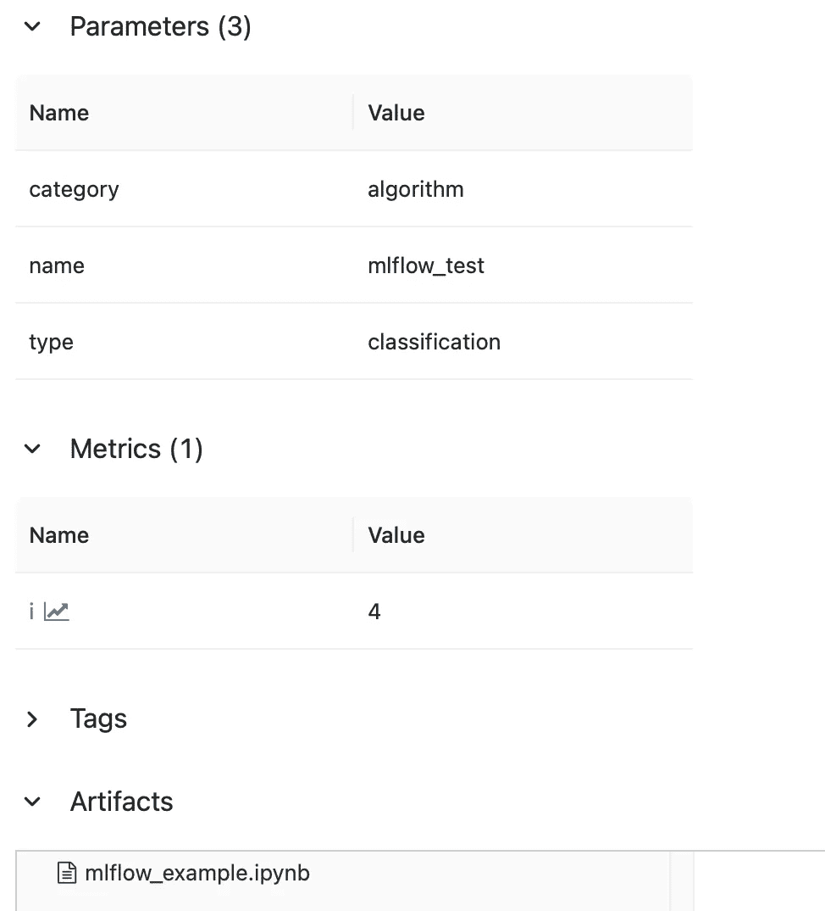

# 如何用 Docker 设置 MLflow 2.0 工作空间？

> 原文：<https://blog.devgenius.io/how-to-setup-an-mlflow-2-0-workspace-with-docker-7e4938b695e5?source=collection_archive---------5----------------------->

## *使用 MLflow 管理机器学习生命周期—部署您自己的 MLflow 工作空间*


照片由 [CHUTTERSNAP](https://unsplash.com/ja/@chuttersnap?utm_source=medium&utm_medium=referral) 在 [Unsplash](https://unsplash.com?utm_source=medium&utm_medium=referral) 上拍摄

MLflow 是一个管理机器学习(ML)生命周期的开源平台。通过使用 ML flow，可以对每个 ML 实验的代码、数据和结果进行跟踪，这意味着可以随时查看所有处理步骤。所有实验都是可重复的，您可以使用 MLflow 共享和部署您的模型。此外，MLflow 提供了一组 API，可用于许多现有的 ML 库，如 TensorFlow、PyTorch 或 sklearn，无论您在哪里运行 ML 代码(例如，在 jupyter 笔记本上或在云中)。MLflow 与库无关。所有功能都可以通过 [REST API](https://mlflow.org/docs/latest/rest-api.html#rest-api) 和 [CLI](https://mlflow.org/docs/latest/cli.html#cli) 访问。此外，MLflow 项目还包括一个 [Python API](https://mlflow.org/docs/latest/python_api/index.html#python-api) 、 [R API](https://mlflow.org/docs/latest/R-api.html#r-api) 和 [Java API](https://mlflow.org/docs/latest/java_api/index.html#java-api) 。

作为一名数据科学家，你花了很多时间优化 ML 模型。最佳模型通常取决于最佳超参数或特征选择，并且很难找到最佳组合。还有，你要记住所有的组合，这很费时间。MLflow 是应对这些挑战的高效开源平台。



带有 Docker 的 MLflow 工作区(作者插图)

在本帖中，我们将介绍 MLflow 的基本功能，并展示 Docker 的设置。在这种情况下，MLflow 建立在 docker 堆栈中，具有 Postgres 数据库、SFTP 服务器和 JupyterLab。这些步骤如下:

1.  **物流基础知识**
2.  **技术要求**
3.  **使用 Docker** 进行设置
4.  **结论**
5.  **有用的文献和链接**

# 🤔**物流基础知识**

目前，MLflow 提供了四个组件。您可以在下图中看到它们。



MLflow 功能概述(作者插图)

*   **MLflow Tracking** 用于跟踪和查询实验。它跟踪模型参数、代码、数据和模型工件。此外，MLFlow 的跟踪服务器提供了一个 Web UI，它显示了被跟踪的 ML 模型。ML flow 库已经提供了 Web 用户界面。跟踪服务器是以实验的形式组织的。在实验中，可以通过可视化结果来比较 ML 模型。
*   **MLflow 项目**是一个组件，用于以可重用和可复制的方式封装数据科学代码。
*   **ML 流模型**格式为使用不同库(如 TensorFlow、PyTorch 或 sklearn)创建的 ML 模型提供了统一的存储格式。统一的格式支持在不同的环境中部署。
*   **模型注册**组件允许提供从试生产到生产的生产模型的年表。它支持在中央模型库中管理 ML 模型。

您可以在 MLflow 的[官方文档](https://mlflow.org/docs/latest/index.html)和 [GitHub repo](https://github.com/mlflow/mlflow) 中了解更多关于各个组件的信息。

# ✅技术要求

您将需要以下先决条件:

*   您的机器上必须安装最新版本的 Docker。如果您尚未安装，请遵循[说明](https://docs.docker.com/get-docker/)。
*   您的计算机上必须安装最新版本的 Docker Compose。请遵循[指示](https://docs.docker.com/compose/install/)。
*   访问 bash (macOS、Linux 或 Windows)。

# 🖥 **用 Docker** 设置工作空间

首先，您应该检查是否正确安装了 Docker 和 Docker Compose。打开您选择的终端并输入以下命令:

```
$ docker --version
# Example output: $ Docker version 20.10.21
```

如果安装正确，则输出 Docker 版本。您可以为您的 Docker Compose 安装检查相同的内容。

```
$ docker-compose --version
# Example output: $ Docker Compose version v2.12.2
```

是啊。一切正常。现在我们可以从 Docker 组合栈开始。

有几种方法可以使用 MLflow。您可以将 MLflow 与 localhost 一起使用，或者为生产环境部署完整的堆栈。在这篇文章中，我们将重点讨论第二种选择。该堆栈包含四个服务，如下图所示。



Docker 合成堆栈(作者插图)

在下文中，我们描述各个服务。你可以在我们的 [GitHub repo](https://github.com/tinztwins/mlflow-workspace) 中找到完整的 docker-compose 栈。启动堆栈的确切说明在项目自述文件中。我们已经在一个。环境文件。

*   **JupyterLab** 是一个基于网络的笔记本、代码和数据交互开发环境。它经常用于数据科学项目。在这篇文章中，我们使用了 DockerHub 上的 [jupyter/scipy-notebook](https://hub.docker.com/r/jupyter/scipy-notebook) 图片。您也可以使用其他 Jupyter 图像，如 JupyterHub。在工作区设置中，它可用于创建和跟踪 ML 模型。
*   SFTP 服务器是一个远程数据存储器。SFTP(安全文件传输协议)是一种文件传输协议，提供对远程计算机的安全访问。在这个项目中，我们使用来自 DockerHub 的 [atmoz/sftp](https://hub.docker.com/r/atmoz/sftp) 映像。您也可以使用其他存储技术，如 AWS S3。在我们的设置中，SFTP 服务器充当工件存储。在这个商店里，我们存放着经过训练的 ML 模型和其他人工制品，如 jupyter 笔记本。
*   **物流跟踪服务器**提供物流网络用户界面。在这个 Web UI 上，你可以看到所有的实验，并仔细查看具体的实验。我们使用 [python:3.9.15](https://hub.docker.com/_/python) Docker 图像。服务器可以在 *localhost:5000* 访问。你可以在下面看到一个网页界面的截图。



MLflow Web 用户界面

*   Postgres 是一个免费的开源关系数据库管理系统。我们用它来存储参数和评估指标。在本帖中，我们使用 DockerHub 的官方 [postgres](https://hub.docker.com/_/postgres) docker 图片。

您可以使用以下命令启动 docker-compose 堆栈:

```
$ docker compose up -d
```

标志-d 意味着容器作为守护进程运行。在这种模式下，终端不输出任何日志。您可以使用以下命令查看特定容器的日志:

```
$ docker compose logs --follow <container_name>
```

日志显示容器的状态。如果一切正常，那么您可以使用 MLflow 工作区。

首先，您可以登录 JupyterLab 服务器。您必须使用 jupyter 容器日志中的令牌。当你在本地启动时，网址是 *localhost:8888* 。在服务器上，你可以看到 jupyter 笔记本。您可以使用笔记本 *mlflow_example.ipynb* 检查您的设置。执行每个单元，并检查没有错误出现。没有错误？是的，你的设置很成功。

接下来，您可以检查 MLflow 跟踪服务器是否正确跟踪了您的实验。访问以下网址: *localhost:5000。*您应该会看到 MLflow web UI。现在你可以选择实验“MLflow Example”并点击运行。新页面打开。此页面显示跟踪的参数、度量和工件。



跟踪值概述

还可以看到 jupyter 笔记本被跟踪。结果是由哪个代码生成的总是很清楚的。很有帮助。现在你可以从你的笔记本开始。试试看。

# 🎬结论

在这篇文章中，我们看到了如何用 Docker 建立一个 MLflow 工作空间。在这种情况下，我们学习了如何将服务互连到一个整体系统。我们在我们的 [GitHub](https://github.com/tinztwins/mlflow-workspace) 账户上提供完整的源代码。试试看。

你喜欢这篇文章吗？成为[中级会员](https://tinztwins.medium.com/membership)继续无限学习。当您使用该链接时，我们将收取一小部分会员费。您无需支付额外费用。

**不要错过我们接下来的故事:**

[](https://tinztwins.medium.com/subscribe) [## 每当 Tinz Twins 发布时收到一封电子邮件。

### 每当 Tinz Twins 发布时收到一封电子邮件。注册后，如果您还没有，您将创建一个中型帐户…

tinztwins.medium.com](https://tinztwins.medium.com/subscribe) 

非常感谢你的阅读。如果你喜欢这篇文章，请随意分享。关注我们了解更多内容。祝你有美好的一天！


# 🔍有用的文献和链接

*   [物流单据](https://mlflow.org/docs/latest/index.html)
*   [MLflow GitHub](https://github.com/mlflow/mlflow)
*   [采用 MLflow 的机器学习工程](https://www.packtpub.com/product/machine-learning-engineering-with-mlflow/9781800560796)
*   [用 MLFlow 开始 MLOps】](https://www.amazon.de/-/en/Sridhar-Alla/dp/1484265483)