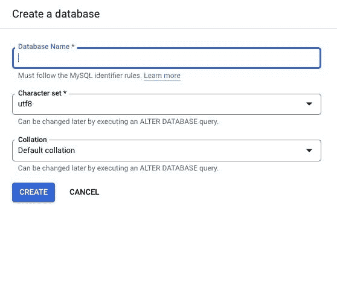

# 如何从 Laravel 应用程序设置并连接到 Google 云平台中的云 SQL 数据库

> 原文：<https://blog.devgenius.io/how-to-setup-and-connect-to-cloud-sql-database-in-google-cloud-platform-from-a-laravel-application-f2d4191ae506?source=collection_archive---------5----------------------->


谷歌云 SQL — Laravel

在本文中，我们将探索 Google 云平台上的数据库设置以及使用云 SQL 的 Laravel 应用程序中的集成示例。

这种设置可以用作任何编程语言或框架的数据库设置。为了演示集成的用例，我们将在 Laravel 应用程序中使用它。

没有进一步的重做，让我们开始在谷歌云平台(GCP)上设置数据库

*   **创建谷歌云平台(GCP)账户**

如果您没有帐户，您可以创建一个或登录[这里](https://console.cloud.google.com/)

创建帐户后，您应该会看到这个屏幕


*   [云 SQL 实例](https://cloud.google.com/sql/docs/)

云 SQL 实例是完全托管的关系型 MySQL、PostgreSQL 和 SQL Server 数据库。Google 处理复制、补丁管理和数据库管理，以确保可用性和性能。

在仪表板上搜索 SQL 或云 SQL 实例


*   创建实例


*   根据您的项目需求选择数据库引擎


在本教程中，我们将选择 SQL 进行演示

**为了创建一个实例，你必须先启用** [**计算引擎 API**](https://cloud.google.com/compute/)

****

****接下来填写创建实例所需的详细信息****

****

*   **实例 ID**
*   **密码(最好点击生成)**
*   **为您的应用程序选择 MySQL 版本**
*   **选择一个配置作为开始**

**这些建议的配置将预先填写此表单，作为创建实例的起点。您可以在以后根据需要进行自定义。**

*   **选择区域**
*   **分区可用性(单个或多个)**

**自定义您的实例**

**您也可以稍后自定义实例配置**

*   **连接**

**选择您希望源如何连接到此实例，然后定义授权连接的网络。**

**您可以使用云 SQL 代理来获得额外的安全性。**

****

**实例 IP 分配**

*   **私有 IP**

**[配置私有 IP](https://cloud.google.com/sql/docs/mysql/configure-private-ip?)**

*   **公共 IP**

**选择您选择的实例 IP 分配，并定义网络 IP 地址**

****

****数据保护****

**自动化备份和时间点恢复**

*   **单击“创建实例”继续**

**实例仪表板**

****

*   **实例摘要**

****

*   **动作标签**

****

*   **数据库实例已准备好**

****

**点击左侧菜单中的数据库，创建一个数据库(**请注意，这也可以通过命令行界面**完成)**

****

*   **设置数据库的名称**

****

*   **单击左侧菜单栏中的用户来创建用户**

****

*   **转到您的项目，根据编程语言或框架要求使用凭据。**

****下面是连接到云 SQL 实例的不同方式:****

*   **[公共 IP 地址](https://cloud.google.com/sql/docs/mysql/configure-ip)**
*   **[私有 IP 地址](https://cloud.google.com/sql/docs/mysql/private-ip)**
*   **[使用 SSL/TLS 证书授权](https://cloud.google.com/sql/docs/mysql/authorize-ssl)**
*   **[云 SQL 授权代理](https://cloud.google.com/sql/docs/mysql/sql-proxy)**

**有关连接选项的更多信息(来自云运行、云功能、应用引擎等)。)访问[这里](https://cloud.google.com/sql/docs/mysql/connect-overview)**

****让我们用 Laravel 应用程序做一个演示，使用代理认证从本地机器连接 SQL 实例。****

```
**Don't use these instructions to set up the Cloud SQL Auth proxy for a production environment.**
```

**云 SQL 身份验证代理是一个云 SQL 连接器，它提供对实例的安全访问，无需授权网络或配置 SSL。**

**这是关于[如何工作的文档](https://cloud.google.com/sql/docs/mysql/sql-proxy?_ga=2.59899821.-1639499822.1644143128#how-works)**

**要使用云 SQL 身份验证代理，您必须满足以下要求:**

*   **必须启用云 SQL 管理 API。**
*   **您必须为云 SQL 身份验证代理提供 Google Cloud 身份验证凭据。**
*   **您必须为云 SQL 身份验证代理提供有效的数据库用户帐户和密码。**
*   **该实例必须具有公共 IPv4 地址，或者配置为使用专用 IP。**

****

```
Enable the Cloud SQL Admin API
```

*   **[下载并安装云 SQL 认证代理](https://cloud.google.com/sql/docs/mysql/sql-proxy?_ga=2.59899821.-1639499822.1644143128#install)**

**下载应用程序后，将其重命名为 **cloud_sql_proxy.exe****

*   **启动云 SQL 身份验证代理**

**在自己的终端中启动云 SQL Auth 代理，这样就可以监视它的输出。用您在上一步中复制的实例连接名称替换 INSTANCE_CONNECTION_NAME。**

*   **对于 Linux 环境，使用以下命令启动云 SQL 身份验证代理:**

```
./cloud_sql_proxy -instances=INSTANCE_CONNECTION_NAME=tcp:3306
```

**在 Windows 上的 PowerShell 中，使用以下命令启动云 SQL 身份验证代理:**

```
.\cloud_sql_proxy.exe -instances=INSTANCE_CONNECTION_NAME=tcp:3306
```

**在 Windows 上的 PowerShell 中，使用以下命令启动云 SQL 身份验证代理:**

****

*   **接下来，打开 gcloud 终端或任何 cli，将目录更改为 cloud_sql_proxy.exe 文件的位置**

****

*   **更新 Laravel 应用程序的 env 文件**

```
DB_CONNECTION=mysql
DB_HOST=127.0.0.1
DB_PORT=3306
DB_DATABASE=db_name
DB_USERNAME=user_name
DB_PASSWORD="user_pwd"
```

**在 Laravel 应用程序目录 CLI 中运行 artisan 迁移命令**

```
php artisan migrate
```

****

*   **以下是 artisan migrate 执行时的活动**

****

*   **我们可以使用 MySQL workbench 来查看数据库记录**

****

**如果你是谷歌云平台的新手，或者想探索其他功能，这里有一些我以前发表的文章。**

*   **[如何在谷歌云平台(GCP)的谷歌应用引擎(GAE)上部署 Laravel 应用](https://alemsbaja.hashnode.dev/how-to-deploy-a-laravel-application-on-google-app-engine-gae-in-google-cloud-platform-gcp)。**
*   **[如何在 Google cloud run 上部署一个 Laravel 应用，使用带有 build 命令的 Cloud build，持续集成和部署](https://alemsbaja.hashnode.dev/how-to-deploy-a-laravel-application-on-google-cloud-run-using-cloud-build-with-build-command-continuous-integration-and-deployment)会有帮助。**
*   **[如何从 Laravel 应用上传文件到谷歌云存储](https://alemsbaja.hashnode.dev/how-to-upload-files-to-google-cloud-storage-from-a-laravel-application)**
*   **[如何使用 Google cloud vision API 安全搜索检测来检测 Laravel 中图片上传的露骨内容](https://alemsbaja.hashnode.dev/how-to-use-google-cloud-vision-api-safe-search-detection-to-detect-explicit-content-on-image-uploads-in-laravel)**

**感谢您阅读这篇文章。**

**请与您的网络分享，并随时使用评论区的问题，答案和贡献。**

**你喜欢这篇文章吗？？请在 Hashnode [alemsbaja](https://hashnode.com/@alemsbaja) 或 Twitter [@alemsbaja](https://hashnode.com/@alemsbaja) 上关注我，了解更多文章的最新动态**

***最初发布于*[*https://alemsbaja . hashnode . dev*](https://alemsbaja.hashnode.dev/how-to-setup-and-connect-to-cloud-sql-database-in-google-cloud-platform-from-a-laravel-application)*。***