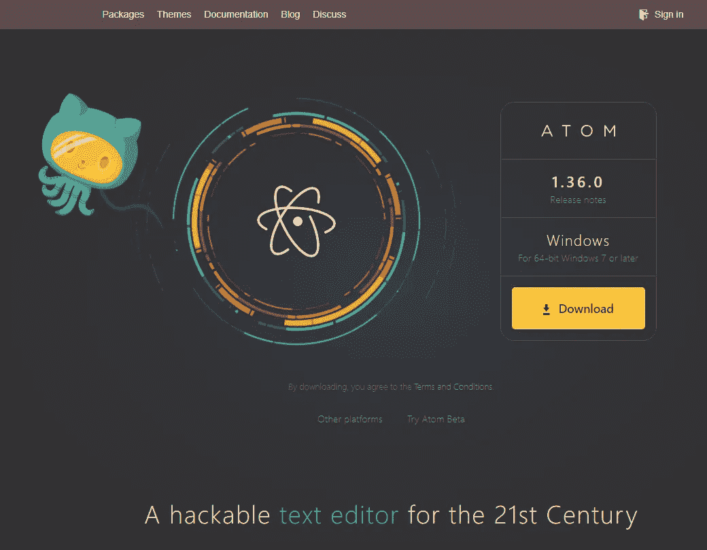
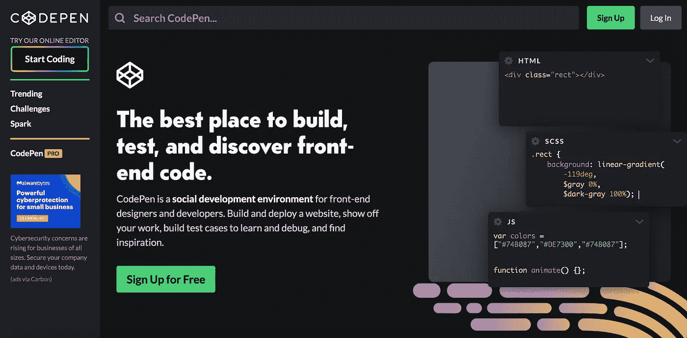

# 如何设置 Atom 和 code pen——我的加密货币三角套利交易机器人(Project Journey)

> 原文：<https://blog.devgenius.io/how-to-setup-atom-and-codepen-my-triangular-arbitrage-trading-bot-project-journey-b0aefd09d881?source=collection_archive---------5----------------------->

就像我在之前的文章中描述的那样，请看下面的文章

> [构建加密货币交易机器人需要什么](https://medium.com/@MrOvos/what-you-need-to-build-a-crypto-trading-bot-my-triangular-arbitrage-trading-bot-kucoin-project-d1a5388499d6)

Atom 是一个流行的 JavaScript 开源编辑器，可以免费下载。另一方面，Codepen 在 Html、CSS 和 JavaScript 项目中也很流行，但它是一个在线编辑器。两个平台都是免费的。

在其他方面，我将使用 Codepen 来帮助你完成我构建加密货币交易机器人的旅程。这将允许我更好地与你分享代码，你可以很容易地访问源代码。；这个项目还会有一个 Github 目录。

如果您的设备(PC)上尚未安装 Atom，或者您尚未创建 Codepen 项目。请遵循以下指南:

> 如果你已经有了 Atom 或者 Codepen 甚至 Visual Studio 代码(VSCODE)，请跳到下一个故事，[设置 Nodejs 和 Nextjs 项目](https://medium.com/@MrOvos/setting-up-my-project-with-nodejs-and-nextjs-my-triangular-arbitrage-trading-bot-project-3f1fa1e68ce0)

# 如何为 JavaScript、Html 和 CSS 开发设置 Atom

要使用 Atom，你必须在 Atom 网站上安装最新版本和正式发行版。

> 要开始使用 Atom，我们需要在您的系统上安装它。本节将介绍如何在您的系统上安装 Atom，以及如何从源代码构建它的基础知识。
> 
> 安装 Atom 应该相当简单。一般可以去 [https://atom.io](https://atom.io/) ，应该会看到一个下载按钮，如下图:

> 按钮应该是特定于您的平台的，并且下载包应该很容易安装。但是，让我们在这里稍微详细地讨论一下。

[*点击此链接，查看 Atom.io 网站上的完整安装指南*](https://flight-manual.atom.io/getting-started/sections/installing-atom/)

安装 Atom 后，按照这个指南安装美化和缩进编辑器的相关包。[此处引导](https://medium.com/productivity-freak/my-atom-editor-setup-for-js-react-9726cd69ad20)

你可能也想在这里安装一些[这些软件包](https://upmostly.com/web-development/best-atom-packages-front-end)

# 如何设置 Codepen 或 JavaScript、Html 和 CSS 开发

这几乎需要你在 [Codepen](https://codepen.io) 网站上创建一个账户。

[*按照指南设置*](https://www.freecodecamp.org/news/how-to-use-codepen/) *码笔*

# 接下来> > >《第四集》

在我的下一个故事中，我将用 Nodejs 和 Nextjs 建立我的项目。[继续阅读……](https://medium.com/@MrOvos/setting-up-my-project-with-nodejs-and-nextjs-my-triangular-arbitrage-trading-bot-project-3f1fa1e68ce0)

# 在这里跟随我的项目旅程

这是我的故事，所以一定要跟随我的项目之旅。请分别在[媒体](https://medium.com/@MrOvos)和[推特](https://twitter.com/MrOvos)上关注我的故事和推文。

我的 [Twitter](https://twitter.com/MrOvos) 页面

成为[**coding gig club**](https://twitter.com/CodingGigClub)的会员

# 结论

安装了 Atom 之后，编写 JavaScript 项目变得更加容易和有趣。你可以随时使用你选择的任何其他编辑器，例如 [*Visual Studio 代码编辑器*](https://code.visualstudio.com/learn/get-started/basics) 。

这是我在构建加密货币套利交易机器人的项目旅程。如果你刚刚开始，请在 [Twitter](https://twitter.com/MrOvos) 和这里 [Medium](https://medium.com/@MrOvos) 上关注我，然后继续到 ***下一集*** 或 [***从头开始***](https://medium.com/@MrOvos/what-are-cryptocurrency-trading-bots-my-triangular-arbitrage-trading-bot-project-journey-a28ad0712fab) 。