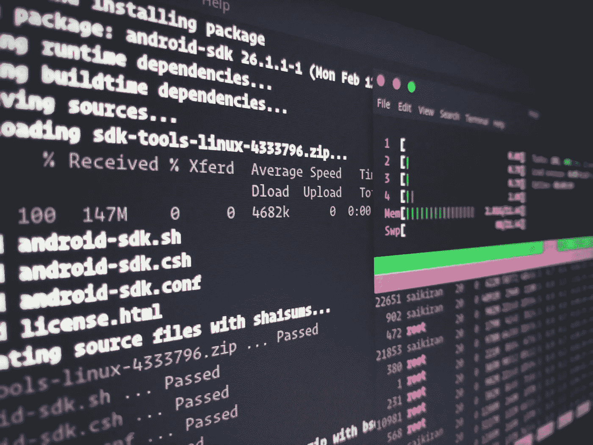

# 如何在 Macbook 中设置自动化测试

> 原文：<https://blog.devgenius.io/how-to-setup-for-your-automation-testing-in-your-macbook-7f0355316b0c?source=collection_archive---------6----------------------->

如果您是基于 UNIX/Linux 系统的新用户，为 Mac PC/Laptop 设置自动化是一项困难的任务。但是如果你熟悉命令和脚本，那么你可以很容易地为自动化和编程设置 mac 系统。



# *按照以下步骤设置 Mac OS X 电脑/笔记本电脑以实现自动化/编程:*

## 将终端设置为 bash 配置文件:

*   将终端设置为 bash 配置文件(以便在终端中更好地编辑)
*   打开“终端”>“前往终端偏好设置”>“通用”
*   Shell 以 set it to Command(完整路径)打开到/bin/bash(如果已经设置了，则无需更改)

## 在 Mac OS 中显示隐藏文件:

*   开放终端
*   粘贴命令:defaults write com . apple . finder AppleShowAllFiles YES
*   按 Option/Shift +右键单击 finder 图标
*   重新启动 Finder(所有隐藏的文件都将可见)

## 步骤 1:安装最新的 JDK 版本

*   这里下载链接:[http://www . Oracle . com/tech network/Java/javase/downloads/JDK 8-downloads-2133151 . html](http://www.oracle.com/technetwork/java/javase/downloads/jdk8-downloads-2133151.html)
*   使用终端设置 Java 主路径

*echo export " JAVA _ HOME = \ $(/usr/lib exec/JAVA _ HOME)">>~/。轮廓*

## 第二步:设置 Android SDK/(Android Studio)

*   在应用程序上安装 Android SDK
*   这里下载链接:[https://developer.android.com/studio/index.html](https://developer.android.com/studio/index.html)

滚动到最后，找到如下软件:

Android-studio-ide-173.4819257-MAC . dmg

*   设置 ANDROID_HOME:

*导出 ANDROID _ HOME =/Users/ex xxxxx/Desktop/utility/ANDROID SDK/ANDROID SDK*

*   使用 Android HOME 设置工具和平台工具的路径

*导出路径= $ PATH:$ ANDROID _ HOME/tools:$ ANDROID _ HOME/platform-tools*

## 第三步:安装家酿啤酒

*   在终端中安装 brew:

*ruby-e " $(curl-fsSL*[*https://raw . githubusercontent . com/home brew/install/master/install*](https://raw.githubusercontent.com/Homebrew/install/master/install)*)"*

## 步骤 4:安装 Node.js

*   安装 node.js:

下载安装程序:[https://nodejs.org/en/download/](https://nodejs.org/en/download/)并运行

## 步骤 5:安装 npm

*   在终端安装 npm:

*brew 更新
brew 安装节点
npm 安装-g npm*

## 步骤 6:设置 Maven 路径

*   设置 maven 路径

*echo export " M2 _ HOME =马雯下载的路径"> > ~/。简介*

## 步骤 7:设置 Bash 配置文件

在终端*中运行命令 open -e .bash_profile*

当我把我的软件放在桌面上时，我给出了我的桌面路径，你可以设置你自己的路径。将以下内容与您的用户名一起复制粘贴到下面

*导出 JAVA _ HOME = $(/usr/lib exec/JAVA _ HOME)*

*导出 M2 _ HOME =/用户/XXXXXX/桌面/软件/maven/*

*导出 ANDROID _ HOME =/Users/XXXXXX/Desktop/software/ANDROID SDK/ANDROID SDK*

*导出路径=${PATH}:${JAVA_HOME}/bin*

*导出路径=${PATH}:${M2_HOME}/bin*

*导出路径= $ { PATH }:$ { ANDROID _ HOME }/tools:$ { ANDROID _ HOME }/platform-tools*

*导出 JAVA _ HOME = $(/Library/JAVA/JavaVirtualMachines/JDK 1 . 8 . 0 _ 141 . JDK)*

## 步骤 8:设置 Appium


*   安装 Xcode 最新桌面版本。
*   安装 Xcode 命令行

(下载。dmg 或使用命令: *xcode-select — install*

*   安装迦太基:

*npm 安装底座*

*   安装 Appium 命令行:

*brew install -g appium*

或者

*NPM install-g appi um @ 1 . 6 . 0-beta 1
NPM install wd*

*   安装 Appium Doctor:

*npm 安装-g 设备-医生*

*   安装库:

*brew 安装 libmobile device—HEAD*

*   安装 iOS 部署库:

*npm 安装-g IOs-部署*

*   下载 Appium 最新桌面版本:

[*https://github . com/app ium/app ium-desktop/releases/tag/v 1 . 2 . 7*](https://github.com/appium/appium-desktop/releases/tag/v1.2.7)

## 步骤 9:设置 WebDriverAgentRunner，以便在真实的 iOS 设备上运行测试:


*   打开终端并前往文件夹位置

```
cd /Applications/Appium.app/Contents/Resources/app/node_modules/appium/node_modules/appium-xcuitest-driver/WebDriverAgent
```

## 步骤 10:在终端中运行命令以下载缺少的依赖项:

```
1)mkdir -p Resources/WebDriverAgent.bundle 
2)./Scripts/bootstrap.sh
```

使用 Xcode 打开 Appium 安装中的 WebDriverAgent Runner 项目:

```
/Applications/Appium.app/Contents/Resources/app/node_modules/appium/node_modules/appium-xcuitest-driver/WebDriverAgent
```

*   常规>使用开发者帐户登录
*   创建一个唯一的产品捆绑标识符，并在 WebDriverAgentLib 和 WebDriverAgentRunner 的生成设置中设置它
*   创建预置描述文件时，请连接您的 iOS 设备，否则预置会失败。
*   构建项目并通过产品>测试运行 WebDriverAgentRunner-non debug
*   最后，您可以验证一切正常。构建项目:

```
xcodebuild -project WebDriverAgent.xcodeproj -scheme WebDriverAgentRunner -destination 'id=<udid>' test
```

如果这是成功的，输出应该以类似如下的内容结束:

```
Test Suite 'All tests' started at 2017-01-23 15:49:12.585
    Test Suite 'WebDriverAgentRunner.xctest' started at 2017-01-23 15:49:12.586
    Test Suite 'UITestingUITests' started at 2017-01-23 15:49:12.587
    Test Case '-[UITestingUITests testRunner]' started.
        t =     0.00s     Start Test at 2017-01-23 15:49:12.588
        t =     0.00s     Set Up
```

*   要完全验证，您可以尝试访问 WebDriverAgent 服务器状态(注意:您*必须*与设备在同一个网络上，并知道其 IP 地址，从设置= > Wi-Fi = >当前网络):

```
export DEVICE_URL='http://<device IP>:8100'
    export JSON_HEADER='-H "Content-Type: application/json;charset=UTF-8, accept: application/json"'
    curl -X GET $JSON_HEADER $DEVICE_URL/status
```

*   您将得到如下输出:

```
{
      "value" : {
        "state" : "success",
        "os" : {
          "name" : "iOS",
          "version" : "10.2"
        },
        "ios" : {
          "simulatorVersion" : "10.2",
          "ip" : "https://www.linkedin.com/redir/invalid-link-page?url=192%2e168%2e0%2e7"
        },
        "build" : {
          "time" : "Jan 23 2017 14:59:57"
        }
      },
      "sessionId" : "8951A6DD-F3AD-410E-A5DB-D042F42F68A7",
      "status" : 0
    }
```

步骤 11:打开 Appium 应用程序

*   现在，您可以从“应用程序”中打开 Appium 应用程序并启动服务器。


*   您可以添加所需的功能

```
"platformName": "iOS",
    "platformVersion": "11.0",
    "deviceName": "iPhone 7",
    "automationName": "XCUITest",
    "app": "/path/to/my.app"
```


如果你遵循了上述所有步骤，你的 Mac OS X 安装程序就可以在 iOS 和 Android 上自动运行了

如果您正在寻找我们的服务，请点击下面的网站:

[StackedQA 网站](https://www.stackedqa.com/)

查看我们的社交媒体:

[脸书](https://www.facebook.com/StackedQA)，[推特](https://twitter.com/stackedqa)， [Instagram](https://instagram.com/stackedqa) ，& [Linkedin](https://www.linkedin.com/company/stackedqa)