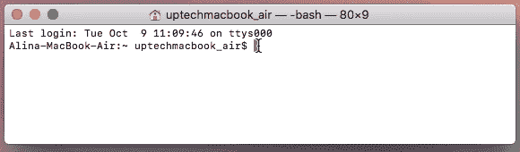
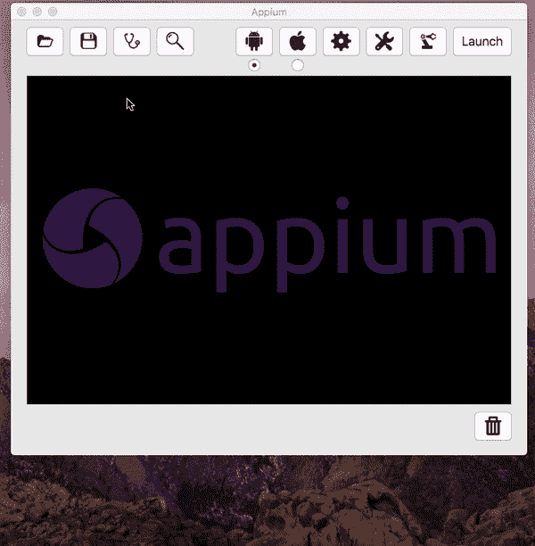
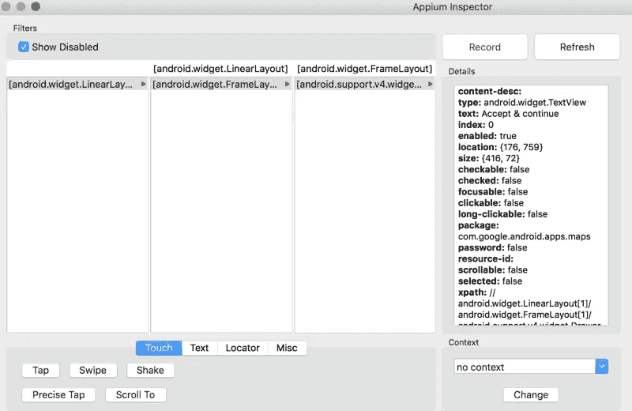
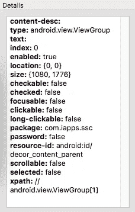
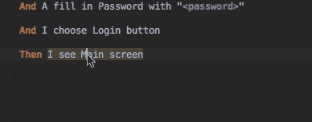

# 如何在 Windows 计算机上设置自动化测试

> 原文：<https://blog.devgenius.io/how-to-setup-for-your-automation-testing-in-your-windows-computer-a50378dcb9ae?source=collection_archive---------6----------------------->

如果您是自动化框架的新测试人员，为 Windows 笔记本电脑/台式机设置自动化是一项困难的任务。但是如果你熟悉命令和脚本，那么你可以很容易地为自动化和编程设置 windows 系统。

今天，我们想丰富您关于自动化移动测试的知识。在本文中，您将找到一步一步的指导以及自动化测试的一个简单例子💁💻。

# 自动化需要什么？

我们将告诉你如何在 IntelliJ Idea 中使用 Cucumber、Appium 和 Java 创建测试。接下来，我们将学习如何编写一个样本特性和自动化测试。我们开始吧！

**——一个允许你为你的移动应用和网站编写简单自动化测试的框架。**

**[**黄瓜**](https://cucumber.io/) —一个支持行为驱动开发的框架。**

**[**Gradle**](https://gradle.org/) —一个构建工具。**

**[**JUnit**](https://junit.org/junit5/) —一个运行测试的框架。**

# **如何设置自动化测试？**

**Appium 是一个强大的测试工具，但是它并不简单，也不容易安装。该文档并没有提供一个很好的快速工作的教程。在这篇文章中，我们将为您提供设置 Appium 所需的一切，以便运行用 Java 编写的基本测试场景。**

**首先，我们需要设置所有组件:**

****第一步:** [安装 Java](https://www.java.com/en/download/help/download_options.xml)**

****第二步:** [安装 Android Studio](https://developer.android.com/studio/install)**

****第三步:**将 [JAVA_HOME](http://www.sajeconsultants.com/how-to-set-java_home-on-mac-os-x/) 和 [ANDROID_HOME](https://github.com/bahattincinic/react-native-starter-kit/wiki/How-to-set-ANDROID_HOME-environment-variable-in-mac) 添加到环境变量中**

****第四步:** [在 Android Studio 中配置仿真器](https://developer.android.com/studio/install)**

****第五步:** [安装 Node.js](https://blog.teamtreehouse.com/install-node-js-npm-mac)**

****第六步:** [安装 Appium 服务器和 Appium 客户端](http://appium.io/docs/en/about-appium/getting-started/)**

****步骤 8** : [安装 IntelliJ Idea](https://www.jetbrains.com/idea/download/#section=mac)**

**使用终端中的**命令**检查组件的安装:**

**`$ appium-doctor`**

**如果一切正常，您将看到以下屏幕:**

****

**验证附件安装**

# **设置设备配置**

**启动 Appium GUI 应用程序☝️️.单击 Android 图标并输入以下详细信息:**

*   **应用程序路径—浏览至。app 文件夹下的 apk 位置**
*   **平台名称—选择 **Android****
*   **自动化名称—选择**应用程序****
*   **平台版本—从下拉列表中选择 **5.1 棒棒糖(API 等级 22)****

**完成上述设置后，点击**通用设置**图标并选择以下设置:**

*   **选择**预启动应用****
*   **选择**严格的能力****
*   **选择**覆盖现有会话****
*   **选择**在启动前终止使用服务器端口的进程****
*   **选择**新命令超时**并输入数值 **7200** 。**

****

**设备设置**

**另外，您需要在模拟器上安装您的应用程序。你可以使用 Android Studio 的模拟器。完成后—启动 Appium 服务器。**

****

**已启动 Appium 服务器**

**当你启动 Appium 应用程序时，你会在顶部看到图标。我用红色突出显示了 Appium 检查器。**

****

**Appium**

**当您单击突出显示的图标(Appium Inspector)时，它将打开一个新窗口，其中包含应用程序 UI 状态捕获。**

****

**应用检查员**

**单击右侧面板上的任何元素，可以找到关于它的详细信息。点击**细节**后，您将看到所选元素的一组属性列表:**

****

**关于元素的详细信息**

**您可能会注意到属性“resource-id”和 id 属性的值。它可以用作测试中元素的标识符。**

# **在移动设备上使用自动化的示例**

**为了在移动设备上使用自动化，我们将创建一个使用正确凭证登录的简单测试。测试是使用页面对象模式编写的。**

****步骤 1:** 创建一个 Gradle 项目，并将 JUnit、Appium、Cucumber 和 log4J 所需的依赖项添加到您的" *build.gradle"* 文件中。**

****第二步:**添加黄瓜插件，创建*。特征"*文件。**

**功能:登录场景概述:通过应用程序登录流程作为用户，我应该能够使用我的电子邮件和密码登录，当我单击登录按钮时，我在电子邮件中填写“<login>”，在密码中填写“<password>”，然后我选择登录按钮示例:| log in | Password | | test . user 1 @ test . com | 123456 | | test . user 2 @ test . com | 123456 |</password></login>**

****步骤 3:** 创建步骤定义。按 *Alt+Enter* 显示**创建步骤定义**意图动作。从弹出列表中选择目标步骤定义文件。**

****

**步骤定义**

****第四步:**每个测试场景都应该在特定的测试环境下执行。Android 和 iOS 移动仿真器所需的功能:**

**if(appium driver = = null){ switch(osName){ case " Android ":capabilities = desired capabilities . Android()；capabilities . set capability(" app ium-version "，" 1 . 9 . 0 ")；capabilities . set capability(" platform name "，" Android ")；capabilities . set capability(" platform version "，" 5.1 ")；capabilities . set capability(" device name "，" Google Nexus 10 ")；capabilities . set capability(" app "，"/Users/uptechmacbook _ air/idea projects/app ium-cucumber/app/test . apk ")；尝试{ appiumDriver = new AppiumDriver(新 URL(" http://0 . 0 . 0 . 0:4723/wd/hub ")，功能)；appiumDriver.manage()。超时()。隐式等待(60，时间单位。秒)；log.info("创建 Android 驱动的实例")；} catch(malformedurexception e){ e . printstacktrace()；log.info("没有创建 Android 驱动的实例")；};打破；**

****步骤 5:** 现在我们需要使用页面对象模式添加包含元素和方法的页面:**

**@ AndroidFindBy(id = " log in _ Button ")私按钮 btnSignIn@ AndroidFindBy(id = " email _ sign _ in ")私信按钮 emailField@ AndroidFindBy(id = " password _ sign _ in ")私信按钮 passField@ AndroidFindBy(XPath = "//Android . widget . Button[@ text = ' log in ' and @ index = ' 2 ']")私有按钮 btnLoginpublic void click sign(){ btnsignin . click()；} public void set email(String email){ emailfield . sendkeys(email)；} public void set password(String password){ passfield . sendkeys(password)；} public void click log in(){ btnlogin . click()；}**

****第六步:**黄瓜有一个很有意思的特点叫做**挂钩**。它们帮助我们在每个场景之前或/和之后执行一段代码。添加它们:**

**@ before class public void setUp(){ wait = new web driver wait(appium driver，15)；} @ before class public void tear down(){ appium driver . close()；}**

****步骤 9:** 因为我们想要使用 JUnit 框架来运行 Cucumber，所以我们需要创建下面的类:**

****你完成了**💪**

**有了这个，我们可以像运行典型的 **JUnit** 测试一样运行测试。还有无数种不同的方法可以设置、构建和运行 Appium 测试。**

# **结论💡**

**在文章中，我们描述了如何为本地应用程序创建测试。我们还学习了如何设置 Appium。在大多数情况下，Appium 是所有可用选项中的最佳选择，因为它是一个“跨平台”的自动化工具，您可以使用相同的 API 针对 iOS 和 Android 平台编写软件自动化测试。通过添加 Cucumber 框架，您可以将 BDD 方法集成到您的项目中。由于 BDD 是测试驱动开发(TDD)的一部分，你还可以额外获得所有合作者共享的视图和过程。**

**如果您有任何问题或想分享您的 Appium 测试经验，请告诉我们！**

**如果您正在寻找我们的服务，请点击下面的网站:**

**[StackedQA 网站](https://www.stackedqa.com/)**

**查看我们的社交媒体:**

**[脸书](https://www.facebook.com/StackedQA)，[推特](https://twitter.com/stackedqa)， [Instagram](https://instagram.com/stackedqa) ，&Linkedin**