# 如何在 Portainer 中设置 Microsoft SQL Server Docker 映像

> 原文：<https://blog.devgenius.io/how-to-setup-microsoft-sql-server-docker-image-in-portainer-66d37ed8a24b?source=collection_archive---------0----------------------->

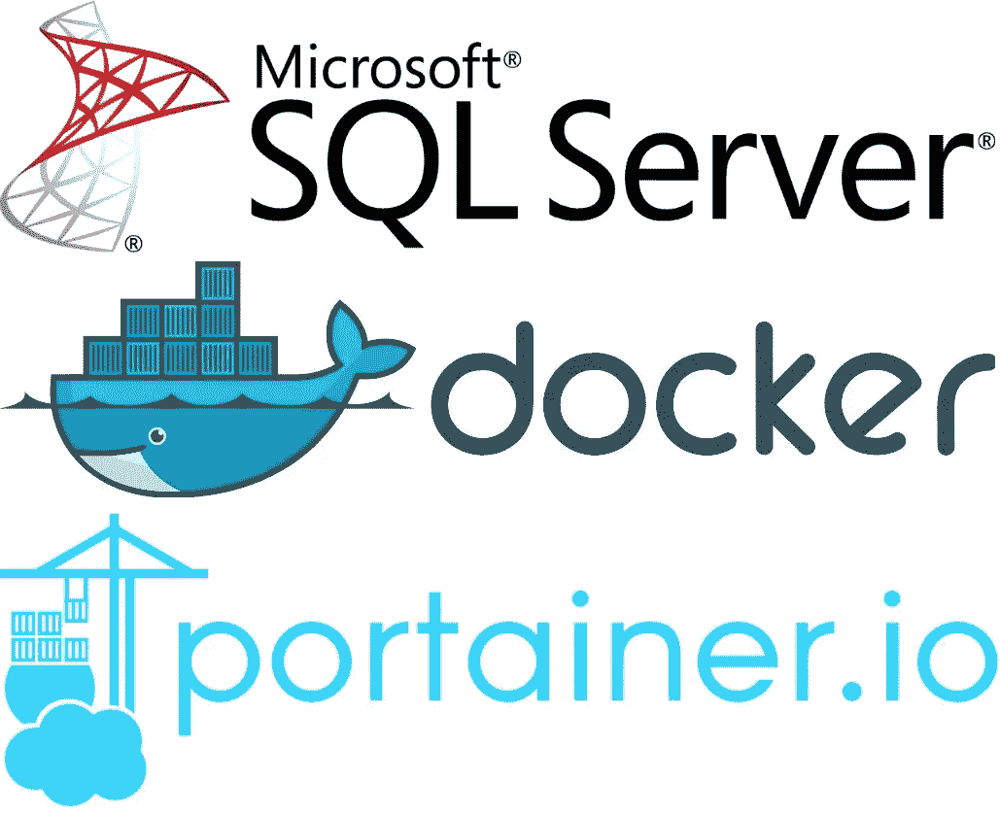

Microsoft SQL Server、Docker 和 Portainer

我得告诉你。当我们在 2017 年听到微软 SQL Server (MSSQL)将开始支持 Linux 的消息时，很多像我一样的软件开发异教徒都兴奋不已。

像我这样的人认为，任何形式的技术，无论是软件还是硬件，都不应该受到他们使用的平台或操作系统的限制。没有优越的平台或编程语言或操作系统，我们都只想实现一件事:一个可行的项目。所以微软拥抱 Linux 和开源世界的举动真的让我们很兴奋。

几年过去了，微软并没有食言。Linux 模拟器来到了 Windows 10，Visual Studio 代码可以在 Linux 和 Mac 上安装和使用，他们去年与 Docker 合作推出了 Azure 容器实例(ACI)。但在我看来，发生的最好的事情是官方 MSSQL Docker 映像的发布，这些映像可以在 Windows 10 或 Linux 上运行。

就在这个星期，我想对我的一个个人项目做一个重大的改变。我维护的一台服务器运行的是 Windows，它提供对网络中其他计算机的 FTP 和 MSSQL 访问。这是一个老服务器，在那里运行 Windows 比以前更长时间可能不是一个好主意，因为 Windows 变得臃肿久而久之。所以我想，如果我重新设置它，提供同样的服务，但是这次，它将运行 Debian，会怎么样呢？因为我是一个懒惰的人，我可以很容易地在那里设置 OpenMediaVault 5 并通过它管理服务器。然后，安装 Docker 和 Portainer 来设置 MSSQL。听起来很简单，对吧？嗯……不完全是。

我遇到了某些障碍，比如权限问题。他们不难对付。但是当你不知道自己在做什么的时候(像我一样)，它确实需要时间来运转。所以我想也许我可以写一下我是如何让它工作的，这样你就可以节省时间，让 MSSQL 在最短的时间内工作。

所以让我们从登录 Portainer 开始。打开 docker 实例并进入容器视图。

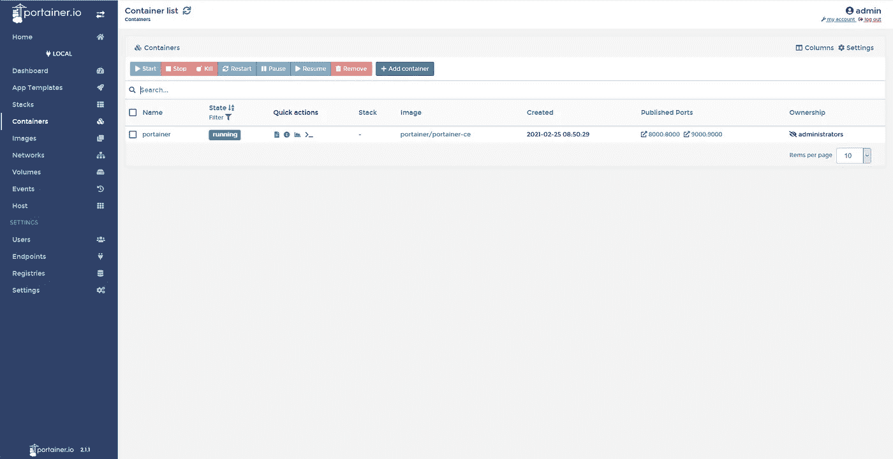

一些在线文章会建议您使用 Portainer 的 MSSQL 模板，提供必要的值，然后就到此为止。虽然对于大多数人来说这是一个很好的解决方案，但在撰写本文时，该模板仍然指向 MSSQL 2017 Docker 映像。如果你想像我一样使用 MSSQL 2019，你需要手动操作。因此，在容器视图中，单击添加容器。

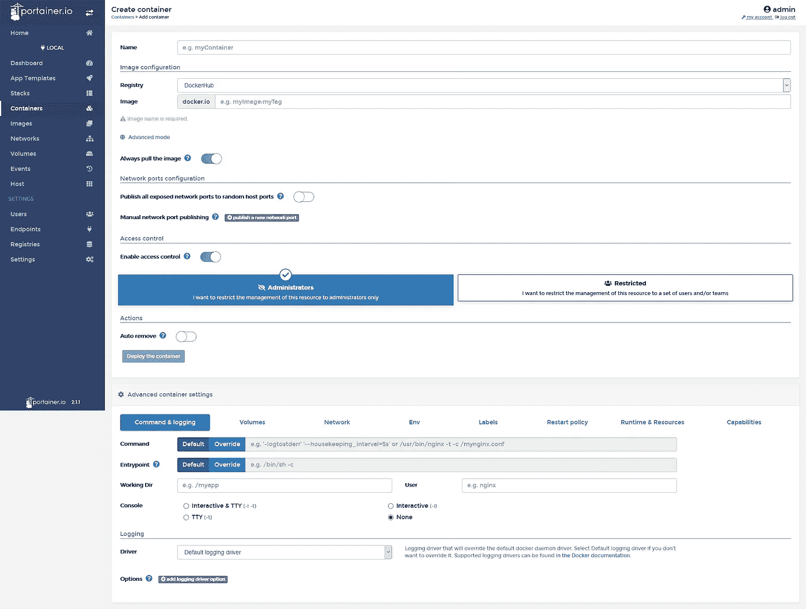

您需要提供以下信息:

1.容器名称。

2.在图像中，您需要提供图像名称和适当的标记。对我来说，是 mcr.microsoft.com/mssql/server:2019-latest。

3.如果您想为 MSSQL Docker 容器使用不同的端口号，您可以在网络端口配置中声明它。请注意，容器值与容器中使用的端口号相关，在本例中，1433 是默认的 MSSQL 端口号。

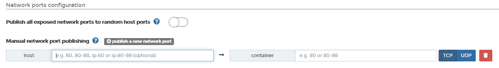

4.在**命令和记录选项卡**中，需要指定用户为 **root** 。

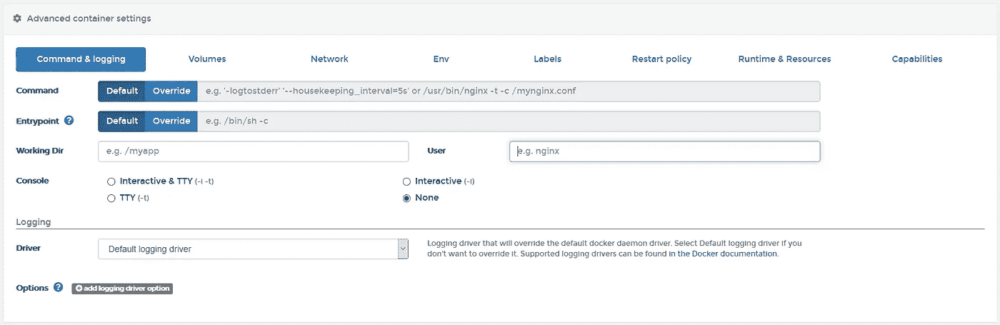

也许您想知道为什么用户应该被设置为 root。如果你没有使用 root，这就是将要发生的事情。

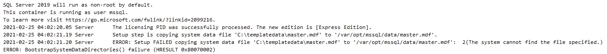

当您尝试登录时，会出现这种情况:

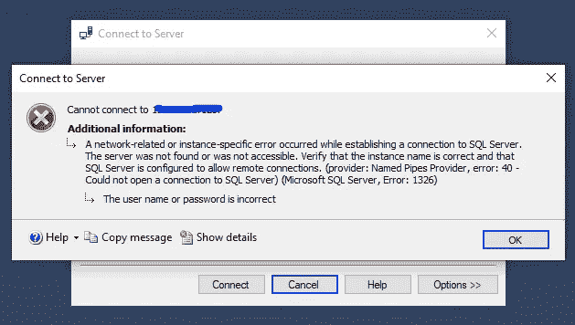

为什么会这样？发生这种情况是因为使 MSSQL 工作所必需的文件(例如 master 数据库)不能被复制到/var/opt/mssql 文件夹中。这意味着即使您的容器部署成功并且技术上正常工作，您也无法登录 MSSQL，因为它没有重要的组件。容器需要在启动时进行设置，并且需要 root 权限来完成设置。根就是这样。

5.在**卷标签**中，你至少应该映射数据文件夹。在我的例子中，我映射了 3 个目录:**数据文件夹**、**日志文件夹**和**秘密文件夹**。

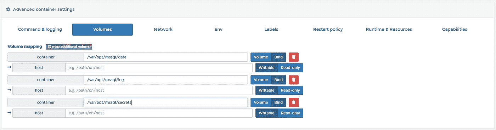

6.我离开了电视台。它默认设置为桥接模式，所以除非你知道自己在做什么，否则就随它去吧。

7.在 **Env 页签**中，至少需要设置 3 个环境变量: **ACCEPT_EULA** 、 **MSSQL_SA_PASSWORD** 和 **MSSQL_PID** 。

ACCEPT_EULA 应设置为 y。
MSSQL _ SA _ PASSWORD 是您的 SA 帐户的密码。
MSSQL_PID 是您要使用的产品 ID。它可以是评估密钥、开发密钥、快速密钥、Web 密钥、标准密钥、企业密钥或产品密钥。

有关可以使用的环境变量的更多信息，请参考 MSDN 条目[在 Linux 上使用环境变量配置 SQL Server 设置](https://docs.microsoft.com/en-us/sql/linux/sql-server-linux-configure-environment-variables?view=sql-server-ver15)。

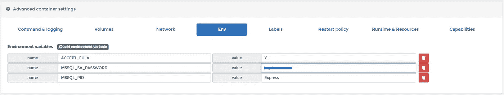

8.在**重启策略选项卡**中，将重启策略设置为**始终**。

9.除非你知道自己在做什么，否则不要触摸**运行时和资源及功能标签**。

完成所有这些步骤后，您现在可以部署您的 MSSQL 容器了。为了测试它，您打开您的 Management Studio，提供您的服务器的地址和必要的凭证。

但是遇到这种情况你打算怎么办？

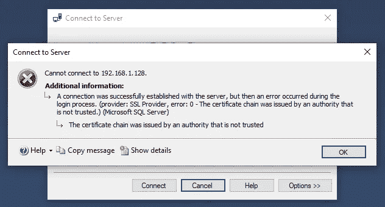

发生这种情况是因为正在使用的证书不是来自**可信的证书颁发机构**。这是正常的，在开发中不应该有太大的影响。要做到这一点，只需将连接属性设置为信任证书。

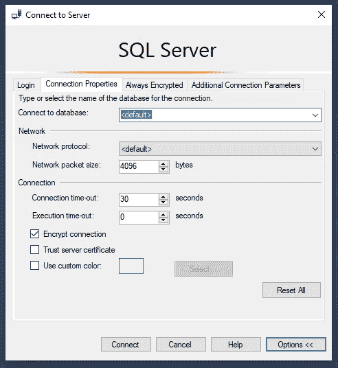

请注意**在生产环境中这不是一个好的做法**，在处理生产系统时，您最好确保您拥有来自可信 CA 的证书。

所以你有它。如果您遵循了本指南中的所有内容，您应该能够让您的 MSSQL Docker 实例正常工作。编码快乐！

感谢你阅读这篇文章。

如果你觉得这篇文章有趣，点击👏按钮，并分享这篇文章。

我的文章发布在****和我的网站[**【www.thebeet21.com】**](https://www.thebeet21.com)****