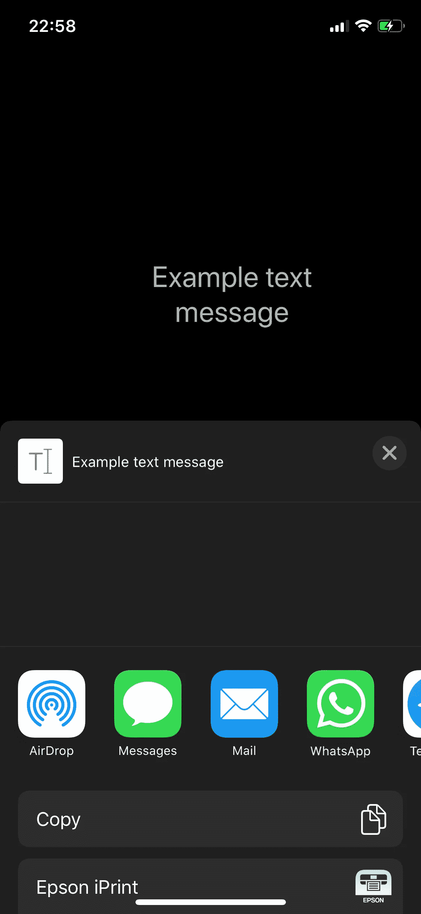
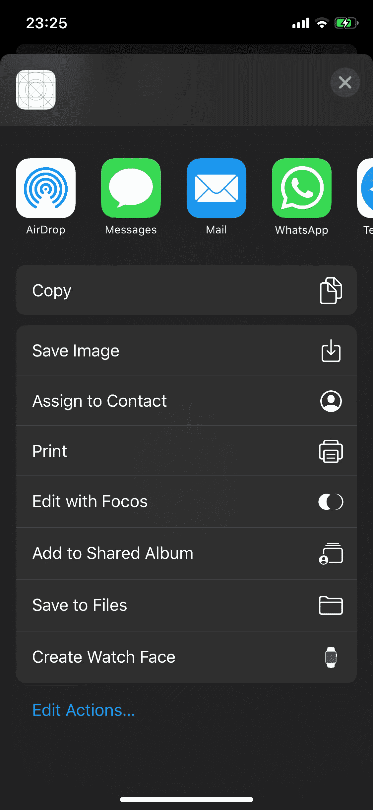

# 如何在 Swift 中使用 UIActivityViewController 共享应用程序中的内容

> 原文：<https://blog.devgenius.io/how-to-share-content-from-your-app-with-uiactivityviewcontroller-in-swift-27e46438f11c?source=collection_archive---------0----------------------->

## 让我们看看 UIActivityViewController 如何处理文本共享、URL、图像等等


[Yura Fresh](https://unsplash.com/@mr_fresh?utm_source=medium&utm_medium=referral) 在 [Unsplash](https://unsplash.com?utm_source=medium&utm_medium=referral) 上拍摄的照片

如果你想在你的应用中分享内容，苹果在 iOS 6 中引入了类`UIActivityViewController` **。这个类处理 URL、文本、图像、视频共享，更简单，只需要几行代码。**

今天，在这篇文章中，我们将讨论如何在我们的应用程序中实现`UIActivityViewController`,以及如何分享我们的内容。

# 入门指南

首先，打开 [Xcode，](https://developer.apple.com/xcode/)，新建一个项目。选择*单视图 App* 。


现在，在屏幕顶部创建一个名为`messageTextView`的`UITextView`，它将包含我们的消息，在屏幕底部创建一个按钮，当点击它时，将显示我们的共享菜单。


# 文本共享实现

进入按钮`IBAction`功能，添加以下代码:

```
let items = [messageTextView.text]
let ac = UIActivityViewController(activityItems: items, applicationActivities: nil)
present(ac, animated: true)
```

这简单的三行将用我们的`UITextView`文本创建一个数组，创建一个`UIActivityViewController`对象，然后向用户显示 share 菜单。

在这里我们可以找到许多支持文本共享的应用程序，例如，Messages、Mail、Whatsapp、Telegram 等。如果我们尝试点击消息图标，我们会看到应用程序将被打开，我们的文本出现在文本框中。



# 图像共享实现

如果我们想分享一张图片，我们需要对应用程序界面做一点小小的改动，并在`UITextView`控件下添加一个名为`profileImageView`的`UIImageView`。


现在用以下代码更改按钮`IBAction`功能:

```
let items = [profileImageView.image]
let ac = UIActivityViewController(activityItems: items, applicationActivities: nil)
present(ac, animated: true)
```

当您从应用程序中共享图像时，用户可以将其保存在图库中，但写入照片库是一项受限制的操作。因此，如果用户点击该操作，应用程序将会崩溃。

为了避免这个问题，您需要像这样请求用户的许可:

*   打开项目的`Info.plist`文件。
*   点击`+`图标。
*   选择*隐私-照片库附加使用说明*键。
*   设置值*我们需要在您的图库中写入照片*。

[](https://www.buymeacoffee.com/nicolidomenico)

# 完整代码

你可以在 [GitHub](https://github.com/domeniconicoli/UIActivityViewControllerExample/tree/master) 上找到完整代码。

感谢您的阅读。如果你有任何问题或建议，请在评论中告诉我。