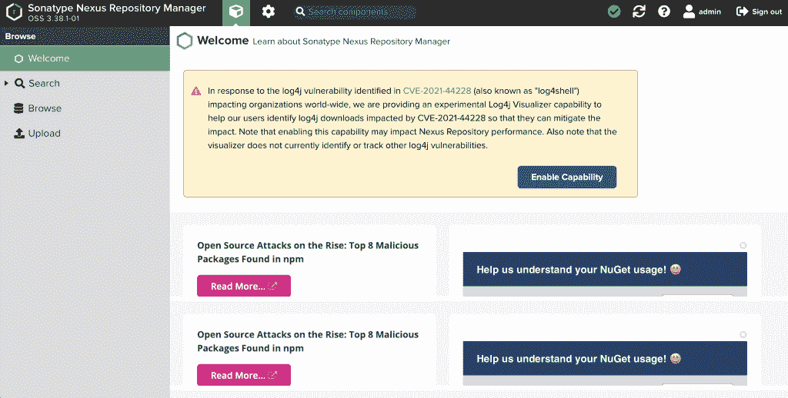
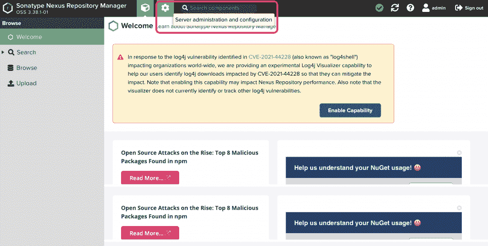
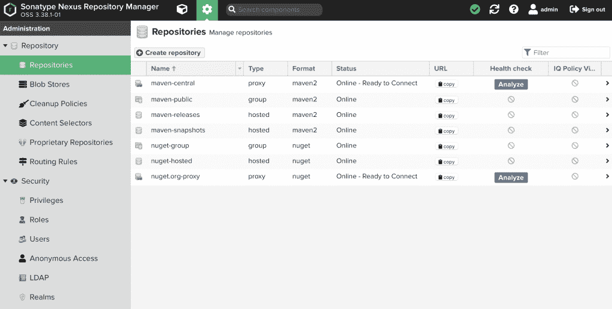
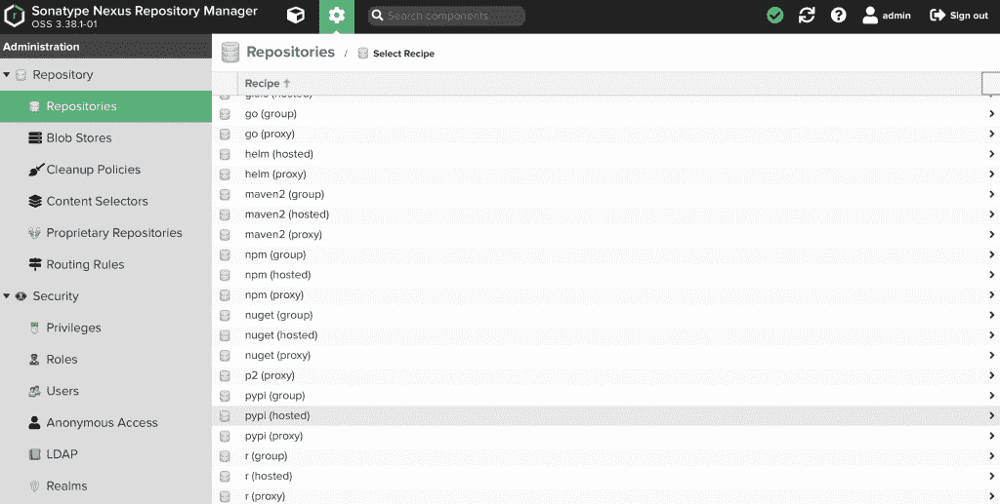
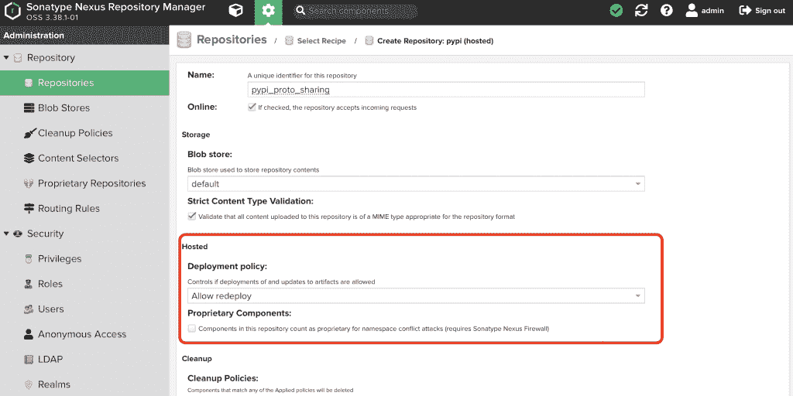

# 如何跨微服务共享 GRPC Proto Buffers 文件

> 原文：<https://blog.devgenius.io/how-to-share-grpc-proto-buffers-files-across-microservices-ffb2534ed8b2?source=collection_archive---------11----------------------->

在本文中，我将简要介绍跨不同微服务共享 GRPC Proto Buffers 文件的方法。

# 背景:客户端和服务器之间的 Proto Buffers 文件共享问题

现在越来越多的项目在使用微服务结构。但是，在我们将项目数据处理管道引入微服务后，选择一个合适的通信框架来更好地跨不同的微服务交付数据对我们来说非常重要。在过去，大多数人会选择 REST API 设计，因为它很熟悉，有大量可用的工具，而且很成熟。然而，REST API 设计也有许多限制，为了将每个微服务与其他微服务分离和隔离，我们需要尽可能纯净的 API 接口。但是由于 REST API 设计的本质，它的动词、头、有效负载、URL 标识符、资源 URL 的组合，维护一个简单的、功能性的接口将会是有成本的。此外，由于整个数据处理管道被切割成不同的微服务，我们将需要让每个调用保持租赁延迟。因为我们将有大量的内部请求/响应 API 调用。GRPC 在连接时间、传输时间和编码/解码时间上超过了 REST API。这就是为什么我们将使用 GRPC 来取代所有的 REST API 设计。

与 REST API 不同，在 REST API 中，客户端只需要知道 URL 标识符和 HTTP 动词就可以调用 API，而在实现 GRPC 时，需要一个 Proto Buffers 文件来进行 RPC 调用。Proto Buffers 是 GRPC 使用的 IDL(接口描述语言),它将记录输入和输出消息格式，包括每个字段的类型以及它们的编码/解码顺序。原型缓冲区是 GRPC 在其他 RPC 中更受欢迎的主要原因。Proto Buffers 既可以作为文档工具，也可以作为版本工具。因为 Proto Buffers 只是一种二进制格式，所以它是向前和向后兼容的。

由于 Proto Buffers 文件记录了输入和输出消息的格式和细节，因此，如果客户端没有最新版本的 Proto Buffers 文件，它可能会在进行服务刚刚更新的 GRPC 调用时得到空值甚至错误。因此，维护一个可以在服务器和客户端之间轻松同步 Proto Buffers 文件的系统对我们来说很重要。

# 此问题的解决方案:

有很多不同的做法可以解决这个问题。我将它们列举如下:

# 使用 Git 子模块:

第一个解决方案很简单:创建一个中央 git 存储库来存储 Proto Buffers 文件。每个人都在他们自己项目的 git 中克隆这个 git 项目作为 git 子模块。

这种方法解决了共享 Proto 缓冲区的问题，但是，在另一个 git 项目中包含一个 git 项目有时会很难管理。但问题是，并不是所有的微服务都需要访问所有的 Proto Buffers 文件，一个微服务可能只需要那些满足其需求的 Proto Buffers。当使用 Proto Buffers git 存储库时，很难只通知那些在服务器端更新了 Proto Buffers 的微服务。

# 使用 GRPC 服务器反射协议:

GPRC 服务器反射是一个很好的工具，可以帮助客户端在运行时构造请求，而无需将存根信息预编译到客户端。但是，GRPC 服务器反射协议的支持仅限于某些语言。目前，仍不支持节点。更多信息可以在这里找到: [GRPC 服务器反射协议](https://github.com/grpc/grpc/blob/master/doc/server-reflection.md)。

# 使用私有包存储库:

这里我要介绍的最后一种方法是通过私有的包存储库发布 GRPC 存根文件(生成的代码)。我认为当 GRPC 服务器反射协议不可用时，这是最好的选择。它将允许服务器端选择要发布的版本和 GRPC 存根文件。通过这种方式，我们可以控制我们希望我们的客户端微服务能够拥有的规模和版本。客户端比较和更新我们作为服务器端发布的不同版本的 GRPC 存根也很容易。

# 实现:使用 Sonatype Nexus 3 存储库来发布和管理 GRPC 存根文件

我们将使用 Sonatype Nexus 来管理我们的私有包存储库。

**安装 Sonatype Nexus 3:**

安装 Nexus3 非常简单。这是官方指南。我将使用 docker 来安装它。

运行以下命令安装 Nexus3 的 docker 版本:

```
docker run -d -p 8081:8081 -p 8082:8082 -p 8083:8083 --name my-nexus sonatype/nexus3:latest
```

安装 Nexus 3 后。您可以使用以下命令获得默认密码:

```
docker exec -it <container_id> cat /nexus-data/admin.password
```

**设置资源库:**

首先，我们只需要登录 Nexus3。默认的 Nexus 3 端口是 8081。如果您在本地主机上安装 Nexus 3，您应该可以使用登录凭证登录到这里: [http://127.0.0.1:8081](http://127.0.0.1:8081) 。

登录后，您应该能够看到以下内容:



单击“服务器管理和配置”



选择存储库以查看所有存储库:



在本例中，我将创建一个 PyPI 包存储库，单击 Create New Repository:

确保选择了(托管)版本:



确保重新部署策略为:允许重新部署，否则，您无法向其推送新版本:



**生成原型存根文件:**

要生成原型存根文件，将需要质子。我不会在这里解释设置协议的细节，因为官方指南已经很清楚了。关于构建存根文件请参考 Google 官方指南: [Python 生成代码| GRPC](https://developers.google.com/protocol-buffers/docs/reference/python-generated)

这是 protoc 生成原代码(Python)的通用命令:

```
protoc --proto_path=src --python_out=build/gen src/foo.proto src/bar/baz.proto
```

为了将我的存根文件上传到 Nexus3，我将在这里使用 twine:

首先，使用设置 twine。pypirc 文件并将其放在%HOME%下

```
[distutils]
index-servers =
pypi
[pypi]
repository: http://127.0.0.1:8081/repository/pypi_proto_sharing/
username: admin
password: password_you_have
```

需要一个 setup.py:

```
from setuptools import setup, find_packages

setup(
    name='example',
    version='0.61',
    license='MIT',
    author="Zichen Zheng",
    author_email='me@zichen.dev
    packages=find_packages('src'),
    package_dir={'': 'src'},
    url='zichen.dev',
    keywords='ProtoFiles',
    install_requires=[
      ],

)
```

然后运行 setup.py 来生成 dist 文件夹:

```
python setup.py sdist
```

生成 dist 文件夹后，使用 twine 上传包

```
twine upload -r pypi dist/* --verbose
```

**使用包**

要使用该软件包，我们需要设置 pip 配置。

在 Windows 上，使用“运行”，转到%AppData%，

在 Mac 上，看到下面可能的位置，如果没有，就创建一个

```
$HOME/Library/Application Support/pip/pip.conf $HOME/.pip/pip.conf $HOME/.config/pip/pip.conf
```

在 pip 文件夹下，创建 pip.ini:

```
[global]
trusted-host=127.0.0.1:8081
index = http://127.0.0.1:8081/repository/pypi_proto_sharing/pypi
index-url = http://127.0.0.1:8081/repository/pypi_proto_sharing/simple
no-cache-dir = false
```

然后，您可以使用 pip 下载该包。

# 结论

通过使用私有的包存储库，我们可以轻松地为所需的微服务管理适当的 Proto Buffers 文件，并轻松地启用版本控制。在本文中，我只展示了 PyPi 的例子，Nexus 3 也可以与 npm 和许多其他不同语言的包存储库一起工作。它应该解决跨不同微服务共享 Proto 缓冲区的问题。

*原载于 2022 年 4 月 13 日*[*https://zichen . dev*](https://zichen.dev/how-grpc-proto-buffers-files-sharing-across-microservices/)*。*