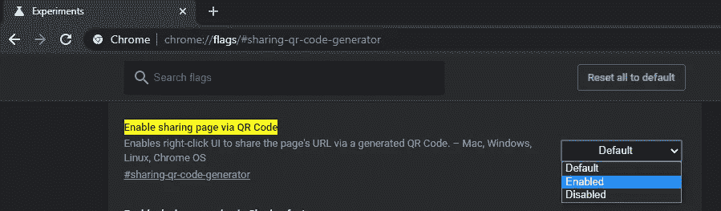

# 如何使用二维码分享链接

> 原文：<https://blog.devgenius.io/how-to-share-links-using-qr-code-2fd9fc42a5b3?source=collection_archive---------11----------------------->

很长一段时间以来，分享链接都是一件麻烦事。现在，多亏了 Chrome，你可以轻松做到这一点。一段时间以来，Chrome 推出了一项新功能，允许用户以二维码的形式分享网站和链接，可由智能手机摄像头和/或谷歌镜头等兼容设备解码。

克里斯蒂安·威迪格在 [Unsplash](https://unsplash.com?utm_source=medium&utm_medium=referral) 上拍摄的照片

尽管这一功能尚未在谷歌 Chrome 的最终版本中实现，但该浏览器的测试版本，通常被称为 Chrome Canary，已经具备了这一功能。但是，默认情况下它是关闭的。用户将不得不进入“标志”部分手动启用它，谷歌通常在那里隐藏浏览器的实验功能。

**先决条件:**
谷歌 Chrome 金丝雀必须安装在你的电脑上
工作互联网连接

*   假设你的设备上已经安装了 Chrome Canary，打开它
*   然后在浏览器的地址栏输入‘chrome://flags/# sharing-QR-code-generator’。
*   这将自动将您直接重定向到标志页面。
*   现在，为了节省一些时间，请在 PC 上按 ctrl + f 并键入 QR 码，然后按 enter。
*   从“通过 QR 码启用共享页面”选项前面的框中选择“启用”选项

通过二维码启用共享页面

*   然后点击屏幕底部的“立即重新启动”按钮。
*   要使用此功能，请打开任何网页并点击三点，然后点击选项“为此页面生成二维码”

# 结束语

这项功能将使那些不得不使用其他方法在设备间共享链接的人的生活变得更加轻松。有了它的方法，你将能够毫不费力地做到这一点。