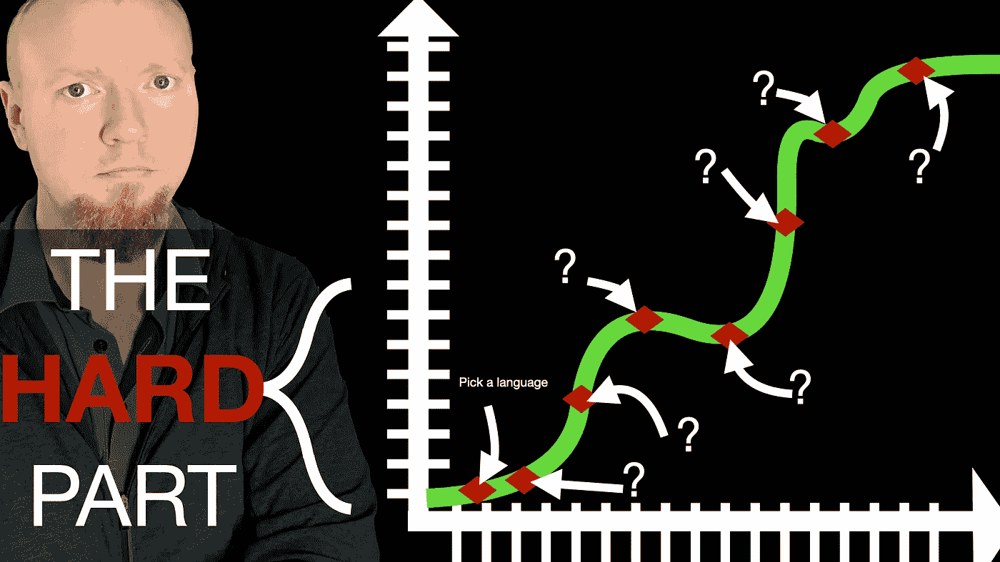

# 如何缩短编程语言的学习曲线

> 原文：<https://blog.devgenius.io/how-to-shortcut-the-programming-language-learning-curve-4ba1ddda9d1f?source=collection_archive---------14----------------------->

学习编码是一种坚持不懈的练习。根据我在现实世界中的经验，很容易看出，大多数想学习编码的人在尝试了一种语言后都会简单地放弃。对大多数人来说，在他们旅程的开始，学习多种语言的想法似乎几乎是不可能的。语法看起来像字母和字符的混乱，甚至只是运行一个基本的“hello world”所需的设置就使整个过程非常令人沮丧。

所以如果你现在在那个地方，我在这里让你知道它变得更容易。学习编码有一条巨大的学习曲线，今天我将与你分享这条曲线是什么样子的，以及当你学会第三种语言时，你会发现学习一种新语言的过程是令人愉快的。

所以一切都始于最初的兴趣火花。你想做点什么，你知道你需要能够写代码来做这件事。在这一点上，你甚至可以去谷歌搜索“学习编码”或“什么是好的第一语言”这样的术语，我保证你会找到不少于几十万条关于如何开始的意见。这让一切变得更加扑朔迷离。尽量不要纠结于学什么语言。无论您在这里选择什么，它都有一个目的，这个目的将在本文的后面变得很明显。

如果你想知道我对语言的看法，这是我的建议。如果你想写一个基本的博客或者给 WordPress 添加功能，用 PHP 吧。如果你想学习更多的通用编程语言，学习 Go 或 Python。如果你想从头开始制作 web 应用程序，那就用 Javascript，但是如果你真的想看很多不同的语言，我强烈推荐你看 fireship 的 [100 秒系列。他的视频做得非常好。](https://www.youtube.com/playlist?list=PL0vfts4VzfNiI1BsIK5u7LpPaIDKMJIDN)

好了，现在你已经选择了一门语言，是时候学习了。这种第一语言总是很难，因为你不仅要学习语言本身的细微差别，而且还要学习编程语言是如何工作的。我不可能详细介绍如何学习我提到的每一种语言，但是让我们来看看你第一次学习时应该学的东西。

1.  首先，学习如何让这种语言在你的计算机上工作。每种语言都有一个网站，通常都有一个“设置”部分，让你开始在你的机器上运行它。有些语言非常容易设置(比如 Go 和 Node)，有些则比较难设置(比如 PHP)，但是允许你简单地保存一个文件并立即看到你的改变。
2.  完成设置后，给自己找一个好的语言速成班。从该语言的网站教程开始，在你浏览完之后，可能会拿起一本书或一门在线课程。我将在这里为您保留销售技巧，但是我已经在本文的底部放置了一些很好的资源。有些是免费的，有些是要花钱的。那些花钱买的东西都很好，很集中，所以如果你想快速行动，这可能是一个好办法。
3.  一旦你对这种语言的语法和特性有了一些基本的理解，就去做点什么吧。不要试图去做大，做你的梦想计划。做点有用的就行了。这会让你觉得到目前为止所有的工作都得到了回报。

好，现在你已经做了一个简单的程序，现在你有一个选择。你可以选择深入你所选择的语言，或者跳到第二种语言来扩展你的技能。无论你现在选择哪一种，你最终都需要学习另一种语言，这是不可避免的，如果你想开始编码生涯，这也是一个好主意。许多雇主会问你是否懂一门语言，但事实是，他们真正关心的是你能不能很好地使用任何一门语言，并把你的知识应用到学习任何一门语言上。

所以，一旦你决定学习另一种语言，一开始你会感觉像是从头再来，但这部分我会帮你节省很多时间，所以你准备好了吗？我之前提到过，学习你的第一语言不仅要学习语言的细微差别，还要学习编程语言的一般工作方式。不幸的是，对于大多数自学成才的程序员来说，你可能没有意识到这句话的第二部分。在学习你的第一语言时，要认识到的重要一点是，几乎所有编程语言的核心都做完全相同的事情，只是方式略有不同。当你学习第二语言时，试着从这个角度来看待学习。

以你学习第一语言的方式开始。弄清楚如何安装它，以及如何在你的电脑上运行它，然后，不要只是钻研代码，而是找出第一语言和第二语言之间的异同。这是要找的东西。

1.  每种语言都会有循环和条件句。弄清楚如何执行 for 循环、while 循环、if 语句和 switch 语句。
2.  一旦你有了这些东西，再深入一点语言的“类对象”部分。不是所有的语言都称它们的结构为对象、属性和方法，但是它们都有类似的行为。
3.  寻找如何在集合中存储信息并创建这些集合的实例。弄清楚如何编写作用于这些集合的函数。找出你的两种语言在语法上的不同，但是仍然要达到相同的结果。
4.  最后，一旦你知道了相似的部分，你就可以了解不同的部分。这些东西使得某些语言在完成某些任务时比其他语言更好。例如，一些语言对多任务有很大的支持，而另一些则没有。有些语言有自动垃圾收集，有些没有。有些语言要求在初始化变量时声明变量的类型，有些则不需要。

好了，现在你在书中有两种语言。你现在应该可以看到，你可以把你学习语言的方法应用到任何其他语言上。一旦你知道了其中的两个，第三个自然就会发生。您应该能够一头扎进去，再次应用相同的模式。

既然你已经看到了学习曲线是如何工作的，请在评论中告诉我:你现在在这条曲线上处于什么位置？你刚刚开始吗？你只是在学习你的第一语言吗？你已经学会第三或第四语言了吗？如果你刚刚开始，不要放弃！好的。我要把它留在那里。下次见，编码快乐！

服务器端编程语言（Professional Hypertext Preprocessor 的缩写）

*   学习 PHP、MySQL 和 JavaScript:创建动态网站的循序渐进指南—[https://amzn.to/3QxAsJ6](https://amzn.to/3QxAsJ6)
*   为傻瓜准备的多功能一体机——https://amzn.to/39Bt8vr
*   php 掌握入门指南—【https://skillshare.eqcm.net/9W3d33 
*   [https://www.cloudways.com/blog/how-to-start-with-php/](https://www.cloudways.com/blog/how-to-start-with-php/)
*   [https://knowthecode . io/labs/PHP-101-gentle-introduction-WordPress-programming](https://knowthecode.io/labs/php-101-gentle-introduction-wordpress-programming)
*   [https://knowthecode.io/series/absolute-beginner-series](https://knowthecode.io/series/absolute-beginner-series)

NodeJS / Javascript

*   NodeJS 简介:后端 JavaScript:[https://skillshare.eqcm.net/kjX2Xd](https://skillshare.eqcm.net/kjX2Xd)
*   Javascript:初学者温和入门:[https://skillshare.eqcm.net/a1kGkM](https://skillshare.eqcm.net/a1kGkM)
*   Node.js 设计模式:使用成熟的模式和技术设计和实现生产级 Node.js 应用程序—[https://amzn.to/3OnrAUz](https://amzn.to/3OnrAUz)
*   从初学者到专业人员:通过构建有趣的、交互式的、动态的 web 应用程序、游戏和页面来快速学习 JavaScript—[https://amzn.to/3QAgL38](https://amzn.to/3QAgL38)
*   https://nodejs.org/en/download/https://nodejs.org/en/docs/guides/[T4](https://nodejs.org/en/download/)
*   [https://developer . Mozilla . org/en-US/docs/Learn/Getting _ started _ with _ the _ web/JavaScript _ basics](https://developer.mozilla.org/en-US/docs/Learn/Getting_started_with_the_web/JavaScript_basics)

Go (Golang)

*   围棋速成班:[https://skillshare.eqcm.net/153d3m](https://skillshare.eqcm.net/153d3m)
*   学习围棋:现实世界的惯用方法
*   去编程—[https://amzn.to/3HAOWnk](https://amzn.to/3HAOWnk)
*   [https://go.dev/doc/tutorial/getting-started](https://go.dev/doc/tutorial/getting-started)
*   [https://go.dev/](https://go.dev/)

计算机编程语言

*   Python 3:Python 编程初学者指南:[https://skillshare.eqcm.net/JradaE](https://skillshare.eqcm.net/JradaE)
*   Python 编程初学者—[https://amzn.to/3n36saA](https://amzn.to/3n36saA)
*   [https://www.python.org/about/gettingstarted/](https://www.python.org/about/gettingstarted/)
*   [https://www.python.org/](https://www.python.org/)

