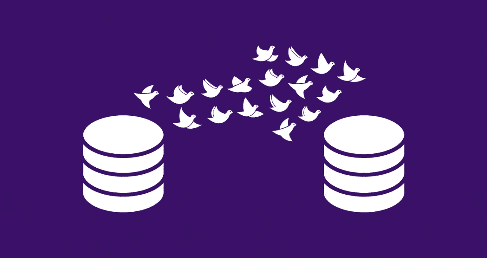

# 如何解决 Django 破碎的移民历史

> 原文：<https://blog.devgenius.io/how-to-solve-broken-migration-history-in-django-57a161968e55?source=collection_archive---------5----------------------->

因为这是我在社交媒体上的第一篇帖子，我会尽可能清楚地解释我的想法和我遇到的问题，以及他们的解决方案。

我是初级 Python 开发人员，正在进行 Django (MVT)的一个项目，在这篇博客中，我将写下我在日常工作中遇到的问题。

这篇文章致力于我最近在 Django 迁移历史中遇到的一些问题，以及我是如何解决这些问题的。

*** *问题#1 选择作为集合还是字典。****

首先，你可能没有注意到的非常具体的问题。每当我试图运行“makemigrations”命令时，我的一个应用程序就会运行一次自动迁移，即使我没有在那里做任何更改。当我试图找出它时，我看到在我的迁移文件中，有一个字段的“alter”操作，该字段是一个具有“choices”属性的“charfield ”,经过一段时间的观察，我意识到每当我运行“makemigrations”命令时，选择的顺序都会改变。因此，如果您将字典设置为“选择”属性，迁移应用程序会自动对其进行更改，例如:

`CHOICES = {
(CHOICE_1, ‘1’),
(CHOICE_2, ‘2’),
(CHOICE_3, ‘3’),
}`

迁移后可以是:
`CHOICES = {
(CHOICE_2, ‘2’),
(CHOICE_1, ‘1’),
(CHOICE_3, ‘3’),
}`

您的“选择”属性必须是一个集合:

`CHOICES = (
(CHOICE_1, ‘1’),
(CHOICE_2, ‘2’),
(CHOICE_3, ‘3’),
)`

💡如果您的模型中有一个以“choices”为属性的“charfield ”,那么您的 choices 常量必须是一个集合，而不是字典或列表，因为集合是一种无序的数据类型，除非字典。

*** *问题 2 不安全删除迁移。****

如果有人在你之前做过一个项目，而你没有他应用的迁移，甚至在开发过程中他删除了一些迁移，这就像一场灾难。

假设您的一个迁移依赖于另一个应用程序的迁移。您需要为所有应用程序重新执行迁移过程，如果表中有业务关键型数据，这就很成问题，因为数据可能会被删除或损坏。

如果删除了该应用程序的一些迁移，并且迁移历史被破坏，一种解决方案是清除该应用程序的迁移历史。但是如上所述，我必须确保所有的数据是安全的。

数据库中的表有一些限制，这给我带来了问题。有一种“黑客”方法，或者我的朋友这么说，即他给了我一个脚本，解除了对一组特定表的约束，这样我就可以从数据库中导出数据，重新创建结构，然后再导入数据并重新启用约束。(我们还必须用另一个脚本检查数据完整性)。

因此工作流程看起来像这样:

1.从表
2 中导出所有数据。迁移 app_name zero
3。删除本地所有迁移文件
4。解除约束
5。Makemigrations app_name
6。迁移 app_name
7。将所有数据导入回来

但是使用这种方法，您必须通过 SQL 脚本直接与数据库进行交互，并且您会丢失数据，在一段时间内，您肯定会删除数据，然后将其导入回数据库，但是您无法确信所有数据都已应用回数据库，并且数据库的完整性没有问题。

对我来说，这是一个很好的结果，我没有丢失数据，数据库也很好。但肯定对数据库来说这不是一个好的过程，在那个应用程序的模型又一次改变后，我发现问题又出现了，我为那个问题找到了另一个更好的解决方案，没有丢失数据。该解决方案仅处理应用程序的迁移历史，因此也处理数据库中的迁移表。但是也有很多问题，我将在下面描述。

*** *正确的解决方案。****

对于正确的方法，我们需要找出我们的模型是否匹配表结构，并根据它采取行动。如果模型匹配表结构，那么我们可以很容易地应用我们的方法来清理我们的迁移历史。如果没有的话，我们不得不玩一会儿。

如果模型不匹配，那么我们需要识别模型中的变化，而不是数据库表中的变化，并将它们从模型中删除，在应用迁移之后，我们将实现它们。如果应用程序的目标是从其他应用程序迁移，我们将在该应用程序中按照从子到父的依赖关系顺序执行类似的操作。孩子依赖于父母。

正确的解决方案是什么:

1.运行 *makemigrations* 来验证您的模式和您的数据库是否相同，但是如果我们的本地初始迁移与应用于数据库的迁移不同，Django 不会让我们知道这一点，它会说这很好，但是正因为如此，您的本地差异不会被应用。

2.备份数据以防万一。

3.运行*$ python manage . py migrate-fake app _ name zero*命令，该命令将撤销应用于该表的所有迁移。“-- fake”参数将确保数据的安全。

4.删除实际的迁移文件。检查受您的历史记录清理影响的每个应用程序，并删除迁移文件夹中的所有内容，除了 **__init__** 。py 文件。或者，如果您想要清除所有应用程序的所有迁移，并且如果您使用的是类似 unix 的操作系统，您可以运行以下脚本(在您的项目目录中):

> *找到。-路径" */migrations/*。py" -not -name "__init__。py "-删除
> 查找。-路径" */migrations/*。pyc”-删除*

5.创建初始迁移:

> *$ python manage . py make migrations app _ name*
> 
> 所有这些导致:
> ‘应用程序名称’的迁移:
> 0001_initial.py:
> -创建模型 MyModel

6.接下来，我们希望应用迁移，但是这种方法行不通，因为表已经存在，所以我们需要模拟初始迁移，以便保存数据。这就是我们需要确保我们的模型和表结构是相同的，这样我们就不会在将来重复这个问题。执行模拟的命令是:

> *$ python manage . py migrate—fake-initial app _ name* 结果:
> 要执行的操作:
> 运行迁移:
> 应用 app _ name . 0001 _ initial…fake

如果最初您的模型不同，那么在这一步您可以恢复差异并创建一个新的迁移来应用它们。

> *$ python manage . py make migrations app _ name
> $ python manage . py migrate app _ name*

就这些，我希望我已经用这些信息帮助了一些人，我已经试着用那种方式组织它，尽可能容易地阅读和理解它。