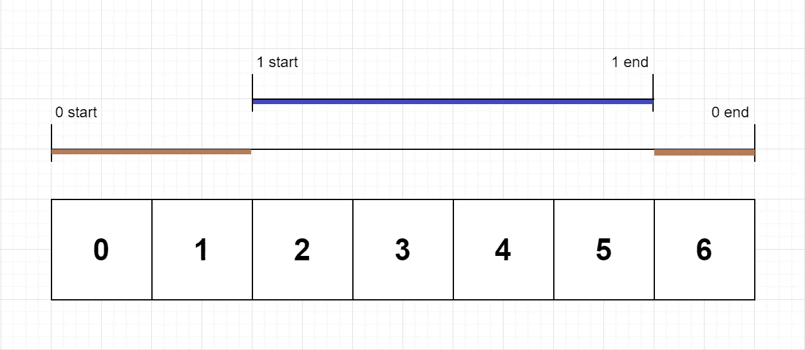

# 如何用堆栈解决函数的独占时间？

> 原文：<https://blog.devgenius.io/how-to-solve-exclusive-time-of-functions-using-stack-3e643c66f13e?source=collection_archive---------3----------------------->

## 第 37 天——100 天到 LinkedIn、雅虎、甲骨文


由 [Aron Visuals](https://unsplash.com/@aronvisuals?utm_source=unsplash&utm_medium=referral&utm_content=creditCopyText) 在 [Unsplash](https://unsplash.com/s/photos/time?utm_source=unsplash&utm_medium=referral&utm_content=creditCopyText) 上拍摄的照片

*   出于免费的故事？下面是我的 [**好友链接**](https://medium.com/@akshay_ravindran/3e643c66f13e?source=friends_link&sk=a995082aec0e7217a7a1cdd03ee4977b)
*   100 天到 LinkedIn，雅虎，甲骨文

# 介绍

嘿，伙计们，今天是 LinkedIn 挑战 100 天的第 37 天。

[](https://amzn.to/3fLILh7)

Kindle 阅读器免费

如果你在准备面试。即使你已经在工作中安顿下来，让自己了解最新的**面试问题**对你的**职业** **成长**是必不可少的。从**这里**开始你的**准备**！

上个月，我一直在研究这些公司的常见问题。我已经收集了这些问题中的 **100** 个，我不能保证你会在面试中得到这些问题，但我相信这些“面试问题”中的大多数都有相似的逻辑，并从这些挑战中采用相同的思维方式。

在我们进入第一个问题之前，如果你想知道我为什么选择 LinkedIn、雅虎和甲骨文而不是 FAANG，是因为我已经完成了一项挑战[，重点是亚马逊和脸书的面试](https://medium.com/javarevisited/100-days-to-amazon-day-1-b9e07228f079)。

# 新的一天，新的力量，新的想法

# 第 37 天——函数独占时间🏁

# 目的

在一个**单线程** CPU 上，我们执行一些功能。每个功能在`0`和`N-1`之间有一个唯一的 id。

我们按照描述函数何时进入或退出的时间戳顺序存储日志。

每个日志都是一个字符串，格式如下:`"{function_id}:{"start" | "end"}:{timestamp}"`。例如，`"0:start:3"`表示 id 为`0` **的函数在时间戳`3`的开头**开始。`"1:end:2"`表示 id 为`1` **的函数在时间戳`2`的末尾**结束。

一个函数的*独占时间*是在这个函数中花费的时间单位数。注意，这不**不**包括任何对子函数的递归调用。

CPU 是**单线程**的，这意味着在给定的时间单位内只有一个功能被执行。

返回每个函数的独占时间，按函数 id 排序。

# Example🕶



```
**Input:**
n = 2
logs = ["0:start:0","1:start:2","1:end:5","0:end:6"]
**Output:** [3, 4]
**Explanation:**
Function 0 starts at the beginning of time 0, then it executes 2 units of time and reaches the end of time 1.
Now function 1 starts at the beginning of time 2, executes 4 units of time and ends at time 5.
Function 0 is running again at the beginning of time 6, and also ends at the end of time 6, thus executing for 1 unit of time. 
So function 0 spends 2 + 1 = 3 units of total time executing, and function 1 spends 4 units of total time executing.
```

> 关注[**代码之家**](https://medium.com/@akshay_ravindran) **s** 了解编程面试世界的最新动态。

# 密码👇

作者:[阿克谢·拉文德兰](https://www.linkedin.com/in/akshay-ravindran-096)

# 算法

1.  创建一个堆栈来表示哪个 id 是当前 id；y 活动。
2.  对于数组中的每个元素，将其分成三个部分。首先表示函数的 id。
3.  代表函数“开始”或“结束”的第二个元素。
4.  表示时间符号的第三个元素。
5.  如果函数正在启动，则将 id 添加到堆栈中。使时间符号成为以前的值。
6.  如果函数是 end，则从堆栈中获取顶部元素，将当前值和先前值之差添加到结果数组中。
7.  在列表末尾返回结果数组🔚

# 复杂性分析

> **时间复杂度:O(n)遍历整个数组一次**
> **空间复杂度:O(n/2)堆栈大小只会增长到数组中 id 的数量，等于 n/2。**

[](https://amzn.to/3eZbTS9)

感谢你制作了这个排名第一的新版本🖤

# 进一步阅读

[4 个极其有用的面试链表技巧](https://medium.com/javarevisited/4-incredibly-useful-linked-list-tips-for-interview-79d80a29f8fc?source=your_stories_page---------------------------)
[亚马逊 SDE 面试前 25 题](https://medium.com/javarevisited/top-25-amazon-sde-interview-questions-cfe0ef70ba9e?source=your_stories_page---------------------------)
[你以为你真的了解斐波那契数列吗？](https://medium.com/javarevisited/are-you-making-these-fibonacci-number-mistakes-5e3cbedd367e?source=your_stories_page---------------------------)
[用 C 编程解决 9 个最佳字符串问题](https://medium.com/@akshay_ravindran/9-best-strings-problem-solved-using-c-5e2a1d373fc2?source=your_stories_page---------------------------)
[一个人不简单地解决 50 个黑客等级挑战](https://medium.com/javarevisited/top-50-coding-challenges-in-hacker-rank-3d79c181528?source=your_stories_page---------------------------)

# 线的尽头

你现在已经到了这篇文章的结尾。谢谢你阅读它。祝你编程面试好运！

如果你在面试中遇到这些问题。请在下面的评论区分享它。我会很高兴读到它们。

[](https://medium.com/javarevisited/the-ultimate-guide-to-binary-trees-47112269e6fc) [## 二叉树的最终指南

### 任何你必须知道的关于二叉树的事情！

medium.com](https://medium.com/javarevisited/the-ultimate-guide-to-binary-trees-47112269e6fc) 

当我们发布新的编码挑战时，不要忘记点击**关注 button✅** 以接收更新。告诉我们你**是如何解决**这个问题的。🔥我们会很高兴阅读它们。❤:我们可以在一篇博文中介绍你的方法。

> 想在 java 编程方面出类拔萃？

[](https://www.amazon.in/Solved-Programming-Challenges-Coding-Interviews-ebook/dp/B07S5K4Z32/ref=sr_1_1?keywords=100%20best%20solved%20programming%20challenges&qid=1563392111&s=gateway&sr=8-1&source=post_page---------------------------)

已经解决的 **100 个 Java(面试)编程问题**汇编。**(黑客等级)🐱‍💻。**这是完全**免费的**🆓如果你订阅了亚马逊 kindle。


作者:[阿克谢·拉文德兰](https://www.linkedin.com/in/akshay-ravindran-096)