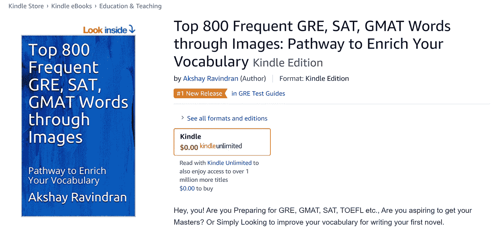
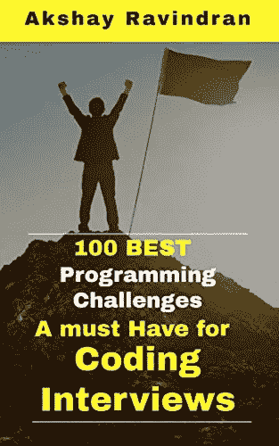

# 没有相邻色的花卉种植怎么解决？

> 原文：<https://blog.devgenius.io/how-to-solve-flower-planting-with-no-adjacent-colors-d93d7db55e1d?source=collection_archive---------2----------------------->

## 第 46 天——100 天到 LinkedIn、雅虎、甲骨文


照片由 [Josefin](https://unsplash.com/@josefin?utm_source=unsplash&utm_medium=referral&utm_content=creditCopyText) 在 [Unsplash](https://unsplash.com/s/photos/plant?utm_source=unsplash&utm_medium=referral&utm_content=creditCopyText) 上拍摄

*   出于免费的故事？下面是我的 [**好友链接。**](https://medium.com/@akshay_ravindran/d93d7db55e1d?source=friends_link&sk=6d60e8ca15aabce58847406708f83a5d)
*   100 天到 LinkedIn，雅虎，甲骨文

# 介绍

嘿，伙计们，今天是 LinkedIn 挑战 100 天的第 46 天。

[](https://amzn.to/3fLILh7)

Kindle 阅读器免费

如果你在准备面试。即使你已经在工作中安顿下来，让自己了解最新的面试问题对你的 T21 职业发展至关重要。从**这里**开始你的**准备**！

上个月，我一直在研究这些公司的常见问题。我已经收集了这些问题中的 100 个，我不能保证你会在面试中得到这些问题，但是我相信这些“面试问题”中的大多数都有相似的逻辑，并且从这些挑战中运用了相同的思维方式。

在我们进入第一个问题之前，如果你想知道我为什么选择 LinkedIn、雅虎和甲骨文而不是 FAANG，是因为我已经完成了一项挑战[，重点是亚马逊和脸书的面试](https://medium.com/javarevisited/100-days-to-amazon-day-1-b9e07228f079)。

# 新的一天，新的力量，新的想法

# 第 46 天——花卉种植无相邻颜色🏁

# 目的

您有从`1`到`n`标记的`n`个花园，以及一个数组`paths`，其中`paths[i] = [xi, yi]`描述了花园`xi`到花园`yi`之间的双向路径。在每个花园里，你想种 4 种花中的一种。

所有花园最多有 3 条**路径进出。**

你的任务是为每个花园选择一种花的类型，这样，对于任何两个由小路连接的花园，它们都有不同类型的花。

返回 ***任意*** *这样的选择作为一个数组* `answer` *，其中* `answer[i]` *是种植在* `(i+1)th` *花园中的花的类型。花的种类分别表示为*`1`*`2`*`3`*或* `4` *。可以保证答案是存在的。***

# **Example🕶**

```
****Input:** n = 3, paths = [[1,2],[2,3],[3,1]]
**Output:** [1,2,3]
**Explanation:**
Gardens 1 and 2 have different types.
Gardens 2 and 3 have different types.
Gardens 3 and 1 have different types.
Hence, [1,2,3] is a valid answer. Other valid answers include [1,2,4], [1,4,2], and [3,2,1].**Input:** n = 4, paths = [[1,2],[3,4]]
**Output:** [1,2,1,2]**
```

> **关注[**代码之家**](https://medium.com/@akshay_ravindran) **s** 了解编程面试世界的最新动态。**

# **密码👇**

**作者:[阿克谢·拉文德兰](https://www.linkedin.com/in/akshay-ravindran-096)**

# **算法**

1.  **你可以解决这个问题，如果你试着把单个的花园表示为一个图的节点，把路径表示为图的边。**
2.  **我们可以用一个 hashmap 来表示这个图，它是一个节点 **(KEY)** ，由一个 **HashSet(Value)** 中的**相邻节点**表示**
3.  **创建一个数组来存储结果 **(ans)。****
4.  **对于每个花园，创建一个 colors 数组，存储我们可以根据特定节点的相邻节点列表使用的颜色。**
5.  **现在，在结果数组中，填充可以使用特定节点表示的颜色。**
6.  **类似地，对图中的每个节点重复这些步骤。**
7.  **在遍历结束时返回结果🔚**

# **复杂性分析**

> ****时间复杂度:O(Len + N)遍历花园的长度次数**
> **空间复杂度:O( N)我们为每个节点创建一个图****

**[](https://amzn.to/3eZbTS9)

感谢你制作了这个排名第一的新版本🖤** 

# **进一步阅读**

**[4 个极其有用的面试链表小技巧](https://medium.com/javarevisited/4-incredibly-useful-linked-list-tips-for-interview-79d80a29f8fc?source=your_stories_page---------------------------)
[亚马逊 SDE 25 大面试问题](https://medium.com/javarevisited/top-25-amazon-sde-interview-questions-cfe0ef70ba9e?source=your_stories_page---------------------------)
[你以为你真的了解斐波那契数列吗？](https://medium.com/javarevisited/are-you-making-these-fibonacci-number-mistakes-5e3cbedd367e?source=your_stories_page---------------------------)
[用 C 编程解决 9 个最佳字符串问题](https://medium.com/@akshay_ravindran/9-best-strings-problem-solved-using-c-5e2a1d373fc2?source=your_stories_page---------------------------)
[一个人不能简单解决 50 个黑客等级挑战](https://medium.com/javarevisited/top-50-coding-challenges-in-hacker-rank-3d79c181528?source=your_stories_page---------------------------)**

# **线的尽头**

**你现在已经到了这篇文章的结尾。谢谢你阅读它。祝你编程面试好运！**

**如果你在面试中遇到这些问题。请在下面的评论区分享它。我会很高兴读到它们。**

**[](https://medium.com/javarevisited/the-ultimate-guide-to-binary-trees-47112269e6fc) [## 二叉树的最终指南

### 任何你必须知道的关于二叉树的事情！

medium.com](https://medium.com/javarevisited/the-ultimate-guide-to-binary-trees-47112269e6fc) 

当我们发布新的编码挑战时，不要忘记点击**关注 button✅** 接收更新。告诉我们你是如何解决这个问题的。🔥我们会很高兴阅读它们。❤:我们可以在一篇博文中介绍你的方法。

> 想在 java 编程方面出类拔萃？

[](https://www.amazon.in/Solved-Programming-Challenges-Coding-Interviews-ebook/dp/B07S5K4Z32/ref=sr_1_1?keywords=100%20best%20solved%20programming%20challenges&qid=1563392111&s=gateway&sr=8-1&source=post_page---------------------------)

已经解决的 **100 个 Java(面试)编程问题**汇编。**(黑客等级)🐱‍💻。**这是完全**免费的**🆓如果你订阅了亚马逊 kindle。


作者:[阿克谢·拉文德兰](https://www.linkedin.com/in/akshay-ravindran-096)**