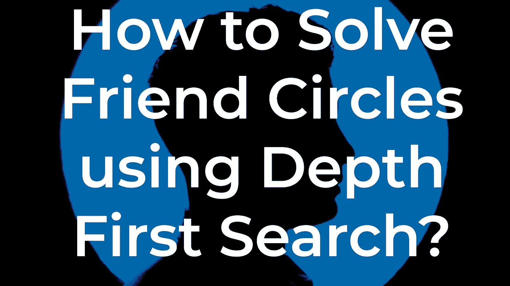

# 如何用 DFS 解决朋友圈？

> 原文：<https://blog.devgenius.io/how-to-solve-friend-circles-using-dfs-89c7c58b77a0?source=collection_archive---------5----------------------->

## 第 45 天——100 天到 LinkedIn、雅虎、甲骨文



本·斯威特在 [Unsplash](https://unsplash.com/s/photos/circle?utm_source=unsplash&utm_medium=referral&utm_content=creditCopyText) 上的照片

*   出于免费的故事？这里是我的 [**好友链接。**](https://medium.com/@akshay_ravindran/89c7c58b77a0?source=friends_link&sk=42216b2c4bccd52a496088cb6be2108d)
*   100 天到 LinkedIn，雅虎，甲骨文

# 介绍

嘿，伙计们，今天是 LinkedIn 挑战 100 天的第 45 天。

[](https://amzn.to/3fLILh7)

Kindle 阅读器免费

如果你在准备面试。即使你已经在工作中安顿下来，让自己了解最新的面试问题对你的职业发展是至关重要的。从**这里**开始你的**准备**！

上个月，我一直在研究这些公司的常见问题。我已经收集了这些问题中的 100 个，我不能保证你会在面试中得到这些问题，但我相信这些“面试问题”中的大多数都有相似的逻辑，并且从这些挑战中运用了相同的思维方式。

在我们进入第一个问题之前，如果你想知道我为什么选择 LinkedIn、雅虎和甲骨文而不是 FAANG，是因为我已经完成了一项挑战[重点是亚马逊和脸书的面试](https://medium.com/javarevisited/100-days-to-amazon-day-1-b9e07228f079)。

# 新的一天，新的力量，新的想法

# 第 45 天——朋友圈🏁

# 目的

一个班有 N 名学生。他们有些是朋友，有些不是。他们的友谊本质上是可传递的。举个例子，如果 A 是 B 的**直接**好友，B 是 C 的**直接**好友，那么 A 就是 C 的**间接**好友，而我们定义的朋友圈就是一群直接或者间接好友的同学。

给定一个 **N*N** 矩阵 **M** 代表班上同学之间的朋友关系。如果 M[i][j] = 1，那么第 I 个和第 j 个学生彼此是**直接**朋友，否则不是。而且你要输出所有同学的朋友圈总数。

# Example🕶

```
**Input:** 
[[1,1,0],
 [1,1,0],
 [0,0,1]]
**Output:** 2
**Explanation:**The 0th and 1st students are direct friends, so they are in a friend circle. 
The 2nd student himself is in a friend circle. So return 2.**Input:** 
[[1,1,0],
 [1,1,1],
 [0,1,1]]
**Output:** 1
**Explanation:**The 0th and 1st students are direct friends, the 1st and 2nd students are direct friends, 
so the 0th and 2nd students are indirect friends. All of them are in the same friend circle, so return 1.
```

> 关注[**代码之家**](https://medium.com/@akshay_ravindran) **s** 了解编程面试世界的最新动态。

# 密码👇

作者:[阿克谢·拉文德兰](https://www.linkedin.com/in/akshay-ravindran-096)

# 算法

1.  当你深入这个问题时，这会让你想起我们以前处理过的一个 dfs 问题。就是 [**岛数**](https://medium.com/javarevisited/day-33-number-of-islands-80ecd0490fe3) **的问题。**
2.  我们必须用类似的方法来解决这个问题。
3.  创建一个访问过的数组来知道你已经访问过哪些人。
4.  **基本逻辑**是如果你能以 **dfs** 的方式**从一个人穿越**到另一个人，那么他们本来就属于一个朋友圈。
5.  如果我们能够通过 **dfs** 接触到从第一个人开始的所有朋友，那么就只有**一个圈子。**
6.  每次访问一个人时，在访问过的节点中做上标记，说明你已经统计了这个人。

# 复杂性分析

> 时间复杂度:O(N)对于每个人，你将调用一个 dfs。如果他们没有联系。
> **空间复杂度:O(N)其中 N 是给定 2D 数组中的人数。**

# 边缘案例

1.  如果给定矩阵**为空，则返回 0。**

[](https://amzn.to/3eZbTS9)

感谢你制作了这个排名第一的新版本🖤

# 进一步阅读

[4 个极其有用的面试链表技巧](https://medium.com/javarevisited/4-incredibly-useful-linked-list-tips-for-interview-79d80a29f8fc?source=your_stories_page---------------------------)
[亚马逊 SDE 25 大面试问题](https://medium.com/javarevisited/top-25-amazon-sde-interview-questions-cfe0ef70ba9e?source=your_stories_page---------------------------)
[你认为你真的了解斐波那契数列吗？](https://medium.com/javarevisited/are-you-making-these-fibonacci-number-mistakes-5e3cbedd367e?source=your_stories_page---------------------------)
[用 C 编程解决 9 个最佳字符串问题](https://medium.com/@akshay_ravindran/9-best-strings-problem-solved-using-c-5e2a1d373fc2?source=your_stories_page---------------------------)
[一个人不简单地解决 50 个黑客等级挑战](https://medium.com/javarevisited/top-50-coding-challenges-in-hacker-rank-3d79c181528?source=your_stories_page---------------------------)

# 线的尽头

你现在已经到了这篇文章的结尾。谢谢你阅读它。祝你编程面试好运！

如果你在面试中遇到这些问题。请在下面的评论区分享它。我会很高兴读到它们。

[](https://medium.com/javarevisited/the-ultimate-guide-to-binary-trees-47112269e6fc) [## 二叉树的最终指南

### 任何你必须知道的关于二叉树的事情！

medium.com](https://medium.com/javarevisited/the-ultimate-guide-to-binary-trees-47112269e6fc) 

当我们发布新的编码挑战时，不要忘记点击**关注 button✅** 以接收更新。告诉我们你**是如何解决**这个问题的。🔥我们会很高兴阅读它们。❤:我们可以在一篇博文中介绍你的方法。

> 想在 java 编程方面出类拔萃？

[](https://www.amazon.in/Solved-Programming-Challenges-Coding-Interviews-ebook/dp/B07S5K4Z32/ref=sr_1_1?keywords=100%20best%20solved%20programming%20challenges&qid=1563392111&s=gateway&sr=8-1&source=post_page---------------------------)

已经解决的 **100 个 Java(面试)编程问题**汇编。**(黑客等级)🐱‍💻。**这是完全**免费的**🆓如果你订阅了亚马逊 kindle。


作者:[阿克谢·拉文德兰](https://www.linkedin.com/in/akshay-ravindran-096)