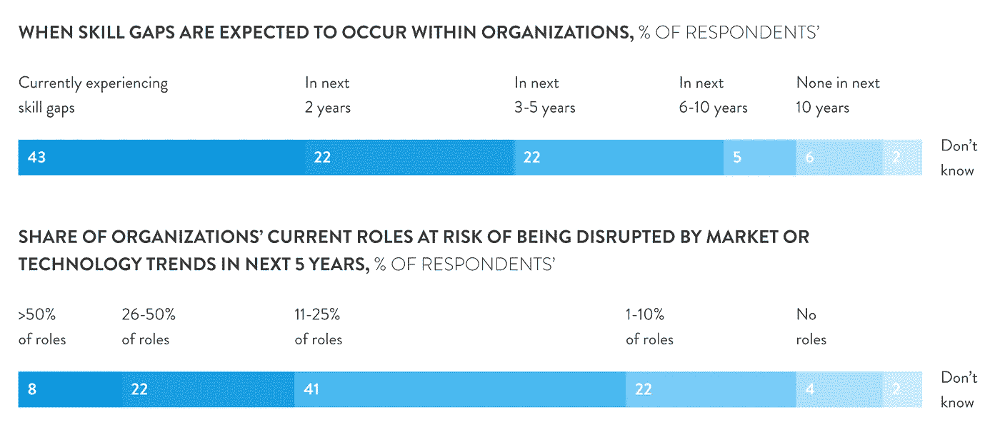

# 如何解决贵公司软件工程师短缺的问题

> 原文：<https://blog.devgenius.io/how-to-solve-shortage-of-software-engineers-in-your-company-98aea38ae698?source=collection_archive---------12----------------------->

# 解决软件工程师短缺的最有效方法

对软件工程师的需求迅速增长。原因有很多，但并不是所有的原因都与全球数字化转型有关。IT 行业的面貌在不断变化，导致软件工程师短缺。这个世界迫切需要能够为广泛的软件问题提供解决方案、有效管理工作负载、新技术和新的工作方式的专家。

鉴于疫情期间远程工作需求的特殊性，找到并留住合适的 it 人才非常重要。Requestum 的专家们在这个问题上有着丰富的经验，他们决定仔细研究这个问题，并找出可能的解决方法。

# 软件工程师的需求

在未来几年，新技术的引进率将保持不变，在某些领域将会加快。云计算、大数据、开源和电子商务解决方案将是重中之重，因此全球软件开发商的需求将会很大。

根据统计数据，软件工程师仍然是最受欢迎的专家之一。对加密、人工智能和 ML 日益增长的兴趣推动了对拥有最新知识和资格的专业人员的需求。此外， [Gartner 将](https://www.gartner.com/en/newsroom/press-releases/2019-01-17-gartner-survey-shows-global-talent-shortage-is-now-the-top-emerging-risk-facing-organizations)人才短缺列为当今五大商业风险之一。大约 63%的受访高管承认这一点。

基于[官方数据](https://www.cnbc.com/2019/11/06/how-switching-careers-to-tech-could-solve-the-us-talent-shortage.html)，2019 年底，全球 IT 部门的职位空缺超过 90 万个。尽管申请者甚至被认为是编程和计算机科学年度夏令营的毕业生。

公司正试图填补技能缺口。最近的麦肯锡民意调查显示，87%的公司要么正在经历相关问题，要么预计在未来 5 年内会遇到

根据[一些估计](https://www.kornferry.com/insights/briefings-magazine/issue-30/2030-the-very-human-future-of-work)，到 2030 年对新专家的需求可能超过 8500 万人，这将导致知识密集型行业收入的巨大损失。仅在美国，目前就缺少一百多万软件开发人员。他们的就业率预计到 2028 年将增长 21%，远高于行业平均水平。根据美国劳工统计局的数据，到 2029 年，对技术工程师的需求[将增长 22%](https://www.daxx.com/blog/development-trends/software-developer-shortage-us) ！

即使是平均年薪 10 万美元的丰厚职业也无法满足戏剧性的软件工程师需求。人才储备不足，加上缺乏新的技术技能，给招聘市场带来了前所未有的压力。这对一般公司来说意味着什么？

# 软件工程师短缺对企业的影响

人才短缺阻碍了行业和相关业务的发展。它对运营有影响，会影响预算和招聘时间。某项[研究](https://www.icims.com/blog/how-to-prepare-for-tech-hiring-in-2020/)指出，招聘科技工作人才比其他工作多花 50%的时间。平均要两个月才能找到合适的人选。这只是一个候选人——一个潜在的未来雇员，而不是确定的那个。

开发人员的短缺阻碍了创新，减缓了业务增长。[超过 50%](https://www.cio.com/article/3068595/it-talent-gap-an-existential-threat-in-need-of-new-tactics.html) 接受调查的首席信息官表示，由于缺乏熟练的人才，他们的公司很难跟上技术的发展。60%的人确信他们正因此失去竞争优势。

# 软件工程师短缺的主要原因

申请技术类职位空缺的人数几乎是其他类型职位空缺的两倍。那么软件工程师荒从何而来？

首先，可以解释为高素质的工程人员数量少。雇主提出的要求是求职者准备不足或根本没有准备好。它们也跟不上流行的编程语言和技术趋势的发展。最重要的是，掌握新知识需要时间、知识和实践。

软件开发人员短缺的一个重要原因是教育机构无法适应新的条件。教育系统的转变比 IT 行业慢。另一方面，学习永远不会太晚。有许多已知的案例表明，人们在成年后已经从另一个专业转向了 IT。

根据应用协会的数据，仅在美国就有超过 223，000 个软件开发职位空缺。与此同时，学院和大学每年仅毕业 3 万名计算机科学家。按照这种速度，将需要近 8 年时间来弥补需求缺口。很少有州采用了最新的计算机科学标准，尽管超过一半的新 STEM 工作是在计算机领域。与此同时，资深员工退休了。

因此，即使有可能找到十几个软件开发人员，雇主也会面临以下问题:

1.  缺乏经验；
2.  缺乏技术、硬性和软性工作流程技能(领导、沟通、团队合作、职业道德等。);
3.  缺乏正规教育；
4.  过高的薪酬要求。

虽然雇佣开发人员对小企业和初创公司来说通常是一个挑战，但拥有大量预算和声望的公司会觉得更容易。科技巨头通常在选择合适的人方面没有问题。总的来说，这几年生意越来越慢。职业提升变慢了，职业倦怠让员工想要更多，不妥协。

疫情也影响了就业状况。员工希望远程工作，以便不剥夺自己过正常生活的机会。根据 T2 思杰公司的一项研究，86%的专业人士选择公司是根据价值，而不是工作量来判断的。因此，雇主需要有创造力来吸引和留住最优秀的人才。

# 如何应对软件工程师短缺？

无论公司的规模和地位如何，解决方案都是一样的:

1.  雇佣新人才──靠自己或在招聘机构的帮助下。
2.  培训自己的员工。
3.  与外包公司的伙伴关系。

如果你想雇佣高质量的专业人士，请遵循以下算法:

*   在空缺职位上，公布一个薪资范围，以吸引合适水平的人才，并提升你在谷歌求职中的地位；
*   寻找比自己聪明的人。你将成为一个最好的磁铁，从长远来看，是一个公认的人才熔炉；
*   不要纠结于简历、缺乏经验或没有技术学位。选择展示能力的候选人；
*   用现实世界的问题来测试候选人。

培训你的员工是一个漫长而昂贵的过程。培训和职业发展系统必须整合到您的组织中。不是每个人都能处理好的。当训练有素的员工被竞争对手挖走时，就更令人恼火了。这就是为什么他们需要适当的激励。

大多数现有的招聘机构不关心客户需求和目标、技术堆栈或 SDLC。这就是为什么他们需要为候选人提供一份完整的要求清单，包括你需要的技术知识。

与外包公司的伙伴关系提供了获得具有成本效益的、精确的人力资源的最佳机会。最新数据显示，41%的组织将很快增加外包成本，以应对软件开发人员短缺。这种解决方案有许多优点:

1.  作为一个规则，外部团队是专业的，并立即开始与你合作；
2.  项目的目的、目标和时间安排提前达成一致，并记录某些里程碑的实现情况；
3.  除了工作细节，你们的关系不涉及其他问题(例如，报酬)。

在时间有限的情况下，外包可能是你最好的选择。说到这里，我们还想补充一点，贵公司程序员的短缺是我们要解决的问题！

Requestum 团队已经准备好并愿意帮助客户利用技术的力量解决紧迫的业务挑战。从业务分析到设计和最终产品，我们为满足并超越用户期望的功能应用开发提供全方位的服务。

我们的专家在最新技术方面拥有深厚的专业知识，这使我们能够为各个领域的企业提供高性能的解决方案:

*   完美匹配个人业务目标、行业需求和客户期望的 Web 应用程序；
*   具有丰富功能和高性能的外部接口；
*   后端:复杂的服务器端代码、系统架构、集成层次、API
*   移动应用从创意到发布和支持；
*   人工智能技术；
*   适用于各种任务的有效深度学习模型；
*   业务优化算法，以及节省和提高运输服务生产率的路线选择；
*   语音识别、自然语言理解和内容分析；
*   区块链:我们将开发一个智能合约，并建立最合适的方式让它与所有需要的平台进行交互。

让我们携手合作，帮助您建立一个独特、强大的团队来满足贵公司的需求。

# 结论

使用正确的方法，软件开发人员的需求在任何给定的公司都可以很容易地降级。

*最初发表于*[*【https://requestum.com】*](https://requestum.com/blog/how-to-solve-shortage-of-software-engineers-in-your-company/)*。*