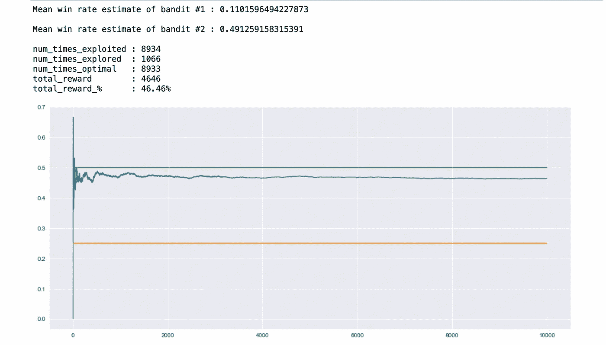

# 如何解决多臂强盗问题:ε-贪婪算法

> 原文：<https://blog.devgenius.io/how-to-solve-the-multi-armed-bandit-problem-epsilon-greedy-approach-ebe286390578?source=collection_archive---------0----------------------->

## 包括代码解释和模拟结果！

卡尔·劳在 [Unsplash](https://unsplash.com?utm_source=medium&utm_medium=referral) 上的照片

让我们从离开的地方继续。我在之前的帖子中已经解释了*探索-利用困境*和*多臂强盗问题*。本文就是建立在这个基础上的，所以，考虑先浏览一下(如果你不熟悉这些术语的话)。

 [## 探索-利用困境:一种视觉方法！

### 强化学习和贝叶斯统计交叉的经典问题

blog.devgenius.io](/understanding-the-explore-exploit-dilemma-a-visual-approach-839f437c1cff) 

在这一篇中，我将解释ε-贪婪算法以及它如何帮助解决探索-利用困境。

我将通过分解我下面提供的模拟代码来进行解释。我们将根据组件的用途和最终结果对其进行检查。

所以，让我们深入研究一下。

# ε-贪婪实现代码

ε贪婪实现代码

## 模拟的结果

结果快照 1

绿色和橙色线条分别代表考虑中的盗匪的个人胜率， *50%* & *25%* 。

模拟期间的总体胜率用蓝线表示。

请注意，在最初的波动之后，整体赢率开始向给定强盗池的最高可能赢率靠拢。也就是达到了获得最大回报的目的。

最初的波动是由于模型的观察值越多，它在估计整体胜率时就越有信心。正如你从下面的一些其他结果中看到的，最初的波动对所有人来说都是常见的。

结果快照 2

结果快照 3

> 请注意，尽管 Epsilon-Greedy 是一种很好的方法，但它不是 100%安全的。在某些情况下，当模拟中的试运行次数很少时，模型可能会收敛到次优胜率，但一旦您运行模拟足够长的时间，这些情况将可以忽略不计。
> 
> 此外，如果你想让总体回报尽可能接近最高值(在上述场景中为 50%)，在这种情况下可以使用衰减ε。
> 
> **衰减的ε与迭代的时间或次数成反比。实际意义在于，模型的探索因子随着模拟的每次迭代而不断减小，从而更经常地选择最佳 bandit。**

# 模拟代码的分解

从导入所需的库和初始化模拟的超参数开始。

即:

*   `NUM_TRIALS`模拟将执行的试验次数
*   `EPS`探索因子(模型探索了多少而不是探索了多少)。一个**0.1**ε值意味着模型将探索 10%的时间而不是利用。常用的数值是 5%到 10%。
*   `BANDIT_PROBS`盗匪的实际胜率(模型未知)

举个更实际的例子:

*   游戏者有两台老虎机，实际赢率分别为 25%和 50%。
*   探索因素表示，如果游戏者玩 100 次，则 10%的次数，他们将探索其他吃角子老虎机，而不是简单地玩直到该时间点的最高估计胜率的一个。

然后声明模拟函数，并且在该函数中，模拟之前投币机的初始胜率估计值被设置为 0，因为模拟还没有开始。

此外，还声明了一些变量来记录模型决策和模拟过程中获得的奖励。

还记录了最佳 bandit，以检查模型在模拟过程中选择该 bandit 的次数。记住，最终目标是最大化模型选择最优的次数。

然后我们就有了决定模型是否要进行探索的组件。

通过将ε值与`np.random.random`函数进行比较来做出决定，该函数从均匀分布的范围[0.0，1.0]中返回一个浮点整数。

> 为了简化理解，我们假设`np.random.random`从**均匀分布的范围【1100】**中返回一个整数。也就是说，该范围内的每个整数被选中的概率相等。
> 
> 现在，如果探索因子是 0.1 (10%)，那么如果`np.random.random`返回[1，10]之间的值，模型将进行探索，因为发生这种情况的概率是 10%

如果是，则记录除了具有最高胜率估计值的盗匪之外的那些盗匪的指数，并通过`np.random.choice`功能随机选择其中一个进行探索。

接下来，是利用场景组件，它只选择到那时为止胜率估计最高的强盗。

注意`np.random.choice`功能用于有两个胜率最高的强盗的情况。在这种情况下，我们只是从两个中随机选择一个。然而，如果只有一个胜率最高的强盗，那么`np.random.choice`函数将返回那个强盗。

最后，一旦一个强盗被选中，就要检查它是否是最佳的。此步骤仅用于记录模拟结果。

然后拉匪臂看我们拿不拿奖励。注意，这里使用了`np.random.random` 功能，并且应用了与之前相同的逻辑。唯一不同的是，这里我们检查的是玩家是否从选择的强盗那里得到了奖励，而不是探索因素。

之后，根据上一步获得的奖励计算新的平均胜率估计值。

用于计算平均胜率估计值的方法如下:

假设你有四个整数 **2，4，1，7** 。平均值将达到 3.5 T4。
现在，我们假设您向该组添加了另一个整数 **6** 。你可以相加得到新的平均值 **4。**

或者你可以得到新的数字 **(6)** 和以前的平均值 **(3.5)** 之差，即**(6–3.5 =****2.5)**，然后将其平均分配到整个组中，即 **(2.5/5 = 0.5)** ，平均值加起来就是 **(3.5+0.5 = 4)**

> 为什么选择第二种方法？**这使我们能够计算恒定时间和空间中的平均值**，因为我们没有像第一种方法那样存储数字，而只是存储以前的平均值。

除此之外，其余组件用于绘制结果，并且仅用于可视化目的。所以，它们是自明的。

# 感谢阅读！

这给了我很大的鼓励！😃*如果你觉得这个帖子很有意思，想要更多，可以考虑* [***关注我***](https://medium.com/subscribe/@pratik.pandav)*🥁*。我每周发布与机器学习、统计和数据分析相关的主题。我喜欢通过可视化来学习，因此，我的帖子包含了大量的图表、模拟和代码示例。**

*简要说明一下，我尽力把错误降到最低，但它们是我们学习的一部分，所以，如果你发现什么，请指出来。最后，请随意提出你希望我写的主题。*