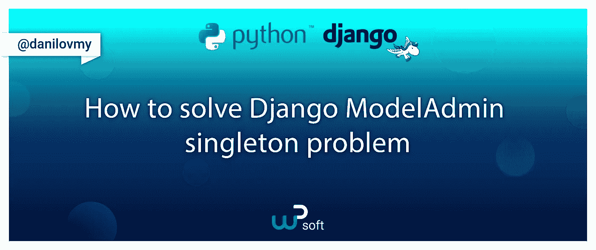
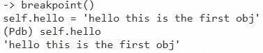
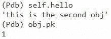

# 如何解决 Django ModelAdmin 中的单体问题？

> 原文：<https://blog.devgenius.io/how-to-solve-the-singleton-problem-in-django-modeladmin-4e31cc4f2690?source=collection_archive---------6----------------------->



来自*django . contrib . admin . options*的`ModelAdmin`类从一开始就有一个糟糕的设计:你的项目中每个注册的`ModelAdmin`都是单例的。

这个事实给每个在项目中使用 Django Admin 的开发人员制造了一个很大的障碍。这减慢了项目的速度，当同一个`ModelAdmin`被几个用户使用时会产生问题，并鼓励程序员使用黑客手段来绕过这个(反)模式的限制。在这篇文章中，你可以用 5 行代码来学习如何解决这个问题。

为什么 django.contrib.admin 的开发者继续依赖这个架构对我来说是个谜。

幸运的是，从 Django 的第一个版本到当前版本(2022 年 4 月的 4.0.3 ),这个问题已经有了一个快速简单的解决方案。

# 目录:

*   [**问题**](#91b7) **。**我会详细描述 ModelAdmin 使用 singleton 架构时遇到的问题。
*   [**解**](#f433) **。**我将带你完成修复，并解释它是如何工作的以及为什么工作。
*   [**姜戈 devs**](#f141) **。我请求正在阅读这篇文章的 Django 开发者考虑改变 django.contrib.admin 的结构，让每个人的生活更轻松。**
*   [**从 PyCon 2022 说起这个问题**](#e645) **。除了这篇文章，我还有一个来自柏林 2022 年 PyCon DE 的视频。**

# 问题

## 1.多个用户不能同时使用同一个`ModelAdmin`正常工作。

当多个用户同时运行管理面板时，singleton 设计模式允许一个用户修改另一个用户的数据。

让我用我上一篇关于 [Django admin 动态内联定位](/django-admin-dynamic-inline-positioning-7208596479ce)的文章中的代码来演示一下。现在代码做什么并不重要。我们只是像这样修改管理面板中的功能:

管理. py

现在让我们打开管理面板的两个选项卡来模拟两个用户。现在让我们打开第一个选项卡上 pk=1 的产品的变更表单(/admin/products/product/1/change)。过了这条线，我们被`breakpoint`拦住了:

```
10 self.hello = 'hello this is the first obj'
```

如果我们检查`self.hello`属性，我们会看到以下内容:



调试器输出第一个线程

现在让我们在另一个选项卡('/admin/products/product/2/change ')中打开一个 pk=2 的产品的变更表单，看看会发生什么。我们马上从变更表单中得到响应，因为我们跳过了`breakpoint`。但是让我们看看在第一个选项卡中为`ModelAdmin`设置的`hello`属性发生了什么。



第二个线程结束后，第一个线程中的调试器输出

我们的 GET 请求 pk=1 的`ModelAdmin.hello`属性已经更改为“这是第二个 obj”，尽管我们在第一个线程中什么也没做。

我们证明了`ModelAdmin`是单例的，这意味着我们总是得到同一个`ModelAdmin`实例。

这是一个简单的问题演示。因为在这个例子中没有真正的后果，一些人甚至认为它是微不足道的，但是这种行为对我们的项目的后果可能是危险的。

由于这种行为，每个 ModelAdmin 都不能保证数据的完整性，因为不可能跟踪谁编辑了数据。这个当前线程编辑了我们的数据吗？另一个请求在我们不知情的情况下改变了什么吗？谁知道呢。

您可能会认为这不是问题，因为请求必须同时发生，这个问题才会生效。然而，在一个多个人同时运行管理面板的项目中，问题不在于是否有人同时打开`ModelAdmin`，而在于何时打开**。**

这导致了错误，如果没有对管理面板架构的深入理解，就没有明显的解释。

所以避免这个问题的最简单的方法就是不要使用`ModelAdmin`实例作为容器。

> *但并不是每个开发者都意识到了这一点，* `*ModelAdmin*` *经常被没有经验的开发者用来存储数据。在这个* [*的例子中*](https://stackoverflow.com/questions/727928/django-admin-how-to-access-the-request-object-in-admin-py-for-list-display-met/23574558#23574558?newreg=fca9027c603a4c18b9f6e584986b3f2a) *的最高投票答案正是如此。*

如果我们不能使用`ModelAdmin`，那么我们的数据可以存储在哪里？Django 默认没有给我们明确的答案。

## 2.劈

由于不能使用 ModelAdmin 的实例作为容器，开发人员正在寻找其他选择。

我发现的大多数解决方法[是将信息存储在一个全局字典中，并将其映射到当前线程的本地。是的，那是可行的，但是难道不应该有比那更好的方法吗？](https://gist.github.com/vparitskiy/71bb97b4fd2c3fbd6d6db81546622346)

## 3.速度

如果有可能使用`ModelAdmin`作为数据的容器，Django 自己也能做到。目前 Django 在同一个请求中重复调用某些`ModelAdmin`方法来获得相同的结果。所有这些结果都应该被缓存。如果`ModelAdmin`表现得像 Django-GCBV 一样，我们可以节省宝贵的计算时间。

下表显示了每个请求调用以下`ModelAdmin`方法几次的频率:

对某些方法的调用次数取决于`AdminForm`或`ModelForm`字段的数量。

让我们比较一下默认情况下“普通的”Django 管理面板和使用 ModelAdmin 的缓存方法的 Django 管理面板的响应时间。作为一个代码示例，我从我的[上一篇文章](https://dev.to/danilovmy/django-admin-dynamic-inline-positioning-3cam)中选取了这个项目:

我创建了一个中间件，它输出请求和响应之间经过的时间:

计时中间件

如果中间件代码被执行，我们将得到结果:

时间结果

如您所见，即使在这个简单的项目中，由于缓存了计算函数的结果，速度也提高了近 20% ！

重构整个`ModelAdmin`类可以大大提高这个速度，因为它目前是一段臃肿的 spagetty 代码。

# 解决方案

现在让我们来看看 Django 的单身族是从哪里来的，并尝试解决它。

当`AdminSite`的实例从*django . contrib . admin . sites*注册时，就会创建`ModelAdmin`的每个实例。

在`AdminSite`类的 docstring 中，我们了解到`get_urls`方法用于从 ModelAdmin 的每个注册实例中检索视图。感谢这个 docstring 的作者。

在`AdminSite.get_urls`中，我们可以找到这段被截取的代码:

`AdminSite.get_urls method`

这里我们看到调用了`ModelAdmin.urls`属性。该属性返回`ModelAdmin.get_urls`方法的结果。所以，让我们探索一下这个方法`get_urls`做了什么:

模型管理员获取 _ urls

乍一看，这似乎是一大堆代码，但是让我们一段一段地解开它。让我们从底层开始探索这段代码。

返回的列表是为 url 调度程序创建的。它包含来自 **url** 、要调用的**视图**和视图的**名称**的元组。

对我们来说重要的是，什么是作为**视图**给出的。这是一个 **ModelAdmin 实例**的包装**有界方法**。那么，让我们来看看这个包装器`wrap`是做什么的。

幸运的是，这个包装器`wrap`就在上面定义了。`wrap`末尾的`update_wrapper`并不重要，它只是让最终视图表现得像一个 **ModelAdmin 实例**。

`wrapper`函数的主体对我们的任务至关重要。这里我们看到一个调用`admin_site.admin_view`的调用，使用 **ModelAdmin 实例**的**有界方法**作为参数。`admin_site`是`AdminSite`的实例，在其上注册了 **ModelAdmin 实例**。

我们需要覆盖这个方法来摆脱 Django ModelAdmin 对单例模式的诅咒。

所有这些解释都是为了一个需要被覆盖的简单函数。是的，因为如果不知道整个系统是如何工作的，我们就不会明白如何正确地忽略这个函数来解决我们的问题而不破坏任何东西。

让我们创建一个`AdminSite`的子类并覆盖`admin_view`方法，如下所示:

修复我们的单例问题

让我们忽略所有的包装器，专注于这几行代码:

```
new_instance = type(instance)(instance.model, instance.admin_site) return func.__func__(new_instance, *args, **kwargs)
```

*func* 是 ModelAdmin 的 singleton *实例*的一个有界方法，它对于每个查询总是相同的。

*func* 的`__func__`属性是`ModelAdmin`类的一个方法。它不再与`ModelAdmin`的任何实例相关联。

> *这里我用的是 python 术语* ***绑定*** *和* ***未绑定*** *的方法。* `*func.__func__*` *没有绑定* `*func.__self__*` *的实例，但也不是静态函数，它是一个类方法。仍然需要与* `*func.__self__*` *同类的实例作为调用该方法的第一个参数。*

为了创建`ModelAdmin`的**新实例**，我们需要 model 和 admin_site 作为参数，这可以很容易地从旧的 singleton-instance 中获得。

现在我们可以返回' **func** '调用，使用**新实例**作为自身，以及在调用时传递的参数*args 和**kwargs。

现在单例架构被成功绕过了。

**这意味着每次向视图发送请求时，都会创建一个新的 ModelAdmin 实例，并调用其对应的视图函数**

如前所述，从姜戈开始就有可能避免所有这些痛苦。

剩下的工作就是将我们的子 AdminSite 作为项目中的默认设置。

我们可以像这样创建一个`AdminConfig`类的孩子:

`default_site`属性必须与你的`AdminSite`类匹配。

最后，在 INSTALLED_APPS 的 settings.py 中注册`AdminConfig`完成修改。记得删除默认的管理面板。

这个新的管理面板目前的形式并不比旧的快。我们仍然需要缓存`ModelAdmin`方法。为此，您可以为 ModelAdmin 创建一个 Mixin，并将上述方法包装如下:

这个缓存实现没有任何问题，但是如果你担心用不同的参数多次调用同一个方法，你可以用 [memoize 包装器](https://docs.python.org/3/library/functools.html#functools.lru_cache)包装这些方法。这也会降低我们解决方案的速度提升。

# 结论

我喜欢 Django 框架。这是帮助我创造伟大事物的强大工具。我可以用一小段代码在正确的地方修复这个框架的任何问题。但是找到那个地方并不容易。而 Django 的文档帮不上忙。缺少文件——这是 Django 最大的问题。

# Django devs

我希望在我在这篇文章中提出的观点之后，你会同意 Django 在管理面板中实现单例架构存在严重的问题。这种模式使得管理面板变得麻烦和缓慢，需要做些事情来解决它。我在这里写下如何做到这一点。

我提出的修复是改进 Django 管理面板的重要的第一步，但不幸的是，下一步工作要在实现之后才开始。ModelAdmin 类代码需要大大改进，我问了一下，例如，本期中的[，但如果可以做到，我确信 Django 管理面板将是一个更好的工作工具。](https://code.djangoproject.com/ticket/33028)

# PyCon 2022 上的单身问题讲座

我在许多场合都谈到过这个问题。你可以看到我 2022 年 4 月在柏林皮肯德的视频，我[在这里写了](https://medium.com/@danilovmy/the-python-and-django-conferences-you-dont-want-to-miss-in-2022-82c53257254)我将在那次会议上发言。

在 PyCon 2022 上演讲