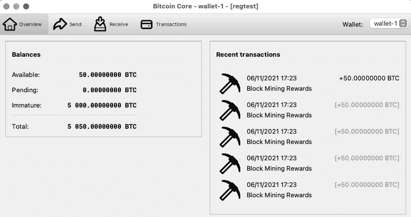

# 如何使用区块链浏览器加快区块链 App 开发速度？

> 原文：<https://blog.devgenius.io/how-to-speed-up-blockchain-app-development-using-blockchain-explorer-d0983b236068?source=collection_archive---------3----------------------->

## 轻松可视化您的私有区块链


照片由[巧妙的视觉效果](https://unsplash.com/@clever_visuals?utm_source=unsplash&utm_medium=referral&utm_content=creditCopyText)在 [Unsplash](https://unsplash.com/?utm_source=unsplash&utm_medium=referral&utm_content=creditCopyText) 上拍摄

私有区块链是基于区块链的应用程序开发的重要设置。在上层测试环境和生产部署中进行进一步测试之前，团队和个人开发人员有自己的私人区块链来验证系统的功能。

如果开发人员想知道区块链发生了什么，比如说比特币区块链，比特币节点提供了 RPC 命令，用于对块和交易进行操作和检查。下面的记录是使用 RPC 命令从区块链检索到的一个示例事务。虽然记录是 JSON 格式的，但是理解内容需要时间。

相反，使用区块链浏览器以 HTML 格式显示的相同交易记录可读性更好。这种表示直观且易于理解，提供超链接用于导航到其他详细信息，而无需运行任何 RPC 命令。


区块链浏览器—样本交易

# 区块链浏览器

区块链浏览器是一个表示层，以用户友好的方式显示区块链数据。它支持按地址、事务哈希和块哈希进行数据搜索。在幕后，它利用 RPC 命令从区块链中检索信息，并将 JSON 数据转换成更可读的 HTML 格式。

区块链浏览器的使用加快了整个系统的开发，因为它方便了开发人员在 web 浏览器中搜索信息，而不是运行 RPC 命令和读取 JSON 数据。

因此，强烈推荐将区块链浏览器作为区块链系统开发工具包的一部分。有许多开源的区块链资源管理器可用，如 [Abe](https://github.com/bitcoin-abe/bitcoin-abe) 、 [BTC RPC 资源管理器](https://github.com/janoside/btc-rpc-explorer)、 [Esplora](https://github.com/blockstream/esplora) 等。在本文中，我将向您展示如何设置 BTC RPC Explorer，并通过私有区块链上的示例事务演示其用法。

如果你刚到区块链，那么这篇文章可以帮助你了解情况。它提供了对区块链的快速概述，以及如何为本地测试创建本地区块链的步骤。

[](/how-to-create-your-private-blockchain-for-cryptocurrency-app-development-eeacd042b107) [## 如何为加密货币 App 开发创建自己的私有区块链？

### 加密货币的快速概述，包括钱包创建、区块挖掘和资金转移的演练

blog.devgenius.io](/how-to-create-your-private-blockchain-for-cryptocurrency-app-development-eeacd042b107) 

# 本地区块链创建

在设置区块链浏览器之前，第一步是创建一个本地区块链。在你的本地机器上安装[比特币核心](https://bitcoin.org/en/download)或[比特币结](https://bitcoinknots.org/)。

然后，启动比特币节点。默认情况下，它连接到 mainnet(即生产)。我们需要通过编辑配置将其转换为 regtest 模式。

转至首选项，点击“打开配置文件”按钮，然后在弹出编辑器中将以下设置添加到`**bitcoin.conf**`配置文件中。


比特币选项屏幕

```
# Tell Bitcoin node to accept JSON-RPC commands
server=1# Enable transaction index
txIndex=1# Allow connections from any IP addresses
rpcallowip=0.0.0.0/0# Credential for JSON-RPC commands
rpcuser=bitcoin
rpcpassword=123456# Tell Bitcoin node to run in regtest mode
regtest=1# IP address binding and port number of JSON-RPC service for Regtest
regtest.rpcport=8089
regtest.rpcbind=0.0.0.0
```

配置更新完成后，使用输入参数`**-fallbackfee**`重启比特币节点。您需要此参数作为默认费用，以防由于某种原因无法计算费用。

**对于 Mac OS 来说**

```
/Applications/Bitcoin-Qt.app/Contents/MacOS/Bitcoin-Qt -fallbackfee=0.00002
```

**用于 Windows**

```
<Installation path>/bin/Bitcoin-Qt.exe -fallbackfee=0.0002
```

当它启动时，您将看到以 regtest 模式显示的屏幕 UI。


Regtest 模式下的比特币节点

# BTC RPC 浏览器安装程序

[BTC RPC 浏览器](https://github.com/janoside/btc-rpc-explorer)是一个 NodeJS 应用程序。您可以从源代码运行应用程序，也可以通过 NPM 安装。

运行此命令以安装通过 NPM 浏览

```
npm install -g btc-rpc-explorer
```

然后，使用以下命令行运行浏览器。它将使用上面的 bitcoin.conf 配置文件中指定的用户 id 和密码在端口 8089 连接到您的本地区块链。

```
btc-rpc-explorer — bitcoind-port=8089 — bitcoind-host=127.0.0.1 — bitcoind-user=bitcoin — bitcoind-pass=123456
```

进入 http://localhost:3002 ，你会看到一个区块链的概要界面。新创建的区块链只有创世纪块。


区块链浏览器—初始区块链

# 设置钱包

为了演示区块链浏览器的功能，让我们设置 3 个钱包— **钱包-1** 、**钱包-2** 和**钱包-3** 。

进入比特币用户界面的菜单项文件→创建钱包，输入钱包名称并创建钱包


在比特币用户界面中创建钱包

完成钱包创建后，您将看到一个下拉框，其中列出了新创建的钱包


带有钱包下拉列表的比特币用户界面

# 初始化本地区块链

为了创建交易，我们需要先生成硬币。对于处于 regtest 模式的区块链，对于前 150 个区块，每生成一个新区块，矿工将获得 50 BTC 的奖励。

我们会用钱包 1 来领取区块开采的奖励。在比特币界面选择**钱包-1** ，创建新的收款地址


为钱包 1 创建新的接收地址

然后，将显示生成的地址。复制地址，我们将使用它进行挖掘。


生成的地址

让我们开采 101 个区块，以便生成硬币并可供使用。触发此 HTTP 请求，该请求将运行 RPC 命令来生成块:

```
curl --request POST 'http://localhost:8089' \
--header 'Content-Type: application/json' \
--user bitcoin:123456 \
--data-raw '{
   "jsonrpc": "1.0",
   "id": "curltext",
   "method": "generatetoaddress",
   "params": [101, "bcrt1qzwp9nyszugy6ya77g8ztmatyy4jtzrwgysqyaq"]
}'
```

由于生成了 101 个块，现在有 50 个 BTC 可供使用。



挖掘 101 个区块后的钱包余额

刷新区块链浏览器的浏览器屏幕，它将显示生成块的列表


拥有 101 个区块的区块链浏览器

# Mempool 中的新事务

是时候创建新的交易，分别将硬币转移到钱包 2 和钱包 3。我们将创建这两个事务:

*   从钱包 1 向钱包 2 发送 15 BTC
*   从钱包 1 向钱包 3 发送 10 BTC

在比特币 UI 中，输入钱包 2 的地址和金额。然后，发送交易。


向钱包 2 发送硬币

然后，给钱包 3 寄 10 BTC。提交这两笔交易后，您将在 Wallet 1 的交易屏幕中看到这两个条目:


钱包 1 的交易

因为新提交的事务还没有被挖掘到下一个块中，所以您将在浏览器中的 Mempool Transactions 屏幕下看到 2 个事务。


区块链浏览器—内存池交易

单击交易散列并导航至交易详细信息


区块链浏览器—交易详情

有时候，你还是需要看得更深一些，查看 JSON 里的技术资料。explorer 提供了一种简单的方法来检查事务的 JSON 原始数据、块头、UTXOs 和 Mempool 细节。


区块链浏览器— JSON 数据

# 新块生成

运行此命令以挖掘 1 个新块:

```
curl --request POST 'http://localhost:8089' \
--header 'Content-Type: application/json' \
--user bitcoin:123456 \
--data-raw '{
   "jsonrpc": "1.0",
   "id": "curltext",
   "method": "generatetoaddress",
   "params": [1, "bcrt1qzwp9nyszugy6ya77g8ztmatyy4jtzrwgysqyaq"]
}'
```

mempool 中的 2 个事务将包含在新挖掘的块中。这是浏览器显示的块细节


区块链浏览器—区块详情

在新块中有一个额外的事务，浏览器显示它是 coinbase 事务，这是块挖掘的回报。


区块链浏览器—区块交易

# 多输入多输出交易

如何处理不同的交易组合，例如多个输入和多个接收方？由于这样的事务涉及到输入和输出的混合，JSON 数据很复杂，很难理解。让我们看看事务是如何在浏览器中显示的。

我们首先在钱包 1 中选择 2 枚硬币，然后创建一个将硬币转移到钱包 2 和钱包 3 的交易。

我们没有使用自动硬币选择，而是在比特币用户界面中指定这两个硬币进行交易


比特币 UI——手动选择用于发送交易的硬币

使用选定的硬币，添加钱包 2 和钱包 3 的地址作为交易的收款人


向多个接收者发送带有所选硬币的交易

在资源管理器中，您将看到创建的事务有 2 个输入和 3 个输出 vout: 0 和 vout: 2 分别是 Wallet 2 和 Wallet 3 的输出，而 vout: 1 是零钱。


区块链浏览器—为多个接收者选择硬币

# 最后的想法

区块链浏览器为开发人员提供了一种便捷的方式来导航区块链数据，而无需麻烦 RPC 命令。直观的用户界面有助于检查交易数据，从而提高工作效率。此外，如果您需要更深入地了解技术数据，explorer 会显示原始的 JSON 数据。对于区块链应用程序开发来说，它绝对是一个必不可少的工具。