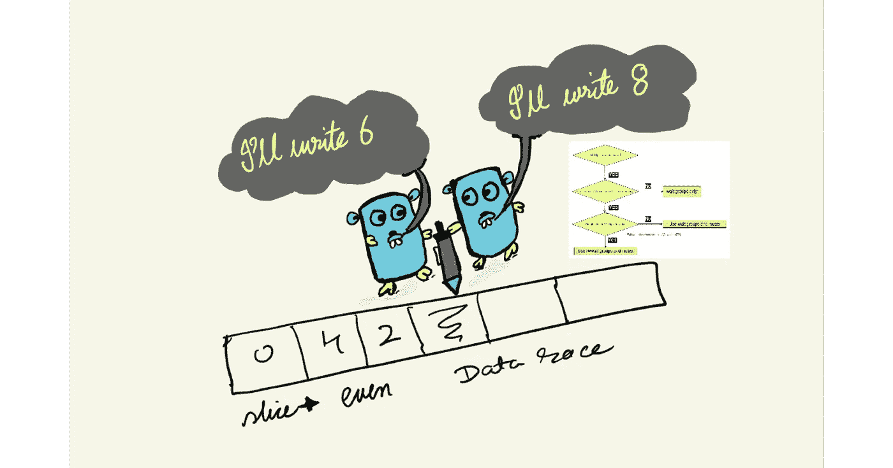
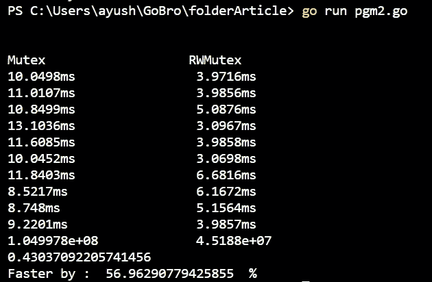
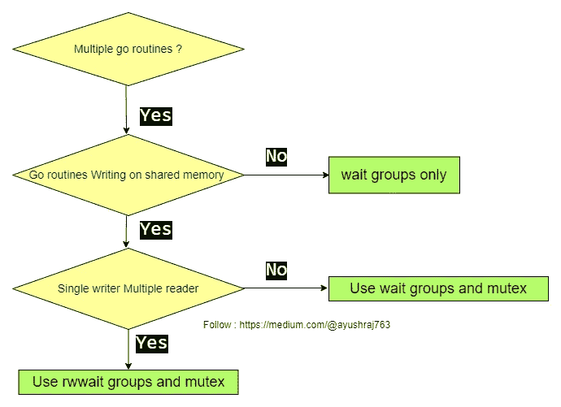

# 如何使用互斥体将并发围棋例程的速度提高 50%？

> 原文：<https://blog.devgenius.io/how-to-speed-up-concurrent-go-routines-with-mutex-by-upto-50-51863bfbea8d?source=collection_archive---------1----------------------->

我们将讨论如何使用 RWMutex 而不是 Mutex 来大大提高性能。



图简介(制作于 draw.io，photopea)

# 介绍

多个线程同时访问同一个内存是不可取的。在 Golang 中，我们可以有几个不同的 goroutines，它们都可能访问相同的内存变量，这可能会导致竞争情况。互斥，互斥，以及等待组来避免竞争情况。可以使用 golang 的 Mutex 和 RWmutex。

# 互斥 v/s rw 互斥

第一个中的互斥量是八个字节。RWMutex 是二十四个字节。来自[官方文档](https://pkg.go.dev/sync#RWMutex):*rw mutex 是一个读/写互斥锁。锁可以由任意数量的读取器或单个写入器持有。RWMutex 的零值是一个解锁的互斥体*。

```
// Mutex v/s RWMutex//Mutex
type Mutex struct {
    state int32
    sema  uint32
}// RWMutex type RWMutex struct {
    w           Mutex  // held if there are pending writers
    writerSem   uint32 // semaphore for writers to wait for completing readers
    readerSem   uint32 // semaphore for readers to wait for completing writers
    readerCount int32  // number of pending readers
    readerWait  int32  // number of departing readers
}
```

简而言之，读者不需要彼此等待。他们只需要等待持有锁的作者。由于 just reading 函数不会改变文件内容，因此允许许多读者同时读取同一个文件以提高程序的性能是可以接受的。但是写改变了文件的内容，互斥访问是必需的；否则，就会出现过大的错误。同步。因此，RWMutex 适用于大量读取数据，并且通过同步节省了资源。互斥是时间。

由 RWMutex 保护的每个写操作都是 O(readers)。

# 标杆管理

代码在采用英特尔 i5 芯片的 windows 系统上运行 10 次，性能作为完成并发读写操作的平均值。

代码和输出:

```
package mainimport (
 "fmt"
 "math/rand"
 "sync"
 "time"
 //"os"
)var a float64 = 0.0
var b float64 = 0.0func done() {
 r := rand.New(rand.NewSource(99))
 lst1 := []int{}
 lst2 := []int{}
 lock1 := sync.Mutex{}
 lock2 := sync.RWMutex{}
 wtgrp1 := sync.WaitGroup{}
 wtgrp2 := sync.WaitGroup{}for i := 0; i < 10; i++ {
  lst1 = append(lst1, i)
  lst2 = append(lst2, i)
 }// 1\. spawn 1000 goroutines and synchronize through locks
 now1 := time.Now()
 for i := 0; i < 1000; i++ {
  wtgrp1.Add(1)
  pos := r.Intn(10)
  go func() {
   defer wtgrp1.Done()
   lock1.Lock()
   defer lock1.Unlock()
   goLst := []int{} // goLst, destroy automatically
   // Process each element of lst1 randomly
   for j := 0; j < 1000; j++ {
    goLst = append(goLst, lst1[pos])
   }
  }()
 }
 wtgrp1.Wait()
 diff1 := time.Now().Sub(now1)// 2\. spawn 1000 goroutines and synchronize through read-write locks
 now2 := time.Now()
 for i := 0; i < 1000; i++ {
  wtgrp2.Add(1)
  pos := r.Intn(10)
  go func() {
   defer wtgrp2.Done()
   lock2.RLock()
   defer lock2.RUnlock()
   goLst := []int{} // goLst, destroy automatically
   // Process each element of lst2 randomly
   for j := 0; j < 1000; j++ {
    goLst = append(goLst, lst1[pos])
   }
  }()
 }
 wtgrp2.Wait()
 diff2 := time.Now().Sub(now2)
 fmt.Println(diff1, "  ", diff2)
 a = a + float64(diff1)
 b = b + float64(diff2)}func main() {
 fmt.Println("Mutex   RWMutex")
 for i := 0; i < 10; i++ {
  done()
  time.Sleep(2 * time.Second)
 }
 fmt.Println(a, "  ", b)
 fmt.Println(b / a)
 fmt.Println("Faster by : ", ((a-b)*100)/a, " %")}
```



图一。Windows PC 上的输出

# **总而言之……**



图二。流程图

当我们只有一个写入者时，RWmutex 应该用于等待组，以改变共享内存和多个读取者。