# 如何使用 Postman 的高级特性加速 API 测试

> 原文：<https://blog.devgenius.io/how-to-speed-up-your-api-tests-using-the-advanced-features-of-postman-350c453b376?source=collection_archive---------2----------------------->

## 令人惊叹的可重用 API 请求模板、动态请求数据和 API 请求工作流自动化


照片由 [Unsplash](https://unsplash.com/?utm_source=unsplash&utm_medium=referral&utm_content=creditCopyText) 上的[尼克·费因斯](https://unsplash.com/@jannerboy62?utm_source=unsplash&utm_medium=referral&utm_content=creditCopyText)拍摄

当通过 HTTP 协议进行 web 服务开发时，REST API 是流行的约定。开发人员甚至最终用户都熟悉 HTTP 动作动词，如 GET、POST、PUT 和 DELETE，它们对应于系统记录的查询、创建、更新和删除。虽然可以使用浏览器发送 HTTP 请求，但是它只允许提交 HTTP GET 请求。因此，测试工具对于 API 开发至关重要，这样开发人员/测试人员就可以轻松提交各种类型的 HTTP 请求。

谈到 API 开发，Postman 是一个流行的 API 测试工具。它只支持各种 HTTP 动作动词、HTTP 头和主体内容类型。它已经成为大多数开发者个人电脑上不可或缺的软件。但是，很多人仅仅只是使用了 Postman 的基本功能。事实上，该工具提供了令人惊叹的功能，如可重用的请求模板、脚本以及自动化，这大大节省了您的时间并提高了您的生产率。在这篇文章中，你将学会如何释放邮递员不可思议的力量。

## 基本特征

如果你不熟悉 Postman，让我们快速浏览一下。示例截图显示了 Postman UI，这是一个简单而直观的设计，您可以通过指定动作、URL 和请求体来提交 HTTP 请求。然后，Postman 会显示 HTTP 状态、响应时间、数据大小和响应正文。如果响应体是 JSON 数据结构，那么它会以易于阅读的格式显示。

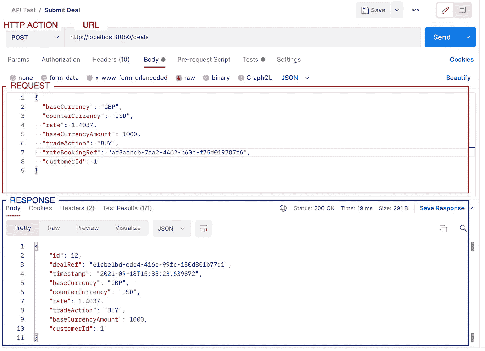

邮递员基本特征

# GitHub 知识库

Postman 高级特性的演练基于一个[外汇交易示例应用程序](/uplift-your-java-spring-boot-to-webflux-non-blocking-application-7b207999e669)。请随意查看 [GitHub 库。](https://github.com/gavinklfong/reactive-spring-forex-trade)

您也可以从[这里](https://github.com/gavinklfong/reactive-spring-forex-trade/tree/master/postman)下载 Postman 集合和环境定义文件，并在您的本地环境中使用 Postman 特性。

# 创建可重用的请求模板

正如您可能在下面的示例截图中观察到的，API 请求中有特定于环境的参数，比如请求 URL([http://localhost:8080](http://localhost:8080))和 API 密钥。如果我们需要在 SIT 或 UAT 等其他环境中测试相同的 API，该怎么办？当然，您需要手动编辑这些值或者复制 API 请求，以便在其他环境中执行测试。毫无疑问，在测试之前编辑 API 请求是非常烦人的，尤其是在有多个环境的情况下。

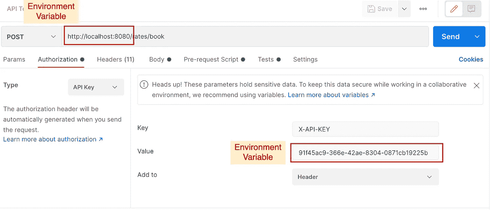

请求将参数转换为环境变量

通过将配置外部化到环境变量中，可以使 API 请求兼容所有环境。Postman 允许您用一组变量创建自己的环境列表。在这里，您可以看到为“本地开发”环境定义的基本 URL“base URL”和 API 键“API key”。

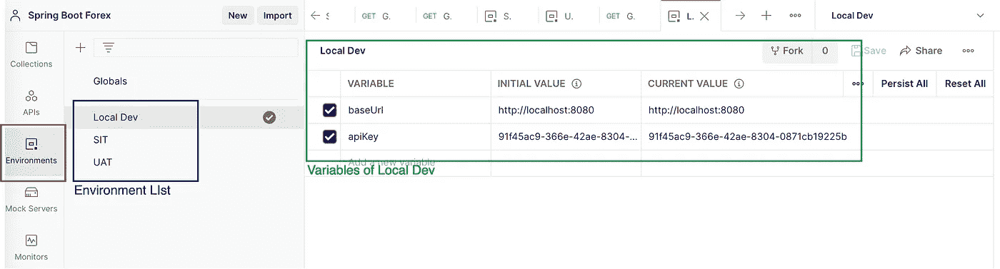

邮递员中的环境配置

要将变量应用于 API 请求，请用{{ <variable name="">}}格式的相应环境变量替换 URL 和 API 键。Postman 将自动为当前环境填充变量值。现在，您可以在不同的环境中测试 API 请求，只需在右上角的下拉列表中切换目标环境。</variable>

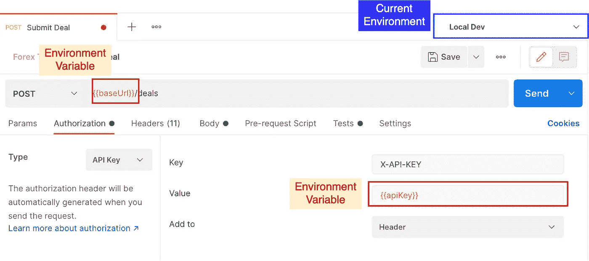

使用环境变量的 API 请求

同样的想法也适用于请求头和请求体。将字段值转换为变量将使配置请求值变得更加容易，特别是对于具有复杂 JSON 主体的 API 请求。

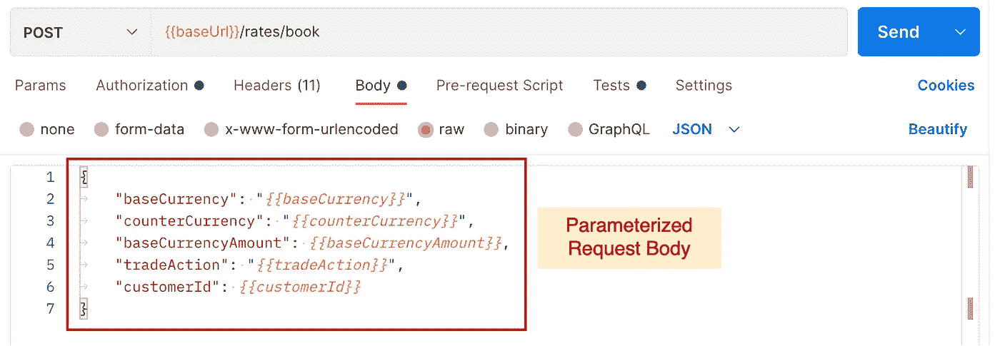

带有变量的 API 请求正文

无缝执行请求工作流

一个完整的业务用例将包含一个带有多个 API 请求的工作流。例如，下图说明了外汇交易提交的 API 请求工作流，其中包括 3 个 API 请求:

1.  预订外汇汇率
2.  提交带有预订参考的保留价格的交易
3.  通过引用检索交易并验证记录

您可以看到，步骤 2 和 3 依赖于前面步骤的响应。步骤 2 中的交易提交需要步骤 1 中的预订参考和预订价格，而步骤 3 中的交易查询需要步骤 2 中的交易参考。

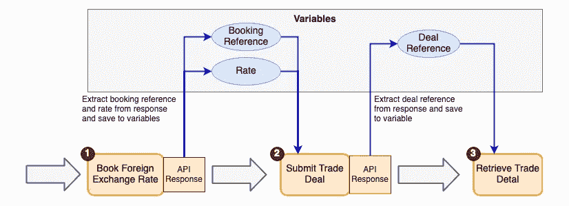

API 请求工作流

在 API 请求之间复制和粘贴字段值并逐个手动执行它们是低效且耗时的。如果工作流由许多 API 请求组成，您很容易迷路或者不小心混淆了字段值。

好消息是，可以使用 Postman 的测试脚本自动从 API 响应中提取数据字段。Postman 执行“测试”部分的 javascript 代码来验证 API 响应。除了断言之外，我们还可以利用这个特性提取响应数据并将值存储在变量中。

Postman 为响应数据提取提供了开发人员友好的 javascript API。下面的示例通过调用 pm.json()从 response 获取一个 JSON 对象，然后将预订参考“bookingRef”和预订价格“rate”保存到变量中。

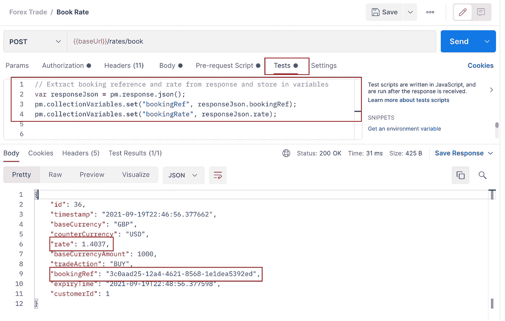

使用测试脚本提取响应数据

当测试脚本将值保存到集合范围的变量中时，您将在 API 请求执行完成时在 API 请求集合的“variables”部分中找到提取的值。如果你想知道更多关于变量在 Postman 中的用法，请看这个。

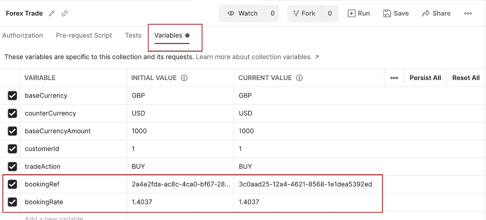

提取的响应数据保存在变量中

# 启用动态请求数据

有些场景需要生成动态请求数据，而不是对 API 请求使用静态数据。例如，外汇汇率登记请求的交易行为可以是卖出或买入。让我们创建一个带有随机交易行为的价格预订请求。

Postman 在 API 请求提交之前执行“请求前脚本”部分中的 javascript 片段。一个随机的交易动作被生成并存储在一个名为“trade action”的变量中，该变量包含在请求体中。

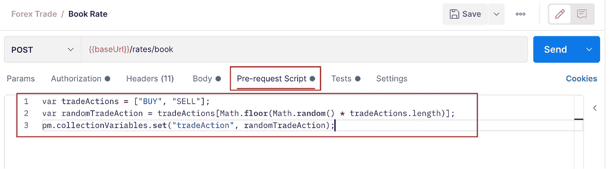

产生随机交易行为

当费率预订 API 请求被多次执行时，会生成具有不同交易行为的请求。其他请求参数(如货币和金额)也可以使用预请求脚本进行随机化。


带有随机交易动作的 API 执行

# 自动化请求执行

是时候将所有东西放在一起并自动化请求流的执行了。在集合中定义 API 请求工作流后，选择该集合，您将看到一个运行 API 请求工作流的按钮。

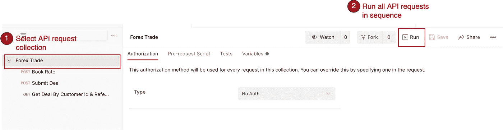

API 请求集合

Postman 将向您显示一个屏幕，其中列出了在所选集合下分组的 API 请求。它支持多种配置，如迭代次数和延迟。

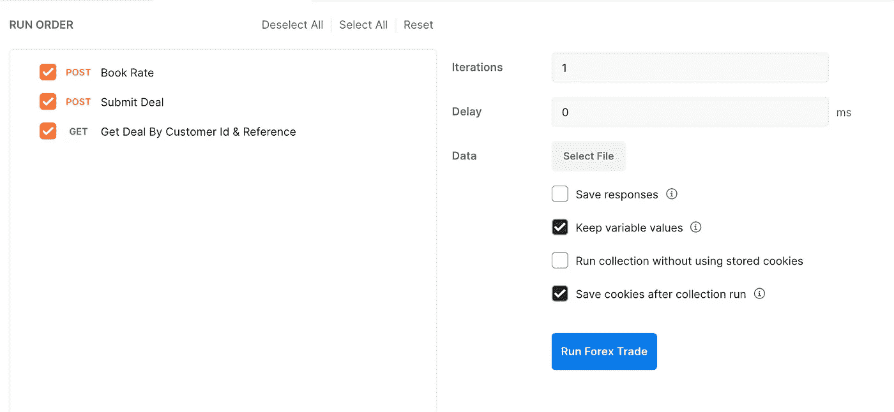

API 集合执行屏幕

测试完成后，结果屏幕会显示每个 API 请求的响应状态和响应时间。

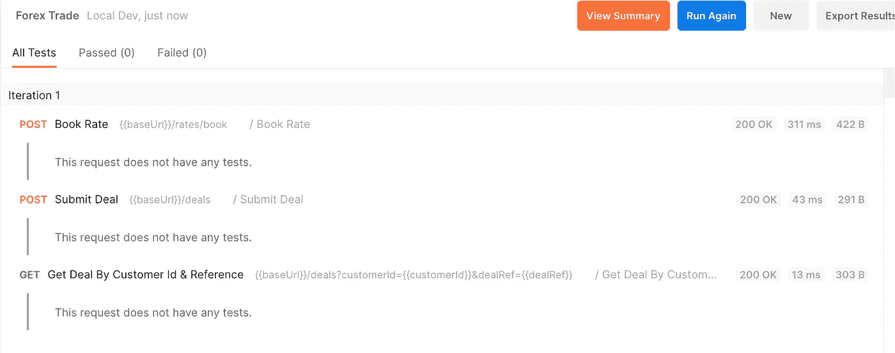

API 集合执行结果

最好实现一些验证规则，比如响应状态验证和响应数据断言。验证脚本可以放在每个 API 请求的“测试”部分。

此外，您可以为结果屏幕中的显示构建一个有意义的输出。Book Rate API 请求的测试脚本用货币对构造测试用例名称，用示例输出构造交易细节:

```
Currency Pair GBP/USD — BUY — GBP 1000 (Rate: 1.4037)
```

除了响应状态检查之外，交易交易检索 API 的测试脚本还断言检索到的交易引用与 API 请求中的交易引用相同。

现在，测试结果提供了更多信息。

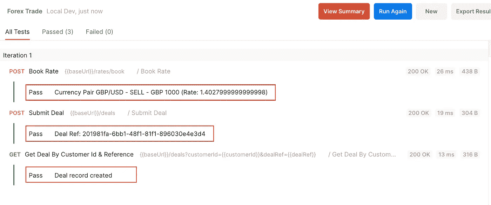

具有有意义输出的 API 集合执行结果

# 最后的想法

Postman 是 API 开发和测试的便捷工具。它不仅是 REST API 请求提交的简单助手，还是一个强大的工具，支持创建高度可重用的请求模板和 javascript 代码，用于请求数据生成和响应验证。Postman 中 API 请求工作流执行的自动化惊人地加快了手工 API 测试的速度。这些功能易于使用，您肯定会享受到生产力的提高。