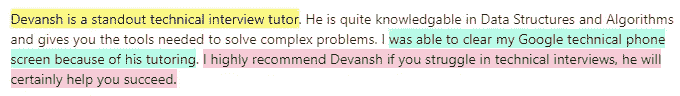

# 如何在编码面试中发现贪婪算法

> 原文：<https://blog.devgenius.io/how-to-spot-greedy-algorithms-in-your-coding-interviews-bd6e30b8630a?source=collection_archive---------3----------------------->

## 许多人努力处理这类问题

作为一个与成千上万试图通过编码面试的人一起工作过的人，我对人们最纠结的问题有一些见解。显然，个体差异是存在的，但有些话题比其他话题更容易让人迷惑。在这些主题中，贪婪算法是一个表面上看起来很容易理解的想法。然而，我的学生/读者不断告诉我，他们很难解决 Leetcode 问题，这些问题的解决方案中包含贪婪的算法。原因很简单- *很难发现贪婪算法何时会导致最佳解决方案*。所以我创建了一个框架来帮助你发现 Leetcode 问题中的贪婪算法。在这篇文章中，我将告诉你如何在 Leetcode 风格的编码面试/考试中发现贪婪的算法。我的读者从中受益匪浅，我相信你也一样。准备好赢得所有大型技术面试吧。

我分享的技术让很多开发者都得到了 w。

# 突出

这篇文章将涵盖以下观点-

1.  **什么造就了贪婪的算法**——贪婪的算法之所以贪婪，是因为它们没有向前看。他们会在当前点做出最佳决策，而不会考虑现在更差的选择是否会带来更好的结果。用数学术语来说，贪婪算法总是以经常错过全局最优值为代价来最大化局部最优值。
2.  **如何发现贪婪算法**——使用一个问题和考虑事项的列表，你可以有效地发现贪婪算法的问题。
3.  **如何做好这个-** 练习。大量的练习。

这篇文章将改变你的生活。准备好。

# 贪婪算法是由什么构成的？

我可以给你一个理论上的定义(我在重点部分做了一些)，但是你们大多数人不需要这个。如果你感兴趣的话，我可以在周一再做一次数学课，专门讨论贪婪算法的数学性质。所以，请欣赏这张我从维基百科上截取的可爱图片。

贪婪算法在人工智能和决策理论中大量出现。当情况非常复杂，有太多的因素需要考虑时，贪婪算法可能是一个很好的选择。旅行推销员问题就是一个很好的例子。然而，Leetcode 风格面试中的问题要简单得多，通常可以用贪婪算法来优化解决。那么，你如何发现一个问题是否适合贪婪的方法呢？让我们来看看。

爬山是传统的贪婪算法的例子。照片由[布莱克·齐克](https://unsplash.com/@blakecheekk?utm_source=medium&utm_medium=referral)在 [Unsplash](https://unsplash.com?utm_source=medium&utm_medium=referral) 上拍摄

# 如何识别贪婪算法？

我可以谈谈如何用数学证明一个问题是否贪婪。但是你们中的大多数人不需要在编码中这样做。我们将把它留给周一的数学课。

你可以用来发现贪婪算法的第一个提示是它们的[最优子结构属性](http://en.wikipedia.org/wiki/Greedy_algorithm)。如果你的问题可以分解成子问题，并且它们各自的最优解是整个问题最优解的一部分，那么贪婪算法就是一个可行的解。

[图片来源](https://www.researchgate.net/figure/Greedy-algorithm-for-minimization_fig1_226303975)

为什么会这样呢？回想一下我们是如何定义贪婪解决方案的。它会追求局部最优而不是全局最优。如果你所有子问题**的最优解**都是你的解的一部分，那么采取局部最优将导致全局最优解。

测试这一点的最好方法是带着你的问题，在小输入上模拟算法。这些将有助于你快速发现这个结构。

除此之外，还有一些指导性问题，可以帮助你发现贪婪的算法。考虑以下情况-

*   在某些时候，我可以在不同的选择中做出选择吗？贪婪算法是用来探索选项的。
*   这种选择会导致可以单独解决的子问题吗？
*   我是否能够利用子问题的解决方案推导出整体问题的解决方案？

这个讨论很有趣。它用更多的例子探讨了这里提到的观点。

# 如何变好

这是简讯中最无聊的部分。普通读者完全知道我要说什么。你将不得不在许多贪婪的问题上实现这个框架，来发展你对这个话题的直觉。

当你继续练习的时候，确保你分析了这些问题，以提高你对这个过程的舒适度。当你这样做的时候，你会发现你的技能变得越来越好。

如果你喜欢这篇文章，你会喜欢我的每日电子邮件简讯[技术使之变得简单](https://codinginterviewsmadesimple.substack.com/)。它涵盖了算法设计、数学、人工智能、数据科学、最近的技术事件、软件工程等主题，让你成为更好的开发人员。 [**我目前正在进行一整年的八折优惠，一定要去看看。**](https://codinginterviewsmadesimple.substack.com/subscribe?coupon=1e0532f2) 使用此折扣会降低价格-

***每月 800 印度卢比(10 美元)→ 533 印度卢比(8 美元)***

***每年 8000 印度卢比(100 美元)→6400 印度卢比(80 美元)***

[你可以在这里了解更多关于时事通讯的信息](https://codinginterviewsmadesimple.substack.com/about)

# 向我伸出手

使用下面的链接查看我的其他内容，了解更多关于辅导的信息，或者只是打个招呼。另外，查看免费的罗宾汉推荐链接。我们都得到一个免费的股票(你不用放任何钱)，对你没有任何风险。**所以不使用它只是在损失免费的钱。**

为了帮助我了解您[请填写此调查(匿名)](https://forms.gle/7MfQmKhEhyBTMDUD7)

查看我在 Medium 上的其他文章。https://rb.gy/zn1aiu

我的 YouTube:[https://rb.gy/88iwdd](https://rb.gy/88iwdd)

在 LinkedIn 上联系我。我们来连线:[https://rb.gy/m5ok2y](https://rb.gy/f7ltuj)

我的 insta gram:[https://rb.gy/gmvuy9](https://rb.gy/gmvuy9)

我的推特:[https://twitter.com/Machine01776819](https://twitter.com/Machine01776819)

如果你想在科技领域发展事业:[https://codinginterviewsmadesimple.substack.com/](https://codinginterviewsmadesimple.substack.com/)

获得罗宾汉的免费股票:[https://join.robinhood.com/fnud75](https://join.robinhood.com/fnud75/)