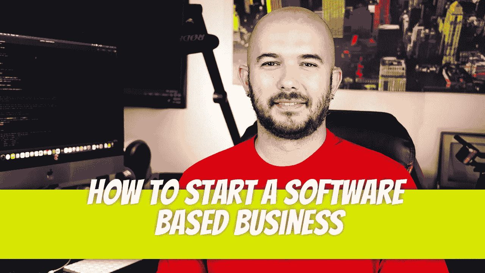

# 如何开始一个基于软件的业务

> 原文：<https://blog.devgenius.io/how-to-start-a-software-based-business-a613b7e16a97?source=collection_archive---------6----------------------->

你见过别人开发了一个应用程序，赚了几百万。你对自己说，“为什么不是我？我认为我有一个非常有创造力的头脑。让我想出一个价值 100 万美元的想法，让这个应用程序运行起来。”大多数人忘记的是，这仍然是一个**行业**，并且应该被如此对待。你的产品是一个软件。商业基本面仍然扮演着重要角色。

# **从软件产品的独特想法开始。**

创建一个成功的软件企业的第一步是为产品或服务提出一个原创的想法。这是你做生意最重要的，因为如果你没有独特的想法，那么就很难获得客户。

创意无处不在:博客、论坛和社交媒体网站上充斥着创意。但是不要只是去寻找想法；确保你要构建的东西能真正解决人们的问题，或者通过提高效率或沟通让他们的生活变得更轻松。在这个阶段，你需要花一些时间，真正了解这些问题是什么，这样当人们询问你的产品或服务时(他们会询问)，他们就会确切地知道为什么他们应该从你这里购买，而不是从其他人那里购买，他们有类似的产品/服务，但提供的价值不如你的好(因此不会销售)。

# **评估你的预算和资金选择。**

你必须评估你的预算和资金选择。

你需要多少钱来开始一个基于软件的生意？这将取决于你想做的工作类型，但一般来说，如果可能的话，最好以 5 万美元(或更多)的最低投资为目标。如果你刚刚起步，还没有任何客户，那么这可能就是你所需要的——但是一旦你获得了一些与他们相关的动力(例如，获得报酬),那么理想的情况是需要有足够的现金流进入企业，这样它就不会因为没有足够的来自客户/顾客的可用收入而破产。

你会从你的主要工作中为你的事业提供资金吗？SBA 贷款？银行贷款？众筹？风险投资？天使投资人？各有利弊。你需要坐下来理解。

# 制定你的商业计划。

开始你自己的软件开发业务的第一步是创建一个商业计划。一份好的商业计划将帮助你清楚地定义你公司的目标和目的，以及识别与实现这些目标相关的潜在风险和机会。编写软件开发商业计划的一个好方法是使用“SWOT 分析”方法——或者优势、劣势、机会和威胁(从外部来看)。

为了进一步发展这些概念:

*   优势——突出你在市场中的独特之处；例子包括有为客户建造高质量项目的经验或能够提供优秀的客户服务
*   弱点——指出竞争对手比你有优势的领域；例子包括没有足够的经验建设网站或没有一个有效的营销策略
*   机会——什么外部因素给了你的组织一个竞争分析？
*   威胁—哪些因素可能会对您的组织造成潜在危害？那些需要被识别。

也有很多关于构建商业计划的书籍。我最喜欢的一句话是:

 [## 成功的商业计划:秘密与策略

### 有史以来排名第一的商业计划指南。这个基本的一步一步的指导任何人启动或扩大…

amzn.to](https://amzn.to/3wl8eJ8) 

# **雇佣员工。**

招聘是开始软件开发业务最重要的步骤之一。没有人在船上，你就无法成功，所以你必须确保在雇佣第一批员工时，他们拥有适合他们工作的技能和经验。

雇佣优秀人才是每个企业家在职业生涯的某个阶段都会遇到的问题，即使他们事先做了计划，在选择一个看起来很适合这个职位的候选人之前雇佣了多个候选人(而不仅仅是因为运气好才申请的)。

这很重要，不仅因为雇佣某人意味着放弃对工作中事情如何运作的一些控制，还因为让某人做特定的任务将有助于降低成本，因为这消除了与让某人整天无所事事而无所事事相关的间接成本。

# **如有必要，安全承包商。**

如果你打算雇佣承包商，首先要做的就是定义你的需求。需要完成的关键任务有哪些？每个需要多少时间，平均有多少人完成？这个项目是否有任何需要解决的特殊要求(例如，截止日期)？一旦你有了需要做什么的想法，就该做一些研究了。

寻找承包商的最佳方式是通过口头传播或 LinkedIn 群组。还要留意像 Stack Overflow 和 Reddit 这样开发者出没的论坛；他们可能认识能帮你完成项目的人。

一旦你找到了潜在的候选人，重要的是不仅要让他们马上进入项目，还要管理他们的表现，使他们在整个开发阶段都达到预期——并且不要在完成日期之前筋疲力尽。

# **设计和开发你的软件产品。**

设计是软件开发过程的关键部分。这不仅仅是关于你的产品的外观和感觉，也是关于它是如何工作的。设计一个应用可以是一个迭代的过程，你从一个想法开始，在用户身上测试，然后根据反馈做出改变。这很重要，因为没有哪两家公司会以完全相同的方式进行设计；一些人可能更关注用户体验，而另一些人可能更关注技术方面，如性能或安全措施。

设计软件产品涉及到一个团队中许多不同的技能:为屏幕创建图像的图形设计师；设计用户和屏幕之间交互的 UI/UX 设计师；在屏幕后面编写代码的工程师；QA 测试人员，他们检查一旦部署到生产环境(如云服务)中，一切都按预期工作。

# 制作营销材料来推广你的业务。

一旦你的生意开始运转，是时候开始推广了。这里有一些方法可以做到这一点:

*   社交媒体营销是宣传你的产品或服务并建立一个信任和欣赏你所提供的用户社区的好方法。这可以通过不同的方式实现:通过创建 Twitter 账户、LinkedIn 群等等；在热门网站上发帖；制作 YouTube 视频；写博文；建立登录页面，更多地解释为什么他们应该使用他们销售的产品/服务；等等..
*   电子邮件营销——定期发送包含促销内容的电子邮件是新客户或现有客户的一种简单方式，他们尚未购买任何东西，但如果每周/每月的收件箱中有有趣的内容，他们可能会很快购买其他东西

# **为你的企业建立一个网站。**

开始软件开发业务的第一步是建立一个网站。一个好的网站会帮助你为你的公司创建一个在线的形象，但是它也会给那些寻找像你这样的服务的人一个找到你的方法。

建立这个网站的最好方法是使用 WordPress，它从 2000 年就已经存在，并且仍然是当今最流行的内容管理系统之一。如果你不知道在你自己的电脑或服务器上安装或管理 WordPress 网站有多容易(或者如果没有足够的时间)，那就投资雇佣一个会做的人。

# **建立一个软件开发企业可能很复杂。**

软件开发是一个复杂的领域。对于拥有正确想法和对行业了解的企业家来说，这是一个令人兴奋的机会。

软件开发是一个不断发展的领域，如果你有合适的技能组合，它会是有利可图的。但这也很有挑战性，因为有太多不同类型的项目需要团队成员的各种技能组合——有时这些技能组合并不总是匹配得很好。

迪诺·卡伊奇目前是 [LSBio(生命周期生物科学公司)](https://www.lsbio.com/)、[绝对抗体](https://absoluteantibody.com/)、 [Kerafast](https://www.kerafast.com/) 、[珠穆朗玛生物](https://everestbiotech.com/)、[北欧 MUbio](https://www.nordicmubio.com/) 和 [Exalpha](https://www.exalpha.com/) 的 IT 主管。他还担任我的自动系统的首席执行官。他有十多年的软件工程经验。他拥有计算机科学学士学位，辅修生物学。他的背景包括创建企业级电子商务应用程序、执行基于研究的软件开发，以及通过写作促进知识的传播。

你可以在 [LinkedIn](https://www.linkedin.com/in/dinocajic/) 上联系他，在 [Instagram](https://instagram.com/think.dino) 上关注他，[访问他的博客](https://www.dinocajic.com/)，或者[订阅他的媒体出版物](https://dinocajic.medium.com/subscribe)。

阅读 Dino Cajic(以及 Medium 上成千上万的其他作家)的每一个故事。你的会员费直接支持迪诺·卡吉克和你阅读的其他作家。你也可以在媒体上看到所有的故事。