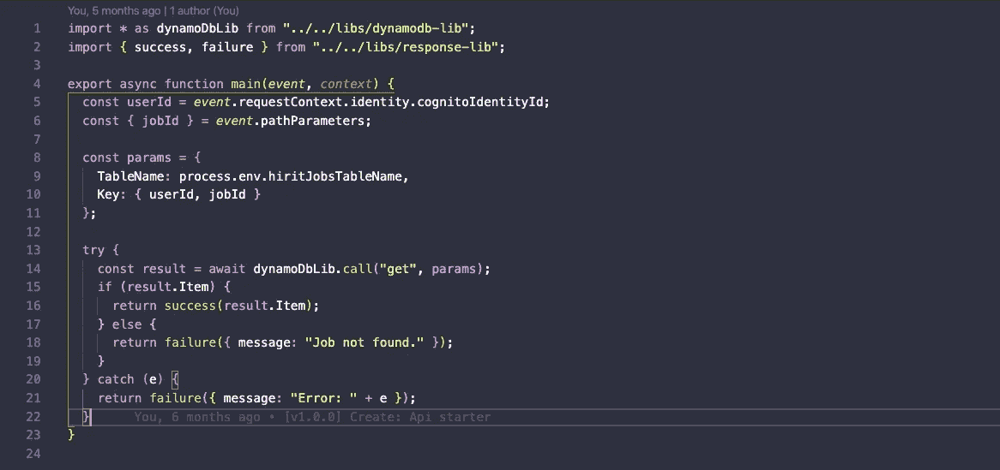
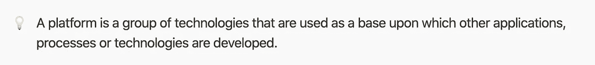
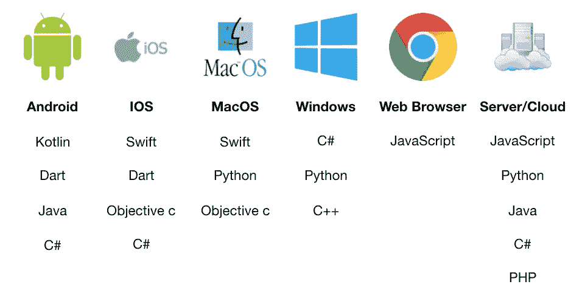
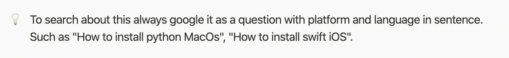
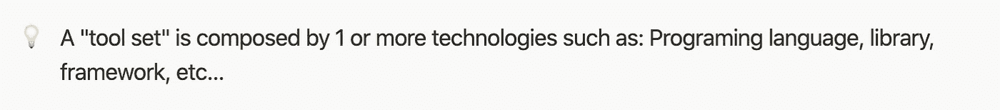

# 如何开始编码？知道自己想做什么的重要性。

> 原文：<https://blog.devgenius.io/how-to-start-coding-choosing-a-platform-and-a-programing-language-954f81dbb633?source=collection_archive---------16----------------------->

## 选择平台和编程语言。

后端-Lambda 函数-JavaScript-Snippet。

出于个人原因，我们都对软件开发产生了兴趣，比如我们想创造下一个伟大的应用程序，我们听说工资很高，我们想在任何地方自由工作等等。

大多数时候，我们为实现目标而增长的激情会逐渐消失，因为我们不知道如何回答“我从哪里开始学习？”或者最重要的是“我到底应该学什么？”。

所以，我来帮你解答这些问题。但首先，你可能会问自己，我为什么要相信这个人？

嗨！我是 Luis，我已经做了 6 年多的开发人员和开发经理，从初创公司到大型科技公司。我的专业是计算机科学，我真的很难适应大学和他们给出的过于复杂的解释。现在我知道这并不像他们想象的那么难，我将通过这篇文章和下一篇文章与你分享我希望他们当时教给我的东西。

**那么我们开始吧！**

首先，你需要问自己“你想要建立什么？”

为了回答这个问题，我将向您展示人们构建软件的顶级平台及其编程语言。

机器人

一个存在于电话、手表、汽车以及诸如冰箱、烤箱、吸尘器等智能设备中的操作系统。

ios

苹果手机和平板电脑中的操作系统。

马科斯

Mac 电脑中的操作系统。

Windows 操作系统

一个存在于世界上大多数电脑和一些智能设备中的操作系统。

网络浏览器

存在于 Android、iOS、macOS、Windows 设备中的应用程序。

服务器/云

为其他程序或设备提供功能的计算机程序或设备。

所以…如果你想发展:

*   移动应用你应该分别选择 Android 或 iOS 平台及其一种编程语言。
*   网络应用程序的“前端”意味着我们在浏览器上看到的东西，你应该选择 Javascript。
*   桌面应用你应该分别选择 MacOs 或 Windows 平台及其一种编程语言。
*   如果你想开发“后端”,也就是应用程序的大脑，你应该选择服务器/云以及它的一种编程语言。

我强烈建议选择这 6 个平台中的一个和它的一种语言开始。“我该选哪一个”的正确答案完全取决于你和你想要达到的目标。

如果你担心每个人代表的钱，工资方面，你不应该担心你的选择，因为每个人都有很多工作，报酬实际上是基于你对平台开发工具的专业知识水平，而不是什么。

那么…你选好了吗？如果没有，我会建议你推迟阅读，因为如果你头脑不清楚，你会失去注意力，试图承担太多，要成为一名伟大的开发人员，必须涵盖很多内容。这意味着如果你没有一个清晰的路径，你将会浪费很多时间去寻找错误的东西。

如果你已经下定决心，那么恭喜你，我将向你展示一个真正的总结路径，告诉你为了实现你的目标，你需要学习什么，以及一些在这个过程中让你头脑清晰的提示。

1.  阅读你选择的编程语言。
2.  安装 IDE 或代码编辑器。
3.  安装编程语言和工具。
4.  用真实代码练习所有编程基础。
5.  了解您选择的平台。
6.  阅读该平台的开发工具。
7.  安装平台开发工具。
8.  设定一个个人项目或跟随一个教程去创造一些东西。
9.  阅读框架。
10.  安装框架。
11.  了解图书馆
12.  选择对您的项目有帮助的库并实现它们。

这些步骤与您的个人目标相关，因此可能会因情况而异。但是我强烈建议你按照我说的去做。当我个人学习的时候，有几年时间我到处跑，但是一旦我开始在学习新技术时遵循这些步骤，它们明显地改善了我的学习曲线。

暗示

1.  所有软件都在一个平台上运行。
2.  该平台决定了您将使用的工具集，以便创建在其上运行的软件。
3.  一些平台可能有不同的工具集来实现相同的软件，但这并不意味着它会有相同的性能或含义。
4.  为了确定工具集中的元素，我们需要做如下工作:首先，我们选择编程语言，其次，我们选择框架，再次，我们选择库，然后我们可以根据需要添加技术。

我计划创建一个完整的指南，涵盖我提到的六条路径中的一条或两条。我很高兴听到社区对哪一个更感兴趣，所以如果有任何疑问和建议，请随时给我发电子邮件。

leadluiss@gmail.com。