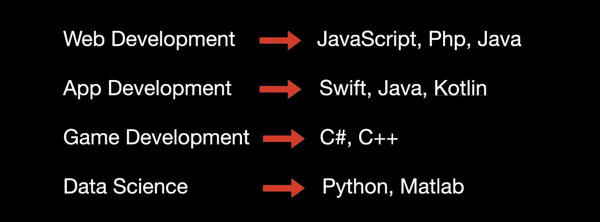
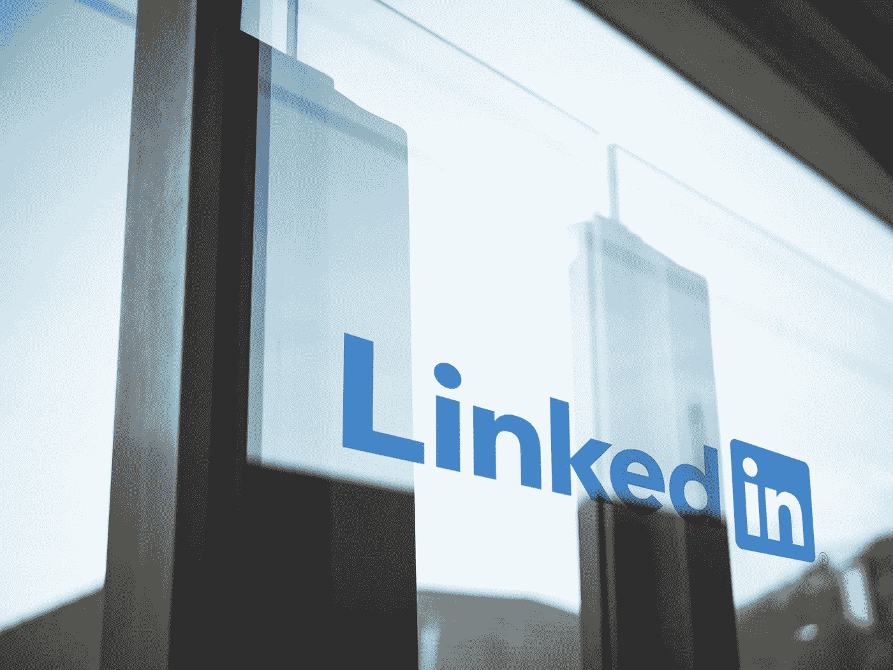
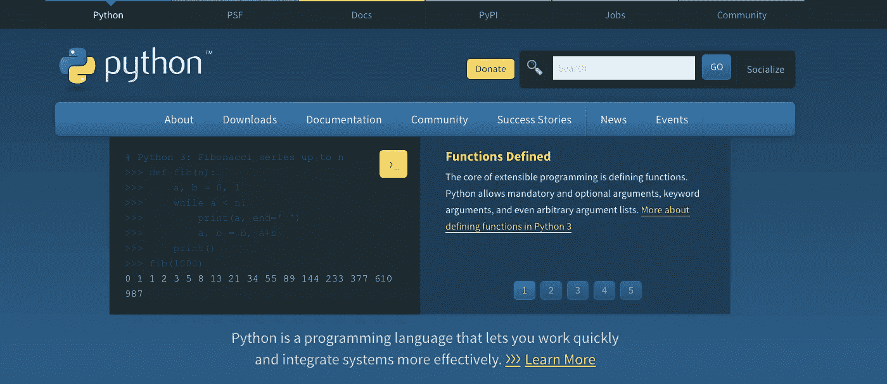
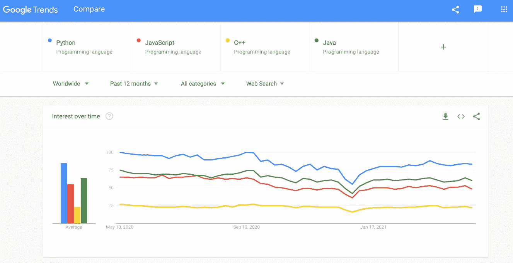

# 2021 年如何开始学习编码(适合初学者)？

> 原文：<https://blog.devgenius.io/how-to-start-to-learn-coding-in-2021-for-beginners-911a402711f8?source=collection_archive---------3----------------------->

照片由 [Fotis Fotopoulos](https://unsplash.com/@ffstop?utm_source=medium&utm_medium=referral) 在 [Unsplash](https://unsplash.com?utm_source=medium&utm_medium=referral) 上拍摄

你想学编码，却不知道从何入手？哪种编程语言最适合初学者？这些是初学者和学生问得最多的问题。

在这篇文章中，我将回答这些问题，帮助你轻松开始你的编程之旅。在这篇文章的最后，我还会推荐一些学习编程的最佳在线资源。

# 如何开始学习编程？

事实是所有的编程语言都是相似的。所以如果你不能决定从哪种语言开始，我说这应该是你的第二步。

第一步应该专注于学习编程的基础知识，例如:

*   如何打印您的第一个输出？(“hello world”示例)
*   什么是数据类型，如何存储它们？(字符串、数字、数组)
*   条件语句(if-else 情况)
*   函数的概念(如何创建和执行函数)

所以一旦你理解了编程的这些主要概念，以后你就可以选择学习任何你想学的编程语言。

# 哪种编程语言最好？

所以接下来重要的问题是，哪种编程语言最适合初学者？我会给你一个名字，但在此之前，我有两个重要的提示。

## 第一条建议:找到你的激情

软件工程有不同的职业道路(从 Web 开发到 AI &机器人)。

如果你还不知道[你想走哪条职业道路](/6-career-paths-roles-in-software-engineering-you-can-choose-in-2021-dd2eb70960b0)那很好，但是如果你有一些想法，那么它可以帮助你决定正确的编程语言。

下面你可以看到一些编程语言的例子，它们被用于编程的各个领域:

每个领域使用不同的编程语言。所以，如果你能先找到你的兴趣，那么你就能做出更好的选择，从适合你的语言开始。

## 第二个建议:搜索市场

现在是第二个建议:搜索市场。是的，你的热情很重要，但是工作机会也很重要。

基于你所在的位置，你应该对你将来考虑申请的潜在职位空缺有一个概念。要找到这类信息， [LinkedIn](https://www.linkedin.com/) ， [Glassdoor](https://www.glassdoor.com/) ，或者[的确](https://www.indeed.com/)都是不错的地方。

如果你在就业市场上做一点搜索，通常今天你可以找到一个网页开发或应用程序开发的工作，即使是远程的，也比游戏开发容易得多。

由于这些领域的市场上有更多的空缺职位，你不会想去选择像游戏开发这样竞争激烈的领域，因为它缩小了你的选择范围，并使初学者很难找到工作。

但是在你职业生涯的后期，当你作为一名软件开发人员工作了几年后，你可以随时转换你的领域。

好了，现在来回答这个问题:初学者学习哪种编程语言最好？

# 选择 PYTHON

[Python 官网](https://www.python.org/)

我个人的想法是，你选择哪种编程语言并不重要，因为最终它们都是相似的。

因此，如果你已经决定从 C++、Java 或 JavaScript 开始，那完全没问题。但是如果你是一个完全的初学者，绝对没有编码的想法，那么我个人推荐会是 Python。

Python 是一种高级的面向对象的编程语言，具有初学者友好的语法，根据[谷歌趋势](https://trends.google.com)，Python 是当今最流行的编程语言:

Python 也可以被不同职业的人使用。很多领域都使用 Python，例如:

*   数据科学
*   人工智能和机器学习
*   Web 开发
*   移动应用程序开发

Python 一年比一年流行，对于初学者来说开始学习编码也是很棒的。

# 学习编码的免费在线资源

我推荐的这些资源是完全免费的，您不必为它们支付任何费用，第一个是:

## 自由代码营

FreeCodeCamp 是最大的完全免费学习代码的平台之一。因此，当你访问 freecodecamp.org[时，你会发现一个巨大的编程语言、框架等库。](https://www.freecodecamp.org/)

此外，FreeCodeCamp 提供了无需任何配置即可编写您自己的代码的环境，当您完成全部课程后，您将获得认证。FreeCodeCamp 也有一个论坛,所以如果你被困在某个地方，你可以提出你的问题。

## 油管（国外视频网站）

另一个免费学习编程的好平台是 YouTube。你可以在 YouTube 上找到无穷无尽的关于任何你想要的编程语言的教程视频。

观看教程也是学习编程的另一个好方法，有些人喜欢通过观看在线编码教程来学习。

## StackOverflow

第三个免费在线资源是 [StackOverflow](https://stackoverflow.com/) 。StackOverflow 是一个基于问答的网站，供软件开发人员学习和分享经验。

如果你有问题，你可以在这个网站上搜索，寻找答案。但是如果问题还不存在，那么你可以自己发布，StackOverflow 上的其他人会回答。

无论你选择哪种方法或资源，记住学习编程并不容易，需要花费很多时间，尤其是如果你是一个完全的初学者。

所以这些是我能给你的在编程世界中轻松起步的建议。如果你想了解更多关于软件开发的知识，欢迎[在 YouTube 上关注我](https://www.youtube.com/channel/UC1EgYPCvKCXFn8HlpoJwY3Q)并订阅[我的时事通讯](https://bit.ly/2KXEBsv)。

感谢您的阅读！