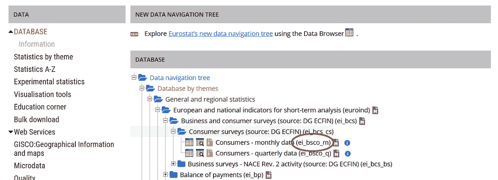
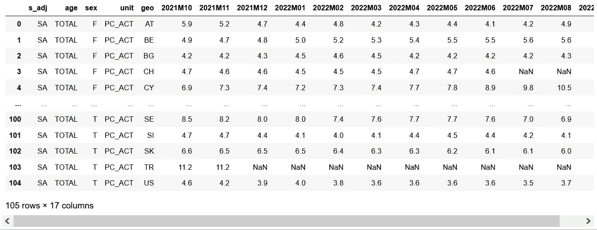
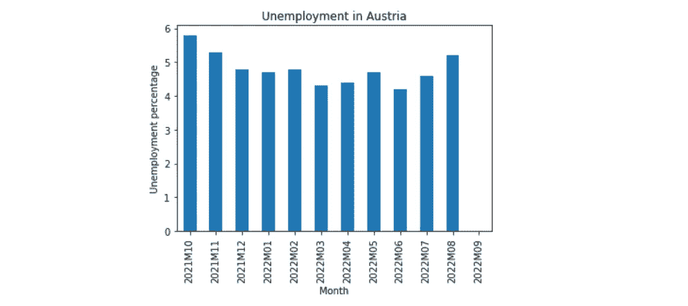
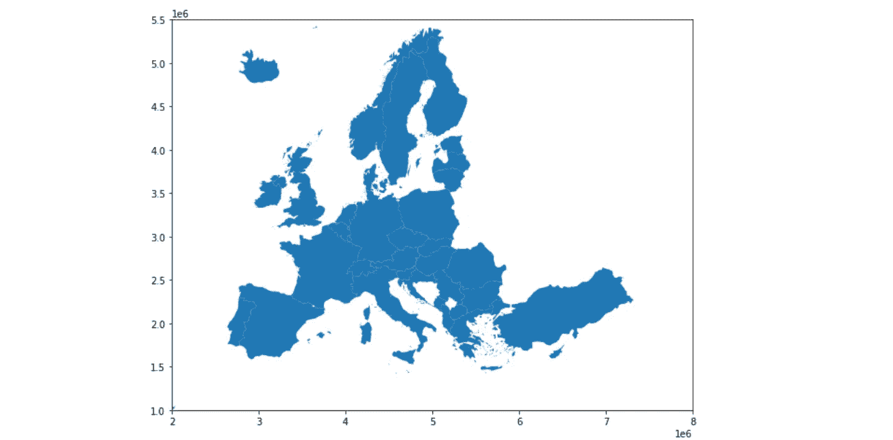
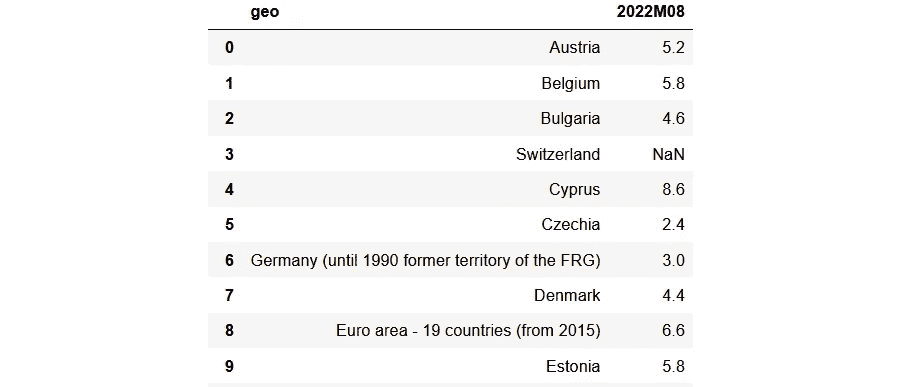

# 如何开始使用欧盟统计局的欧洲统计数据

> 原文：<https://blog.devgenius.io/how-to-start-using-eurostat-statistical-data-on-europe-a7a847c27dbc?source=collection_archive---------16----------------------->

欧统局是欧洲统计的主要切入点。本文将帮助您快速学习如何使用 Python 中的数据。


照片由[卢克·切瑟](https://unsplash.com/@lukechesser?utm_source=medium&utm_medium=referral)在 [Unsplash](https://unsplash.com?utm_source=medium&utm_medium=referral) 拍摄

欧盟统计局是欧盟的统计机构。他们的任务是提供欧洲的统计数字和数据。所有的数据都可以浏览和下载。你可以在这里浏览他们完整的数据库。本文的最终代码可以在我的 GitHub 上以 [easy_eurostat 包](https://github.com/lmeulen/EasyEuroStat)的形式获得。

## 数据集

所有表格都可以通过它们的识别码下载。此代码显示在数据库浏览器中数据集名称后面的括号中。请看下图中的红圈。下载的文件是 gzipped tar 格式的，包含一个制表符分隔的数据文件。



红圈表示数据集 ID(作者截图)

使用数据集识别码，可以从 URL 下载带有参数`file=data/dataset.tsv.gz`的格式`https://ec.europa.eu/eurostat/estat-navtree-portlet-prod/BulkDownloadListing`的数据集:

```
import os
import gzip
import urllib.requestdef download_eurostat_dataset(dataset):
    url = "[https://ec.europa.eu/eurostat/" + \
          "estat-navtree-portlet-prod/" + \
          "BulkDownloadListing?file=data/](https://ec.europa.eu/eurostat/estat-navtree-portlet-prod/BulkDownloadListing?file=data/)" + \
          dataset + ".tsv.gz"
    out_file = os.path.join("cache", dataset + ".tsv")
    if os.path.exists(out_file):
        return
    try:
        with urllib.request.urlopen(url) as resp:
            with gzip.GzipFile(fileobj=resp) as data:
                file_content = data.read() # Write to file in binary mode 'wb'
        with open(out_file, 'wb') as f:
            f.write(file_content)
    except Exception as e:
        print(e)download_eurostat_dataset("teilm020")
```

这个例子下载数据集`teilm020`(失业数字)并将制表符分隔的文件存储在缓存目录中。数据集保存在磁盘上，因此可以用作欧盟统计局数据库的缓存版本。gzipped 文件加载到内存中，并在写入前解压缩。在这种情况下，由于数据集的大小有限，在内存中工作不成问题。

存储的文件是制表符分隔的格式，除了第一列是逗号分隔的(让我们不要让它太容易)。深入研究 CSV 导入函数的工作方式，可以发现一种复杂的方式来接受逗号和制表符作为分隔符。因此，要将数据集加载到 Pandas 数据帧中，我们可以使用以下代码:

```
def get_eurostat_dataset(dataset):
    download_eurostat_dataset(dataset)
    df = pd.read_csv(os.path.join("cache", dataset + ".tsv"),
                     sep=",|\t| [^ ]?\t", na_values=":",
                     engine="python")
    df.columns = [x.split('\\')[0].strip(' ') for x in df.columns]
    return dfdf = get_eurostat_dataset("teilm020")
```

从周围的空格中清除列名(有时在列名的末尾有一个空格)，最后一列有一个后缀“\time”，表示后面的列是时间序列。这个后缀也被删除。

产生的数据帧如下:



失业数据的数据框架(作者截图)

## 字典

前五列是代码，指代码列表。这些代码清单(字典)可以在欧盟统计局网站上的[这里](https://ec.europa.eu/eurostat/estat-navtree-portlet-prod/BulkDownloadListing?sort=1&dir=dic%2Fen)找到。列名等于该位置的`.dic`文件的名称。该文件包含由制表符分隔的键/值对。*键*是缩写，*值*是全文。在数据集中，编码列是第一个不是用制表符分隔而是用逗号分隔的列。遍历这些列名，我们可以用文本值逐个替换它们。

为了用它们的值替换代码，我们需要从 Eurostat 加载字典文件，并将其导入字典:

```
def download_eurostat_dict(dictionary):
    dictionary = dictionary.lower()
    url = "[https://ec.europa.eu/eurostat/" + \
          "estat-navtree-portlet-prod/BulkDownloadListing" + \
          "?sort=1&downfile=dic%2Fen%2F](https://ec.europa.eu/eurostat/estat-navtree-portlet-prod/BulkDownloadListing?sort=1&downfile=dic%2Fen%2F)" +\
          dictionary + ".dic"
    out_file = os.path.join("cache", dictionary + ".dic")
    if os.path.exists(out_file):
        return
    try:
        with urllib.request.urlopen(url) as resp:
                file_content = resp.read().decode('utf-8')
        with open(out_file, 'w') as f:
            f.write(file_content)
    except Exception as e:
        print(e)

def get_eurostat_dictionary(dictionary, inverse=False):
    download_eurostat_dict(dictionary)
    filename = os.path.join("cache", dictionary + ".dic")
    try:
        with open(filename) as f:
            d = {}
            for line in f:
                if len(line) > 1:
                    row = line.split('\t')
                    d[row[0]] = row[1].strip()
        if inverse:
            d = {v: k for k, v in d.items()}
        return d
    except:
        return {}
```

与数据集一样，副本被下载到用作缓存的本地文件夹中。不同之处在于，字典文件没有压缩，可以下载后存储。

字典文件每行包含一个由制表符分隔的键/值对。一些字典文件在每个键/值对之间包含一个空行，因此需要检查行长度以跳过空行。该值从' \n '字符中去除。

有了字典，数据帧中的代码可以被替换。Panda dataframe 有一个特定于此功能的方法`replace()`。当在以字典作为参数的列上调用它时，该列中的所有值都将被替换为与当前列值相关联的值作为键。

## 替换代码

`get_eurostat_dataset`方法扩展了用值替换代码列键的功能:

```
def get_eurostat_dataset(dataset):
    download_eurostat_dataset(dataset)
    df = pd.read_csv(os.path.join("cache", dataset + ".tsv"),
                     sep=",|\t| [^ ]?\t", na_values=":", 
                     engine="python")
    df.columns = [x.split('\\')[0].strip(' ') for x in df.columns]
    # Now get the dictionary columns (first line, comma sep)
    with open(os.path.join("cache", dataset + ".tsv")) as f:
        first_line = f.readline()
    codes = first_line.split('\t')[0].split('\\')[0].split(',')
    # Replace codes with value
    for c in codes:
        code_list = get_eurostat_dictionary(c)
        df[c] = df[c].replace(code_list)
    df = df.set_index(codes).transpose()
    return df
```

在返回之前，数据帧被转置，所有代码列都是多级列索引的一部分。起初，这似乎很复杂，但数据框架变得更容易使用。

读取相同的数据集现在会导致:


更新的数据框架(作者截图)

## 从数据集到图表

访问和使用多索引列的工作方式如下:

```
>>> # Get names of all levels
>>> print(df.columns.names)['s_adj', 'age', 'sex', 'unit', 'geo']>>> # Obtaining all unique values for level 2 ('sex')
>>> print(df.columns.get_level_values(1).unique())Index(['Females', 'Males', 'Total'], dtype='object', name='sex')>>> #Selecting unemployment data for all sexes combined
>>> df.loc[:, ('Seasonally adjusted data, ...',
               'Total', 
               'Total',
               'Percentage of population in the labour force')]
```

因此，以创建奥地利失业数据的条形图为例:

```
d = df.loc[:, ('Seasonally adjusted data, not calendar adjusted' +\
               ' data','Total', 'Total',
               'Percentage of population in the labour force')]
ax = d['Austria'].plot.bar()
ax.set_title('Unemployment in Austria')
ax.set_xlabel('Month')
_ = ax.set_ylabel('Unemployment percentage')
```

导致



奥地利失业率(作者截图)

因此，现在我们知道如何从欧盟统计局下载和准备数据，并使用它来创建图表。所有数据集都包含每个国家的数据，因此下一步是制作一个 choropleth 地图。

## 等值区域图

欧盟统计局还提供了地理数据。该地理数据包含国家边界、地区边界、城市等。详细程度称为 NUTS，NUTS 级别 0 是国家级别。通过增加这个数字，可以添加更多的细节，但是现在级别 0 已经足够了:

```
import geopandas as gpddef download_url(url, filename, binary=False):
    if os.path.exists(filename):
        return
    try:
        with urllib.request.urlopen(url) as resp:
                file_content = resp.read()
                if not binary:
                    file_content = file_content.decode('utf-8')
        with open(filename, 'wb' if binary else 'w') as f:
            f.write(file_content)
    except Exception as e:
        print(e)def download_eurostat_geodata():
    url = "[https://gisco-services.ec.europa.eu/distribution/v2/" +\
          "nuts/shp/NUTS_RG_20M_2021_3035.shp.zip](https://gisco-services.ec.europa.eu/distribution/v2/nuts/shp/NUTS_RG_20M_2021_3035.shp.zip)"
    out_file = os.path.join('data', 
                            'NUTS_RG_20M_2021_3035.shp.zip')
    download_url(url, out_file, binary=True)
```

我们使用比例为 1:20mio 的`RG_20M`文件。如果需要更多细节，还有 1:10mio、1:3mio 和 1:1mio 文件可供选择。替换文件名中的`20M`以下载另一台秤，例如 1:10 米欧秤的`10M`。

下载的 zip 文件包含一个[地理空间形状文件](https://en.wikipedia.org/wiki/Shapefile)。ESRI 的这种文件格式是矢量化地理空间数据最常见的格式。它由表示地理空间项目(国家、道路等)的点、线和多边形组成。所有项目都可以有与之关联的属性。

Geopandas 包能够打开这个 zip 文件:

```
def get_eurostat_geodata(lvl=0):
    download_eurostat_geodata()
    borders = gpd.read_file(os.path.join('data', 
                            'NUTS_RG_20M_2021_3035.shp.zip'))  
    return borders[borders['LEVL_CODE'] == lvl]
```

生成的数据帧如下所示。`geometry`列包含地理空间项目，在本例中，它们都是多边形(`MULTIPOLYGON`)。其他列是属性。


Geopandas 数据框架内容(作者截图)

为了检查数据帧的内容，我们可以用内置的`plot()`方法绘制它。

```
countries = get_eurostat_geodata()ax = countries.plot()
ax.set_xlim(2000000, 8000000)
ax.set_ylim(1000000, 5500000)
```

这导致了欧洲的一个阴谋:



欧洲示例图(作者截图)

x 和 y 限制裁剪掉了像加那利群岛这样遥远的部分。

当`plot()`参数`column`被指定时，一个 choropleth 映射被创建。该列用于根据该列的值对国家/地区进行着色。首先，我们必须把失业数据框架和国家数据框架结合起来。国家数据框架使用国家缩写作为标识。这个缩写在包含国家全称的失业数据的导入阶段被删除。地理词典用于反向翻译。

```
d = df.loc[:, ('Seasonally adjusted data, not calendar adjusted' +\
                ' data','Total', 'Total',
                'Percentage of population in the labour force')]
d = d[d.index == '2022M08'].transpose().reset_index()
code_list = get_eurostat_dictionary('geo', inverse=True)
d['geo'] = d['geo'].replace(code_list)
d = countries.merge(d, right_on='geo', left_on='NUTS_ID')
```

首先，像以前一样过滤失业数据(所有性别的总人数)。选择 2022 年 08 月是因为它是包含所有国家数据的最后一行。此后，数据帧被转置，导致



每个国家的失业率(作者截图)

`geo`字典用于将国家名称翻译回它们的缩写。

失业数据和国家数据现在可以合并了。确保将失业数据合并到国家数据中，以确保生成的数据框确实是能够绘制地图的 GeoPandas 数据框。国家代码在`countries`数据框的`NUTS_ID`栏中。绘制 choropleth 图的最终代码是

```
ax = d.plot(column='2022M08', legend=True)
ax.set_xlim(2000000, 7000000)
ax.set_ylim(1000000, 6000000)
ax.set_title('Unemployment in the European Union')
```

导致


欧洲失业地图(作者截图)

恭喜你！现在，您已经拥有了使用欧盟统计局开放数据的所有工具，包括创建图表和地图。

## easy_eurostat 软件包

我已经根据上面的代码创建了一个包。代码得到了更好的重用，并且添加了一些易于使用的方法参数。一个例子是用于`download_eurostat_data`方法的 de `transpose`参数。上面的代码显示，在下载过程中，表被转置，但它需要另一个转置，撤销第一个转置，以将其用于映射目的。布尔`transpose`参数定义是否在方法中执行转置。

所有代码在我的 GitHub 上都有 [easy_eurostat 包](https://github.com/lmeulen/EasyEuroStat)。按需随意使用。

使用这个包实现的这篇文章的例子:

```
from easy_eurostat import get_eurostat_geodata, get_eurostat_dataset# Plotting the Austrian unemployment numbers over time
df = get_eurostat_dataset("teilm020")
d= df.loc[:, ('Seasonally adjusted data, not calendar adjusted' +\
                ' data','Total', 'Total',
                'Percentage of population in the labour force')]
ax = d['Austria'].plot.bar()
ax.set_title('Unemployment in Austria')
ax.set_xlabel('Month')
_ = ax.set_ylabel('Unemployment percentage')# Making a choropleth map of unemployment numbers in Europe
df = get_eurostat_dataset("teilm020", replace_codes=True,
                          transpose=False, keep_codes=['geo'])
df = df[(df['age'] == 'Total') & (df['sex'] == 'Total')]df = pd.merge(countries, df, left_on='NUTS_ID', right_on='geo')
ax = df.plot(column='2022M08', legend=True)
ax.set_xlim(2000000, 7000000)
ax.set_ylim(1000000, 6000000)
ax.set_title('Unemployment in the European Union')
```

# 最后的话

我希望你喜欢这篇文章。要获得更多灵感，请查看我的其他文章:

*   [用 Python 总结一段文字](https://towardsdatascience.com/summarize-a-text-with-python-b3b260c60e72)
*   [F1 分析和 Python 入门](https://medium.com/p/5112279d743a)
*   [太阳能电池板发电分析](https://towardsdatascience.com/solar-panel-power-generation-analysis-7011cc078900)
*   [对 CSV 文件中的列执行功能](https://towardsdev.com/perform-a-function-on-columns-in-a-csv-file-a889ef02ca03)
*   [根据活动跟踪器的日志创建热图](https://towardsdatascience.com/create-a-heatmap-from-the-logs-of-your-activity-tracker-c9fc7ace1657)
*   [使用 Python 的并行 web 请求](https://towardsdatascience.com/parallel-web-requests-in-python-4d30cc7b8989)

所有的故事都可以在我的个人资料中找到。如果你喜欢这篇文章或我的任何其他文章，请点击下面的按钮！

*免责声明:本文包含的观点和看法仅归作者所有。*