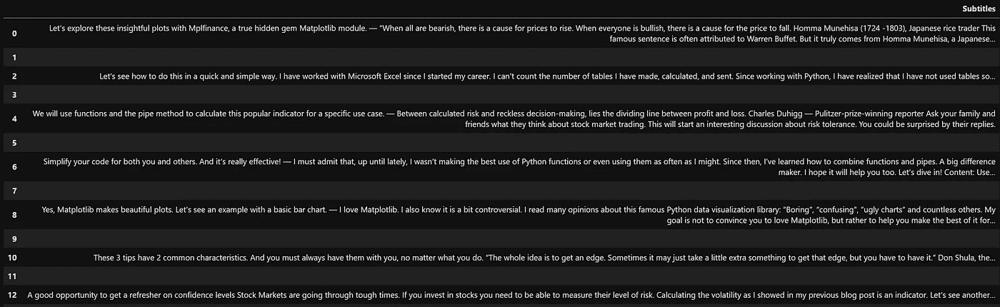

# 如何启动网页抓取数据并将其打印在表格中

> 原文：<https://blog.devgenius.io/how-to-start-web-scraping-data-and-print-it-in-a-table-9fd10525d49d?source=collection_archive---------3----------------------->

## 我们的用例是用 BeautifulSoup 从 Medium 中提取博客标题和副标题，然后在表格中打印结果。

蒂姆·莫斯霍尔德在 [Unsplash](https://unsplash.com/s/photos/inspection?utm_source=unsplash&utm_medium=referral&utm_content=creditCopyText) 上的照片

> 如果你从事数据科学，你需要数据。所以你需要知道如何网刮它。

网络抓取提供了广泛的应用，包括为机器学习项目收集数据，开发价格比较工具，或研究任何其他需要大量数据的开创性概念。

> 今天的目标是构建一个可重用的 web 抓取模板，从一个中型博客中提取博客标题和副标题。

让我们开始吧！

## 内容:

1.  [导入需要的库](https://medium.com/p/9fd10525d49d#a8d8)
2.  [建立网页抓取模板](https://medium.com/p/9fd10525d49d#1d18)
3.  [打印表格中的博客标题和副标题](https://medium.com/p/9fd10525d49d#e916)
4.  [结论](https://medium.com/p/9fd10525d49d#7567)

## 1.导入所需的库

有两种类型的网站:

*   **静态:**每次加载页面时，都会传递相同的内容
*   **动态:**每次加载页面时，内容可能会发生变化

*(如果你想了解更多，我在本文末尾放了一个链接)*

要安装它们，您可以按以下方式运行它们:

我们将使用我的中型博客页面作为用例。

**请求**帮助我们将所有网站的 HTML 代码检索到我们的 Python 脚本中，以便我们可以使用它。让我们看看如何做到这一点:

如果您打印这段代码，您将看到该页面的所有 HTML 代码。为了了解更多，我在这篇文章的末尾放了一个链接。你对它越熟悉，你就越容易抓取网页。

BeautifulSoup 的作用是帮助我们解析之前根据请求搜集的 HTML 代码。这样，我们就更容易阅读代码和浏览我们需要的内容。

## 2.构建 web 抓取代码

我们需要通过用下面的代码创建一个 BeautifulSoup 对象来解析我们之前用 Requests 库检索到的 HTML 代码:

Prettify()将以可读的格式解析 HTML 代码。花点时间检查一下。这是一个强制性的步骤，能够正确的网页抓取。以下是一小段摘录:

作者图片

让我们在这里暂停一下。

有一个技巧你需要熟悉。要查看我的博客页面的 HTML 代码，你只需右击它，然后点击“Inspect”

下面是 HTML 代码

看起来又密又乱！我们想在 HTML 代码中找到博客标题。

HTML 由称为**标签的元素组成。**这个标签告诉网络浏览器里面的所有东西都是 HTML。

如果你在寻找博客文章标题“用 Python 中的这两个财务图表提升你的股票分析”，你会在下面的 HTML 代码上找到它，它在网页上突出显示如下:

我们需要使用标签

和类“jq jr js jt ju l”作为博客标题位于那里。

作者图片

## 3.在表格中打印博客标题

我们获得了一个很好的标题列表。我们现在将它转换成熊猫数据帧。

作者图片

让我们用制表库将这个数据帧格式化成一个表格。你可以阅读我之前的[博文](/how-to-easily-print-and-format-tables-in-python-18bbe2e59f5f)来深入了解一下。

作者图片

第二个任务是找到字幕。让我们重复这个过程:

每个字幕之间的这些空行不方便

一旦我们将字幕列表转换成数据帧，我们会在每个字幕之间看到一个空行。为了去掉这些空格，我们将使用 here NumPy 将它们替换为 NaN 值，以便以后可以删除它们。

好多了！

现在让我们在一个表格中打印博文标题及其副标题:

下面是最终结果！你可以尝试不同的东西:例如，抓取图片或超链接。

## 4.结论

这是一个温和的网络抓取入门。要点是花时间查看 HTML 代码，以确定您想要提取的内容。你可以在其他网站上练习来提高你的技能。

我希望你喜欢阅读这篇文章！未来的文章请关注我。它激励我继续下去。

你也可以在 [LinkedIn 上找到我。](https://www.linkedin.com/in/lancaothai/)

 [## 通过我的推荐链接加入 Medium-Khuong LAN Cao Thai

### 阅读 Khuong lán Cao Thai(以及媒体上成千上万的其他作家)的每一个故事。您的会员费直接…

medium.com](https://medium.com/@Eyquem/membership) 

参考资料:

[静态网站与动态网站:通过例子了解差异优势和使用(wix.com)](https://www.wix.com/blog/2021/11/static-vs-dynamic-website/#:~:text=A%20static%20website%20is%20one,to%20change%20with%20the%20user.)

[美汤文档—美汤 4.4.0 文档(Beautiful-Soup-4 . readthedocs . io)](https://beautiful-soup-4.readthedocs.io/en/latest/#)

[请求:人类 HTTP 请求 2.28.1 文档](https://requests.readthedocs.io/en/latest/)

[美汤文档(crummy.com)](https://www.crummy.com/software/BeautifulSoup/bs3/documentation.html)