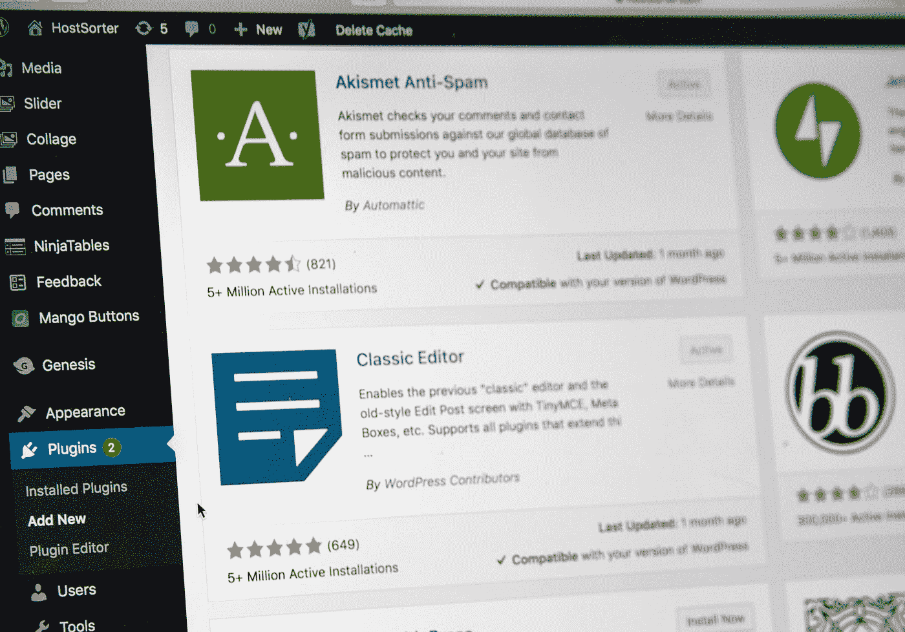

# 如何用 Docker 开始 WordPress 插件开发，第 1 部分:Docker 和管理面板

> 原文：<https://blog.devgenius.io/how-to-start-wordpress-plugin-development-with-docker-part-1-docker-and-admin-panel-6ac9673c9a22?source=collection_archive---------2----------------------->


由 [Unsplash](https://unsplash.com?utm_source=medium&utm_medium=referral) 上的 [Launchpresso](https://unsplash.com/@launchpresso?utm_source=medium&utm_medium=referral) 拍摄的照片

> “漂亮的设计、强大的功能，以及构建您想要的任何东西的自由。WordPress 既是免费的，同时也是无价的。~ Wordpress.org

如果你从事网络工作，你应该听说过 WordPress。这是必须的！使用 WordPress，你可以创建任何东西。

从一个新用户的角度来看，WordPress 是一个不错的 CMS:你安装一个主题，设置它，安装你需要的插件，你甚至可以使用插件来调整一些 SEO 方面。

从开发者的角度来看，就不一样了。WordPress 就像一个框架。想一想，有了 WordPress 你就有了:

*   **路由**:你可以随心所欲地编写你的自定义网址。
*   数据库接口:你有很多有用的功能，比如准备好的语句和参数清理。
*   模板化:你可以添加你自己的模板，扩展一个插件或者甚至分割视图，并且单独定义每个子视图。
*   **媒体管理**:无需编写代码即可处理图像、音频和视频。
*   **认证/权限处理**:角色管理可以随意调整。
*   管理面板:你有一个可以扩展的漂亮的仪表板。您可以添加菜单、页面和设置，而无需重新构建任何内容。

它不是一个框架，但确实与此类似。从这个角度出发，开始设计我们的插件吧！

# WordPress 的一次性开发环境🔧

如果你已经开发了" *WordPress stuff* "，你应该已经有了一个你满意的开发环境，如果你不想改变，你可以跳过这一部分，直接进入生成器，但是如果你想有另一个视角，这里就是。如果你使用一个不同的策略，认为它更简单或者更有效，让我在评论中知道，它总是很感谢得到其他开发者的评论！

Docker 社区维护着 WordPress 的官方形象:

*   作为 web 服务器的 Apache
*   PHP-FPM 担任流程经理
*   WP-CLI 作为命令行助手(不知道 WP-CLI？发现它[在这里](https://wp-cli.org/it/)
*   MySQL 作为数据库管理系统
*   PHPMyAdmin 作为数据库浏览器实用程序

这是一个有趣的事实:这些图片是*现成的*，你不需要知道 docker 如何在你的本地机器上使用它，你只需要按照步骤，启动图片，开发你的 WordPress，最后清除一切。

使用 docker 设置环境非常简单:

*   docker 的官方图片可以在 Github 上找到[，你应该克隆这个`git clone`](https://github.com/nezhar/wordpress-docker-compose.git) `[https://github.com/nezhar/wordpress-docker-compose.git](https://github.com/nezhar/wordpress-docker-compose.git)`。
*   进入克隆的文件夹，让 docker 用`docker-compose up -d`完成剩下的工作。

这将触发 docker 从 [DockerHub](https://hub.docker.com/) 获取图像，并捆绑您的环境。如果你查看文件夹内容，你应该看到一个`.env`文件:

```
IP=127.0.0.1
DB_ROOT_PASSWORD=password
DB_NAME=wordpress
```

这个文件应该可以帮助你在构建之前调整这三个参数，以改变默认的图像行为。一旦 docker 完成，你只需要打开`localhost`，你的 WordPress 就准备好了！


使用 Docker 安装 WordPress

你的 WordPress 文件在`wp-app`文件夹里！

# WordPress 插件样板文件生成器✏️

WordPress 插件可以按照你的意愿构建，你可以把文件放在里面，没有特定的结构，如果你遵循了 Codex 中写的 2/3 规则，你的插件将会工作。如果你已经有了自己的结构，很好，继续，如果你想尝试一个新的结构或者你是第一次做，一个样板可以是一个很好的起点。

我尝试了不同的样板文件，我最喜欢的是[**WPPB**](https://wppb.me/)***(WordPress 插件样板文件)。***

****

**wppb.me:样板文件生成器**

**要真正创新，让我们建立一个 Hello World。**

****

**wppb.me**

**点击“构建插件”后，你会在你的下载文件夹中得到你的插件样本压缩文件！解压后，你会看到很多文件。它们被组织到 3 个方便的文件夹中:**

*   **`admin`:行政相关人员所在位置。**
*   **`public`:公共相关的东西在哪里。**
*   **奇迹发生的地方。**

**我们将采用“*先使用，后学习*”的方法，这意味着我们将通过实践来学习，然后我们将通过检查该样板文件的确切工作流程来更深入地学习。**

# **在您的本地环境中安装插件**

**我们之前说过，你的本地 WordPress 环境位于`wp-app`文件夹，为了更快的开发你的插件，把插件文件夹复制到`wp-app/wp-content/plugins`，到`[http://localhost/wp-admin/plugins](http://localhost/wp-admin/plugins.)`T12。**

****

**安装的插件**

**这个插件已经准备好被激活了，它的好处是你可以激活、开发、刷新并实时获得你刚刚做的事情。激活它并开始开发过程！**

# **管理面板上的 Hello world**

**要开始开发管理面板，您应该从`admin/class-kalizi-hello-world-admin.php`中的 admin 类开始。在`partials`文件夹里会有你对每一页的看法。要开始注册一个页面，首先在 admin 类中创建一个方法，这个方法包含页面的逻辑和视图，非常简单。**

```
public function adminHello() {
    include 'partials/kalizi-hello-world-admin-display.php';
}
```

**如果你打开收录页面，会有很多评论，你可以把你的 HTML 代码放在 PHP 标签的开头，比如**

```
<h1>Hello world</h1>
```

**但是这样，什么都没做，你应该通过`[admin_menu](https://developer.wordpress.org/reference/hooks/admin_menu/)`钩子告诉 WordPress 你的页面。要注册一个钩子，您应该看一下`includes/class-kalizi-hello-world.php`，在那里您会发现一个名为`define_admin_hooks`的方法，在这里管理类被实例化，两个动作将脚本排队。为了注册菜单页面，我们应该在 admin 类中添加另一个方法来处理钩子。**

```
public function register_menu() { }
```

**然后在`define_admin_hooks`里把它绑到钩子上:**

```
$this->loader->add_action( 'admin_menu', $plugin_admin, 'register_menu' );
```

**在`register_menu`中，您可以使用`[add_menu_page](https://developer.wordpress.org/reference/functions/add_menu_page/)`注册管理页面:**

```
public function register_menu() {
  **add_menu_page(
   'Hello Page Title',
   'Hello Menu',
   'manage_options',
   'hello_from_kalizi',
   [ &$this, 'adminHello' ]
  );**
 }
```

**其参数依次为:**

*   **页面标题。**
*   **菜单标题。**
*   **功能:这允许你控制谁可以访问什么，`manage_options`用户可以访问管理屏幕的权限(在这里[检查它们](https://wordpress.org/support/article/roles-and-capabilities/#manage_options))。**
*   **菜单条。**
*   **可调用函数:这将遵循 PHP `call_user_func`的方式，要调用一个方法你应该使用语法`**[$className, $methodName]**`。**
*   **图标网址:这是可选的，你可以添加一个图标到你的文件，并通过`plugin_dir_url(__FILE__).’/path/to/image’`获得它的网址。**
*   **位置:WordPress 菜单遵循索引顺序，为了检查你的菜单顺序，你应该像在[管理页面文档](https://codex.wordpress.org/Administration_Menus)中一样使用`print_r($GLOBALS['menu')`。**

****

**注册的菜单**

**一旦你点击它，这将调用包含视图的`adminHello`。**

****

**你好世界**

> ***🔥*现在是火的洗礼时间，孩子*🔥***

# **数据库ˌ资料库💾**

**如果你正在构建一个插件，除非你在做一些静态的东西，你应该需要一些表格。要摆放桌子，请看一下`includes/class-kalizi-hello-world-activator.php`。在那里，有一个叫做`activate`的方法，你应该把 DB init 逻辑放在那里。**

**要执行`CREATE`语句，你应该首先这样告诉 WordPress:**

```
global $wpdb;
require_once(ABSPATH . 'wp-admin/includes/upgrade.php');
```

**第一行将回忆起`[$wpdb](https://developer.wordpress.org/reference/classes/wpdb/)`，WordPress 数据库访问抽象类。**

**第二行将要求`upgrade.php`使用`[dbDelta](https://developer.wordpress.org/reference/functions/dbdelta/)`，这是一个用 SQL 修改数据库的函数。因此，要执行`CREATE`语句，您应该:**

```
$query = "
 **CREATE TABLE IF NOT EXISTS {$wpdb->prefix}hello_from_the_database (
  id BIGINT(20) NOT NULL AUTO_INCREMENT,
  hello_from VARCHAR(20) NOT NULL,
  hello_message LONGTEXT NOT NULL
  PRIMARY KEY(id)
 ) {$wpdb->get_charset_collate()};**
";
**dbDelta**($query);
if (! empty($wpdb->last_error)) {
 // *What you gonna do if this fails?*
}
```

**如果你已经在 WordPress 中，你应该知道所有的 WordPress 表格都有一个前缀，所以你也必须用`$wpdb->prefix`添加它，并且使用 WP collate。**

**要执行查询，你必须再次调用`$wpdb`，你可以在 [WordPress 文档中获得更多关于 WPDB](https://developer.wordpress.org/reference/classes/wpdb/) 的信息。**

# **从行政，都是今天！**

****

**斯蒂芬·菲利普斯-Hostreviews.co.uk 在 [Unsplash](https://unsplash.com?utm_source=medium&utm_medium=referral) 上的照片**

**一旦你了解了管理部分的基础知识，你就可以做任何你能想象到的事情，WordPress Documentation 有很多动作你可以用委托的方法。**

**如果你对这个部分有任何疑问，想了解更多关于 wp-admin 的信息或者对插件开发有任何疑问，请在下面留下评论。💬**

**请继续关注本系列的下一篇文章，我们将深入到样板文件中，讨论如何在公共部分做一些事情，如何使用 ajax 或您最喜欢的 JS 框架或库，以及更多的东西！如果你想让我专注于 WP 插件开发的某些方面，祝你愉快，请告诉我！☕️**