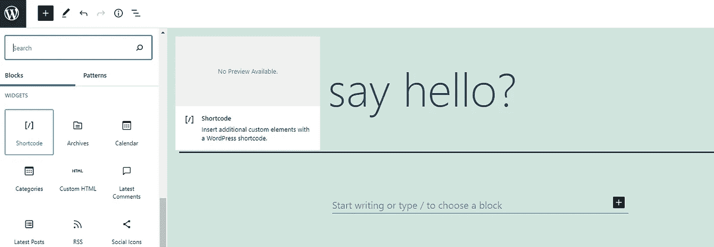
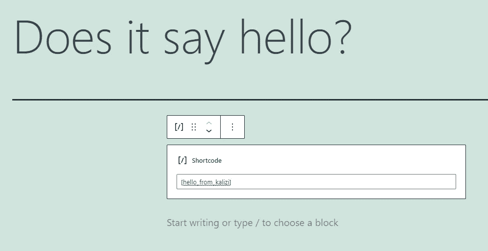
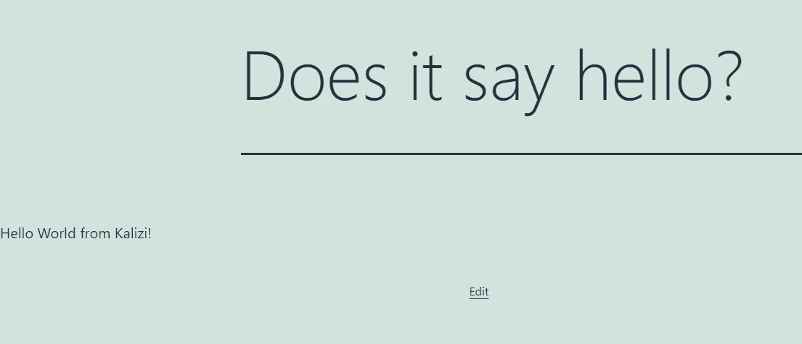

# 如何用 Docker 开始 WordPress 插件开发，第 2 部分:用短代码创建一个简单页面

> 原文：<https://blog.devgenius.io/how-to-start-wordpress-plugin-development-with-docker-part-2-create-a-simple-page-with-cd6cf54599ac?source=collection_archive---------9----------------------->


斯蒂芬·菲利普斯-Hostreviews.co.uk 在 [Unsplash](https://unsplash.com?utm_source=medium&utm_medium=referral) 上的照片

> 简单是幸福的本质。~塞德里克·布莱索

我喜欢在博客文章的开头引用一句话，尤其是这句话，非常正确。想一想 K.I.S.S. ( *保持简单，愚蠢的*)哲学:它简单地说系统在保持…嗯… *简单*时工作得更好！如果你从未听说过这个原则，乍一看可能会觉得“这是显而易见的”，但我向你保证这不是。

想想有多少次你使用了一个新的范例或者一个新的模式，你过度思考了如何使用它或者它过度工程化了你的项目，以保证你进一步的可维护性或者一个更干净的结构，但是……它没有。

# 短代码

简码是将页面内容“绑定”到 PHP 函数的最简单方式。简而言之，这意味着您只需在编辑器中用您的参数(如果有的话)编写一个短代码，它就会完成任务！

但是短码是如何工作的呢？

```
[shortcodeName parameter1="value1" parameter2="value2"]
```

**如何注册？**

```
add_shortcode('shortcodeName', 'functionName');
```

**如何处理它们？**

```
function functionName( $attributes ) {
    // do the magic
}
```

超级容易！

# 短代码和样板文件

我们希望保持样板逻辑的一致性，这意味着我们必须遵循插件流程来添加我们的短代码。但是插件样板目前不支持短码，这意味着我们必须添加短码支持！动作和过滤器目前通过`includes/class-*-loader.php`中的捆绑加载器来支持和加载。过滤器和动作存储在两个独立的数组中，然后在调用`run`方法时应用，所以要添加短代码，我们应该简单地添加:

```
/**
  * The array of shortcodes registered with WordPress.
  *
  * [@since](http://twitter.com/since)    1.0.0
  * [@access](http://twitter.com/access)   protected
  * [@var](http://twitter.com/var)      array    $shortcodes The shortcodes registered with WordPress to fire when the plugin loads.
  */
 protected $shortcodes;/**
  * Add a new shortcode to the collection to be registered with WordPress
  *
  * [@since](http://twitter.com/since)     1.0.0
  * [@param](http://twitter.com/param)     string        $tag           The name of the new shortcode.
  * [@param](http://twitter.com/param)     object        $component      A reference to the instance of the object on which the shortcode is defined.
  * [@param](http://twitter.com/param)     string        $callback       The name of the function that defines the shortcode.
  */
 public function add_shortcode( $tag, $component, $callback, $priority = 10, $accepted_args = 1 ) {
    $this->shortcodes = $this->add( $this->shortcodes, $tag, $component, $callback, $priority, $accepted_args );
 }
```

添加 shortcode 会将我们的 shortcode 放入 shortcodes 数组中，所有的方法参数都与来自 [WordPress 文档](https://codex.wordpress.org/Shortcode_API)的相同，所以这里没有什么新东西！

并以这种方式改进运行方法:

```
/**
  * Register the filters and actions with WordPress.
  *
  * [@since](http://twitter.com/since)    1.0.0
  */
 public function run() { // other stuff... foreach ( $this->shortcodes as $hook ) {
       add_shortcode( $hook['hook'], array( $hook['component'], $hook['callback'] ), $hook['priority'], $hook['accepted_args'] );
    }}
```

# 注册我们的第一个短代码

既然我们的加载器已经准备好处理短代码，我们只需要在`includes/class-*.php`的核心类中注册它们。

所以直接进入`define_public_hooks`并以这种方式添加我们的短代码:

```
$this->loader->add_shortcode( **'hello_from_kalizi', $plugin_public, 'shortcode_hello'** );
```

这意味着我们的短代码将是`hello_from_kalizi`，它将由`$plugin_public`通过它的方法`shortcode_hello`来处理。所以我们要做的唯一一步就是在`public/class-*-public.php`中定义方法。

前端文件夹结构与管理端相同，这意味着我们有一个存放所有视图的 partials 文件夹。出于测试目的，我将在那里编辑文件，只需放入“来自 Kalizi 的 Hello world”。

最后，我将这样定义我的方法:

```
public function shortcode_hello($attributes) {
    include 'partials/kalizi-hello-world-public-display.php';
}
```

# 打个招呼，简码

现在我们的插件已经准备好处理短代码了，我们只需要创建一个新页面并添加它！所以只要进入 WordPress 的页面部分，创建一个新页面。一旦你进入编辑器，寻找简码，将它们添加到你的页面中。



添加短代码组件

在短码被选中后，我们不得不说 WordPress 这个短码就是之前声明的那个，所以`[hello_from_kalizi]`。



添加了短代码(记住括号)

如果一切顺利，在发布页面后，您应该会看到 hello world！



你好世界，来自 shortcode！

好吧，我选择的主题不是很时尚，但我们可以努力！

# 第一步完成了！


沃洛季米尔·赫里先科在 [Unsplash](https://unsplash.com?utm_source=medium&utm_medium=referral) 上的照片

正如我在本系列的前一集[中所说，WordPress 的世界真的很大，你可以用非常不同的方式做很多事情。短代码是一种用很少的代码处理页面内容的简单方法，它们非常强大。](/how-to-start-wordpress-plugin-development-with-docker-part-1-docker-and-admin-panel-6ac9673c9a22)

如果你对这部分有任何疑问，想知道更多关于 wp-admin 的信息，或者对插件开发有任何疑问，请在下面留下评论。💬

请继续关注本系列的下一篇文章，我们将深入探讨样板文件，讨论如何在公共部分做一些事情，如何使用 ajax 或您最喜欢的 JS 框架或库，以及更多内容！如果你想让我专注于 WP 插件开发的某些方面，请告诉我，祝你有美好的一天！☕️