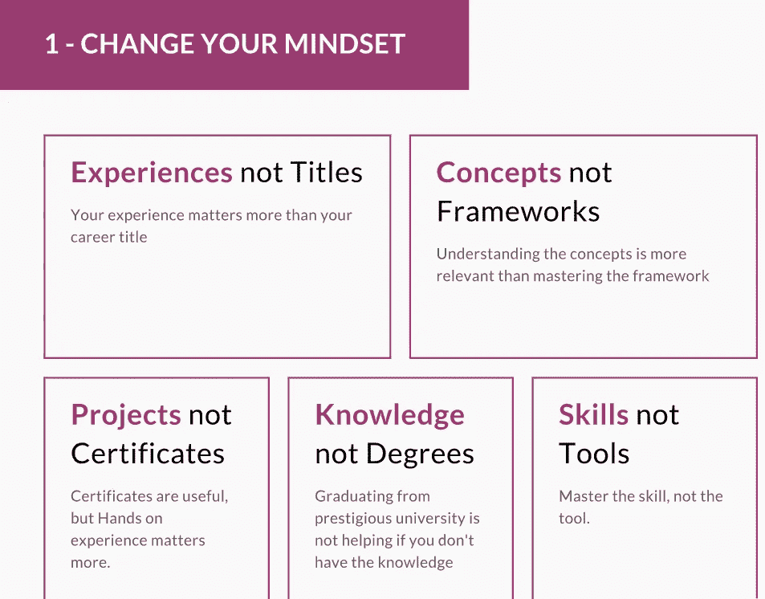

# 如何在技术领域保持相关性？

> 原文：<https://blog.devgenius.io/how-to-stay-relevant-in-tech-cb71169c81c3?source=collection_archive---------3----------------------->

图片来自:[https://blogs . Oracle . com/marketing cloud/why-the-word-relevant-is-more-important for-CMOS](https://blogs.oracle.com/marketingcloud/why-the-word-relevant-is-more-important-than-ever-for-cmos)

我最近有机会成为 [Job Stack 2020](https://jobstack.talentsarena.net/) 演讲团队的一员，这项技术吸引了该领域的许多软件工程师。

我的演讲主要围绕如何在技术领域保持相关性，这主要是受我收到的许多人的请求的启发，特别是那些已经在该领域工作了几年的软件工程师，他们想知道如何赶上技术领域正在发生的一切，也很少有人在他们的早期职业生涯中提出请求。您可以在此链接中找到[的介绍，以下是一些亮点:](https://www.beautiful.ai/player/-MOlWua6bO1KDMue5SBW)

首先，作为在 IT 领域工作的人，您可能需要重新审视您对某些事情的看法，这些在下面的幻灯片中列出:

现在，让我们来看看清单(完整的清单在[演示文稿](https://www.beautiful.ai/player/-MOlWua6bO1KDMue5SBW)中)

1.  关注公认的研究机构出版物，如 [Gartner 网络研讨会](https://www.gartner.com/en/webinars)、 [Forester wave](https://www.forrester.com/search?N=10001+5001&range=504005&sort=3&searchRefinement=reports) 、[Business Inside 10 Things to Know in Tech](https://www.businessinsider.com/10-things-in-tech-you-need-to-know-today-december-4-2020-12?r=US&IR=T)等。
2.  为你的 IT 专业主题设置 [Google Alert](https://www.google.co.uk/alerts) 例如，如果你对 Apache Spark 感兴趣，你可以为网上发布的任何内容创建一个提醒，以跟踪周围发生的事情。
3.  阅读工程博客，尤其是 FAANG 公司的博客(脸书、亚马逊、苹果、网飞和谷歌)
4.  阅读公认的工程师博客，我的推荐是[马丁·福尔](https://martinfowler.com/)、[沃纳·威格尔](https://www.allthingsdistributed.com/)(所有东西都是分布式的)和托德·霍夫— [高可扩展性](http://highscalability.com/)
5.  参加每个季度的 ThoughtWorks technology radar 网上研讨会，这是了解软件世界新趋势的一个很好的来源，也是你在每个项目开始时做出技术选择的一个很好的参考。
6.  获得行业顶级认证，尽管在第一点中我提到的认证不太重视实践经验，但它们仍然很有价值，特别是如果它们来自一家声誉良好的公司，我推荐 [AWS 云认证](https://aws.amazon.com/certification/)、[谷歌云认证](https://cloud.google.com/certification)和 [Azure 云认证](https://docs.microsoft.com/en-us/learn/certifications/browse/)。

这些是快速集锦，请完整查看[演示文稿](https://www.beautiful.ai/player/-MOlWua6bO1KDMue5SBW)，并告诉我您的意见。