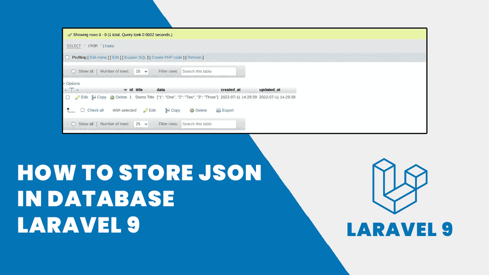
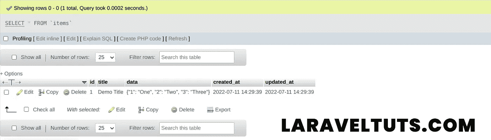

# 如何在数据库 Laravel 9 中存储 JSON

> 原文：<https://blog.devgenius.io/how-to-store-json-in-database-laravel-9-8f64a7202ccf?source=collection_archive---------0----------------------->



**如何在数据库 Laravel 9 中存储 JSON**

今天我们将学习**如何在数据库 Laravel 9** 中存储 JSON。本教程将介绍如何在 laravel 9 中将 JSON 值存储到数据库中。

如果是大数据或不固定的列，那么你不能创建太多的字段来保存数据到数据库。然后，您必须将值保存到数据库中的 JSON 中。这种方式可以平稳地加载数据库，而不必加载到数据库中。

[](https://www.cloudways.com/en/?id=1278547&data1=medium)

# 如何在数据库 Laravel 9 中存储 JSON 的步骤:

*   **步骤 1:** 安装新的 Laravel 9 应用程序
*   **步骤 2:** 创建数据库和迁移
*   **第三步:**创建模型
*   **步骤 4:** 创建路线
*   **步骤 5:** 创建控制器
*   **第六步:**测试
*   **第七步:**结论

**也可阅读:** [**创建 Ajax CRUD Laravel 9 应用示例**](https://laraveltuts.com/create-ajax-crud-laravel-9-application-example/)

# 步骤 1:安装新的 Laravel 9 应用程序

首先，我们将安装一个全新的 laravel 9 应用程序。要安装 laravel 9 应用程序，请在终端中运行以下命令。

```
composer create-project laravel/laravel save-json-appcd save-json-app
```

**注:****save-JSON-app**为 laravel 9 应用名称。

# 步骤 2:创建数据库和迁移

现在，我们将创建一个数据库。打开 **phpmyadmin** 并创建一个名为 **save-json-app** 的新数据库。

将数据库详细信息输入到**。如下面的代码所示。**

```
DB_CONNECTION=mysql
DB_HOST=127.0.0.1
DB_PORT=3306
DB_DATABASE=save-json-app
DB_USERNAME=root
DB_PASSWORD=
```

现在我们将创建带有标题和数据(作为 json)列的**项**迁移。要创建迁移，请在终端中运行以下命令。

```
php artisan make:migration create_items_table
```

现在，打开可以在**数据库/迁移**文件夹中找到的项目迁移文件，并更新以下代码。

```
<?php

use Illuminate\Database\Migrations\Migration;
use Illuminate\Database\Schema\Blueprint;
use Illuminate\Support\Facades\Schema;

return new class extends Migration
{
    /**
     * Run the migrations.
     *
     * @return void
     */
    public function up()
    {
        Schema::create('items', function (Blueprint $table) {
            $table->id();
            **$table->string('title');
            $table->json('data')->nullable();**
            $table->timestamps();
        });
    }

    /**
     * Reverse the migrations.
     *
     * @return void
     */
    public function down()
    {
        Schema::dropIfExists('items');
    }
};
```

现在运行迁移来创建一个项目表。

```
php artisan migrate
```

**也可阅读:** [**如何在 Laravel 9 中创建 RSS Feed 示例**](https://laraveltuts.com/how-to-create-rss-feed-in-laravel-9-example/)

# 步骤 3:创建模型

现在，我们将创建一个项目模型。要创建项目模型，请在终端中运行以下命令。

```
php artisan make:model Item
```

打开**item.php**文件，该文件可以在 **App/Models/** 中找到，并更新以下代码。

```
<?php

namespace App\Models;

use Illuminate\Database\Eloquent\Factories\HasFactory;
use Illuminate\Database\Eloquent\Model;
use Illuminate\Database\Eloquent\Casts\Attribute;

class Item extends Model
{
    use HasFactory;

    /**
     * Write code on Method
     *
     * @return response()
     */
    protected $fillable = [
        'title', 'data' 
    ]; 

    /**
     * Get the user's first name.
     *
     * @return \Illuminate\Database\Eloquent\Casts\Attribute
     */
    protected function data(): Attribute
    {
        return Attribute::make(
            get: fn ($value) => json_decode($value, true),
            set: fn ($value) => json_encode($value),
        );
    } 
}
```

# 步骤 4:创建路线

现在我们要创建路线。输入以下路线到 **routes/web.php**

```
<?php

use Illuminate\Support\Facades\Route;
use App\Http\Controllers\ItemController;

/*
|--------------------------------------------------------------------------
| Web Routes
|--------------------------------------------------------------------------
|
| Here is where you can register web routes for your application. These
| routes are loaded by the RouteServiceProvider within a group which
| contains the "web" middleware group. Now create something great!
|
*/

Route::get('item', [ItemController::class, 'index']);
```

**也读作:** [**Ajax 文件上传带进度条的 Laravel 9 例子**](https://laraveltuts.com/ajax-file-upload-with-progress-bar-in-laravel-9-example/)

# 步骤 5:创建控制器

最后一步是创建一个**ItemController.php**。在 **app/Http/Controllers** 中创建一个新文件**ItemController.php**，并向 controller 输入以下代码。

```
<?php

namespace App\Http\Controllers;

use Illuminate\Http\Request;
use App\Models\Item;

class ItemController extends Controller
{
    /**
     * Write code on Method
     *
     * @return response()
     */
    public function index()
    {
        $input = [
            'title' => 'Demo Title',
            'data' => [
                '1' => 'One',
                '2' => 'Two',
                '3' => 'Three'
            ]
        ];

        $item = Item::create($input);

        dd($item->data);

    }
}
```

# 第六步:测试

现在，是时候测试我们的 laravel 应用程序了。首先通过运行以下命令启动 laravel 服务器。

```
php artisan serve
```

并在任何 web 浏览器中打开以下 URL。

```
[http://127.0.0.1:8000/item](http://127.0.0.1:8000/item)
```

**也可理解为:**[**Laravel 9 示例**](https://laraveltuts.com/datatables-filter-with-dropdown-in-laravel-9-example/) 中带下拉菜单的数据表过滤器

您可以看到数据库输出和打印变量输出:

**数据库输出:**



**如何在数据库 Laravel 9 中存储 JSON**

**输出:**

```
array:3 [
  1 => "One"
  2 => "Two"
  3 => "Three"
]
```

# 第七步:结论

今天，我们学习了如何在数据库 Laravel 9 中存储 JSON。希望这篇教程对你学习 Laravel 9 有所帮助。如果你有任何问题，你可以在下面的评论区问我们。如果你喜欢教程，请订阅我们的 [**YouTube 频道**](https://www.youtube.com/channel/UCwIbFoGoht3Dom9Q1NkOS3A) 并在社交网络 [**脸书**](https://www.facebook.com/laraveltutscom) 和 [**Instagram**](https://www.instagram.com/laraveltuts/) 上关注我们。

**也读作:** [**在 Laravel 9 示例中使用 Vite 创建 React JS CRUD**](https://laraveltuts.com/create-react-js-crud-using-vite-in-laravel-9-example/)

*2022 年 7 月 13 日，原载于*[](https://laraveltuts.com/how-to-store-json-in-database-laravel-9/)*4 分钟读完*