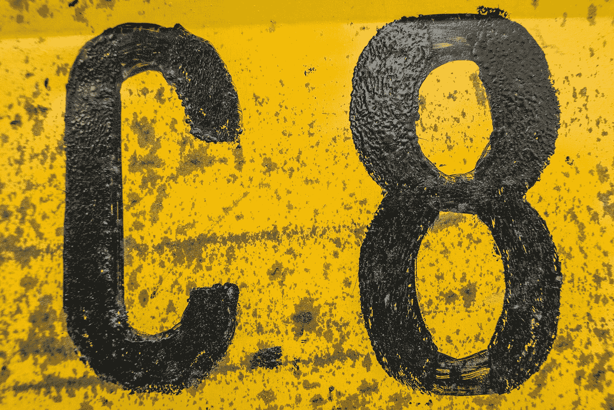

# 如何在 JavaScript 中剥离一个字符串中的所有非数字字符？

> 原文：<https://blog.devgenius.io/how-to-strip-all-non-numeric-characters-from-a-string-in-javascript-e72c04006690?source=collection_archive---------1----------------------->



由 [OSS 摄影](https://unsplash.com/@ossphotography1?utm_source=medium&utm_medium=referral)在 [Unsplash](https://unsplash.com?utm_source=medium&utm_medium=referral) 上拍摄

从字符串中去除所有非数字字符是我们在 JavaScript 应用程序中经常做的事情。

在本文中，我们将研究如何用 JavaScript 从字符串中去除所有非数字字符。

# 字符串.原型.替换

要在 JavaScript 中从一个字符串中剥离所有非数字字符，我们可以使用 string `replace`方法找到所有非数字字符，并用空字符串替换它们。

例如，我们可以写:

```
const str = 'abc123'
const newStr = str.replace(/\D/g, '');
console.log(newStr)
```

用正则表达式调用`replace`来获取所有非数字字符并用空字符串替换它们。

`\D`表示非数字字符。

而`g`意味着我们在字符串中搜索给定模式的所有实例。

因此，`newStr`就是`'123'`。

此外，我们可以使用`0-9`模式来搜索数字。所以我们可以写:

```
const str = 'abc123'
const newStr = str.replace(/[^0-9]/g, '');
console.log(newStr)
```

所以我们得到了和上一个例子一样的结果。

要在字符串中保留小数点和负号，我们可以通过编写以下内容进行更精确的替换:

```
const str = 'abc123.45'
const newStr = str.replace(/[^\d.-]/g, '');
console.log(newStr)
```

`^\d.-`表示我们搜索除数字、小数点和负号之外的任何内容，并用空字符串替换它们。

所以`newStr`就是 `‘123.45’`。

# 结论

我们可以使用字符串的`replace`实例方法，用 JavaScript 从字符串中去除所有非数字字符。