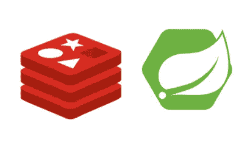

# 如何处理陈旧的缓存响应？

> 原文：<https://blog.devgenius.io/how-to-tackle-stale-cached-responses-615fb15281b?source=collection_archive---------13----------------------->

在本文中，我将讨论我们缓存的不同类型的响应，以及数据变得陈旧的可能性和避免这种情况的不同方法。



Spring Boot 的 Redis 缓存

首先，让我们了解存储在缓存中的不同类型的响应，以及它变得陈旧的可能性。

1.  一生中很少改变的反应。这些是曾经计算过的很少改变的反应。这些类型的数据是真实的，如电影类型，一些旧比赛的足球比分，发明家和发明等。
2.  **仅依赖于数据库的响应**。这些是仅依赖于数据库的响应，我们不做任何服务端消息传递/处理。这些响应的刷新率将取决于数据库更新的频率。
3.  **依赖于数据库和服务端代码**的响应。这些是响应，我们从数据库中获取数据，进行一些处理，然后发送响应。这些响应的刷新率不仅取决于数据库刷新的频率，还取决于您部署新版本服务的频率。

我们不必担心第一种反应。因此，在下一节中，让我们讨论如何处理第二种和第三种情况下的陈旧数据。

## 仅依赖于数据库的响应

在这种情况下，因为响应只依赖于数据库。我们必须首先了解数据库刷新的频率。无论是每月、每天还是每小时。根据这一点，我们可以决定缓存刷新的频率。不一定要完全一样。我们必须明白我们可以做出多大的妥协，因为如果我们开始非常频繁地刷新缓存响应，那么我们的缓存命中率将会下降。

一旦我们得出一个数字，我们就可以通过设置`TTL`(生存时间)来刷新我们的缓存。让我们看看当我们使用 Redis 进行缓存时，如何在 Spring Boot 做到这一点。

```
[@Bean](http://twitter.com/Bean)
public CacheManager cacheManager
    (RedisConnectionFactory connectionFactory) {

    RedisCacheConfiguration defaultCacheConfig =               RedisCacheConfiguration.defaultCacheConfig();
    defaultCacheConfig.disableCachingNullValues();Map<String, RedisCacheConfiguration> cacheConfigurations = new   HashMap<>();
    // APPNAME_CACHE_KEY* these are cache keys. 
    // You can define it as constants and use it in the config 
    // and also in your annotations.
    // appNameCache* are the number of seconds, 
    // minutes or hours you want to set your TTL. 
    // You can define it in your application properties
    // or tomcat properties. 
    cacheConfigurations.put(
        APPNAME_CACHE_KEY1,defaultCacheConfig.entryTtl(
            Duration.ofSeconds(appNameCache1)
        )
    );
    cacheConfigurations.put(
        APPNAME_CACHE_KEY2,defaultCacheConfig.entryTtl(
            Duration.ofMinutes(appNameCache2)
        )
    );
    cacheConfigurations.put(
        APPNAME_CACHE_KEY3,defaultCacheConfig.entryTtl(
            Duration.ofHours(appNameCache3)
        )
    );
    return RedisCacheManager
        .builder(connectionFactory)
        .cacheDefaults(defaultCacheConfig)
        .withInitialCacheConfigurations(cacheConfigurations)
        .build();
}
```

## 依赖于数据库和服务端代码的响应

在这种情况下，响应不仅依赖于数据库，还依赖于服务端代码。因此，我们必须做我们在第二种情况下正在做的事情，但除此之外，我们还必须考虑我们部署新版本代码的频率。有时服务的新版本会引入对 UI 有害的突破性变化。

基本上有两种方法可以解决这个问题。

1.  每当我们部署新的服务代码时，我们都需要手动清除缓存。我们甚至可以将这一步添加到 CI / CD 管道中，以便它可以清除缓存。
2.  第二种方法是将我们的应用程序版本添加到我们的缓存键中，在这种情况下，我们不需要做任何事情，缓存键本身会处理应用程序版本问题。

让我们看看如何在《春靴》中完成第二部分。

```
# In your application.yml just add this to get the project version
app:
    version: '[@project](http://twitter.com/project).version@'// Then inside your controller. You can get the version like this 
// using @Value annotation
@Value("${app.version}")
private String appVersion;// Then you can pass the app version to the service method which you // want to cache. 
@Cacheable(
    cacheNames = APPNAME_CACHE_KEY1, 
    key = "{ #arg1,#appVersion}", unless = "#result == null"
)
ClassName getResponse(final String arg1,final String appVersion);
```

如果您想了解更多关于 Redis 缓存的内容，可以浏览这些

1.  [https://blog . dev genius . io/multi level-redis-caching-to-improve-performance-8603 f0ea 146 f](/multilevel-redis-caching-to-improve-performance-8603f0ea146f)
2.  https://www.baeldung.com/spring-boot-redis-cache
3.  [https://docs . spring . io/spring-data/redis/docs/current/API/org/spring framework/data/redis/cache/rediscacheconfiguration . html](https://docs.spring.io/spring-data/redis/docs/current/api/org/springframework/data/redis/cache/RedisCacheConfiguration.html)
4.  [https://docs . spring . io/spring-data/data-redis/docs/current/API/index . html？org/spring framework/data/redis/core/time tolive . html](https://docs.spring.io/spring-data/data-redis/docs/current/api/index.html?org/springframework/data/redis/core/TimeToLive.html)