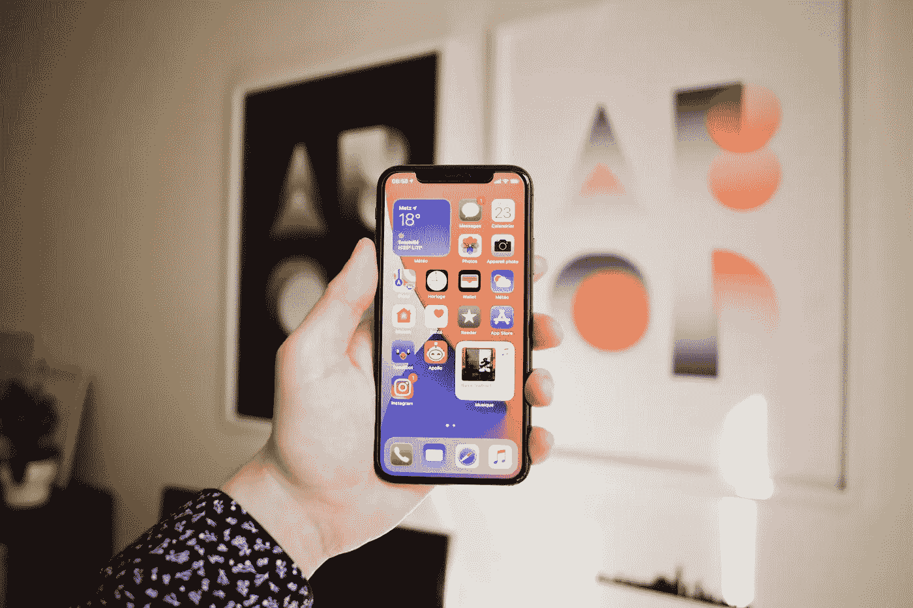
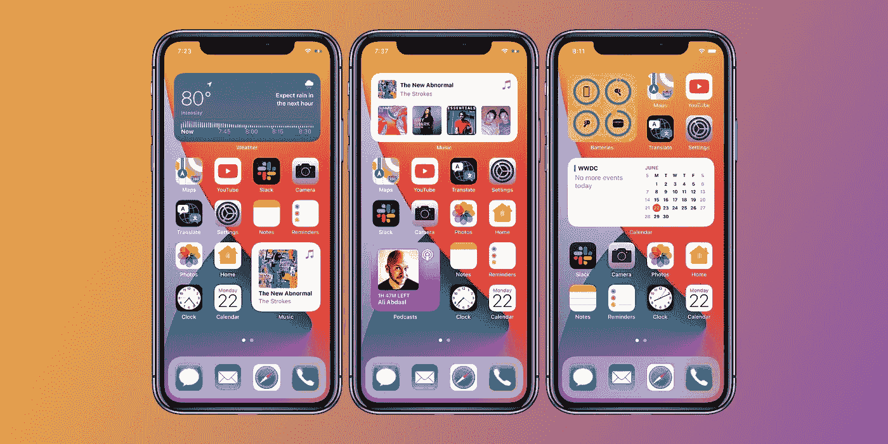
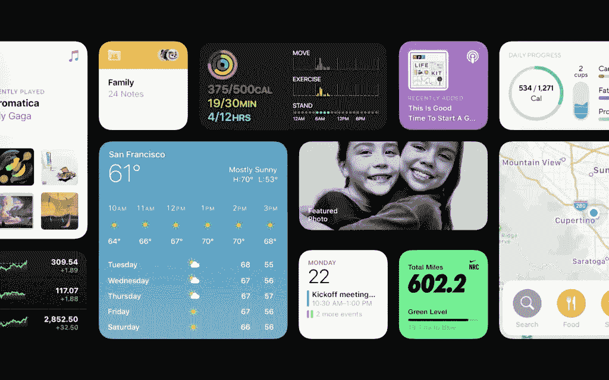

# 如何利用新的 iOS 14 小工具

> 原文：<https://blog.devgenius.io/how-to-take-advantage-of-the-new-ios-14-widgets-133b9a89ab45?source=collection_archive---------6----------------------->

## 随着最近在今年 WWDC 2020 主题演讲上的宣布，苹果推出了期待已久的 iOS14 更新。但是，作为产品创造者，我们是否忽略了一些巨大的东西？

今年，苹果公司推出了一款全新的今日页面小工具，并将它们移到了主屏幕上。

这绝不是苹果的大量创新——Android 设备已经有小工具一段时间了。然而，我对这一改进如此感兴趣的原因是因为这些新的小部件会出现在用户的主屏幕上。

以前，应用程序遵循统一的网格布局，并遵循非常严格的设计参数。一段时间后，它们看起来都一样——很难让你的应用程序从普通人智能手机上的 60 到 90 个其他应用程序中脱颖而出。然而，通过 iOS 14 Widgets，你可以让你的应用在用户主屏幕上脱颖而出。

主屏幕是一个令人垂涎的、非常有价值的屏幕实体，在过去的 14 年里一直没有什么变化——直到现在。

人们每天查看手机超过 100 次——有各种各样的小工具大小可供选择，你真的可以让你的应用在用户 iphone 的主屏幕上脱颖而出。

就像 2008 年随着第三方应用的引入而出现的 App Store 热潮一样，用户首先有机会下载原生苹果应用选择之外的新应用。在最初几年选择有限的情况下，一些应用做得非常好。

在过去 3 周使用 iOS14 开发者测试版后，他们目前只有原生的苹果小工具可供选择——然而，据我所知，苹果将提供第三方访问的[SDK](https://developer.apple.com/documentation/widgetkit/creating-a-widget-extension)。您还可以在 Keynote 上看到像 Nike 这样的第三方应用程序显示一个小部件。

作为 2020 年 9 月 iOS14 发布之日起可用的少数几个小工具之一，可能会在第三方应用成为像 App store 一样的狂野西部之前为其提供优势。

通过为您的移动应用程序提供一个小部件，我预计您的指标可能会有以下改进:

*   鉴于其在主屏幕上的突出地位，增加了与现有用户的互动
*   重新激活以前停滞的用户
*   提高保留率
*   每日使用量增加

我玩的一个很好的例子是产品搜索。我通常通过他们的移动应用程序每天至少查看一次产品搜索。我总是在寻找新的有趣的科技产品——但是直接从你的主屏幕上查看当天的特色产品不是很方便吗？我很快模拟了一个可视化用户界面如下。

从这里，我可以向下滑动，看到当天的热门产品，并查看他们目前有多少支持票。我还可以选择任何产品，并在产品搜索应用程序中直接进入其特色页面。

开发者可以利用 3 种小部件尺寸。2X2，2X4 和 4X4。上面的例子是 2X4。尺寸越大，你可以创建的可视化效果越详细——然而，在玩了 4X4 之后，我怀疑许多人会考虑在他们的主页上添加不止一个这样大小的小部件，因为它们太大了。

最后，我真的很好奇第三方小部件如何与智能堆栈集成，以及产品团队将如何利用这一特性。Cnet 下面提供的一个例子初步表明了我们可以期待什么:

> 例如，如果你早上第一件事就是查看天气和日历，智能堆栈可能会包含这两个应用程序，并在早上第一次解锁 iPhone 时自动向你显示天气预报和你的日程安排。然后，如果你在晚饭后例行检查你的活动统计，堆栈将显示你一天中那个时间的活动小部件。

‍Apple 没有提到任何关于开发者将能够用小工具做什么的事情，所以在这个阶段，还不清楚智能堆栈基于上下文的洗牌是否会扩展到包括第三方软件。

你在考虑为 iOS14 创建一个小工具吗？有什么有趣的小工具建议吗？让我知道。

想看更多这样的帖子？查看我的个人网站。