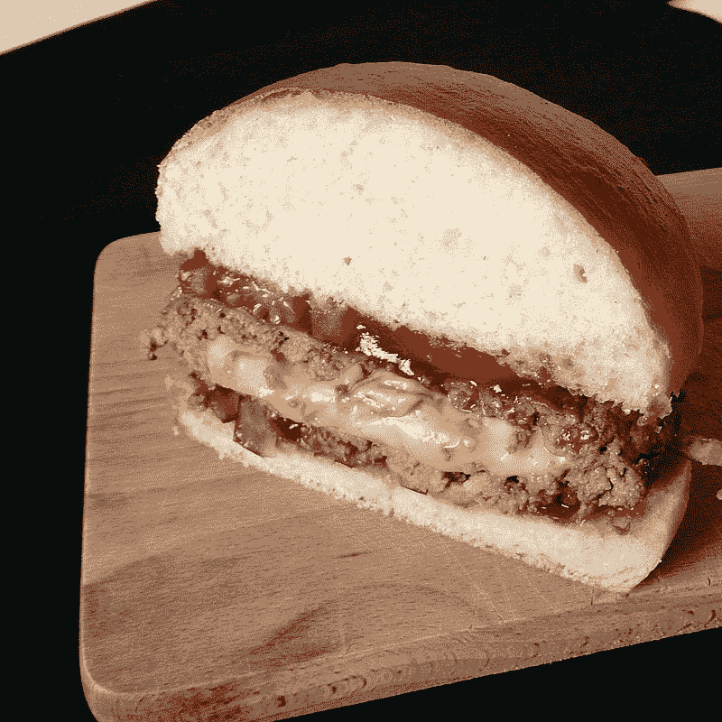

# 如何用 containsKey()方法判断 Java 哈希映射中是否有特定的键

> 原文：<https://blog.devgenius.io/how-to-tell-if-a-java-hash-map-has-a-specific-key-in-it-with-the-containskey-method-fd9b93a99800?source=collection_archive---------13----------------------->



多汁的露西。如果你读了这篇文章，这将是有意义的；我保证。

在 Java 中，`java.util`包中的 HashMap 类非常有用。Java 的 map 接口允许您将数据存储在键值对中，然后索引可以访问这些键值对。除了其他优点之外，由于 map 的散列特性，您可以非常快速地访问数据。Java 文档是这样写的:

> 这个实现为基本操作(get 和 put)提供了恒定的时间性能，假设散列函数将元素适当地分布在桶中。

“恒定时间性能”就是我们在这里讨论的。在 Big-O 符号中，它被写成 O(1)时间。但是让我们回到这个帖子的症结。

要访问 HashMap 中的数据，可以在键值对中查找键。假设我们对一些线对有了一个高层次的了解:

*   波士顿:蛤蜊杂烩
*   明尼阿波利斯:多汁的露西
*   新奥尔良:阿宝男孩
*   巴尔的摩:蟹饼
*   旧金山:蛤蜊杂烩

我饿了吗？也许吧。

但是不管怎样，如果我们在 HashMap 中将这些对变成键-值对，我们会将城市名看作键，将食物项看作值。

在 HashMap 中，值可以有重复，但是键不能。这就是为什么波士顿和旧金山都可以声称蛤蜊杂烩是最著名的食物(不要在评论中与我争论太多)；然而，新奥尔良不能选择 po'boys *和* jambalaya(老实说，这里有很多你可以合理选择的)。

但是无论如何，在一个散列表中，你将能够检查这些城市名称中的一个——记住，这些键——是否存在于地图中。

为此，您可以调用 HashMap 类自带的特定函数(或方法)。它叫做 *containsKey。*

你怎么称呼它？它看起来有点像这样(同样，让我们以代码形式正式声明散列表，好吗？).

```
HashMap<String, String> citiesToFood = new HashMap();citiesToFood.put("Boston", "clam chowder");
citiesToFood.put("Minneapolis", "juicy lucy");
citiesToFood.put("New Orleans", "po'boys");
citiesToFood.put("Baltimore", "crab cakes");
citiesToFood.put("San Francisco", "clam chowder");if (citiesToFood.containsKey("San Francisco") == true) { System.out.println("The most well-known food of SF is " + cities.get("San Francisco"));}
```

如你所见，我们明确地将每个城市及其最著名的食物添加到散列表中，然后在声明的散列表上调用`containsKey()`方法，查看`San Francisco`是否是其中的一个键。如果是，那么我们可以安全地向控制台输出一条消息，说明最著名的食物是相关的值。

这个例子有点显而易见，因为我们可以清楚地看到旧金山在代码的散列表中，但通常我们可能有一个更抽象的视图。换句话说，HashMap 中的确切内容可能是未知的，也可能是提供给正在编写的函数的参数。

我要提到的另一件事是，在阅读或编写代码时，要做的一件好事是查看代码可以改进的地方。你能发现什么吗？

我看到一个。我写的条件是:

```
if (citiesToFood.containsKey("San Francisco") == true)
```

我这样做是为了在本文中清楚地说明`containsKey()`返回的是什么:一个布尔值，意味着可能是`true`或`false`。

但是，在 Java 中，不需要显式检查`true`。您可以完全省略它，代码将检查`true`。它看起来像这样:

```
if (citiesToFood.containsKey("San Francisco"))
```

但是无论如何，这篇文章是要向你展示`containsKey()`以及如何使用它，希望我已经充分地涵盖了这一点。现在是时候把这个名字记在脑子里了，这样你就不会忘记了(但是如果你忘记了，你可以随时查阅):`containsKey()`！

`containsKey()`！

`containsKey()`！

好的，我想你明白了。

*   *不确定什么是多汁的露西？这是一种填满奶酪的汉堡，奶酪放在肉里面而不是上面。明尼苏达州的明尼阿波利斯市有两家酒吧声称发明了这个:马特酒吧和 5-8 俱乐部。如果你有时间，这是一个有趣的小兔子洞，如果你在明尼的镇上，你绝对应该尝试一下。

如果你觉得这很有帮助或者只是喜欢阅读这篇文章，考虑[注册成为一名灵媒会员](https://tremaineeto.medium.com/membership)。每月 5 美元，你可以无限制地阅读媒体上关于软件、技术等主题的报道。如果你用我的链接注册，我会得到一小笔佣金。

[](https://tremaineeto.medium.com/membership) [## 通过我的推荐链接加入 Medium—Tremaine Eto

### 作为一个媒体会员，你的会员费的一部分会给你阅读的作家，你可以完全接触到每一个故事…

tremaineeto.medium.com](https://tremaineeto.medium.com/membership)