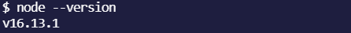
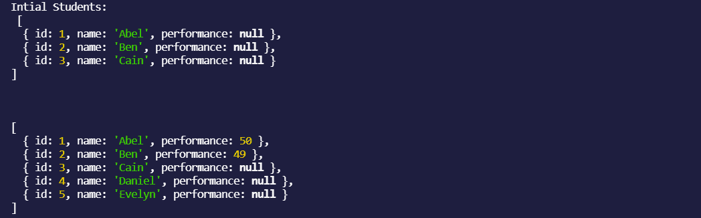
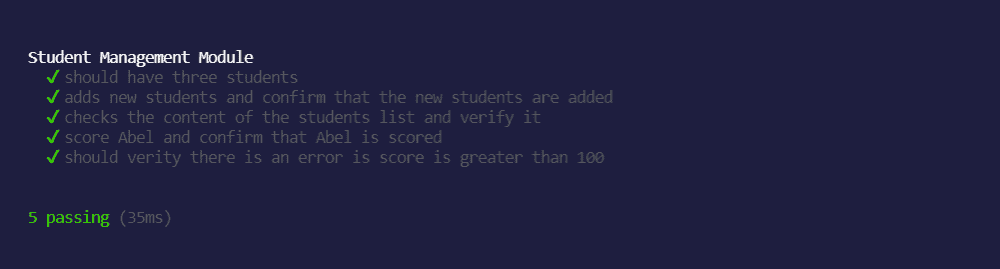

# 如何使用 Mocha 和 Assert 测试 NodeJS 模块

> 原文：<https://blog.devgenius.io/how-to-test-a-nodejs-module-using-mocha-and-assert-c66c1c2e2a99?source=collection_archive---------12----------------------->

软件测试是软件开发和质量保证不可或缺的一部分。测试可以帮助我们写出更好更高质量的代码，尽早发现歧义，抓住回归，自信地重构，并且在享受一杯咖啡的时候部署到生产 **☕** 。

我们需要一个结构化的测试，用测试用例来验证我们的应用程序的不同行为。Mocha 是一个 JavaScript 框架，它组织我们的测试用例并为我们运行它们。尽管 Mocha 不会验证我们的测试行为，但我们将利用 Nodejs `assert`库来验证我们的测试行为。

NodeJS 是建立在 Chrome 的 V8 引擎上的运行时环境，它使我们能够在 web 浏览器之外编写和运行 JavaScript。Node.js 使用事件驱动的非阻塞 I/O 模型，这使得它轻量级且高效，非常适合跨分布式设备运行的数据密集型实时应用程序。

NodeJS 模块是具有特定功能的代码块，可以基于它们各自的功能与外部应用程序一起使用。NodeJS 模块的核心思想是封装性、可重用性和模块化。模块可以分为三个部分，例如:

*   本地模块:这些是我们可以在应用程序中本地创建的模块，并且可以在应用程序中重用。
*   第三方模块:这些是由外部资源提供的模块，而不是我们的本地应用程序和 NodeJS 核心模块。Mocha 是一个第三方模块，我们必须从外部安装。

# 先决条件

# 核心 NodeJS 模块的示例用例

我们将编写一个名为`core_modules.js`的简单 NodeJS 应用程序，它利用内置模块`path`来打印我们程序的扩展类型`.js`

`path.extname`函数接受一个字符串参数(path)并返回路径中文件的扩展名。当我们在终端中运行命令`node core_modules.js`来运行这段代码时。`process.argv`是一个数组，其中的第二个元素(index `1`)是我们正在运行的 JavaScript 文件的路径。

运行上面的代码，我们应该得到结果:`.js`。

现在我们将编写一个模拟学生管理应用程序的 NodeJS 模块。这个模块将能够存储学生名单，添加新的学生名单，获得学生名单和学生成绩之间的范围 0 至 100。

具备上述先决条件后，我们将创建一个新文件夹并初始化我们的应用程序环境。在我们的终端中，我们将通过运行命令创建一个新文件夹

通过运行以下命令，将我们终端的当前工作目录更改为`students-manager`文件夹

接下来，我们将初始化 [npm](https://docs.npmjs.com/) ，这是必需的，因为我们将通过 npm 安装 Mocha。

`-y`选项允许 npm 使用默认选项启动我们的项目:

我们将创建一个`index.js`文件，在这里我们可以开始编写 NodeJS 模块。

在上面的代码中，我们用一个构造函数创建了一个类，该构造函数将一个字符串数组(学生姓名)作为参数，并将每个数组项转换为一个具有`id`、`name`和`performance`属性的对象。`#students`是类的私有属性，只能在内部访问。

`generateId`是一个帮助函数，它将`counter`变量加 1，并返回`counter`的当前值。返回值将用于为每个创建的学生生成唯一的`id`。

`generateId`和`counter`代表模块的一个特性，即封装。封装帮助我们隐藏实现并暴露功能。真实世界的场景是车辆如何工作，我们中的许多人并不真正知道发动机和齿轮系统是如何工作的，我们接触到的是主要驾驶的汽车的功能。

让我们创建一个名为的方法，将学生添加到学生列表中:

`add()`方法获取一个字符串(学生姓名)并创建一个对象，该字符串作为`name`属性，学生成绩设置为`null`

如果我们想要添加一批学生姓名，使用同一个函数添加单个姓名或多个姓名参数是有意义的，因此我们将重写`add()`方法。

接下来，我们将包含一个名为`getStudent()`的方法，该方法返回学生及其详细信息的数组。

根据`studentIdOrName`是否作为参数传递，`getStudent()`方法以两种方式工作。`studentIdOrName`可以是学生的 id(数字)，也可以是学生的名字(字符串)。

如果找到学生的`id`或`name`，该方法只返回一个学生，否则它只返回整个学生列表。

我们使用的是数组方法`filter()`。`filter()`遍历数组中的每一项，并通过我们传递给它的回调函数来访问该项。如果回调返回 true，`filter()`将在结果中包含该项。

让我们创建一个能够给学生评分的方法，该函数将采用两个参数，一个用于学生 id，另一个用于学生的分数，该分数应该是一个介于 **0** 和 **100** 之间的数字。

我们的`score()`方法检查`performance`是否在 **0 - 100** 的范围内，如果参数小于 **0** 或大于 **100** ，我们将抛出一个错误。该方法检查学生列表，找到与方法的第一个参数中提供的`id`相似的学生。

到目前为止，`index.js`文件还不是一个模块，所以我们需要导出它，使它可以在我们的本地应用程序中重用，并测试它。

NodeJS 对模块使用 CommonJS 约定，因此我们现在已经导出了模块，并准备好在本地应用程序中使用。

一旦完成，我们的`index.js`应该类似于这样:

接下来，我们将手动使用我们的项目，看看它是如何工作的。

我们在我们的 **students-manager** 文件夹的根目录下创建一个`demo.js`文件，并通过调用`require`函数来使用该模块。

当我们通过调用`node demo.js`来运行这个应用程序时，我们可以看到结果验证了模块如预期的那样工作。

下面是结果截图:

记得当我们谈到 NodeJS 模块时，我们谈到了不同类型的模块，`assert`是内置模块，而 mocha 是外部模块，因此我们必须使用 [npm](https://docs.npmjs.com/) 将其安装到我们的项目中。

在我们的终端中，确保我们仍然在`students-manager`目录中，我们将通过运行以下命令来安装 mocha:

`--save-dev`标志将 mocha 作为开发依赖项保存在我们的 NodeJS 中，因为我们只想在开发阶段编写测试，而不想将它们包含在生产部署中。

让我们创建我们的测试文件，名为`index.test.js`，包括我们的本地`StudentManager`模块和当前工作目录中的`asset`模块:

Mocha 帮助我们组织和运行测试。测试结构通常如下所示

`it`函数包含我们的测试代码。这是我们使用断言模块来测试`StudentManagement`模块的地方。

对于 Mocha 来说,`describe`函数并不是运行我们的测试所必需的，但是它有助于对我们的测试进行分组并轻松地管理它们。

让我们定义我们的测试用例，并编写这些测试用例的实现。

# 测试案例

*   用三个名字初始化我们的模块:Abel，Ben 和 Cain
*   确认该模块共有三名学生
*   添加两个新学生，并确认学生人数增加到 5 人
*   给 Abel 打 50 分，并确认该分数包含在 Abel 绩效指标中
*   给 Ben 打 120 分，确认模块抛出错误

# 测试实现

# 代码走查

1.  `describe()`:我们之前提到的这个函数用于对我们的测试进行分组，并向测试添加一个描述。因为我们将测试添加到了这个块中，所以`before()`方法是一个在第一个测试开始之前运行的钩子。在这个块中定义了一个`testClass`,使它对我们所有的测试都是全局可用的。
2.  `assert.equal()`检查两个变量是否相等，它使用`==`运算符。与`assert.strictEqual()`不同，这种类型的等式检查试图将不同类型的变量转换为相同的时间。`assert.strictEqual()`使用了`===`操作符。
3.  `assert.deepEqual()`用于检查对象的相等性，比较对象的可枚举属性

为了运行我们的测试，我们将使用 **Mocha** ，在我们的终端中，在当前工作目录`students-manager`的根目录下运行以下命令:

但是 npm 有一个特性，我们可以定义不同的命令集，并使它们简单和共享。这些命令位于我们的`package.json`文件的`scripts`部分。

当我们运行`npm init -y`时，npm 为我们创建了一个`package.json`文件，当我们安装 Mocha 时，npm 更新了这个文件以便与安装的依赖项一起使用。

让我们创建我们的脚本，名为:

那么我们的 final `package.json`应该类似于这个:

现在，让我们通过运行终端来开始我们的测试:

我们在终端中测试的输出:

在本教程中，我们介绍了 NodeJS 模块，如何在我们的应用程序中要求模块，以及如何创建我们的模块。我们创建了一个模拟学生管理应用程序的 NodeJS，并用 Mocha 和 assert 编写了基于该模块所公开的功能的测试，以验证我们的测试，并享受了一杯咖啡

Mocha 是一个功能丰富的 JavaScript 测试框架，运行在 [NodeJS](https://nodejs.org/) 和浏览器中，使异步测试*变得简单*和*有趣*。Mocha 测试连续运行，允许灵活和准确的报告，同时将未捕获的异常映射到正确的测试用例。

通过为后续的 NodeJS 模块编写测试来挑战自己。

要深入了解摩卡，可以查看[官方摩卡文档](https://mochajs.org/)。为了继续学习 NodeJS 模块，您可以查看关于模块的 [NodeJS 文档](https://nodejs.org/api/modules.html)

如果你喜欢读这篇文章，你可以考虑[请我喝杯咖啡](https://www.buymeacoffee.com/kayode)

*最初发布于*[*blog . z4ff . dev*](https://blog.z4ff.dev)