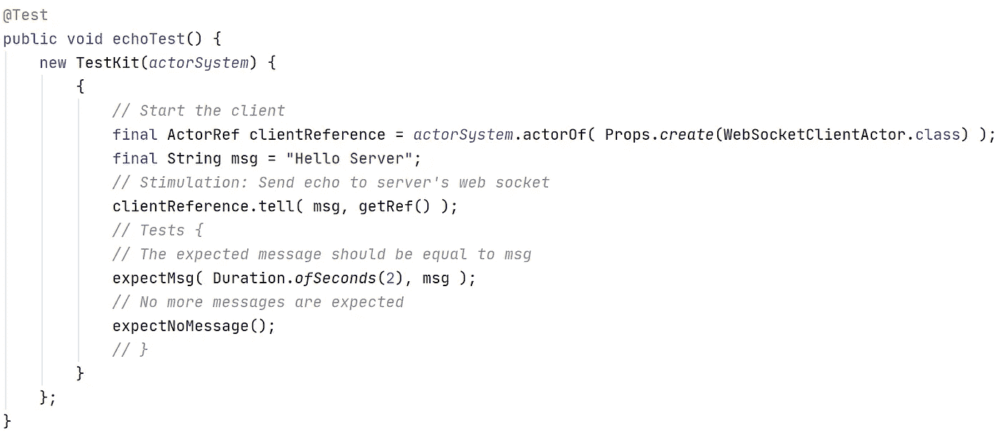
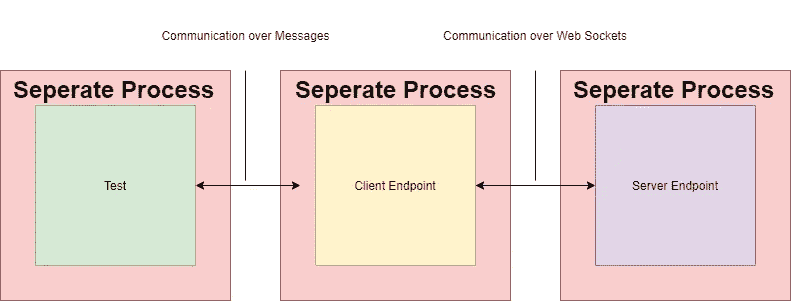
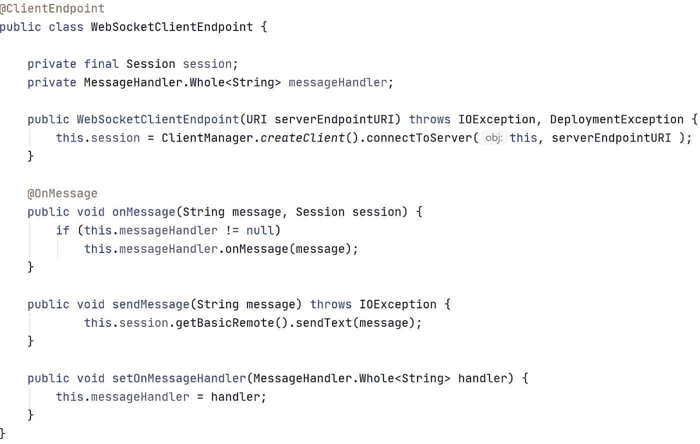
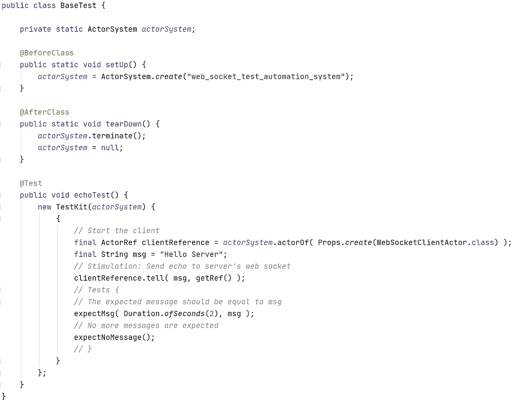

# 如何测试 Web 套接字 API (Java)

> 原文：<https://blog.devgenius.io/how-to-test-a-web-socket-api-java-ac69b4b0fe35?source=collection_archive---------4----------------------->

在柏林一家金融科技初创公司的工作中，我接受了编写一个基本测试自动化框架的编码挑战，该框架从客户的角度对公司部署的 web socket 端点进行测试。为了这次编码挑战，我花了三天时间。

除了我不是一个测试自动化/ QA 工程师的事实之外，我还在测试一个可公开访问的 web socket API 时遇到了挑战。在这篇短文中，我想分享我的解决方法，因为我在网上没有找到任何有用的信息和工具。

# 测试 Web 套接字 API 时出现的问题

虽然测试基于无状态 HTTP 请求/响应的 API 不是一门火箭科学，但是测试基于 web 套接字的 API 可能会有问题。尤其是当连接保持不变，并且您希望监视和验证从服务器到客户端的永久发送消息时。

当我测试一个 REST API 时，我向端点发送一个请求，**等待**响应，并检查响应代码、数据(带格式)和响应时间。测试要么通过，要么失败，工作完成，其他测试将运行。

相比之下，测试 Web Socket API 是不同的，因为连接的持久性。测试需要一种方法来维护打开的连接，并查看响应客户端消息的永久到达的消息。试图用我们测试 REST APIs 的方式来测试这一点，将会阻塞单线程测试用例，直到它失败，从而阻止其他测试用例的运行。

# 我的解决方法

在处理编码挑战时，我遇到了上面描述的问题，并最终提出了一个我可以接受的解决方案:

任务是从客户端的角度测试与服务器端点的通信。这就是框架的工作方式:

1.  每个测试都是一个单独的进程，有自己的进程 id (PID)和消息框。它启动客户端端点以模拟客户端视角，这也是一个单独的进程，并记住客户端的 PID。不需要启动服务器，因为已经联机，并且可以通过其 web 套接字访问。
2.  之后，测试能够向客户端进程发送消息。
3.  客户机通过 web 套接字连接将来自测试的此类传入消息转发到服务器端点。
4.  服务器向客户端发送响应。
5.  客户端将这些响应传递给启动它的测试。
6.  最后，测试根据预期的响应来验证收到的响应。

*将客户端端点和测试实现为单个(并且可能是分布式的)流程的决定来自于创建一个“长期有效”的测试用例的想法，该用例接收必须被监控和验证的推送消息。这种测试用例可以在框架的帮助下部署到集群中自己的节点上，并测试服务器。由于断言和/或模式匹配失败，测试在其进程终止时失败。*

# Java 实现

实现是在 Java 和 Akka 框架的帮助下进行的，目的是使客户端端点和测试成为可以通过消息通信的单个进程，而不是同一个线程中的回调函数。因此，流程被称为参与者。

在实践中，我会用编程语言 **Erlang 或 Elixir 以及 OTP 框架**来实现这个测试自动化框架。但是由于我参与编码挑战的时间很短，所以我使用了我熟悉的工具。但是在我看来，基于 Erlang 虚拟机的语言更适合构建这样的框架。

## 一些代码片段

归根结底，框架核心代码只包含两个类:

1.  WebSocketClientEndpoint
2.  WebSocketClientActor

**客户端**

WebSocketClientEndpoint 只是一个管理服务器端点之间的 web 套接字连接的类。它从服务器端点接收消息，并允许设置消息处理程序。

WebSocketClientActor 更有趣:

此类代表一个客户端，它作为自己的进程(参与者)运行，并通过 onReceive 方法从另一个参与者(在框架内，仅来自测试用例)接收消息，然后转发到 web socket 服务器端点。为了传递响应，onReceive 还保存消息发送方的引用(PID)(测试)。

除此之外，该类还在构造函数中注册了一个 on 消息处理程序(传入套接字消息的处理程序)。该处理程序将来自服务器 web 套接字端点的传入消息转发给测试，该测试预先发送了请求数据。

**测试**

这个框架的测试用例的最小设置包括三个部分:

1.  创建一个受测试的演员。这应该永远是客户。
2.  通过向客户演员发送诸如 echo“Hello World”的消息来进行刺激。
3.  并创建一个 actor 来接收和检查回复。这应该总是测试用例本身。

Akka 框架提供的 TestKit 类包含一组工具，使得这三个步骤易于编写:

getRef()是 TestKit 类的方法，它返回它的 PID。因此客户端可以向这个测试用例发送消息。

# 最后

编写和阅读这样的测试看起来相当复杂。这是因为 Java 本质上不是并发和分布式语言，并且这个框架不使用 DDD。这只是编码挑战的 MVP。最终产品应该——如上所述——用 Erlang 或 Elixir 等语言实现，并提供 DDD，实现流畅的界面设计模式等。因为我在这个挑战中获得了很多乐趣，所以我将在空闲时间创建一个专业的开源框架，使用基于 Erlang 虚拟机的编程语言来测试 web socket API。

我的解决方案完整代码:[https://github . com/DawidWalczak/web _ socket _ test _ automation _ framework](https://github.com/DawidWalczak/web_socket_test_automation_framework)

# 常见问题解答

*幸运的是，编码挑战被接受了，接下来是几个长时间的技术面试。也有人问我解决问题的方法。我想把这些和我的答案一起分享。*

## 为什么测试用例与客户端是一个独立的过程；测试用例作为一个单独的过程运行，并向服务器端点发出请求，这还不够吗？

*这是一个很好的问题，我在编程时有时也会问自己。*

首先，对我来说，将测试用例与客户端视为两个不同的事物是非常直观的。一方面，在单个过程中实现客户端和测试用例在技术上没有异议。编码挑战的要求也将得到满足。

但是另一方面，框架的目的是通过允许产生或模拟整个软件系统的几个组件(例如微服务)而不仅仅是客户端，来简化和自动化端到端测试。例如，一个测试用例也可以产生客户端和推送服务器，并验证它们之间的通信。因此，测试是一个中立的团体，它 a)产生系统组件，b)验证它们之间的通信。

## 为什么每个测试用例产生一个客户端进程，而不是所有测试用例只通过一个客户端进程进行通信？

一方面，我意识到每一个拥有自己的 web 套接字连接的新进程都是消耗资源的。但是另一方面，如果某个东西失败了，就很难找出是哪个测试用例/消息导致了这个问题。

[Me@LinkedIn](https://www.linkedin.com/in/dawid-l-8115141a2)