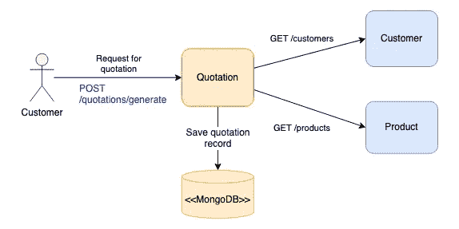
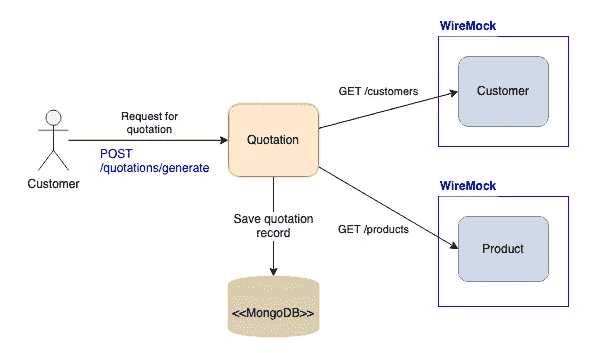
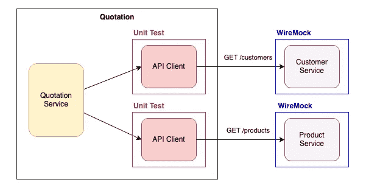
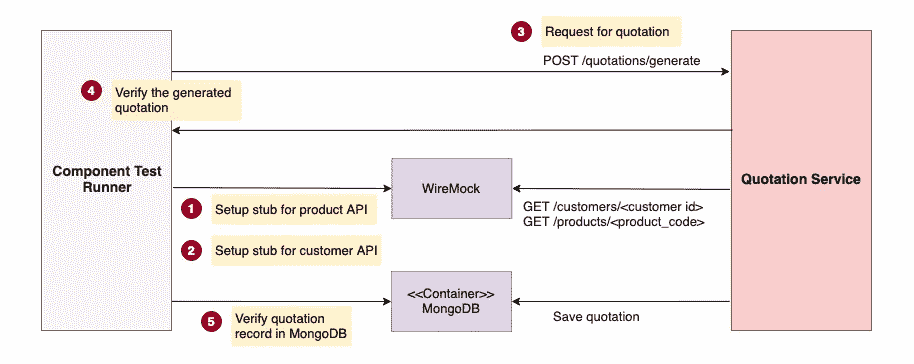
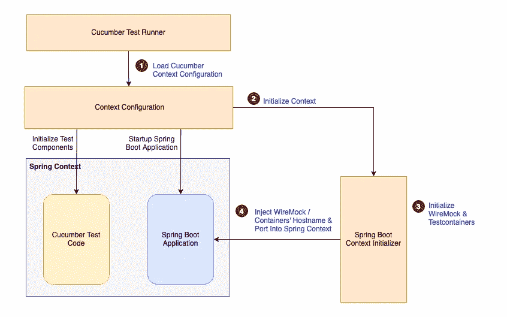
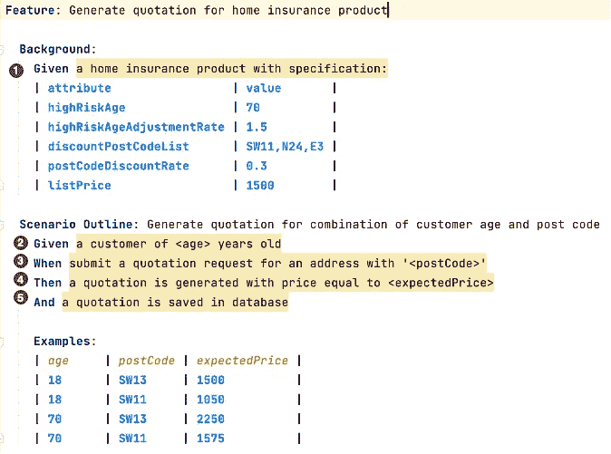

# 如何使用 WireMock 独立测试 Spring Boot 微服务？

> 原文：<https://blog.devgenius.io/how-to-test-spring-boot-microservice-independently-using-wiremock-d269d20fa626?source=collection_archive---------2----------------------->

## 让我们看看如何使用 WireMock 实现单元测试和组件测试


[戴红帽的女孩](https://unsplash.com/@girlwithredhat?utm_source=unsplash&utm_medium=referral&utm_content=creditCopyText)在 [Unsplash](https://unsplash.com/t/technology?utm_source=unsplash&utm_medium=referral&utm_content=creditCopyText) 上的照片

如今，从全球银行、保险公司到中小型创业公司，许多企业都广泛采用微服务架构。不可否认，这种架构方法通过将复杂的系统分解成单独的服务，实现了快速的开发和部署过程。然而，传统的方法不再适用于质量保证。

单独的微服务是不可操作的。对于负责编排其他服务来执行业务功能的服务来说尤其如此。

我们来看一个保险产品报价服务的例子。业务逻辑编码在报价服务中，它使用客户服务和产品服务的 API 端点，以便根据客户资料和产品规格确定价格。显然，如果客户服务或产品服务不可用，报价服务就不能制定任何报价。同样的情况也适用于测试，报价服务不能单独测试。



报价服务

也许，客户和产品的服务仍在开发中，不可用于测试。我们应该推迟测试过程直到所有外部服务都准备好了吗？您可以这样做，但是延迟特性交付绝对不是一个好的选择。

# 使用 WireMock 加速开发

在没有依赖服务的情况下，我们如何独立地开发和测试服务？设置测试存根是一个聪明的变通方法，这样报价服务就可以像真正的服务一样使用模拟 API。

WireMock 是最流行的 HTTP 模拟服务器之一，你可以通过设置模拟响应轻松地为客户和产品服务创建存根。它可以作为应用程序的一部分运行，也可以作为独立的进程运行。在本文中，我将以报价服务为例，向您展示如何为 Java Spring Boot 应用程序实现单元测试和组件测试。



使用 WireMock 进行微服务测试

# 单元测试

对于 API 客户端的单元测试，目的是验证一个 API 客户端对于客户检索服务的逻辑。测试场景首先为客户检索 API `/customers/12`设置一个模拟响应。当 API 客户机向模拟 API 提交请求时，WireMock 将查找相应的响应并将其返回给 API 客户机。



单元测试

## 将 WireMock 添加到 Maven 依赖项

将 WireMock 库包含在测试用例执行的应用程序中。您需要将这个依赖项添加到 Maven pom.xml 中。

```
<dependency>
  <groupId>com.github.tomakehurst</groupId>
  <artifactId>wiremock-jre8</artifactId>
  <version>2.30.1</version>
  <scope>test</scope>
</dependency>
```

下面的示例代码演示了如何为单元测试初始化 WireMock。WireMock 服务器是用动态端口号初始化的。它是一个静态类成员，所以所有的单元测试用例共享同一个 WireMock 实例。带注释的方法`@AfterAll` 和`@BeforeAll`允许 JUnit 分别在测试执行开始之前和测试完成之后启动和停止 WireMock 服务器。还有另一个带注释`@AfterEach`的方法，在每个测试场景结束时清理所有的存根。

测试场景以`Given — When — Then`的格式排列，使得测试流程易于阅读；

*   **步骤 1** — **给定** —为客户 API 设置 WireMock 存根。该方法调用存根创建是很容易理解的。
*   **步骤 2** — **当**时—调用客户 API 客户端获取客户记录
*   **步骤 3** — **然后** —验证检索到的客户记录。此外，这个示例演示了如何使用 verify()方法来检查 WireMock 服务器是否收到了客户检索请求。

# 组件测试

接下来，让我们演练如何将 WireMock 应用于组件测试。我们将保险报价服务视为组件测试中的黑盒，这意味着我们通过向服务 API 提交请求并检查输出来运行测试，而不知道服务的内部逻辑。MongoDB 等基础设施组件将在 Testcontainers 上运行，WireMock 将为外部 API 服务提供存根。

与单元测试类似，第一步是为客户和产品 API 设置存根。接下来，提交一个 API 请求来生成报价。然后，验证生成的报价以及数据库中插入的记录。



部件试验

组件测试是使用 Cucumber 构建的。如果你是黄瓜测试的新手，请阅读这篇文章。

[](/start-behavior-driven-development-bdd-for-java-springboot-rest-api-using-cucumber-f6b1754d93b1) [## 使用 Cucumber 开始 Java SpringBoot REST API 的行为驱动开发(BDD)

### 为自动化的端到端测试创建人类可读的测试用例

blog.devgenius.io](/start-behavior-driven-development-bdd-for-java-springboot-rest-api-using-cucumber-f6b1754d93b1) 

## **Git 存储库**

提供了组件测试的示例实现，可以随意克隆这个库:[https://github.com/gavinklfong/spring-wiremock-demo](https://github.com/gavinklfong/spring-wiremock-demo)

## 应用程序上下文初始化

在测试执行之前，WireMock 和其他模拟工具(如测试容器)将被初始化并注入到 Spring 上下文中。

下图从较高的层面说明了初始化过程的顺序。一旦 Cucumber test runner 被触发，上下文配置将启动一个初始化器，这个初始化器启动 WireMock 和 MongoDB。连接信息，例如 WireMock 和 MongoDB 的端口号，将被注入到 Spring Boot 上下文中，以便报价服务可以与 WireMock 和 MongoDB 连接。



组件测试初始化

# 测试场景

参考下面的黄瓜测试场景特性，测试场景首先定义了家庭保险产品规范。在后台，根据特性文件中列出的产品属性创建一个产品 WireMock 存根。接下来，根据示例表中列出的客户年龄和邮政编码的不同组合，执行几轮测试。

在每一轮测试执行中，都会创建客户 WireMock 存根，以便客户 API 返回给定时间的客户记录。然后，使用提供的地址邮政编码向报价服务提交请求。最后，验证返回的价格和数据库中生成的报价记录。



组件测试特征文件

让我们一步一步地完成实现。

## 步骤 1 —设置产品 API WireMock 存根

给定数据表中定义的产品属性列表，此步骤将构造一个产品对象。然后，创建一个产品 API 存根，这样对/products/的带有默认产品代码的 GET 请求将返回指定的产品对象。

## 步骤 2 —设置客户 API WireMock 存根

根据提供的客户年龄，这一步创建一个客户 API 存根。因此，对具有默认客户 id 的/customers/的 GET 请求将返回指定年龄的客户记录。

## 第 3 步—提交报价请求

准备好 API 存根后，是时候测试报价服务了。要求报价与提供的地址邮政编码，并找出多少钱的家庭保险政策。报价服务将从存根 API 中获取客户和产品。让我们将生成的报价放入测试上下文中，以便在下一步中进行验证。

## 步骤 4 —验证生成的价格

重要的是，生成的价格应该是正确的，并且与示例表中提供的预期价格相同。这一步非常简单，因为你可以比较价格。

## 步骤 5 —验证数据库中的记录

因为报价服务的输出不仅仅是 API 响应，还包括插入数据库的新记录，所以这一步是查看数据库并验证报价记录是否被正确保存。

# 最后的想法

模仿已经成为现代软件开发中的一项基本技能。除了为单元测试模仿内部服务组件之外，为外部 API 设置存根对于组件测试是至关重要的，尤其是对于基于服务的系统的开发。如果您需要独立测试您的服务，WireMock 是一个有用的工具。它与 JUnit 和 Cucumber 配合得非常好，因此您可以轻松地为单元测试和组件测试构建 API 存根。

但是，为了正确初始化 WireMock 以创建存根，需要样板代码。请随意使用本文中的[示例实现](https://github.com/gavinklfong/spring-wiremock-demo)作为模板，这样它当然可以帮助您快速构建自己的测试，而无需从头开始建立整个框架。