# 如何使用 PyTorch Geometric 在 Cora 数据集上训练图卷积网络

> 原文：<https://blog.devgenius.io/how-to-train-a-graph-convolutional-network-on-the-cora-dataset-with-pytorch-geometric-847ed5fab9cb?source=collection_archive---------1----------------------->

艾莉娜·格鲁布尼亚克在 [Unsplash](https://unsplash.com?utm_source=medium&utm_medium=referral) 上的照片

**现实中充满了图表**。道路？图表。社交网络？图表。分子？图表。你明白了:图是我们拥有的最重要的数据结构之一。

幸运的是，今天有很多很好的资源，可以让你了解将机器学习应用于这类数据所需的一切。这篇文章告诉你如何将斯坦福**斯坦福**的**带图的机器学习**课程提出的各种主题之一付诸实践。

这篇文章的主题只是我正在“转换成代码”的课程中的一课。如果你想看看其他的，**所有当前的笔记本**(在撰写本文时正在开发中)**和斯坦福课程的有用链接，可以在这里** 找到 [**。**](https://github.com/mnslarcher/cs224w-slides-to-code)

如前所述，已经有很多学习与**图形 ML** 相关的理论的材料，特别是**图形神经网络**，所以我在这里就不再解释了。如果你需要复习或者还没有看过理论，除了刚才提到的课程，另外两个资源可能对你有用:

*   原**图卷积网络** **论文** : [用图卷积网络进行半监督分类](https://arxiv.org/abs/1609.02907)
*   论文作者的**博文**，**托马斯·基普夫** : [图卷积网络](https://tkipf.github.io/graph-convolutional-networks/)

好了，介绍够了，我们开始吧！

**在 **Google Colab** (或任何笔记本)上安装 **PyTorch 几何**的**:

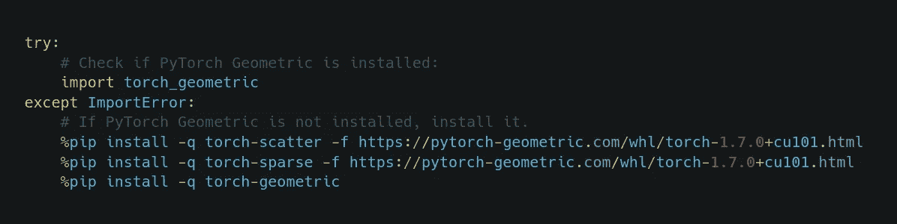

一些进口:

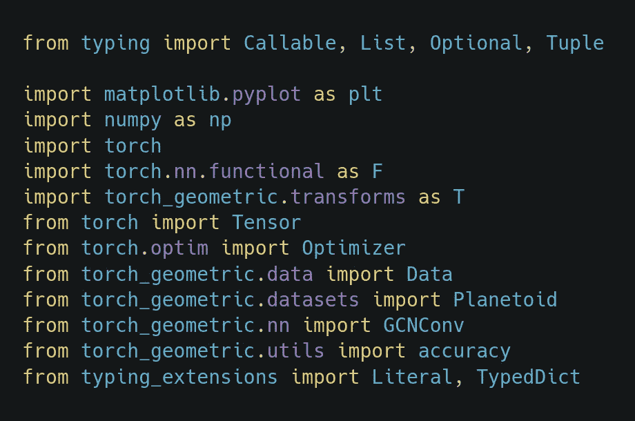

# Cora 数据集

我们将在其上测试我们闪亮的新技术的数据集也是它的创造者使用的数据集之一，Cora 数据集。来自 Cora 数据集带代码页的[文件:](https://paperswithcode.com/dataset/cora)

> Cora 数据集包括 2708 份科学出版物，分为七类。引文网络由 5429 个链接组成。数据集中的每个出版物由 0/1 值的词向量来描述，该词向量指示字典中相应词的存在与否。这部词典由 1433 个独特的单词组成。

让我们来探索这个数据集，以了解它是如何制作的，我提醒你，这里提供的所有代码都可以在笔记本“6。图神经网络 1: GNN 模型”在[这](https://github.com/mnslarcher/cs224w-slides-to-code)页。

来自 [Kipf &威灵(ICLR 2017)](https://arxiv.org/abs/1609.02907) :

> […]在包含 1，000 个标记示例的测试集上评估预测准确性。[…]500 个标记超参数优化示例的验证集(所有图层的辍学率、第一个 GCN 图层的 L2 正则化因子和隐藏单元的数量)。我们不使用验证集标签进行培训。

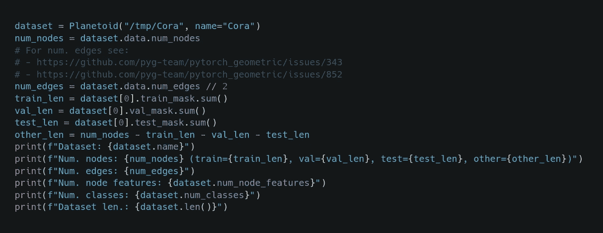

出局:

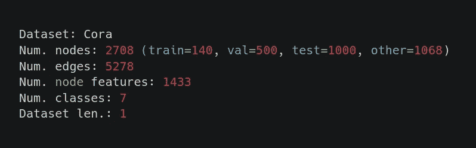

从这里，我们已经可以观察到一些事情。

首先，为了获得正确的边数，我们必须将数据属性“num_edges”除以 2，这是因为**py torch Geometric**“[将每个链接保存为两个方向的无向边](https://github.com/pyg-team/pytorch_geometric/issues/343#issuecomment-496501421)”。

即使这样做，数字加起来也不完美，显然是因为“[Cora 数据集包含重复的边](https://github.com/pyg-team/pytorch_geometric/issues/852#issuecomment-563200790)”。

另一个奇怪的事实是，除去标签用于训练、验证和测试的节点，还有其他节点没有被考虑用于这些目的。

最后，我们可以看到 Cora 数据集实际上只包含一个图。

来自 [Kipf &威灵(ICLR 2017)](https://arxiv.org/abs/1609.02907) :

> 我们使用 Glorot & Bengio (2010)中描述的初始化来初始化权重，并相应地(行)归一化输入特征向量。

默认情况下， **Glorot 初始化**由 PyTorch Geometric 完成，相反，必须明确添加行的**规范化，**以便每个节点的特征总和为 1:

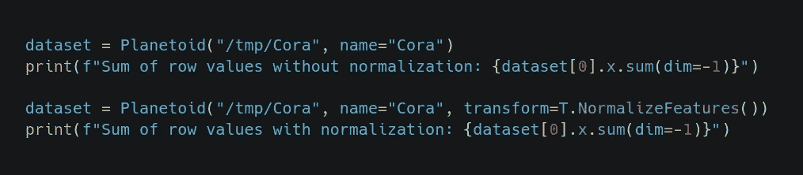

出局:

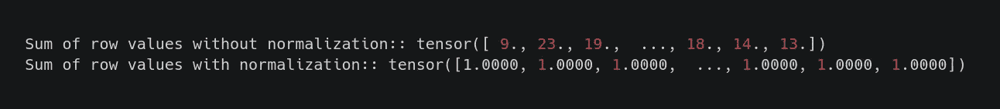

# 图形卷积网络

现在我们有了数据，是时候定义我们的**图卷积网络** ( **GCN** )！

来自 [Kipf &威灵(ICLR 2017)](https://arxiv.org/abs/1609.02907) :

> 我们使用 Adam (Kingma & Ba，2015)对所有模型进行最多 200 个时期(训练迭代)的训练，学习率为 0.01，窗口大小为 10 的早期停止，即如果验证损失连续 10 个时期没有减少，我们就停止训练。

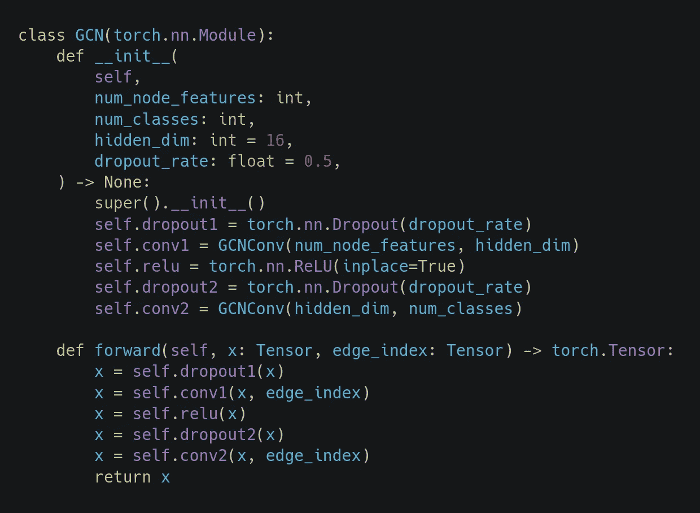

出局:

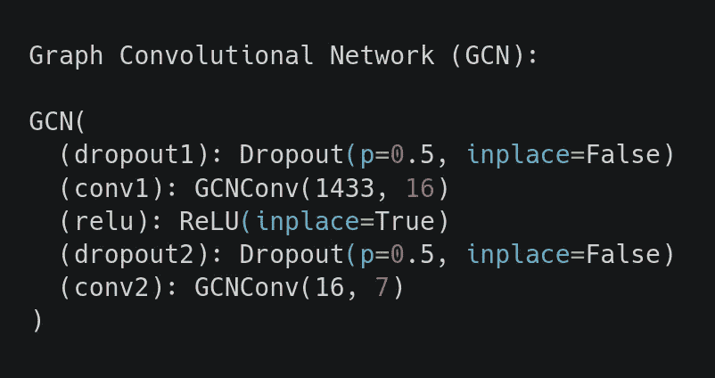

如果您已经查看了 PyTorch 几何文档中的实现，甚至是 Thomas Kipf 的框架中的实现，您可能会发现一些不一致之处(例如，两个漏失层而不是一个)。实际上这是因为[都不忠实于 TensorFlow](https://github.com/tkipf/pygcn/issues/20) 中的原始实现。

# 培训和评估

在编写训练循环之前，我们应该准备一个训练和评估步骤:

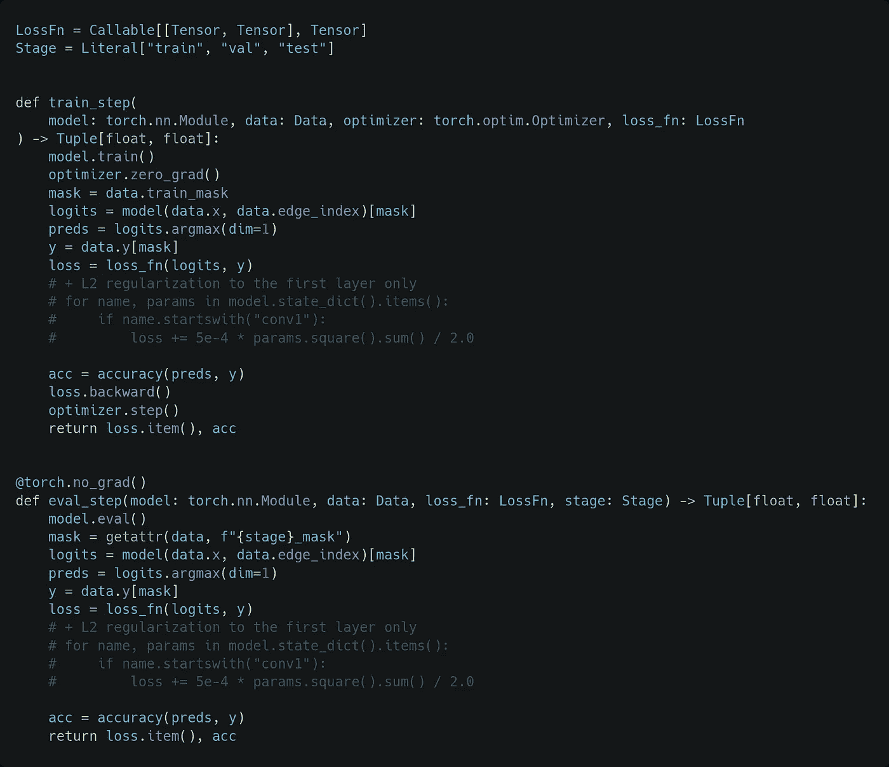

这里我们可以看到，该模型将整个图形作为输入，而**输出**和**目标**被**不同地屏蔽**，这取决于它是处于训练、验证还是测试阶段。

请注意，一些代码被注释掉了，因此没有真正使用，这是因为它代表了一种尝试，即像在最初的实现中一样，仅将 **L2 正则化**应用于第一层。不幸的是，通常情况下，使用 PyTorch 不可能 100%地复制 TensorFlow 中所做的事情。在我们的例子中，使用我们将使用的优化器的“weight_decay”参数可以获得最佳结果: **Adam** 。

来自 [Kipf &威灵(ICLR 2017)](https://arxiv.org/abs/1609.02907) :

> 我们使用 Adam (Kingma & Ba，2015)对所有模型进行最多 200 个时期(训练迭代)的训练，学习率为 0.01，窗口大小为 10 的早期停止，即如果验证损失连续 10 个时期没有减少，我们就停止训练。

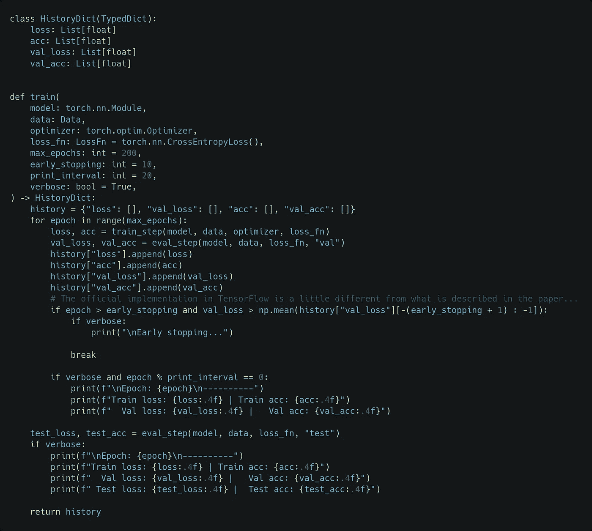

需要注意的是，与论文中描述的相比，**提前停止**逻辑的官方实现(此处复制)略有不同:在验证损失不减少的十次之后，训练不会停止，但当它大于其最后十次值的平均值时，训练会停止。

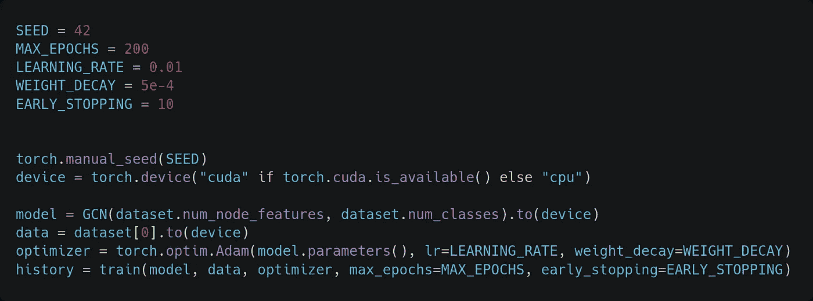

出局:

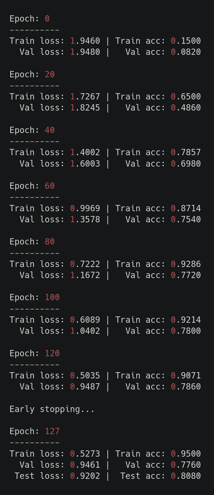

没错。**我们获得了与原论文**中报道一致的测试精度(论文中为 81.5%)。请注意，由于这是一个小数据集，这些结果对选择的随机种子很敏感。缓解这个问题的一个可能的解决方案是像作者所做的那样，取 100(或更多)次运行的平均值。

最后，我们来看看**损耗**和**精度** **曲线**。

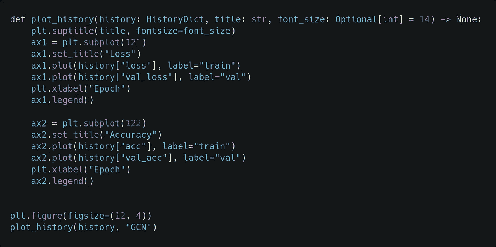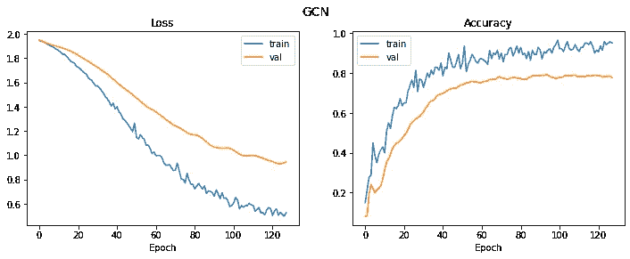

# 最后的想法

如果你已经走了这么远，**谢谢你**！如果你喜欢这篇文章，我会很高兴如果你**拍**让我知道。如果我想在社交媒体上留下一个**明星**的[回购](https://github.com/mnslarcher/cs224w-slides-to-code)或**分享**它，你真的是一个朋友。

啊，我差点忘了，让我们保持联系，你可以在这里找到我:

*   **领英**:[https://www.linkedin.com/in/mnslarcher](https://www.linkedin.com/in/mnslarcher)
*   **推特**:[https://twitter.com/mnslarcher](https://twitter.com/mnslarcher)

 [## 通过我的推荐链接加入 Medium-Mario Nam Tao shian ti Larcher

### 作为一个媒体会员，你的会员费的一部分会给你阅读的作家，你可以完全接触到每一个故事…

mnslarcher.medium.com](https://mnslarcher.medium.com/membership)