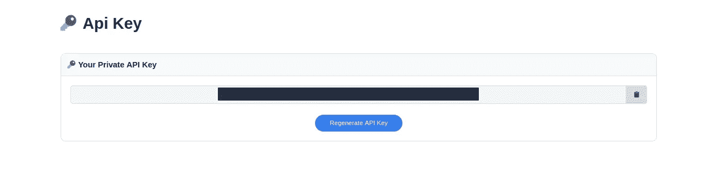
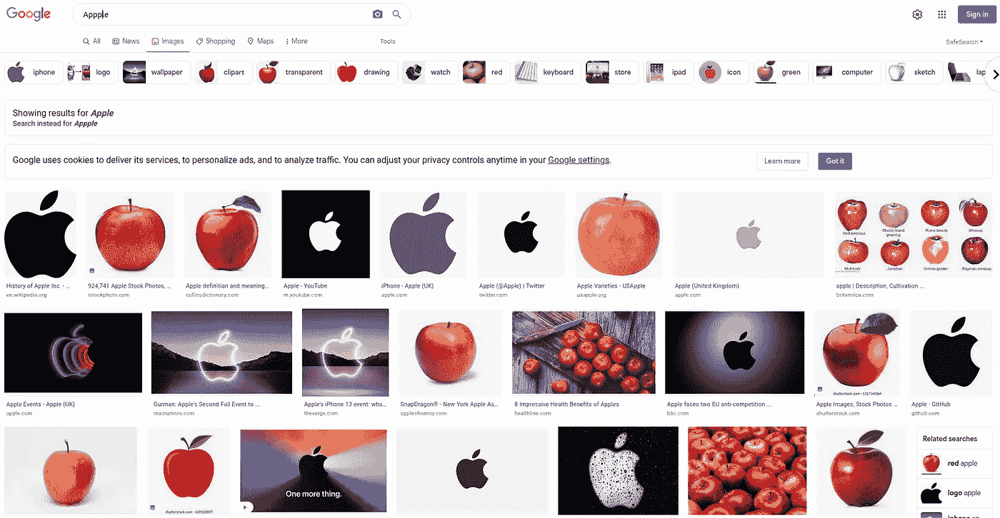
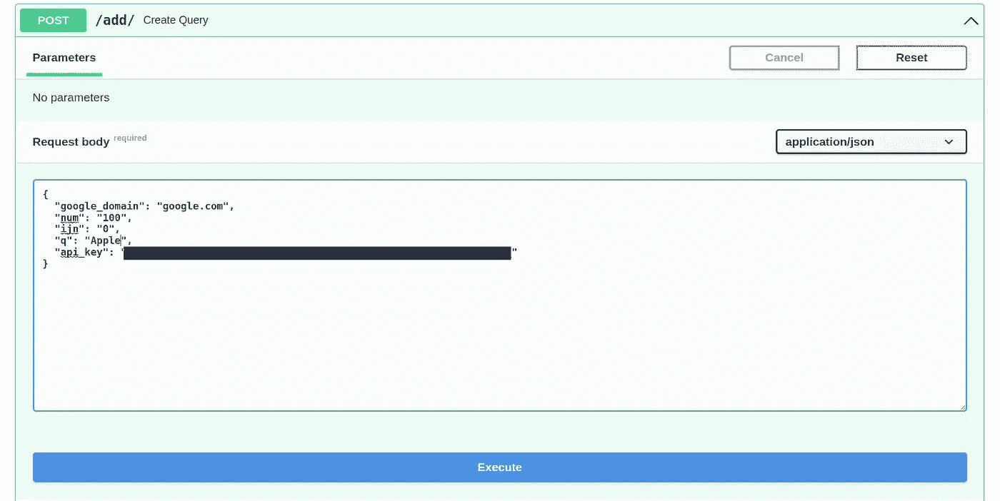

# 如何用 FastAPI 和 SerpApi 训练一个可扩展的分类器？

> 原文：<https://blog.devgenius.io/how-to-train-a-scalable-classifier-with-fastapi-and-serpapi-f528ddf1949f?source=collection_archive---------11----------------------->

这是与人工智能实现相关的系列博文的一部分。如果你对故事的背景或情节感兴趣:

本周，我们将探索 [SerpApi](https://serpapi.com/) 强大的[Google Images Results Scraper API](https://serpapi.com/images-results)在 [FastAPI](https://fastapi.tiangolo.com/) 快速构建 web 框架之上的组合能力。我们将从用同步方法创建一个简单的图像数据库创建器开始，并从那里开始构建。

# 可伸缩分类器是什么意思？

该术语指的是在机器学习训练过程中使用的扩展图像数据库的可扩展性，以及以最小的努力在规模上扩展或再训练模型。简单来说，如果你有一个区分猫和狗的模型，你应该能够通过自动收集猴子图像，重新训练或扩展现有的分类器来轻松扩展它。

# 带有解释的最小 FastAPI 文件夹结构

*   `datasets`:这个文件夹将存储我们将要下载的图像，存储旧的下载历史，并将测试数据库分割成训练数据库。
*   `datasets -> test`:该文件夹将包含不同的文件夹，其中包含查询的名称。每个带有查询名称的文件夹将包含我们将使用的图像。
*   `datasets -> train`:不在本周范围内。但在结构上，它将是测试文件夹的复制品。但是，出于训练目的，每个文件夹中的图像数量将少于测试文件夹。
*   `datasets -> previous_images.json`:该文件将包含之前已经下载的链接，以避免再次下载相同的图像。
*   `add.py`:这个文件将负责从 SerpApi 的 Google Images Results Scraper API 中收集唯一的链接，然后将图片下载到相应的位置。
*   `main.py`:运行服务器和定义路由的主文件。
*   `requirements.txt`:我们在运行 Serpapi 时使用的库。你需要通过 pip 下载它们。

# 要求

这里是我们需要添加到`requirements.txt`文件中的所需库。

# 应用程序配置

顾名思义，FastApi 允许以最小的努力实现快速开发过程。我们现在将在`main.py`中添加两条路由，一条问候用户，另一条接受来自端点的查询对象:

类将包含 pydantic 基本模型对象，该对象包含用于从 SerpApi 的 Google Images Scraper API 获得不同结果的参数。`Download`班会监督整个过程。

至于`add`端点的后台进程，让我们在`add.py`中导入必要的库:

`from multiprocessing.dummy import Array`:这是一个自动添加的用于多处理目的的库
`from serpapi import GoogleSearch`:这是 SerpApi 的库，用于使用 SerpApi 支持的各种引擎。你可以在它的 [Github 回购](https://github.com/serpapi/google-search-results-python)上找到更多信息。只需通过`pip install google-search-results`命令安装即可。
`from pydantic import BaseModel` : Pydantic 允许我们轻松地创建对象模型。
`import mimetypes` : Mimetypes 对于在将下载的元素写入图像之前猜测其扩展名非常有用。它允许我们猜测`.jpg`、`.png`等。文件的扩展名。
`import requests` : Python 的 HTTP requests 库有史以来最酷的库标识。
`import json`:用于读写`JSON`文件。这将有助于存储我们已经下载的图片的旧链接。
`import os`:用于在服务器的本地存储中写入图像，或者为不同的查询创建文件夹。

让我们看看如何包含对`add`端点的查询:

在这个比例模型中，`q`和`api_key`参数必须给定。然而正如我在评论中所说的，你可以用给定的方法硬编码你的`api_key`,这样你就不必每次都输入它。有问题的`api_key`指的是 SerpApi API 键。你可以通过我们的[注册链接](https://serpapi.com/users/sign_up)注册一个免费或付费账户。您的唯一 API 密钥可以在[管理 API 密钥](https://serpapi.com/manage-api-key)页面中找到。

SerpApi 免费提供缓存结果。这意味着如果对`Apple`的搜索被缓存，你将免费得到它。但是，如果您查询了`Monkey`，而它不在我们的缓存中，或者不在您创建的缓存中，它将从您的帐户中消耗一个信用点数。

`google_domain`:会刮到`Google Images`的哪个域。
`num`:给定查询的结果数。默认为最大值`100`。
`ijn`:指页码。默认为`0`，结果将从`ijn x num`开始，到`(ijn x num) + num`结束(这些公式适用于理想情况。谷歌可能不会为某些查询提供那么多数据。)起始结果索引将默认为`0`，因为默认`ijn`为`0`。
`q`:您要进行的扩展图像数据库的查询。
`api_key`:指`SerpApi` API 键。

# 下载图像

让我们声明我们将下载图像的类:

`self.query`:我们在类对象
`self.results`中存储查询的地方:我们在这里存储在 Google 图片搜索中找到的所有图片链接。
`self.previous_results`:以前下载的，或跳过的(将在下面解释)图片链接，以避免重新下载。
`self.unique_results`:我们从查询中收集的唯一链接，我们必须下载以扩展图像数据库。
`self.new_results`:要写入 JSON 文件的以前结果和唯一结果的组合。

让我们定义负责对 SerpApi 进行查询的函数:

如您所见，一些参数如`engine`和`tbm`是预定义的。这些参数负责刮`SerpApi's Google Images Scraper API`。当您对 SerpApi 执行以下查询时，它将返回一个包含 SERP 结果不同部分的 JSON:
`[https://serpapi.com/search?engine=google&google_domain=google.com&ijn=0&num=100&q=Apple](https://serpapi.com/search?engine=google&google_domain=google.com&ijn=0&num=100&q=Apple)`
这是 SerpApi Python 库的基本功能。结果将如下所示:

以下是 SerpApi 可以理解并将其作为 JSON 的原始 HTML 文件:

你也可以去 SerpApi 游乐场获得更多的视觉体验和调整能力。只需将链接中的`search?`改为`playground?` :
`[https://serpapi.com/search?engine=google&google_domain=google.com&ijn=0&num=100&q=Apple](https://serpapi.com/search?engine=google&google_domain=google.com&ijn=0&num=100&q=Apple)`

我们对`images_results`的`original`键感兴趣，因为它们是下载原始尺寸图像的直接链接。关于引擎的更多信息，你可以去 SerpApi 的 Google Images Scraper API 的[文档，探索更多选项。](https://serpapi.com/images-results)

让我们探索一下如何检查旧的下载链接，并分离出唯一的结果:

我们读取`previous_images.json`文件并在其中寻找`previous`键。然后，最后一行决定了唯一的结果。

让我们把这个函数分解成几个步骤。首先，我们要定义一个下载路径:

但是我们也需要检查这样的路径是否存在。例如，如果我们的查询是`Apple`，我们需要一个像`datasets/test/apple`这样的文件夹存在。如果它不存在，我们就创建一个。

让我们看看下载图像的名称选择:

我们会给图片编号，以保持名称的唯一性。如果还没有下载任何文件，文件名将为`0`。如果有，那么该名称将是最大数量加 1。

让我们来看看猜测扩展，并将图像下载到其正确的路径:

我们使用链接以字节的形式获取图像，然后猜测图像的扩展名。Mimetype 将`. webp '图像猜测为“html”。因此，我们为这种情况制定了一个安全措施，并使用我们之前生成的路径和扩展名来编写图像。

现在让我们看看如何更新我们存储的 JSON 文件，以便将来进行独特的下载:

既然每个函数都准备好了，让我们看看包含我们从`add`端点调用的整个流程的函数。

我们在那里放了一点 try 和 except 块，以确保在请求过程中没有意外错误。

# 使用 Uvicorn 运行应用程序

可以使用应用程序路径中的命令在本地计算机上部署 FastApi:

`uvicorn main:app --host 0.0.0.0 --port 8000`

你会看到下面的 prompt:‌

【T2
`INFO: Waiting for application startup.`
`INFO: Application startup complete.`
`INFO: Uvicorn running on http://0.0.0.0:8000 (Press CTRL+C to quit)`

这意味着您的服务器运行没有问题。如果您在本地机器上前往`localhost:8000`，您将会看到这样一个结构:

`{"Hello":"World"}`

这是应用程序的主页面。这将在未来的博客文章中形成。
让我们直奔`localhost:8000/docs`:

FastApi 允许自动文档和应用程序的游乐场。这对我们手动测试端点很有用。这对我们手动创建对`add`端点的 post 请求很有用。只需点击带有`Create Query`的按钮:

接下来，点击`Try it out`按钮:

将`api_key`参数更改为您的 API 键，并将`q`更改为您希望用来扩展数据库的查询。

在我们按下“执行”之前，让我们来看看文件夹结构:

如您所见,`datasets -> test`文件夹是空的，在执行时，它将被图像填满。

让我们按下浏览器中的`Execute`按钮，看看有什么变化:

您将在浏览器和终端中自动看到变化。

完成后，您可以在浏览器中观察到响应:

您也可以前往您的文件夹，查看图像是否已更新:

# 完整代码

`main.py`

`add.py`

`requirements.txt`

`datasets/previous_images.json`

# 结论

我为出版晚了一天向读者道歉，感谢他们的关注。本周我们已经介绍了如何使用 SerpApi 和 FastApi 创建一个可扩展的图像数据库生成器，并在 Uvicorn 上运行该应用程序。两周之后，我们将探讨如何添加异步进程，实现 Pytorch。我感谢塞尔帕皮的杰出人民给我这个机会。

*原载于 2022 年 5 月 19 日*[*【https://serpapi.com】*](https://serpapi.com/blog/scalable-classifier-serpapi-fastapi/)*。*