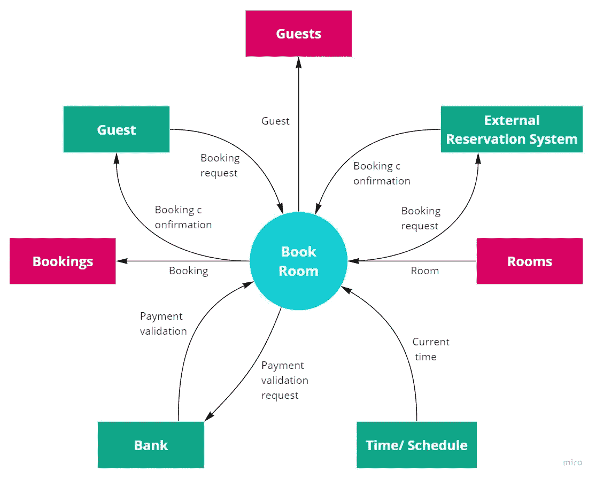

# 如何在产品负责人和团队其他成员之间引发关于产品质量的良好对话

> 原文：<https://blog.devgenius.io/how-to-trigger-good-conversations-about-product-quality-between-the-product-owner-and-the-rest-of-35fdb6ccc132?source=collection_archive---------3----------------------->

是什么让你的产品不仅好用而且优秀？我会给你一些手边的工具，帮助你和你的团队找到正确的质量要求和水平。

在之前的文章中，我用[四个敏捷测试象限](https://medium.com/swlh/how-to-find-the-right-testing-strategy-with-an-easy-framework-9e496a8b7768?source=your_stories_page-------------------------------------)的框架，向您概述了产品开发生命周期中不同的测试方法。

现在我们已经到了最后一个象限，它涉及到从技术角度来看的产品评论测试。你想知道你的产品是否达到了必要的质量标准。这包括，例如，性能(你的产品反应有多快和多稳定？)、安全性(你的产品抵御黑客的能力如何？)，或者稳定性(当很多用户同时访问的时候，你的产品是如何反应的？).没有专门的测试方法。您可以将它们设计为自动化测试，以及手动探索性测试。

通常，从那些质量相关的测试中获得的知识会导致进一步的面向技术和开发指导测试(象限一)，因为代码被改变以提高质量。想象一下烤一个馅饼。如果您测试成品馅饼的质量，您可能会发现一些改进的机会。也许你发现你需要改变食谱中的一些成分，这代表了开发中的代码。(参见“[关于单元和集成测试你需要知道的一切”](https://medium.com/python-in-plain-english/everything-you-need-to-know-about-unit-and-integration-tests-99302d487510)关于 pie 类比的更多细节)

# 质量属性，不是最后也不是最不重要的

特性运行的非功能性需求是敏捷测试象限的第四部分。功能需求描述了*什么*你的产品应该完成什么任务，而非功能需求定义了*如何完成，*意味着完成任务所需的质量。在开发之后测试质量属性并不是产品生命周期中唯一相关的阶段。

> “我们不认为它们是‘附加物’，而是认为它们是团队在每个特性或故事中必须考虑的约束。”——*Janet Gregory 和 Lisa Crispin* [*《敏捷测试浓缩:简介》*](https://www.goodreads.com/book/show/48516589-agile-testing-condensed)

因此，在过程的早期定义质量属性是至关重要的，因为它们会影响特性的开发和产品在生产中的性能。

因此，关注开发的质量属性**和运营的质量属性**是有意义的。开发属性定义了影响软件开发方式的需求，例如，可维护性或可测试性。

操作属性定义了你的产品在与用户交互时应该如何表现。一个例子是 accessibility(也称为[【a11y】](https://issuu.com/i-site-inc/docs/accessu_white_paper)，代表“accessibility”的第一个(a)和最后一个(y)字母之间的十一个单词)。这个想法是让每个人都能获得一种服务或产品，不管他们的精神和身体状况如何。例如，它可以包括使网站可用于供盲人使用的屏幕阅读器。

有多种属性可能与您的产品相关。下面是艾伦·戈特丁纳和玛丽·戈尔曼的 7 个产品维度中的一些属性的[概述:](https://www.ebgconsulting.com/blog/using-the-product-canvas-to-define-your-products-core-requirements/)

[EBG 咨询公司*的质量属性元模型*](https://www.ebgconsulting.com/blog/using-the-product-canvas-to-define-your-products-core-requirements/)

你可能没有技术背景，就像我一样。在这种情况下，您可能无法决定每种类型的属性，无论它是否与产品高度相关。但是不管你在产品中的角色是什么，你总是可以和团队或者你的团队成员进行对话，来设定合适的质量目标。

## 尽早合作，为您的产品找到合适的质量水平

重点应该放在对顾客来说最重要的质量属性上，因为这些属性最有可能说服顾客使用产品。

以下是一些提示，可以帮助引发产品负责人和团队之间的良好对话:

**1)绘制一个上下文图**来概述该特性周围的依赖系统和用户。尽早了解这些依赖性和潜在的脆弱区域，可以让团队有时间做出正确的决策，并从一开始就相应地调整设计。此外，它有助于确定关于处理设计的知识差距，这可以通过尖峰或雇用相应的人来弥补。

这是[上下文图](https://www.edrawmax.com/context-diagram/)的样子:

上下文图[示例](https://www.edrawmax.com/context-diagram/) ( [图片来源](https://online.visula-paradigm/system-context-diagram-example/hotel-reservation-system)))

**2)提问:**

> 在我们发布这项功能后，最糟糕的事情会是什么？这是高风险吗？
> 
> 如果系统或功能停机一段时间，这样可以吗？如果不是，它可以停机的最长时间或百分比是多少？
> 
> 对于一个基于网络的应用程序，客户可能会使用什么浏览器？
> 
> 我们可以假设客户将使用移动设备吗？这包括手机和平板电脑吗？是指苹果和安卓吗？
> 
> 一旦我们发布了这个特性，我们怎么知道它是否成功呢？
> 
> — *Janet Gregory 和 Lisa Crispin* [*《敏捷测试浓缩:简介》*](https://www.goodreads.com/book/show/48516589-agile-testing-condensed)

## **3)预发布测试的计划**

在投入生产之前，一些质量属性可能需要进一步的测试。这可以是一个在阶段环境中的[负载测试](https://www.researchgate.net/publication/282551435_A_Survey_on_Load_Testing_of_Large-Scale_Software_Systems)(参见“[一个关于将代码带给你的客户的非技术指南](https://medium.com/dev-genius/a-non-technical-guide-about-bringing-code-to-your-customer-a51696b4d1f7)”)，以查看功能在更高的压力下如何反应。

快速部署代码的一种安全方式是蓝/绿部署系统。有两个相同的系统，其中只有一个是 life，用户可以访问。团队可以将代码部署到空闲环境中，以便在真实条件下测试某个特性。该系统可以旋转地被激活或去激活，以总是具有测试系统。激活后，另一个环境将作为旧版本的备份系统，以便在需要时快速切换回来。该测试在功能测试(如集成测试)之后进行，以确保在测试其负载能力之前功能正常。

**4)法规合规性**

应尽快了解合规性要求，以避免不必要的工作。因此，该团队应该从一开始就与审计员和监管机构保持联系。考虑如何以最少的额外工作提供合规性数据。(有时自动化测试可以提供常规的信息，您可以使用这些信息作为法规遵循的证据。)

既然您已经了解了产品生命周期的所有阶段和可能的测试活动，有一个方面在整篇文章中反复出现:测试自动化。它是关于什么的，为什么你应该自动化测试？在本系列的下一篇也是最后一篇文章中，我将告诉您更多关于测试自动化的优点和缺点，以及您应该何时应用它。

# 系列文章

敏捷测试策略——图片作者[亚历山德拉·奥利维拉](https://www.linkedin.com/in/aoliveira11/)

*   [第 1 篇:每个人都能理解的敏捷软件测试要点指南](https://medium.com/@lautenbacheralexa/a-guide-through-the-essentials-of-agile-software-testing-that-everyone-can-understand-789999c89585)
*   [文章 2:如何用一个简单的框架找到正确的测试策略](https://medium.com/swlh/how-to-find-the-right-testing-strategy-with-an-easy-framework-9e496a8b7768)
*   [第 3 篇:你成功测试的超能力:创造共享的理解](https://medium.com/swlh/your-superpower-for-successful-testing-creating-a-shared-understanding-61d6d95c7570)
*   [第 4 篇:关于单元和集成测试你需要知道的一切](https://medium.com/python-in-plain-english/everything-you-need-to-know-about-unit-and-integration-tests-99302d487510)
*   [第 5 篇:](https://medium.com/dev-genius/a-non-technical-guide-about-bringing-code-to-your-customer-a51696b4d1f7) [向客户展示代码的非技术性指南](https://medium.com/dev-genius/a-non-technical-guide-about-bringing-code-to-your-customer-a51696b4d1f7?source=your_stories_page-------------------------------------)
*   [第六条:如何发现自己的产品是否真的创造了价值](https://medium.com/dev-genius/how-to-find-out-if-your-product-really-creates-value-829337de593f?source=your_stories_page-------------------------------------)

# 参考

*   [Maddie Presland 的无障碍测试(a11y)](https://issuu.com/i-site-inc/docs/accessu_white_paper)
*   [通过视觉范例展示的上下文图](https://www.edrawmax.com/context-diagram/)
*   系列文章的关键来源:敏捷测试概要:简写于 Janet Gregory 和 Lisa Crispin
*   艾哈迈德·哈桑的负载测试
*   [EBG 咨询公司的质量属性元模型](https://www.ebgconsulting.com/blog/using-the-product-canvas-to-define-your-products-core-requirements/)

# 关于“敏捷软件测试——像我这样的非技术人员的见解”系列文章

*在这些孤立的时期，我抓住机会学习了更多关于软件测试的知识。如果没有技术背景，这可能相当具有挑战性。因此，我读了 Janet Gregory 和 Lisa Crispin 写的书* [*【敏捷测试精粹:简介】*](https://www.goodreads.com/book/show/48516589-agile-testing-condensed) *，并仔细阅读了书中描述的内容。为了让你更容易快速获得最重要的见解，我总结了我从这本书和一些其他来源学到的东西，并希望在一系列短文中与你分享。它们是按照产品开发阶段组织的，你可以一篇一篇地阅读以获得一个整体的概述，也可以选择你最感兴趣的主题。我相信这将对你有所帮助，因为它帮助我在没有技术背景的情况下对测试世界有了更多的了解。*