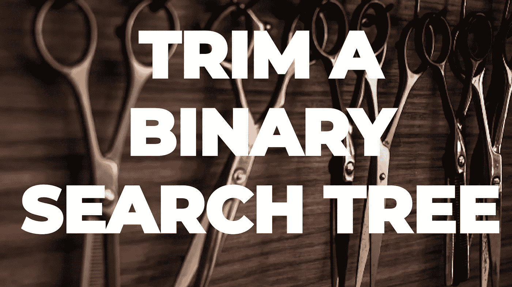
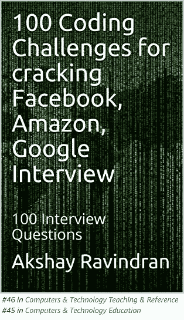
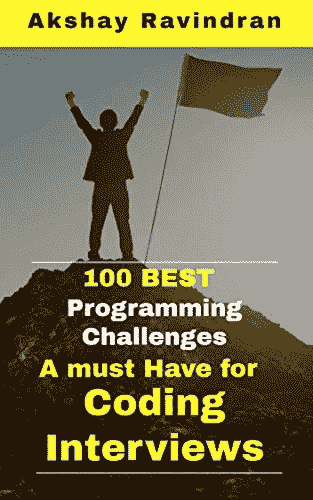
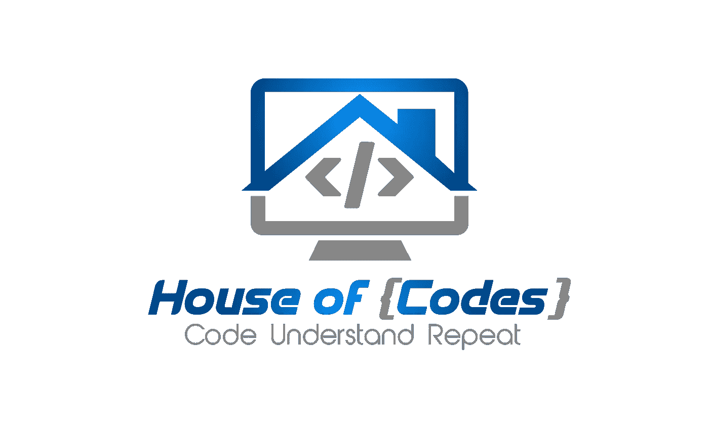

# 如何修剪二叉查找树？

> 原文：<https://blog.devgenius.io/how-to-trim-a-binary-search-tree-83fdb2acceff?source=collection_archive---------12----------------------->

## 第 29 天——100 天到 LinkedIn、雅虎、甲骨文



照片由来自 [Pexels](https://www.pexels.com/photo/several-scissors-1319460/?utm_content=attributionCopyText&utm_medium=referral&utm_source=pexels) 的[尼克·德穆](https://www.pexels.com/@nick-demou-365778?utm_content=attributionCopyText&utm_medium=referral&utm_source=pexels)拍摄

*   出免费故事？下面是我的 [**好友链接。**](https://medium.com/@akshay_ravindran/83fdb2acceff?source=friends_link&sk=01c8793ed534e7117c29730009e7eab1)
*   100 天到 LinkedIn，雅虎，甲骨文

# Introduction🛹

嘿，伙计们，今天是 LinkedIn 挑战 100 天的第 29 天。

[](https://amzn.to/3fLILh7)

Kindle 阅读器免费

如果你在准备面试。即使你已经在工作中安顿下来，让自己了解最新的面试问题对你的职业发展是至关重要的。从这里的**开始你的**准备**！**

上个月，我一直在研究这些公司的常见问题。我已经收集了这些问题中的 100 个，我不能保证你会在面试中得到这些问题，但是我相信这些“面试问题”中的大多数都有相似的逻辑，并且从这些挑战中运用了相同的思维方式。

在我们进入第一个问题之前，如果你想知道我为什么选择 LinkedIn、雅虎和甲骨文而不是 FAANG，是因为我已经完成了一项挑战[，重点是亚马逊和脸书的面试](https://medium.com/javarevisited/100-days-to-amazon-day-1-b9e07228f079)。

# 新的一天，新的力量，新的想法🚀

# 第 29 天——修剪二叉查找树🏁

# 目的🏹

给定一个二叉查找树，最低和最高边界为`L`和`R`，修剪树，使其所有元素位于`[L, R]` (R > = L)。您可能需要更改树的根，因此结果应该返回修剪后的二叉查找树的新根。

# Example🕶

```
**Input:** 
    1
   / \
  0   2

  L = 1
  R = 2

**Output:** 
    1
      \
       2
```

> 关注[**代码之家**](https://medium.com/@akshay_ravindran) **s** 了解编程面试世界的最新动态。

# 密码👇

作者:[阿克谢·拉文德兰](https://www.linkedin.com/in/akshay-ravindran-096)

# 边缘案例

1.  检查根的空条件。

# 算法👨‍🎓

1.  递归遍历二叉查找树。
2.  如果当前节点的值不在期望的区域内，也就是说，如果值小于 L，那么我们不必担心左边的子节点。由于当前元素小于 L，因此当前节点的任何左子元素也将小于目标元素。
3.  同样，如果当前节点大于 R 边界。那么当前节点的任何右子节点也将大于 R 边界。
4.  所以，你必须返回备选子节点的值。如果值小于 **L** ，返回**右**子，反之亦然。

# 复杂性分析

> **时间复杂度:O(N)因为你是遍历整个 BST**
> **空间复杂度:O(N)因为你是递归遍历，你是用栈来存储数据(隐式)**

[](https://amzn.to/3eZbTS9)

感谢你制作了这个排名第一的新版本🖤

# 进一步阅读

[4 个极其有用的面试链表技巧](https://medium.com/javarevisited/4-incredibly-useful-linked-list-tips-for-interview-79d80a29f8fc?source=your_stories_page---------------------------)
[亚马逊 SDE 面试前 25 题](https://medium.com/javarevisited/top-25-amazon-sde-interview-questions-cfe0ef70ba9e?source=your_stories_page---------------------------)
[你觉得你真的了解斐波那契数列吗？](https://medium.com/javarevisited/are-you-making-these-fibonacci-number-mistakes-5e3cbedd367e?source=your_stories_page---------------------------)
[用 C 编程解决 9 个最佳字符串问题](https://medium.com/@akshay_ravindran/9-best-strings-problem-solved-using-c-5e2a1d373fc2?source=your_stories_page---------------------------)
[一个人不简单地解决 50 个黑客等级挑战](https://medium.com/javarevisited/top-50-coding-challenges-in-hacker-rank-3d79c181528?source=your_stories_page---------------------------)

# 线的尽头

你现在已经到了这篇文章的结尾。谢谢你阅读它。祝你编程面试好运！

如果你在面试中遇到这些问题。请在下面的评论区分享它。我会很高兴读到它们。

[](https://medium.com/javarevisited/the-ultimate-guide-to-binary-trees-47112269e6fc) [## 二叉树的最终指南

### 任何你必须知道的关于二叉树的事情！

medium.com](https://medium.com/javarevisited/the-ultimate-guide-to-binary-trees-47112269e6fc) 

当我们发布新的编码挑战时，不要忘记点击**关注 button✅** 接收更新。告诉我们你是如何解决这个问题的。🔥我们会很高兴阅读它们。❤:我们可以在一篇博文中介绍你的方法。

> 想在 java 编程方面出类拔萃？

[](https://www.amazon.in/Solved-Programming-Challenges-Coding-Interviews-ebook/dp/B07S5K4Z32/ref=sr_1_1?keywords=100%20best%20solved%20programming%20challenges&qid=1563392111&s=gateway&sr=8-1&source=post_page---------------------------)

已经解决的 **100 个 Java(面试)编程问题**汇编。**(黑客等级)🐱‍💻。**这是完全**免费**🆓如果你订阅了亚马逊 kindle。



作者:[阿克谢·拉文德兰](https://www.linkedin.com/in/akshay-ravindran-096)