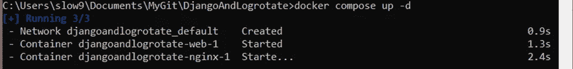
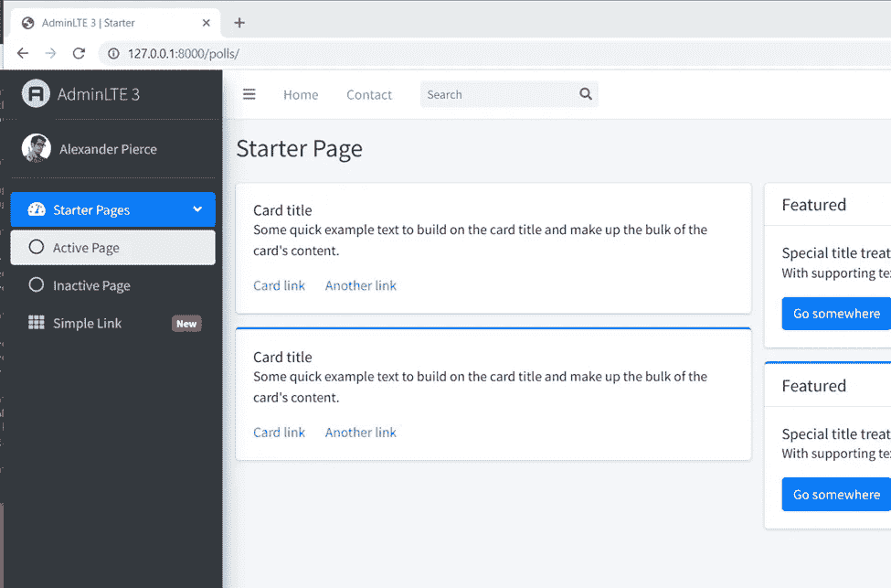
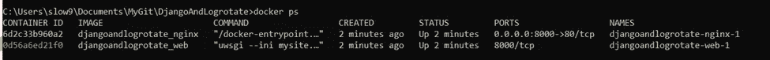
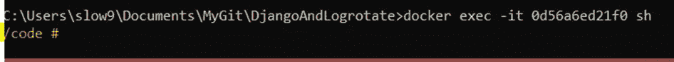
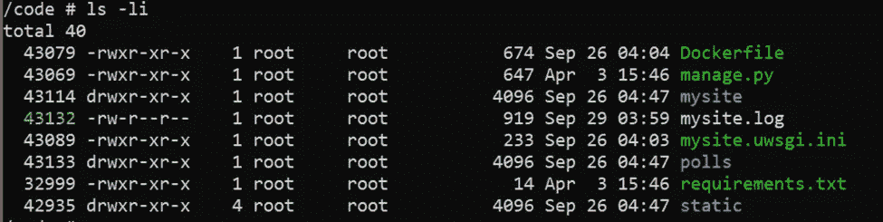
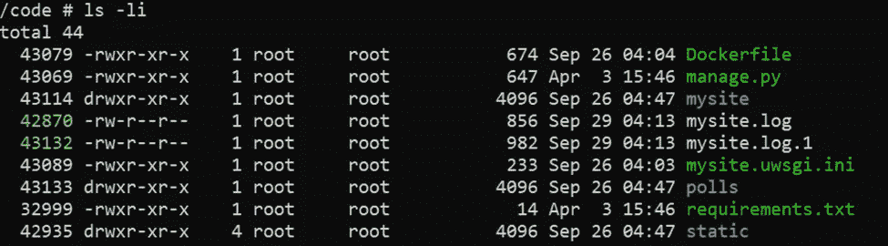
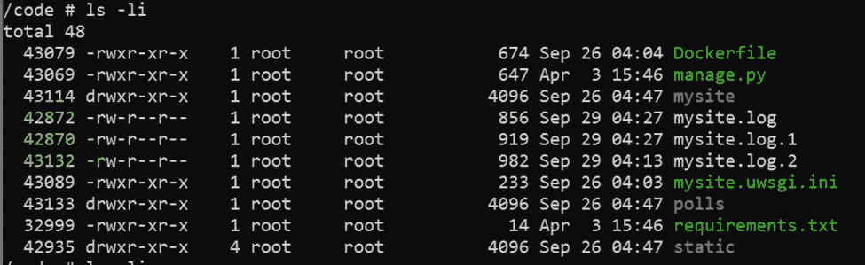
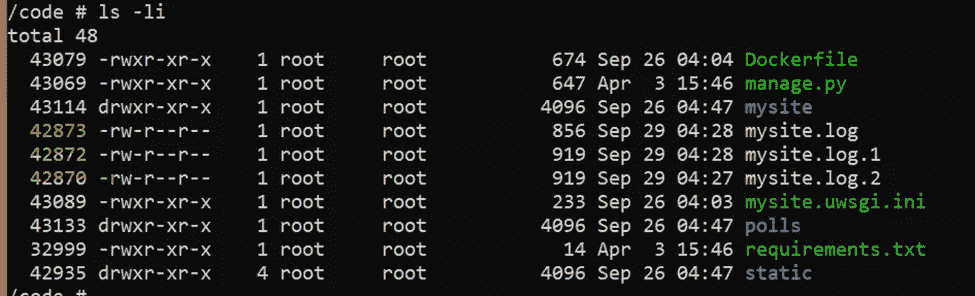
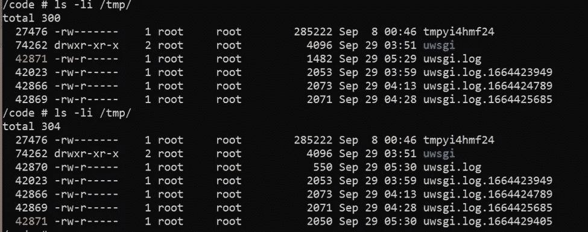

# 如何解决日志轮换问题

> 原文：<https://blog.devgenius.io/how-to-troubleshoot-log-rotation-issue-954a3be4d454?source=collection_archive---------10----------------------->

当涉及到日志循环时，其中一个问题是日志文件看起来并不像配置文件所说的那样循环。它通常以一个大的日志文件结束。预期的日志文件应该相对较小。在本文中，我将带您完成日志轮换。

如果我们有一个生产就绪的 Django 应用程序，我们主要对三种日志轮换感兴趣。一个是应用程序日志。第二个是服务器日志。根据服务器的不同，可能是 uWSGI、Gunicorn 等。在本文中，我将使用 uWSGI 作为一个例子。第三个是默认安装在 Ubuntu 上的 [logrotate 实用程序](https://manpages.ubuntu.com/manpages/xenial/man8/logrotate.8.html)。

# 示例项目

在本文中，我将使用一个示例项目来演示。我把它上传到了我的 Github 上。如果您感兴趣，请查看下面的 Git 资源库。

[](https://github.com/slow999/DjangoAndLogrotate) [## GitHub-slow 999/DjangoAndLogrotate

### 此时您不能执行该操作。您已使用另一个标签页或窗口登录。您已在另一个选项卡中注销，或者…

github.com](https://github.com/slow999/DjangoAndLogrotate) 

# 日志旋转 101

日志轮转是如何工作的？有几种方法。最常见的方法是，当触发循环时，它会删除最旧的副本，按照下一个序列号将其余副本和当前副本一起重命名，并创建一个新的日志文件。例如，当前日志文件是 **mysite.log** 。在第一轮之后，文件列表将会是 **mysite.log** 和 **mysite.log.1** 。第二次循环后，文件列表将为 **mysite.log、mysite.log.1** 和 **mysite.log.2** 。假设我们将拷贝数设为 2。因此，在第三次循环之后，文件列表仍然是 **mysite.log、mysite.log.1、**和 **mysite.log.2** 。

这里我们要稍微了解一下 [**inode**](https://en.wikipedia.org/wiki/Inode) 。随着日志轮转的运行，一个新的 **mysite.log** 被创建并与一个新的 inode 相关联。如果文件被删除，其信息节点将不会被回收。因此，我们可以使用 inode 来验证日志轮转是否正常运行。接下来，我将使用我们的示例项目向您介绍这三种类型的日志轮换。

# Django/Python 日志旋转

要启动项目，请键入如下命令:

```
docker compose up -d
```

我们期望控制台中的输出如下:



合成输出

在浏览器中打开[http://127 . 0 . 0 . 1:8000/polls/](http://127.0.0.1:8000/polls/)。我们将期待如下页面。这意味着我们的项目正在运行。



/polls/ endpoint 的网页

要显示正在运行的容器，请按如下方式键入命令:

```
docker ps
```

我们预计输出如下。让我们记下用黄色突出显示的容器 id。我的情况是 0d56a6ed21f0。



Docker 运行容器的控制台输出

要进入正在运行的容器，请键入如下命令:

```
docker exec -it 0d56a6ed21f0 sh
```

我们期望得到以下输出。这意味着我们在集装箱里。



容器的控制台输出

让我们通过键入如下命令来列出**代码**目录中的内容:

```
ls -li
```

我们期望得到以下输出。请注意，第一列代表 inode。 **mysite.log** 的 inode 是 43132。 **mysite.log** 由 Django 应用程序生成。



列出/code 目录中的文件和目录

应用程序日志的配置在 **mysite/settings.py** 文件中设置。原木旋转部分如下。这意味着如果文件大小超过 1KB，它将调用日志轮换。Django 会保留日志文件的 2 个副本。

```
logging.config.dictConfig({
    …
    'handlers': {
        'logfile': {
            'level': 'DEBUG',
            'class': 'logging.handlers.RotatingFileHandler',
            'filename': 'mysite.log',
            'maxBytes':  1024 * 1,  # 1KB
            'backupCount': 2,
            'formatter': 'standard',
        },
        'console': {
            'level': 'DEBUG',
            'class': 'logging.StreamHandler',
            'formatter': 'standard',
        },
    },
   …
})
```

我们来刷新一下[http://127 . 0 . 0 . 1:8000/polls/](http://127.0.0.1:8000/polls/)页面。再次列出**代码**目录。我们应该期待以下输出。根据 inode，我们知道 inode 为 43132 的文件已经从 **mysite.log** 重命名为 **mysite.log.1** 。创建了一个新的日志文件，其 inode 为 42870。此外，请注意两个日志文件的修改时间是相同的。



第一次刷新后，列出/code 目录中的文件和目录

我们再刷新一下[http://127 . 0 . 0 . 1:8000/polls/](http://127.0.0.1:8000/polls/)页面。继续观察日志文件的变化。第三次刷新的输出如下:



第二次刷新后，列出/code 目录中的文件和目录

第四次刷新的输出如下。inode 为 43132 的日志文件被删除。



在第四次刷新后，列出/code 目录中的文件和目录

让我们呆在控制台里。接下来，我们将深入了解 uWSGI。

# uWSGI 日志旋转

在我们的示例项目中，uWSGI 日志旋转设置在 **mysite.uwsgi.ini** 文件中。它看起来如下。它表明，如果文件大小超过 2048 字节，它将旋转。

```
[uwsgi]socket = /tmp/uwsgi/mysite.sock
module = mysite.wsgi
master = true
processes = 2
chmod-socket = 666
logger = file:logfile=/tmp/uwsgi.log,maxsize=2048
vacuum = true
```

要列出 uWSGI 日志，请键入以下命令。

```
ls -li /tmp/
```

刷新网页几次。输出的快照如下。请注意，索引节点为 42871 的日志文件已被重命名，而其余副本的文件名保持不变。由于对副本的最大数量没有限制，它会一直生成日志，直到磁盘满为止。如果你知道如何设置最大份数，请留下你的评论。非常感谢。在这种情况下，我们可以创建一个 Cron 作业来清理旧的副本。



/tmp/目录中的文件和目录列表

# Linux 日志旋转实用程序

Logrotate 是一个系统实用程序，允许自动旋转、压缩、删除和邮寄日志文件。配置的快照如下。这意味着 logrotate 工具每天运行，如果日志文件丢失，它不会写入错误消息，保留 14 个旧的日志文件，压缩循环的文件，并且 prerotate/postrotate 脚本只运行一次。

```
/var/log/uwsgi/*.log {
    daily
    missingok
    rotate 14
    compress
    sharedscripts
}
```

对于使用过非常旧版本的 uWSGI 的人来说，上面的设置可能对您来说很熟悉。我们之前提到过 uWSGI 支持基于文件大小的旋转。为什么我们需要 logrotate 实用程序来处理 uWSGI 日志文件的循环？原因是当时旧的 uWSGI 服务器不支持基于文件大小的轮换。因此，一种解决方法是使用 logrotate 作为替代方法。

但是，上述配置有一个问题。即使文件已被重命名，uWSGI 也会继续写入同一个日志文件(同一个 inode)。要解决这个问题，我们必须在每次轮换后重新启动 uWSGI。当 uWSGI 重新启动时，它应该会生成一个新的日志文件(新的 inode)。修改后的配置如下:

```
/var/log/uwsgi/*.log {
    daily
    missingok
    rotate 14
    compress
    sharedscripts
    postrotate
        systemctl stop uwsgi.service >/dev/null 2>&1
        systemctl start uwsgi.service >/dev/null 2>&1
    endscript
}
```

# 结论

在本文中，我们经历了三种日志轮换。它们是应用程序日志循环、服务器日志循环和系统日志循环。关于 Linux logrotate 实用程序的讨论并没有结束。因为修改后的配置有负面影响。在日志循环期间，应用程序可能会出现问题。如果企业要求应用程序全天候运行，这可能是个问题。我想让你决定。请留下评论，让我知道你的想法。感谢阅读。敬请关注。